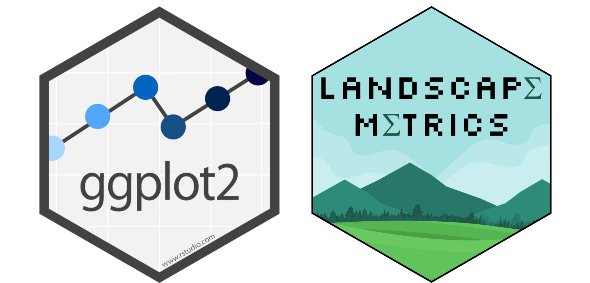
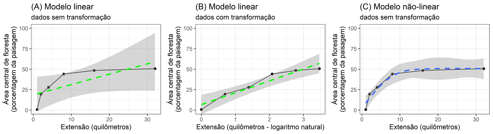

\newpage{}

# Métricas da paisagem {#cap02}

## Apresentação

As métricas da paisagem nos ajudam a entender as mudanças na paisagem de diferentes perspectivas (visual, ecológica, cultural).

Asssim sendo, análises com métricas de paisagem é um atividade fundamental na ecologia da paisagem.
Nesta capitulo aprenderemos sobre como analisar a cobertura da terra com métricas de paisagem em R.
o objetivo principal é mostrar a importância de selecionar a métrica “certa” para o problema “certo” usando R.
As tecnicas será ilustrada através cálculos usando a cobertura florestal ao redor do Rio Araguari, Amapá, Brasil.

Ao longo do caminho, revisaremos modelos lineares e não lineares, aprenderemos sobre manipulação de dados em R e aprenderemos como criar gráficos com o pacote ggplot2.
No capitulo você aprenderá a:

-   Importar e plotar dados raster em R e mapear locais de amostragem com os pacotes [terra](https://rspatial.org/pkg/index.html), [sf](https://cran.r-project.org/web/packages/sf/vignettes/sf1.html) e [tmap](https://r-tmap.github.io/tmap/).

-   Calcular métricas de paisagem com o pacote [landscapemetrics](https://r-spatialecology.github.io/landscapemetrics/).

-   Calcular métricas de paisagem em locais de amostragem e dentro de um buffer ao redor deles (comparação multiescala).

-   Construir gráficos com o pacote [ggplot2](https://ggplot2.tidyverse.org/).

-   Comparação de padrões lineares e não-lineares.

Para ajudar a acompanhar e entender os exemplos no capítulo, use como base as aulas ("Métricas da paisagem: Modelo mancha-corredor-matriz" e "Índices de Paisagem e Análises de Padrões Espaciais") e você deve ler os seguintes artigos:

-   Tischendorf, L.
    2001.\
    Can landscape indices predict ecological processes consistently?.
    Landscape Ecology 16, 235–254.
    <https://doi.org/10.1023/A:1011112719782>

-   Casimiro PC.
    2009.\
    Estrutura, composição e configuração da paisagem conceitos e princípios para a sua quantificação no âmbito da ecologia da paisagem.
    Revista portuguesa de estudos regionais.
    (20):75-99.
    <https://www.redalyc.org/pdf/5143/514351895006.pdf>

-   Pereira JL, et.
    al. 2001.\
    Métricas da paisagem na caracterização da evolução da ocupação da Amazônia.
    Geografia.
    2001:59-90.
    <https://www.periodicos.rc.biblioteca.unesp.br/index.php/ageteo/article/view/1907>

-   McGarigal K.
    2017.\
    Landscape metrics for categorical map patterns.
    Lecture notes.
    <https://opencourses.ionio.gr/modules/document/file.php/TFP122/%CE%98%CE%95%CE%A9%CE%A1%CE%99%CE%91/%CE%94%CE%95%CE%99%CE%9A%CE%A4%CE%95%CE%A3%20%CE%A4%CE%9F%CE%A0%CE%99%CE%9F%CE%A5/Landscape%20metrics.pdf>

Cópias dos artigos estão no Google Classroom e também podem ser baixadas [aqui](https://drive.google.com/drive/folders/1n6KrIiqu8IPvKLdhcKqwpI5o3MB_4gEu?usp=sharing): <https://drive.google.com/drive/folders/1n6KrIiqu8IPvKLdhcKqwpI5o3MB_4gEu?usp=sharing>

\newpage

## Métricas da paisagem e pacote "landscapemetrics"

As métricas de paisagem são a forma que os ecólogos de paisagem usam para descrever os padrões espaciais de paisagens para depois avaliar a influência destes padrões espaciais nos padrões e processos ecológicos.

A paisagem objeto de análise é definida pelo usuário e pode representar qualquer fenômeno espacial.
As métricas simplesmente quantifica a heterogeneidade espacial da paisagem; cabe ao usuário estabelecer uma base sólida para definir e dimensionar a paisagem em termos de conteúdo temático e resolução e extensão espacial.

**É importante ressaltar que o resultado das métricas só é relevante se a paisagem definida for adequado em relação ao fenômeno em consideração.**

O uso comum do termo "métricas de paisagem" refere-se exclusivamente a índices desenvolvidos para padrões de mapas categóricos.
Métricas de paisagem são algoritmos que quantificam características espaciais específicas de manchas, classes de manchas ou mosaicos inteiros de paisagem.
Uma infinidade de métricas foi desenvolvida para quantificar padrões de mapas categóricos.
Estas métricas enquadram-se em duas categorias gerais: aquelas que quantificam a composição do mapa sem referência a atributos espaciais, e aquelas que quantificam a configuração espacial do mapa, necessitando de informação espacial para o seu cálculo [McGarigal & Marks 1995](https://doi.org/10.2737/PNW-GTR-351), <https://doi.org/10.2737/PNW-GTR-351>.

O pacote [landscapemetrics](https://r-spatialecology.github.io/landscapemetrics/) tem funções para calcular métricas de paisagem em paisagems categóricos (onde tem uma classificação de cobertura de terra/habitat - modelo mancha-corredor-matriz), em um fluxo de trabalho organizado [@Hesselbarth2019].
Existem diversos tutoriais e exemplos no site do proprio pacote: <https://r-spatialecology.github.io/landscapemetrics/> .

O pacote [landscapemetrics](https://r-spatialecology.github.io/landscapemetrics/) pode ser usado como um substituto do FRAGSTATS ([McGarigal & Marks 1995](https://doi.org/10.2737/PNW-GTR-351), <https://doi.org/10.2737/PNW-GTR-351>), pois oferece um fluxo de trabalho reproduzível para análise de paisagem em um único ambiente.
FRAGSTATS é um programa de análise de padrões espaciais para mapas categóricos disponível apenas para a sistema operacional Windows.
Pode obter FRAGSTATS aqui: <https://fragstats.org/> .
Além de métricas padrão [landscapemetrics](https://r-spatialecology.github.io/landscapemetrics/) também permite cálculos de quatro métricas teóricas de complexidade da paisagem: entropia marginal, entropia condicional, entropia conjunta e informação mútua ([Nowosad e Stepinski 2019](https://doi.org/10.1007/s10980-019-00830-x) <https://doi.org/10.1007/s10980-019-00830-x>).


### Pacotes

Além do "landscapemetrics", precisamos carregar alguns pacotes a mais para facilitar a organização e apresentação de dados espaciais (vector e raster) e os resultados.

Carregar pacotes (que deve esta instalado antes):

```{r, message=FALSE, warning=FALSE}
library(tidyverse)
library(sf)
library(raster)
library(terra)
library(tmap)
library(gridExtra)
library(kableExtra)
library(mgcv)
library(eprdados)
```

Caso os pacotes não tenham sido instalados, o R vai avisar atraves um mensagem tipo: `r kableExtra::text_spec("Error in library(nomepacote)  there is no package called nomepacote", color = "red")`. Neste caso, para instalá-los consulte o capitulos aqui [Capitulo 4 instalação de pacotes](https://livro.curso-r.com/4-1-instala%C3%A7%C3%A3o-de-pacotes.html) e aqui [Capitulo 4 pacotes](https://analises-ecologicas.com/cap4#pacotes-1) .

#### landscapemetrics

Agora, vamos para o pacote principal [landscapemetrics](https://r-spatialecology.github.io/landscapemetrics/).
Digite o código abaixo e veja o resultado.
Leia com atenção e preste particular atenção na organização da página de ajuda.

```{r, message=FALSE, echo=FALSE, eval=TRUE,  warning=FALSE}
library(landscapemetrics)
```

```{r, message=FALSE, eval=FALSE, warning=FALSE}
library(landscapemetrics)
# Olhar a pagina de ajuda
?landscapemetrics
```

No final da página você vai encontrar a palavra "Index".
Clique nela e você verá todas as funções do pacote.
Desca até as lsm\_.
. . e clique em algumas delas ali.
Explorar!
Para listar todas as métricas disponíveis, você pode usar a função `r kableExtra::text_spec("list_lsm()", background = "#dedede")` . A função também permite mostrar métricas filtradas por nível, tipo ou nome da métrica. Para obter mais informações sobre as métricas, consulte os arquivos de ajuda correspondentes ou <https://r-spatialecology.github.io/landscapemetrics>.

Digite o código abaixo e veja o resultados, mostrando exemplos das métricas diferentes disponíveis no pacote.

```{r, message=FALSE, eval=FALSE, warning=FALSE}
# métricas de agregação, nível de fragmento
landscapemetrics::list_lsm(level = "patch", type = "aggregation metric")
# métricas de agregação, nível de classe
landscapemetrics::list_lsm(level = "class", type = "aggregation metric")
# 
landscapemetrics::list_lsm(metric = "area")
# ajudar com opções da função
?landscapemetrics::list_lsm
```

Nesse pacote o formato geral para uma função é em trés partes "lsm_nível_métrica".
A primeira parte é sempre lsm\_ ("landscapemetric"), seguinda do “nível\_” e por fim a “métrica”:

1.  Ou seja, todas as funções que calculam métricas começam com lsm\_ .......

2.  Daí você deve incluir o nível da análise: “p”, "c" ou "l".\
    Sendo, “p” para patch (ou seja, para a mancha/fragmento), “c” para classe e “l” para landscape ou seja, métricas para a paisagem como um todo.

3.  E daí existem inúmeras métricas.\
    Como por exemplo a `r kableExtra::text_spec("cpland", background = "#dedede")`, que é o percentual de área central - “core area” na paisagem, como vimos na aula teórica.
    Assim sendo, a função `r kableExtra::text_spec("lsm_c_cpland", background = "#dedede")` vai calacular a métrica porcentagem da área central em cada classe.
    Lembrando existem metricas que podem se calculados nos trés niveis, e metricas que so pode se calculados somente para um nivel espcifco.
    Ja sabendo o nome da função, podemos buscar ajudar para entender mais detalhes.
    Digite o código abaixo e veja o resultado, mostrando um exemplo para uma métrica.

```{r, message=FALSE, eval=FALSE, warning=FALSE}
# ajudar com opções para uma função especifica
?landscapemetrics::lsm_c_cpland
```

#### Pergunta 1

`r kableExtra::text_spec('Descreva brevemente 2 métricas de cada nível (patch, class, landscape) usando ajudar (usando ? e/ou list_lsm), aulas (Métricas da paisagem: Modelo mancha-corredor-matriz e "Índices de Paisagem e Análises de Padrões Espaciais" ) e/ou a leitura disponivel no Google Classroom (Base teórica 4 Dados, métricas, analises). Incluindo na descrição - o nome, porque serve, unidades de medida, e relevância ecológica.', color = "blue", bold = TRUE)`

------------------------------------------------------------------------

\newpage

## Dados

Vamos continuar as analises que começo no capítulo "Escala", trabalhando com os mesmos bancos de dados.
Então, primeiramente carregar os dados de cobertura da terra com a função <code>rast</code>.
E, em seguida implementar uma reclassificação para gerar uma camada binaria de floresta (valor de "1") e não-floresta (valor de "0").

```{r eval=TRUE, echo=TRUE, results=FALSE, message=FALSE, warning=FALSE}
# Carregar
mapbiomas_2020 <- rast(utm_cover_AP_rio_2020)

# Reclassificação - 
# Criar uma nova camada de floresta (novo objeto de raster copiando mapbiomas_2020, 
# assim para ter os mesmos coordenados, resolução e extensão)
floresta_2020 <- mapbiomas_2020
# Todos os pixels com valor de 0
values(floresta_2020) <- 0
# Atualizar com valor de 1 quando pixels originais são de floresta (classe 3 e 4)
floresta_2020[mapbiomas_2020==3 | mapbiomas_2020==4] <- 1 
```

\newpage

Plotar para verificar, incluindo nomes e os cores para classes de floresta (valor = 1) e não-floresta (valor = 0).

```{r, eval = FALSE, echo = TRUE}
# Passo necessario para agilizar o processamento
floresta_2020_modal <- aggregate(floresta_2020, 
                                 fact=10, 
                                 fun="modal")
# Plot
tm_shape(floresta_2020_modal) +
  tm_raster(style = "cat", 
            palette = c("0" = "#E974ED", "1" ="#129912"), legend.show = FALSE) + 
  tm_add_legend(type = "fill", labels = c("não-floresta", "floresta"),
    col = c("#E974ED", "#129912"), title = "Classe") + 
tm_layout(legend.bg.color = "white")
```

Se esta todo certo, voces devem ter uma imagem assim:

```{r, echo = FALSE, fig.width = 5, fig.height = 5, fig.cap = "Floresta ao redor do Rio Araguari. MapBiomas 2020 reclassificado em floresta e não-floresta."}
# Passo necessario para agilizar o processamento
floresta_2020_modal<-aggregate(floresta_2020, fact=10, fun="modal")
# Plot
tm_shape(floresta_2020_modal) +
  tm_raster(style = "cat", 
            palette = c("0" = "#E974ED", "1" ="#129912"), legend.show = FALSE) + 
  tm_add_legend(type = "fill", labels = c("não-floresta", "floresta"),
    col = c("#E974ED", "#129912"), title = "Classe") + 
tm_layout(legend.bg.color = "white")
```

### Exibir dados raster e sobreposição com locais de amostragem

Agora temos a paisagem, precisamos tambem os pontos de amostra.
Por isso, precisamos carregar os dados de rios e pontos de amostragem que usamos no tutorial Escala.
Vamos carregar as camadas, e no mesmo tempo implementar uma reprojeção, assim para que as sistemas de coordenados ficam iguais para todas as camadas - tanto de vector quanto raster.

No codigo abaixo, usamos `r kableExtra::text_spec("|>", bold = TRUE)`, que estabelece a ligação entre os passos do processo.
Ou seja, `r kableExtra::text_spec("|>", bold = TRUE)` passa o objeto anterior automaticamente para a próxima função como primeiro argumento.
Primeiro, carregamos os dados.
Em seguida, usamos a função `r kableExtra::text_spec("st_transform", background = "#dedede")` para converter as coordenadas para o mesmo sistema de referência do arquivo raster.
As duas etapas ficam ligados através a função `r kableExtra::text_spec("|>", bold = TRUE)`.

```{r, echo = TRUE, eval = TRUE, message = FALSE, warning=FALSE, results='hide'}
# pontos cada 5 km
rio_pontos_31976 <- rio_pontos |> 
  st_transform(31976) 
# linha central de rios
rio_linhacentral_31976 <- rio_linhacentral |> 
  st_transform(31976) 
```

\newpage

Visualizer para verificar.

```{r, eval=FALSE}
# Passo necessario para agilizar o processamento
floresta_2020_modal <- aggregate(floresta_2020, 
                                 fact=10, 
                                 fun="modal")
# Mapa
tm_shape(floresta_2020_modal) +
  tm_raster(style = "cat", 
            palette = c("0" = "#E974ED", "1" ="#129912"), legend.show = FALSE) + 
  tm_add_legend(type = "fill", labels = c("não-floresta", "floresta"),
    col = c("#E974ED", "#129912"), title = "Classe") + 
tm_shape(rio_linhacentral_31976) + 
  tm_lines(col="blue") + 
tm_shape(rio_pontos_31976) + 
  tm_dots(size = 0.2, col = "yellow") + 
tm_layout(legend.bg.color="white")
```

Depois de executar ("run") o código acima, você deverá ver a figura a seguir.

```{r, echo = FALSE, fig.width = 5, fig.height = 5, fig.cap="Cobertura da terra ao redor do Rio Araguari em 2020. Mostrando os pontos de amostragem (pontos amarelas) cada 5 quilômetros ao longo do rio (linha azul)."}
# Passo necessario para agilizar o processamento
mapbiomas_2020_modal <- aggregate(mapbiomas_2020, 
                                  fact=10, 
                                  fun="modal")
# Plot
tm_shape(floresta_2020_modal) +
  tm_raster(style = "cat", 
            palette = c("0" = "#E974ED", "1" ="#129912"), legend.show = FALSE) + 
  tm_add_legend(type = "fill", labels = c("não-floresta", "floresta"),
    col = c("#E974ED", "#129912"), title = "Classe") + 
tm_shape(rio_linhacentral_31976) + 
  tm_lines(col="blue") + 
tm_shape(rio_pontos_31976) + 
  tm_dots(size = 0.2, col = "yellow") + 
tm_layout(legend.bg.color="white")
```

------------------------------------------------------------------------

\newpage

## Calculo de métricas

Agora com todos as camadas organizados e verifcados podemos calcular as métricas de paisagem.
Para ilustrar como rodar as funções e cálculos com landscapemetrics, vamos calcular o percentual de área central na paisagem ( `r kableExtra::text_spec("cpland", background = "#dedede")`).
Vamos estudar uma classe (floresta), portanto vamos incluir as métricas para nível de classe.
No geral, as métricas de paisagem em nível de classe são mais eficazes na definição de processos ecológicos (Tischendorf, L. Can landscape indices predict ecological processes consistently?. Landscape Ecology 16, 235–254 (2001).
<https://doi.org/10.1023/A:1011112719782>.). No entanto, por vezes, os índices de manchas podem ser importantes e informativos nas investigações ao nível da paisagem. Por exemplo, muitos vertebrados requerem manchas de habitat maiores do que um tamanho mínimo, por isso seria útil saber também o tamanho de cada mancha na paisagem.

Para calcular as métricas de paisagem dentro de um certo buffer em torno de pontos de amostra, existe a função `r kableExtra::text_spec("sample_lsm()", background = "#dedede")`. Através da função `r kableExtra::text_spec("sample_lsm()", background = "#dedede")` podemos calcular mais de 50 métricas da paisagem, dentro de buffers (raios/distancias) diferentes.

### Ponto único, raio único, métrica única

Métricas de área central ("core area") são consideradas medidas da qualidade de hábitat, uma vez que indica quanto existe realmente de área efetiva de um fragmento/classe, após descontar-se o efeito de borda.
Vamos calcular a percentual de área central ("core area") no entorno de um ponto de amostragem.
Isso seria, a percentual de áreas centrais (excluídas as bordas de 30 m) de cada classe em relação à área total da paisagem.

Para a função `r kableExtra::text_spec("sample_lsm()", background = "#dedede")` funcionar, precisamos informar (i) a paisagem (arquivo de raster), (ii) ponto de amostragem (arquivo vector), (iii) raio do buffer desejada, (iv) forma do buffer (círculo ou quadrado) e por final (v) a métrica desejada. Cada opção tem especificações particulares, assim para que a função pode receber dados em formatos diferentes e produzir resultados conforme as necessidades de diversos casos.

Para este primeiro exemplo trabalharemos com apenas um ponto.
Fazemos isso selecionando a primeira linha (primeiro ponto) do objeto com os 52 pontos de amostragem ("rio_pontos_31976") usando colchetes: `r kableExtra::text_spec("[1, ]", background = "#dedede")` .

```{r, echo=TRUE, message=FALSE, warning=FALSE}
# com a paisagem "floresta_2020", 
# fazer uma amostragem de um ponto "rio_pontos_31976[1, ]"
# dentro de uma buffer com raio de 1000 metros e forma circular
# e calcular a métrica "cpland"

minha_amostra_1000 <- sample_lsm(landscape = floresta_2020, 
                                 y = rio_pontos_31976[1, ], 
                                size = 1000, 
                                shape = "circle", 
                                metric = "cpland", 
                                edge_depth = 1) 
```

Depois que executar ("run"), podemos olhar os dados com o codigo a seguir.
Rodando o nome do obejto, como no proximo bloco de codigo podemos verifcar os resultados.

```{r, eval=FALSE}
minha_amostra_1000
```

Os dados deve ter os valores (coluna "value") da métrica (coluna "metric") de cada classe (coluna "class") conforme a proxima tabela:

```{r, echo=FALSE, message=FALSE, warning=FALSE}
minha_amostra_1000 |> 
  kbl() |>
  kable_styling(full_width = F,  latex_options = "hold_position")
```

#### Pergunta 2

`r kableExtra::text_spec("O modelo mancha-corredor-matriz é frequentemente adotado na ecologia da paisagem. Com base nas aulas teóricas e usando os valores no objeto minha_amostra_1000 apresentados na tabela acima, identificar qual classe representar a matriz na paisagem. Há alguma informação faltando que limita a sua capacidade de identificar qual classe representar a matriz? Se sim, o que precisa ser adicionado? Justifique as suas respostas de forma clara e concisa.", color = "blue", bold = TRUE)`

------------------------------------------------------------------------

\newpage

### Ponto único, distâncias variados, métrica única

```{r, echo = FALSE, message = FALSE, fig.cap = "Cobertura florestal em extensões diferentes ao redor de um ponto de amostragem."}
# 1000 m
rio_pontos_31976_b1000 <- st_buffer(rio_pontos_31976[1, ], 
                                    dist = 1000)
# 2000 m
rio_pontos_31976_b2000 <- st_buffer(rio_pontos_31976[1, ], 
                                    dist = 2000)
# 4000 m
rio_pontos_31976_b4000 <- st_buffer(rio_pontos_31976[1, ], 
                                    dist = 4000)
# 8000 m
rio_pontos_31976_b8000 <- st_buffer(rio_pontos_31976[1, ], 
                                    dist = 8000)
# 16000 m
rio_pontos_31976_b16000 <- st_buffer(rio_pontos_31976[1, ], 
                                     dist = 16000)
buffer.forest1.16000m <- crop(floresta_2020, 
                              rio_pontos_31976_b16000, 
                              mask = TRUE)

#fig all together
line_col <- "black"
fig_together <- tm_shape(buffer.forest1.16000m) +
  tm_raster(style = "cat", 
            palette = c("0" = "#E974ED", 
                        "1" ="#129912"), legend.show = FALSE) + 
  tm_shape(rio_pontos_31976[1, ]) + 
    tm_symbols(shape =21, col = "yellow", 
            border.col = "black", border.lwd = 0.2, size=0.5) + 
  tm_shape(rio_pontos_31976_b1000) +
    tm_borders(col = line_col, lwd = 4, lty = "dashed") + 
  tm_shape(rio_pontos_31976_b2000) +
    tm_borders(col = line_col, lwd = 4, lty = "dashed") + 
  tm_shape(rio_pontos_31976_b4000) +
    tm_borders(col = line_col, lwd = 4, lty = "dashed") + 
  tm_shape(rio_pontos_31976_b8000) +
    tm_borders(col = line_col, lwd = 4, lty = "dashed") + 
  tm_shape(rio_pontos_31976_b16000) +
    tm_borders(col = line_col, lwd = 4, lty = "dashed") + 
  tm_add_legend(type = "fill", 
    labels = c("não-floresta", "floresta"),
    col = c("#E974ED", "#129912"),
    title = "Classe") + 
tm_scale_bar(breaks = c(0, 2, 4), text.size = 1, 
             position=c("left", "bottom")) +
tm_layout(legend.position = c("right","top"),
          legend.bg.color = "white")
fig_together
```

Para uma comparação multiescala, vamos calcular a mesma métrica, no mesmo ponto, mas agora com extensões diferentes.
Continuando o exemplo no tutorial anteriio (Escala), vamos repetir o mesmo processo, mas agora com raios de 250, 500, 1000, 2000, 4000, 8000 e 16000 metros, doubrando a escala (extensão) em cada passo.

\newpage

Para obter resultados com extensões diferentes, precisamos primeiramente repetir o código, ajustando para cada extensão, e depois juntar os resultados.
O código a seguir calculará a mesma métrica para as diferentes distâncias.
No exemplo, usamos `r kableExtra::text_spec("|>", bold = TRUE)`, que estabelece a ligação entre os passos do processo.
Neste caso, usamos a função `mutate()` para incluir uma coluna nova ("raio") para manter o valor das diferentes distâncias.
`mutate()` é uma função muito versátil que pode ser usada para criar, modificar e excluir colunas em um quadro de dados (data frame).
Mais exemplos com o uso de `mutate()` [aqui:](https://analises-ecologicas.com/cap5#mutate) <https://analises-ecologicas.com/cap5#mutate>.

Uso de `mutate()` seguir com a sintaxe: o quadro de dados será sempre o primeiro argumento, seguido de um operador pipe ( `|>` ) e pelo nome da função `mutate()`.
Isso permite o encadeamento de várias operações consecutivas mantendo a estrutura do dado original e acrescentando mudanças num encadeamento lógico.

Sendo assim, `mutate()` não precisa modificar necessariamente os dados originais, sendo que as operações de manipulações podem e devem ser atribuídas a um novo objeto.

```{r, echo=TRUE, message=FALSE, warning=FALSE}
# raio 250 metros
sample_lsm(floresta_2020, y = rio_pontos_31976[1, ], 
           size = 250, shape = "circle", 
           metric = "cpland") |> 
  mutate(raio = 250) -> minha_amostra_250 
# raio 500 metros
sample_lsm(floresta_2020, y = rio_pontos_31976[1, ], 
           size = 500, shape = "circle", 
           metric = "cpland")  |> 
  mutate(raio = 500) -> minha_amostra_500
# raio 1 km (1000 metros)
sample_lsm(floresta_2020, y = rio_pontos_31976[1, ], 
           size = 1000, shape = "circle", 
           metric = "cpland")  |> 
  mutate(raio = 1000) -> minha_amostra_1000
# raio 2 km
sample_lsm(floresta_2020, y = rio_pontos_31976[1, ], 
           size = 2000, shape = "circle", 
           metric = "cpland") |> 
  mutate(raio = 2000) -> minha_amostra_2000
# raio 4 km
sample_lsm(floresta_2020, y = rio_pontos_31976[1, ], 
           size = 4000, shape = "circle", 
           metric = "cpland")  |> 
  mutate(raio = 4000) -> minha_amostra_4000
# raio 8 km
sample_lsm(floresta_2020, y = rio_pontos_31976[1, ], 
           size = 8000, shape = "circle", 
           metric = "cpland")  |> 
  mutate(raio = 8000) -> minha_amostra_8000
# raio 16 km
sample_lsm(floresta_2020, y = rio_pontos_31976[1, ], 
           size = 16000, shape = "circle", 
           metric = "cpland")  |> 
  mutate(raio = 16000) -> minha_amostra_16000
```

\newpage

E agora, o código a seguir juntará os resultados das diferentes extensões.
Para combinar as linhas de duas ou mais tabelas de dados podemos utilizar a função `bind_rows()`.
Para esta função, precisamos incluir os nomes de todos os dados que queremos combinar, separados por vírgulas.
Aqui combinamos as métricas de sete buffers separados e criamos um novo objeto "amostras_metrica".

```{r, echo=TRUE, message=FALSE, warning=FALSE}
bind_rows(minha_amostra_250, 
          minha_amostra_500, 
          minha_amostra_1000, 
          minha_amostra_2000, 
          minha_amostra_4000, 
          minha_amostra_8000, 
          minha_amostra_16000) -> amostras_metrica

```

Depois que executar ("run"), podemos olhar os dados "amostras_metrica" com o codigo a seguir.

```{r, eval=FALSE}
amostras_metrica
```

Os dados deve ter os valores (coluna value) da métrica (coluna metric) de cada classe (coluna class) para cada distância (coluna raio):

```{r, echo=FALSE, message=FALSE, warning=FALSE}
amostras_metrica |> 
  mutate_if(is.numeric, format, digits=1,nsmall = 0) |>
  kbl() |>
  kable_styling(full_width = F,  latex_options = "hold_position")
```

\newpage

#### Faça um gráfico

```{r, met-fig-logo, echo = FALSE, message = FALSE, warning = FALSE, out.width = "55%", out.height = "55%", fig.align="center"}



```

Uma imagem vale mais que mil palavras.
Portanto, gráficos/figuras/imagens são uma das mais importantes formas de comunicar a ciência.
Os dados apresentados em uma tabela podem ser difíceis de entender.
Portanto, a primeira pergunta que você deve se fazer é se você pode transformar aquela tabela (chata e feia) em algum tipo de gráfico.
Lembrando, sempre pode incluir a tabela como anexo.

Aqui, vamos fazer um gráfico com os dados amostras_metrica, usando o pacote [ggplot2](https://ggplot2.tidyverse.org/index.html) para verificar como a paisagem muda com a escala.

O [ggplot2](https://ggplot2.tidyverse.org/index.html) faz parte do conjunto de pacotes [tidyverse](https://tidyverse.tidyverse.org/articles/paper.html), e é um pacote de visualização de dados.
"gg" se refere a uma gramática de gráficos.
A ideia principal é criar um gráfico como se fosse uma frase, onde cada elemento do gráfico seria uma palavra, organizados em uma sequencia logica para construir uma frase completo (gráfico final).
Você fornece os dados, informa ao [ggplot2](https://ggplot2.tidyverse.org/index.html) como mapear variáveis para estética, quais tipos/formatos gráficas usar e ele cuida dos detalhes.

Isto nos permite construir gráficos tão complexos quanto quisermos.
Os gráficos criados com [ggplot2](https://ggplot2.tidyverse.org/index.html) são, em geral, mais elegantes do que os gráficos tradicionais do R.
Para mais exemplos e tutoriais com mais detalhes veja os capitulos sobre [ggplot2](https://ggplot2.tidyverse.org/index.html) nos livros:

-   [Ciência de Dados com R](http://sillasgonzaga.com/material/cdr/ggplot2.html)\

-   [Análises Ecológicas no R](https://analises-ecologicas.com/cap6.html)

-   No livro em ingles [R Graphics Cookbook](https://r-graphics.org/) .

-   E sempre pode buscar exemplos no Google, por exemplo digitando: ggplot2 gráfico de barra no Google, tem mais de 50 mil resultados com paginas de imagens, codigo pronto e exemplos no YouTube.

O [ggplot2](https://ggplot2.tidyverse.org/index.html) exige que os dados a serem plotados estejam em um "data frame" ([quadro de dados](https://bookdown.org/wevsena/curso_r_tce/curso_r_tce.html#data-frames-e-tibbles)).
Ou seja, sempre teremos que transformar os dados para um data frame ou construir um data frame com os dados que possuímos.
Data frame é um formato comum e fácil de trabalhar - parecido com uma planilha de dados com linhas e colunas.
Todo que pode fazer com uma planilha de dados pode fazer com um data frame.
Por exemplo, se você importar uma planilha de dados, o resultado seria como data frame (para mais detalhes veja [Estrutura e manipulação de objetos](https://analises-ecologicas.com/cap4.html#estrutura-e-manipula%C3%A7%C3%A3o-de-objetos) e [lendo dados](http://sillasgonzaga.com/material/cdr/lendo-os-dados.html) ).

Além disso, o mais importante é que o resultado dos funções de [landscapemetrics](https://r-spatialecology.github.io/landscapemetrics/) é sempre um data frame, ou seja os resultados da função `r kableExtra::text_spec("sample_lsm()", background = "#dedede")` são prontos para um gráfico elegante com [ggplot2](https://ggplot2.tidyverse.org/index.html).

\newpage

O principal função a ser utilizado é `r kableExtra::text_spec("ggplot()", background = "#dedede")`. Para `ggplot()`, precisamos os dados (data frame), e depois cria o “mapeamento” das variáveis, normalmente usando `r kableExtra::text_spec("aes()", background = "#dedede")` (de aesthetics). Ou seja, você especifica quais são as variáveis dos eixos x e y dentro de `r kableExtra::text_spec("aes()", background = "#dedede")`. Através dele vamos definir qual é a variável preditora/explanatora/independente (eixo x) e qual é a variável resposta/dependente (eixo y) em nosso conjunto de dados. Depois da função `r kableExtra::text_spec("ggplot()", background = "#dedede")`, na sequencia no codigo nós especificamos qual tipo de gráfico com um "geom". Por exemplo, `r kableExtra::text_spec("geom_point()", background = "#dedede")` para plotar pontos, `r kableExtra::text_spec("geom_boxplot()", background = "#dedede")` para um boxplot, etc. Para a lista completa de geoms e todas as outras opções do pacote, visite a página do projeto [ggplot2](https://ggplot2.tidyverse.org/index.html) <https://ggplot2.tidyverse.org/index.html> .

Aqui vamos fazer um gráfico com valores de extensão no eixo x (calculado a partir da coluna raio) e proporção da floresta central no eixo y (coluna value).
Assim sendo, com o codigo a segir, vamos informar (i) os dados, selecionando classe de floresta atraves de um filtro com a função `filter()` e acresentando com `mutate()` uma coluna nova ("ext_m") com a extensão em metros, (ii) as colunas para os eixos x e y, (iii) tipo de gráfico (gráfico de pontos - `r kableExtra::text_spec("geom_point()", background = "#dedede")` e gráfico de linha - `r kableExtra::text_spec("geom_line()", background = "#dedede")`), (iv) nomes para os eixos. No exemplo, usamos `r kableExtra::text_spec("|>", bold = TRUE)`, que estabelece a ligação entre os passos do processo, ligando os dados (amostras_metrica) e o gráfico `r kableExtra::text_spec("ggplot", background = "#dedede")`. Note que no codigo a seguir, adicionamos um geom com um “+”. No [ggplot2](https://ggplot2.tidyverse.org/index.html), nós criamos gráficos em camadas, e adicionamos camada a camada com um “+”. Assim, é posivel ajustar qualquer elemento do gráfico.

```{r, eval=FALSE}
# arrumar os dados
amostras_metrica |> 
  filter(class==1) |> 
  mutate(ext_m = 2*raio) |>
# fazer o gráfico
  ggplot(aes(x = ext_m, y = value)) + 
  geom_point() +  
  geom_line() +
  labs(x = "Extensão (metros)", 
       y = "Área central de floresta (porcentagem da paisagem)")
```

Depois de executar (“run”) o código acima, você deverá ver o gráfico a seguir.

```{r, echo=FALSE, out.width = "50%", out.height = "50%", fig.align = "center"}
amostras_metrica |> 
  filter(class==1) |> 
  mutate(ext_m = 2*raio) |>
  ggplot(aes(x = ext_m, y = value)) + 
  geom_point() + 
  geom_line() +
  labs(x = "Extensão (metros)", 
       y = "Área central de floresta (porcentagem da paisagem)") + 
  theme(text = element_text(size = 14))
```

#### Pergunta 3

`r kableExtra::text_spec("Em vez de extensão, você preciso incluir o tamanho (área do circulo) correspondente a cada raio. Incluir uma cópia do código ajustado para produzir uma figura com tamanho (área em quilômetros quadrados) no eixo x.", color = "blue", bold = TRUE)`

------------------------------------------------------------------------

\newpage

#### Faça um gráfico elegante

Podemos ajustar qualquer elemento do gráfico com ggplot2.
Agora, vamos mudar as unidades de metros para quilometros, aumentar o tamanho dos pontos, incluir uma linha reta para ilustrar a tendência geral usando a função `stat_smooth()`, colocar o titulo longo do eixo y em duas linhas, e aumentar o tamanho da fonte para o texto ficar mais claro.
O objetivo principal de `stat_smooth()` é ajudar o olho a ver padrões nos dados plotados, ou seja, `stat_smooth()` sobrepõe uma curva ajustada aos dados.
Se houver um agrupamento dos dados, curvas separadas poderão ser mostradas para cada grupo por exemplo por cor.
Esta função pode traçar curvas de uma variedade de modelos diferentes, incluindo regressão linear (`method = "lm"`).

```{r, out.width = "55%", out.height = "55%", fig.cap = "Comparação da área central de floresta em diferentes extensões.", fig.align="center" }
# arrumar os dados
amostras_metrica |> 
  filter(class==1) |> 
  mutate(ext_m = 2*raio, 
         ext_km = (2*raio)/1000) |>
# fazer o gráfico
  ggplot(aes(x = ext_km, y = value)) + 
  geom_point(size = 4) + 
  geom_line() +
  stat_smooth(method = "lm", se = FALSE, color = "green", 
              linetype = "dashed") + 
  labs(x = "Extensão (quilômetros)", 
       y = "Área central de floresta\n(porcentagem da paisagem)") + 
  theme(text = element_text(size = 18)) 
```

#### Pergunta 4

`r kableExtra::text_spec("Em menos de 200 palavras apresente a sua interpretação do gráfico em figura 5.2.", color = "blue", bold = TRUE)`

------------------------------------------------------------------------

\newpage

#### Modelos linear e não linear

Um dos desafios mais frequentes é como melhor representar os dados observados para gerar evidências científicas robustas e informações confiáveis.
Nós vimos que as mudancas na métrica porcentagem de área central de floresta não segue uma linha reta em relação de escala (extensão).
Para ir além de uma descrição simplista dos padrões observados, na ecologia da paisagem uma variedade de modelos estatísticos são usados.Não vamos rodar modelos (ainda), mas é importante entender algumas das opções disponíveis ao interpretar os gráficos.

Por exemplo, modelos de regressão são amplamente usados em diversas aplicações para descrever a relação entre uma variável resposta Y e uma variável explicativa x.
Os modelos lineares são uma generalização dos testes de hipótese clássicos mais simples (para mais detalhes veja [Modelos linear](http://sillasgonzaga.com/material/cdr/modelos.html#modelo-linear) e [Modelos lineares](https://analises-ecologicas.com/cap7.html)).
Uma regressão linear só pode ser aplicada para dados em que tanto a variável preditora quanto a resposta são contínuas, enquanto uma análise de variância é utilizada quando a variável preditora/explicativa é categórica.
Os modelos lineares generalizados não têm essa limitação, podemos usar variáveis contínuas ou categóricas indistintamente (para mais detalhes e exemplos ecológicos veja [Modelos Lineares Generalizados](https://analises-ecologicas.com/cap8.html)).

Mas, no caso de padroes ecologicas, sera que um modelo linear é o melhor modelo para representar a relação que explica “y” em função de “x”?
Um número crescente de pesquisadores compartilham o sentimento de que as relações entre variáveis biológicas/ecologicas são melhores descritas por funções não lineares.
Os sistemas ecológicos são inerentemente complexos, com interações multifacetadas entre organismos e seu ambiente.
Capturar essas complexidades muitas vezes requer ir além da simplicidade das relações lineares.
É aí que os modelos não lineares se tornam ferramentas valiosas na pesquisa ecológica.

Ao contrário dos modelos lineares, que assumem uma relação linear entre as variáveis, os modelos não lineares abraçam a possibilidade de curvas, limiares e outros padrões intrincados.
Eles alcançam isso por meio de funções matemáticas que permitem diversas interações entre variáveis.
A principal vantagem dos modelos não lineares sobre os lineares é que eles são baseados em conhecimento prévio sobre a relação a ser modelada e geralmente apresentam interpretação prática para os parâmetros.
Portanto, modelos não lineares captura relações complexas como:

-   Efeitos de limiar:\
    Mudanças repentinas na resposta além de um ponto crítico, como o colapso das populações de plantas após exceder uma pressão de pastejo específica.
-   Loops de feedback:\
    Interações positivas ou negativas entre variáveis, como ciclos predador-presa ou crescimento populacional exponencial.
-   Respostas saturadas:\
    Diminuição ou nivelamento da resposta à medida que uma variável explicativa aumenta, como a absorção de nutrientes se aproximando de um limite máximo.

Em modelos não lineares, os dados observados de uma variável resposta são descritos por uma função que é não linear em seus parâmetros.
Assim como nos modelos lineares, o objetivo é identificar e estabelecer a relação entre as variáveis explicativas e resposta.
No entanto, enquanto os modelos lineares geralmente são utilizados para descrever relações empíricas, os modelos não lineares são geralmente motivados pelo conhecimento do tipo de relação entre as variáveis.
ssisendo, os modelos não lineares podem se ajustar melhor e prever padrões complexos nos dados ecológicos, levando a previsões mais precisas da dinâmica populacional, impactos ambientais e estratégias de manejo de recursos.

Como resultado, os modelos não lineares são amplamente utilizados em diversas áreas, como física, biologia, química, fisiologia, etc., onde as relações entre as variáveis são descritas por funções não lineares.

Como as mudanças na estrutura da paisagem caracterizam-se por serem não-lineares, para desenvolver análises estatísticas robustos pode (i) aplicar uma transformação (por exemplo, "log") ou (ii) adotar modelos não-lineares.

Nesta análise, exploramos os dados `amostras_metrica` através das lentes de três modelos distintos:

1.  Modelo Linear (Dados Originais):\
    Este modelo de linha de base assume uma relação linear entre as variáveis independentes e dependentes nos dados originais não transformados.
    Podemos interpretar os coeficientes do modelo para compreender o impacto direto de cada preditor na variável resposta.
    No entanto, esta abordagem pode não capturar padrões não lineares ou heterocedasticidade (variância desigual) nos dados.

2.  Modelo Linear (dados transformados em log):\
    Reconhecendo a potencial não linearidade, transformamos logaritmo da variável dependente.
    Isto pode estabilizar a variância e potencialmente linearizar a relação, melhorando o ajuste de um modelo linear.
    No entanto, a interpretação dos coeficientes torna-se menos simples, exigindo transformação reversa e exponenciação para retornar às unidades originais.

3.  Modelo Não Linear (Dados Originais):\
    Para contabilizar a potencial não linearidade sem transformar os dados, empregamos um modelo não linear, como uma regressão polinomial.
    Isto permite relações mais flexíveis entre as variáveis mas pode levar a coeficientes menos interpretáveis.

Visualizando o ajuste:

Para comparar a eficácia destes modelos, empregamos ferramentas de diagnóstico visual:

-   Valores previstos versus pontos de dados:\
    sobrepomos os valores previstos (linhas tracejadas) gerados por cada modelo nos pontos de dados originais (pontos pretos).
    Quanto mais próximas as linhas previstas estiverem dos pontos de dados, melhor o modelo captura as tendências subjacentes.

-   Intervalos de confiança:\
    visualizamos os intervalos de confiança (sombreamento cinza) associados às previsões de cada modelo.
    Intervalos mais estreitos indicam maior precisão e menor incerteza nas estimativas.
    A comparação das larguras dos intervalos entre os modelos pode revelar qual deles fornece previsões mais confiáveis.

Podemos mostrar os intervalos de confiança no gráfico com a área central de floresta em diferentes extensões com o seguinte código:

```{r, out.width = "55%", out.height = "55%", fig.cap = "Comparação da área central de floresta em diferentes extensões. Mostrando os valores previstos do modelo linear (linha tracejada), pontos de dados originais (pontos pretos) e o intervalo de confiança do modelo (sombreamento cinza).", fig.align="center" }
# arrumar os dados
amostras_metrica |> 
  filter(class==1) |> 
  mutate(ext_m = 2*raio, 
         ext_km = (2*raio)/1000) |>
# fazer o gráfico
  ggplot(aes(x = ext_km, y = value)) + 
  geom_point(size = 4) + 
  geom_line() +
  stat_smooth(method = "lm", 
              se = TRUE, 
              color = "green", 
              linetype = "dashed") + 
  labs(x = "Extensão (quilômetros)", 
       y = "Área central de floresta\n(porcentagem da paisagem)") + 
  theme_bw() +
  theme(text = element_text(size = 18)) 
```

Para fornecer evidências científicas robustas, precisaríamos ir além de uma avaliação visual subjetiva e adicionar análises estatísticas para apoiar as nossas conclusões.
Ao analisar esses recursos visuais juntamente com métricas estatísticas como R-quadrado (por enquanto não precisamos saber os detalhes, apenas que existem técnicas), podemos tirar conclusões informadas sobre qual modelo melhor se ajusta aos dados amostras_metrica.
Esta abordagem comparativa proporciona uma compreensão mais profunda das relações dentro dos dados e permite-nos escolher o modelo mais apropriado para análise e previsão subsequentes.

Vamos comparar os três modelos modelo linear (dados Originais), modelo Linear (dados transformados em log) e modelo Não Linear (dados Originais).

```{r met-create-fig-comp, echo=FALSE, message=FALSE, warning=FALSE}
amostras_metrica |> 
  filter(class==1) |>
  ggplot(aes(x=(2*raio)/1000, y=value)) + 
  geom_point() + 
  geom_line() +
  stat_smooth(method = "lm", color = "green", 
              linetype="dashed") + 
  coord_cartesian(ylim = c(0,100)) +
  labs(title = "(A) Modelo linear", 
       subtitle = "dados sem transformação",
       x = "Extensão (quilômetros)", 
       y = "Área central de floresta\n(porcentagem da paisagem)") + 
  theme_bw() -> fig_lm

amostras_metrica |> 
  filter(class==1) |>
  ggplot(aes(x=log((2*raio)/1000), y=value)) + 
  geom_point() + 
  geom_line() +
  stat_smooth(method = "lm", color = "green", 
              linetype="dashed") + 
  coord_cartesian(ylim = c(0,100)) +
  labs(title = "(B) Modelo linear", 
       subtitle = "dados com transformação",
       x = "Extensão (quilômetros - logaritmo natural)", 
       y = "Área central de floresta\n(porcentagem da paisagem)") + 
  theme_bw() -> fig_lmtrans

amostras_metrica |> 
  filter(class==1) |>
  ggplot(aes(x=(2*raio)/1000, y=value)) + 
  geom_point() + 
  geom_line() +
  stat_smooth(method = "gam", formula = y ~ s(x, k = 5), 
              linetype="dashed") + 
  coord_cartesian(ylim = c(0,100)) +
  labs(title = "(C) Modelo não-linear", 
       subtitle = "dados sem transformação",
       x = "Extensão (quilômetros)", 
       y = "Área central de floresta\n(porcentagem da paisagem)") + 
  theme_bw() -> fig_gam

pdf("figures/fig_comp_linear.pdf", width=11, height=3)
grid.arrange(fig_lm, fig_lmtrans, fig_gam, nrow=1)
invisible(dev.off())

png("figures/fig_comp_linear.png", width=11, height=3, 
    units="in", res = 600)
grid.arrange(fig_lm, fig_lmtrans, fig_gam, nrow=1)
invisible(dev.off())

```

```{r met-insert-fig-comp2, echo=FALSE, message=FALSE, warning=FALSE, out.width="98%", out.height="98%", fig.cap="Comparação de padrões lineares e não-lineares. Comparamos visualmente o ajuste dos modelos comparando o quão próximos os valores previstos (linhas tracejadas) estão dos pontos de dados originais (pontos pretos) e as diferenças nos intervalos de confiança do modelo (sombreamento cinza)."}

```

#### Pergunta 5

`r kableExtra::text_spec("Comparar os resultados apresentados nas figuras com modelos lineares e não-lineares. Como podemos estabelecer qual seria o melhor modelo? Qual modelo seria mais adequado para identificar limiares no padrão de área central de floresta?", color = "blue", bold = TRUE)`

------------------------------------------------------------------------

#### Pergunta 6

`r kableExtra::text_spec('Aumentar o tamanho amostral na analise. Usando os exemplos de codigo anteriores, aumentar o numero de buffers entre 125 m e 16 km. i) Calcular a metrica cpland para 12 distâncias de bufferes e montar  dados novas (isso é sete distâncias novas e as cinco distâncias originais) em um objeto com nome de "amostras_metrica_nova". ii) usando ggplot2 fazer um gráfico com os novos dados mostrando valores de extensão no eixo x e proporção da floresta central no eixo y. Ajustar o codigo para incluir intervalos de confiança junto com o modelo linear. Comparar os resultados apresentados nas figuras com modelos lineares sem transformação. O que aconteceu com o ajuste do modelo e os intervalos de confiançã? Foi útil incluir mais distâncias? Justifique as suas respostas de forma clara e concisa. Inclua cópias do seu código e gráficos na sua resposta. Você pode usar o printscreen para mostrar o RStudio com seu código e gráficos.', color = "blue", bold = TRUE)`

------------------------------------------------------------------------

\newpage

### Ponto único, distâncias variados, métricas variadas

No exemplo anterior comparamos uma métrica da paisagem em torno de um único ponto de amostragem.
Mas sabemos que uma combinação de várias métricas é necessária para entender os padrões na paisagem.
Aqui mostraremos como incluir cálculos de diferentes métricas de paisagem ao mesmo tempo.

```{r met-insert-fig-buffmetrics, fig.cap="Ilustração da determinação de métricas da paisagem diferentes ao redor de um ponto. Exemplo com a estrutura da paisagem representado com trés caracteristicas (A) Área central, (B) Borda e (C) Vizinho mais próximo. O habitat de interesse (classe) é isolado. Um buffer (linha tracejada) é colocado ao redor de um ponto (amarela) e as métricas calculadas. E em seguida o processo é repetido em diferentes extensões.", echo=FALSE, warning=FALSE, message=FALSE}
ragg <- aggregate(buffer.forest1.16000m, fact=5, fun="median")
ragg_forest <- ragg
# Com valor de NA
values(ragg_forest) <- NA
# Atualizar categorias florestais agrupados com valor de 1
ragg_forest[ragg==1] <- 1 

#ragg10 <- aggregate(buffer.forest1.16000m, fact=10, fun="median")

my_metric_r_all = spatialize_lsm(ragg_forest, level = "patch", metric = "enn")
r_enn <- my_metric_r_all$layer_1$lsm_p_enn

fig_enn <- tm_shape(r_enn) +
  tm_raster(title = "distância", n=9, palette = "-viridis") + 
tm_shape(rio_pontos_31976[1, ]) + 
    tm_symbols(shape =21, col = "yellow", 
            border.col = "black", border.lwd = 0.2, size=0.5) + 
tm_shape(rio_pontos_31976_b1000) +
    tm_borders(col = line_col, lwd = 4, lty = "dashed") + 
tm_shape(rio_pontos_31976_b2000) +
    tm_borders(col = line_col, lwd = 4, lty = "dashed") + 
tm_shape(rio_pontos_31976_b4000) +
    tm_borders(col = line_col, lwd = 4, lty = "dashed") + 
tm_shape(rio_pontos_31976_b8000) +
    tm_borders(col = line_col, lwd = 4, lty = "dashed") + 
tm_shape(rio_pontos_31976_b16000) +
    tm_borders(col = line_col, lwd = 4, lty = "dashed") + 
tm_scale_bar(breaks = c(0, 2, 4), text.size = 1, 
             position=c("left", "bottom")) + 
tm_layout(main.title = "(C) Vizinho mais próximo", main.title.size = 1)

classpoly <- as.polygons(ragg)
# https://gis.stackexchange.com/questions/392505/can-i-use-r-to-do-a-buffer-inside-polygons-shrink-polygons-negative-buffer/392525
shrinkIfPossible <- function(sf, size) {
  # compute inward buffer
  sg <- st_buffer(st_geometry(sf), -size)
  
  # update geometry only if polygon is not degenerate
  st_geometry(sf)[!st_is_empty(sg)] = sg[!st_is_empty(sg)]
   
  # return updated dataset
  return(sf)
}
classpoly_sf <- st_as_sf(classpoly) |> 
  st_make_valid()
SelForest <- which(classpoly_sf$mapbiomas_cover_2020==1)
shp_buffered <- shrinkIfPossible(classpoly_sf[SelForest, ], 300)

fig_core <- tm_shape(buffer.forest1.16000m) +
  tm_raster(style = "cat", 
            palette = c("0" = "#E974ED", 
                        "1" ="#129912"), legend.show = FALSE) + 
  tm_shape(shp_buffered) + 
   tm_fill("lightgreen") + 
   tm_shape(rio_pontos_31976[1, ]) + 
    tm_symbols(shape =21, col = "yellow", 
            border.col = "black", border.lwd = 0.2, size=0.5) + 
  tm_shape(rio_pontos_31976_b1000) +
    tm_borders(col = line_col, lwd = 4, lty = "dashed") + 
  tm_shape(rio_pontos_31976_b2000) +
    tm_borders(col = line_col, lwd = 4, lty = "dashed") + 
  tm_shape(rio_pontos_31976_b4000) +
    tm_borders(col = line_col, lwd = 4, lty = "dashed") + 
  tm_shape(rio_pontos_31976_b8000) +
    tm_borders(col = line_col, lwd = 4, lty = "dashed") + 
  tm_shape(rio_pontos_31976_b16000) +
    tm_borders(col = line_col, lwd = 4, lty = "dashed") + 
tm_add_legend(type = "fill", 
    labels = c("não-floresta", "floresta", "área central"),
    col = c("#E974ED", "#129912", "lightgreen")) + 
tm_scale_bar(breaks = c(0, 2, 4), text.size = 1, 
             position=c("left", "bottom")) +
  tm_layout(legend.position = c("right","top"),
          legend.bg.color = "white") + 
tm_layout(main.title = "(A) Área central", main.title.size = 1)

fig_edge <- tm_shape(buffer.forest1.16000m) +
  tm_raster(style = "cat", 
            palette = c("0" = "#E974ED", 
                        "1" ="lightgray"), legend.show = FALSE) + 
  tm_shape(shp_buffered) + 
   tm_fill("#129912") + 
   tm_shape(rio_pontos_31976[1, ]) + 
    tm_symbols(shape =21, col = "yellow", 
            border.col = "black", border.lwd = 0.2, size=0.5) + 
  tm_shape(rio_pontos_31976_b1000) +
    tm_borders(col = line_col, lwd = 4, lty = "dashed") + 
  tm_shape(rio_pontos_31976_b2000) +
    tm_borders(col = line_col, lwd = 4, lty = "dashed") + 
  tm_shape(rio_pontos_31976_b4000) +
    tm_borders(col = line_col, lwd = 4, lty = "dashed") + 
  tm_shape(rio_pontos_31976_b8000) +
    tm_borders(col = line_col, lwd = 4, lty = "dashed") + 
  tm_shape(rio_pontos_31976_b16000) +
    tm_borders(col = line_col, lwd = 4, lty = "dashed") + 
tm_add_legend(type = "fill", 
    labels = c("não-floresta", "floresta", "borda"),
    col = c("#E974ED", "#129912", "lightgray")) + 
tm_scale_bar(breaks = c(0, 2, 4), text.size = 1, 
             position=c("left", "bottom")) +
  tm_layout(legend.position = c("right","top"),
          legend.bg.color = "white") + 
tm_layout(main.title = "(B) Borda", main.title.size = 1)

tmap_arrange(fig_core, fig_edge, fig_enn, nrow=1)

```

------------------------------------------------------------------------

\newpage

> Não deve calcular todas as métricas disponíveis, mas sim, escolher aquelas que podem ser realmente adequadas para sua pergunta de pesquisa.

Calculando todas as métricas se chama um "tiro no escuro", algo cujo resultado se desconhece ou é imprevisível.
Isso não é recomendado.
Para fazer uma escolha melhor (mais robusta), seguindo princípios básicos da ciência, precisamos ler os estudos anteriores (artigos) para obter as métricas mais relevantes para nosso objetivo, pergunta e/ou a hipótese a ser testada.

A métrica mais simples e mais importante é o tamanho da mancha, que representa um atributo fundamental do caráter espacial de uma mancha. A maioria das métricas de paisagem incorpora diretamente informações sobre o tamanho da mancha ou é afetada pelo tamanho da mancha.

Aqui, como exemplo illustrativa vamos calcular alguns das métricas mais comums.
Mas, isso não representa necessariamente as métricas mais adequados ou recommendadas.
Lembre-se que algumas métricas possuem uma combinação de estatísticas (média, coeficiente de variação e desvio padrão).
É importante incluir medidas de variação (coeficiente de variação e desvio padrão), bem como a média, para que possamos fornecer evidências científicas robustas.
**Nunca apresente uma média sem uma medida da variação**.

-   Métricas de área e borda (area and edge metrics).
    Quantificam a composição da paisagem:

    -   `r kableExtra::text_spec("pland", background = "#dedede")` = percentage of landscape. Percentagem da paisagem. Porcentagem de cobertura da classe na paisagem.
    -   `r kableExtra::text_spec("ed", background = "#dedede")` = edge density . Densidade de borda que é igual à soma dos comprimentos (m) de todos os segmentos de borda que envolvem o fragmento, dividida pela área total da paisagem (m²), sendo posteriormente convertido em hectares.
    -   `r kableExtra::text_spec("cpland", background = "#dedede")` = core area percentage of landscape. Percentual de área central ("core") na paisagem. Percentual de áreas centrais (excluídas as bordas de 30 m) em relação à área total da paisagem. O termo "Core area" foi traduzido como área central ou área núcleo. Aqui vamos adotar área central.

-   Métricas de agregação.
    Quantificam a configuração da paisagem:

    -   `r kableExtra::text_spec("enn", background = "#dedede")` = euclidian nearest neighbour distance. Distância euclidiana do vizinho mais próximo.
    -   `r kableExtra::text_spec("enn_cv", background = "#dedede")` = Coefficient of variation of euclidean nearest-neighbor distance. Coeficiente de variação da distância euclidiana do vizinho mais próximo. A métrica resume cada classe como o Coeficiente de variação das distâncias euclidianas do vizinho mais próximo entre as manchas pertencentes à classe. O valor de enn_cv = 0 se a distância euclidiana do vizinho mais próximo for idêntica para todas as manchas. Aumenta, sem limite, à medida que a variação do ENN aumenta.
    -   `r kableExtra::text_spec("enn_sd", background = "#dedede")` = Standard deviation of euclidean nearest-neighbor distance. Desvio padrão da distância euclidiana do vizinho mais próximo.
    -   `r kableExtra::text_spec("pd", background = "#dedede")` = Patch density. Densidade das manchas.
    -   `r kableExtra::text_spec("cohesion", background = "#dedede")` = Cohesion index. Índice de coesão das manchas.

Para incluir cálculos de diferentes métricas de paisagem ao mesmo tempo, precisamos acrescentar somente uma nova linha de codigo.
Uma nova linha, que cria um objeto com os nomes das funções para as métricas que queremos calcular.....
Também precisamos usar a opção "what" na função para aceitar os nomes das funções .

```{r, echo=TRUE, message=FALSE, warning=FALSE}
# Objeto com os nomes das funções para calcular as métricas desejadas.
# 6 métricas, 
# um (enn) com 3 estatisticas (mn = media, 
#                              sd = desvio padrão, 
#                              cv = coeficiente de variação)
minhas_metricas <- c("lsm_c_pland", "lsm_c_ed", "lsm_c_cpland", 
                     "lsm_c_enn_mn", "lsm_c_enn_sd", "lsm_c_enn_cv",
                     "lsm_c_pd","lsm_c_cohesion")

# 6 Métricas calculadas para cada extensão
# raio 250 metros
sample_lsm(floresta_2020, y = rio_pontos_31976[1, ], 
           size = 250, shape = "circle", 
           what = minhas_metricas) |> 
  mutate(raio = 250) -> metricas_amostra_250 
# raio 500 metros
sample_lsm(floresta_2020, y = rio_pontos_31976[1, ], 
           size = 500, shape = "circle", 
           what = minhas_metricas)  |> 
   mutate(raio = 500) -> metricas_amostra_500
# raio 1 km (1000 metros)
sample_lsm(floresta_2020, y = rio_pontos_31976[1, ], 
           size = 1000, shape = "circle", 
           what = minhas_metricas)  |> 
   mutate(raio = 1000) -> metricas_amostra_1000
# raio 2 km (2000 metros)
sample_lsm(floresta_2020, y = rio_pontos_31976[1, ], 
           size = 2000, shape = "circle", 
           what = minhas_metricas) |> 
  mutate(raio = 2000) -> metricas_amostra_2000
# raio 4 km (4000 metros)
sample_lsm(floresta_2020, y = rio_pontos_31976[1, ], 
           size = 4000, shape = "circle", 
           what = minhas_metricas)  |> 
  mutate(raio = 4000)  -> metricas_amostra_4000
# raio 8 km (8000 metros)
sample_lsm(floresta_2020, y = rio_pontos_31976[1, ], 
           size = 8000, shape = "circle", 
           what = minhas_metricas)  |> 
  mutate(raio = 8000) -> metricas_amostra_8000
# raio 16 km (16000 metros)
sample_lsm(floresta_2020, y = rio_pontos_31976[1, ], 
           size = 16000, shape = "circle", 
           what = minhas_metricas)  |> 
  mutate(raio = 16000) -> metricas_amostra_16000
```

E agora, o código a seguir juntará os resultados das diferentes extensões.

```{r, echo=TRUE, message=FALSE, warning=FALSE}
bind_rows(metricas_amostra_250, 
          metricas_amostra_500, 
          metricas_amostra_1000, 
          metricas_amostra_2000, 
          metricas_amostra_4000, 
          metricas_amostra_8000, 
          metricas_amostra_16000) -> amostras_metricas

```

Depois que executar ("run"), podemos olhar os dados com o codigo a seguir.

```{r, eval=FALSE}
amostras_metricas
```

Os dados deve ter os valores (coluna "value") das métricas (coluna metric) de cada classe (coluna "class") para cada distância (coluna "raio"):

```{r, echo=FALSE, message=FALSE, warning=FALSE}
head(amostras_metricas, n=10) |> 
  mutate(value = round(value,2), 
         percentage_inside = round(percentage_inside,1)) |>
  kbl() |>
  kable_styling(full_width = F,  latex_options = "hold_position")
```

Agora, vamos fazer um gráfico com os dados amostras_metricas, usando o pacote ggplot2.
Para ajudar na visualização incluímos quais métricas são para composição e configuração, e nomes que são mais fáceis de entender.
A função `r kableExtra::text_spec( "mutate()", background = "#d3d3d3")` é usado para incluir novas colunas.

```{r met-insert-fig-multiplemetrics, message=FALSE, warning=FALSE}
metricas_composicao <- c("pland", "ed", "cpland")
# arrumar dados
amostras_metricas |> 
  filter(class==1) |>
  mutate(ext_km = (2*raio)/1000, 
         met_cat = if_else(metric %in% metricas_composicao, 
                           "composição", "configuração")) |>
# fazer gráfico
  ggplot(aes(x=ext_km, y=value)) + 
  geom_point() + 
  geom_line() +
  facet_wrap(met_cat~metric, scales = "free_y") +
  labs(title = "Comparação multiescala de várias métricas",
    x = "extensão (quilômetros)", 
    y = "metric value")
```

#### Pergunta 7

`r kableExtra::text_spec("Com base nos resultados apresentados (figura e tabela) caracterisar as mudançãs na paisagem em função de extensões diferentes. Olhando os gráficos prever como seria o padrão para extensões maiores (lembrando que valores são doubrados - por exemplo raio de 250 metros gerar uma extensão de 500 metros). Seria relevante repetir incluindo calculos para extensões maiores (por exemplo 64 km e 128 km)? Justifique sua caracterização e previsões de forma clara e concisa, apoie sua escolha com exemplos da literatura científica.", color = "blue", bold = TRUE)`

#### Pergunta 8

`r kableExtra::text_spec("Usando como base o conteudo das aulas, leitura disponivel no Google Classroom (Base teórica 4 Dados, métricas, analises), e/ou exemplos apresentados aqui no tutorial, selecione pelo menos oito métricas de nível classe para caracterizar a paisagem de estudo e objectivos da sua projeto em grupo. Justifique sua seleção de forma clara e concisa, apoie sua escolha com exemplos da literatura científica.", color = "blue", bold = TRUE)`

------------------------------------------------------------------------

Essa foi a última pergunta.

[Soluções dos exercícios:](https://darrennorris.github.io/eprsol/solutions02_metricas.html) <https://darrennorris.github.io/eprsol/solutions02_metricas.html>

## Links úteis

Spatial Data Science with R: <https://rspatial.org/>

McGarigal K., Cushman SA., & Ene, E.
2023.\
Spatial Pattern Analysis.
Concepts and applications: <https://www.fragstats.org/index.php/documentation>

Wagner, H.
2022.\
Landscape Genetic Data Analysis with R: <https://bookdown.org/hhwagner1/LandGenCourse_book/> Helene Wagner and Max Hesselbarth.
Spatial data landscape analysis: <https://bookdown.org/hhwagner1/LandGenCourse_book/WE_2.html>

Lovelace, R.
2023.\
Geocomputation with R: <https://geocompr.robinlovelace.net/index.html>

```{r, echo=FALSE, eval=FALSE}
#https://bnu-landscape-ecology.netlify.app/post/2020-10-23-lsm/
#example so no need to repeat by different sizes
# 5 minutos para rodar 5 pontos * 8 metricas * 7 distancias * 2 classes
buffer_sizes <- c(250,500,1000, 2000, 4000, 8000, 16000) 
r <- raster(floresta_2020)
buffer_results <- buffer_sizes |> #buffer data
  set_names() |> #use the given names
  #map_dfr() return a data frame created by row-binding
  map_dfr(~sample_lsm(list(r), 
                      what=minhas_metricas, #metrics 
                      y = rio_pontos_31976[1:5, ], #locations
                      plot_id = data.frame(rio_pontos_31976)[1:5, 'subz_id'],
                      size = .),  #from each element of the data
          .id = "raio") #the variable name for each element of buffer_size

```
