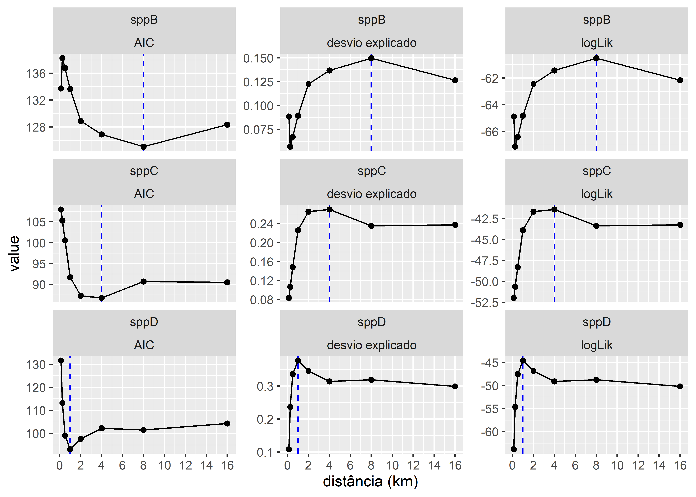

\newpage{}

# Respostas multiescala de espécies {#cap03}

## Apresentação

Este capitulo pretende ilustrar a abordagem geral de identificação de escalas de efeitos nas relações ambientais usando R. Usaremos conteudo baseado no Capítulo 2 do livro [Spatial Ecology and Conservation Modeling](https://doi.org/10.1007/978-3-030-01989-1) [@fletcher2018] . Aqui interpretamos a escala em que as espécies podem responder ao habitat, como a cobertura florestal. Para fazer isso, quantificamos a quantidade de floresta que ocorre a várias distâncias dos pontos de amostragem e, em seguida, determinamos a escala em que a cobertura florestal melhor prevê a ocorrência de espécies.

Durante o capitulo você aprenderá:

1.  Sobre conceitos de escalas características e escalas de efeito,\
2.  Quantificar e avaliar as correlações entre diferentes escalas,\
3.  Determinar a escala em que a floresta melhor prevê a ocorrência de espécies,\
4.  Compreender a relevância dos conceitos para a interpretação e aplicação de resultados dos estudos de ecologia da paisagem.

Recomenda-se que você leia os capítulos anteriores antes de iniciar este. Para ajudar a acompanhar e entender os exemplos no capítulo, você deve ler os seguintes artigos:

-   da Silva, C. R., et. al. (2013).\
    Mammals of Amapá State, Eastern Brazilian Amazonia: a revised taxonomic list with comments on species distributions. Mammalia, 77(4), 409-424. <https://doi.org/10.1515/mammalia-2012-0121>

-   Ferreira, A. S., Peres, C. A., Dodonov, P., & Cassano, C. R. (2020).\
    Multi-scale mammal responses to agroforestry landscapes in the Brazilian Atlantic Forest: the conservation value of forest and traditional shade plantations. Agroforestry Systems, 94, 2331-2341. <https://doi.org/10.1007/s10457-020-00553-y>

-   Lyra-Jorge, M. C., Ribeiro, M. C., Ciocheti, G., Tambosi, L. R., & Pivello, V. R. (2010).\
    Influence of multi-scale landscape structure on the occurrence of carnivorous mammals in a human-modified savanna, Brazil. European Journal of Wildlife Research, 56, 359-368. <https://doi.org/10.1007/s10344-009-0324-x>

-   Michalski, F., Boulhosa, R. L. P., Nascimento, Y. N. D., & Norris, D. (2020).\
    Rural wage-earners’ attitudes towards diverse wildlife groups differ between tropical ecoregions: implications for forest and savanna conservation in the Brazilian Amazon. Tropical Conservation Science, 13, <https://doi.org/10.1177/1940082920971747>

-   Michalski, F., & Peres, C. A. (2007).\
    Disturbance‐mediated mammal persistence and abundance‐area relationships in Amazonian forest fragments. Conservation Biology, 21(6), 1626-1640. <https://doi.org/10.1111/j.1523-1739.2007.00797.x>

-   Michalski, F., & Peres, C. A. (2005).\
    Anthropogenic determinants of primate and carnivore local extinctions in a fragmented forest landscape of southern Amazonia. Biological Conservation, 124(3), 383-396. <https://doi.org/10.1016/j.biocon.2005.01.045>

-   Regolin, et. al. (2017).    
Forest cover influences occurrence of mammalian carnivores within Brazilian Atlantic Forest. Journal of Mammalogy, 98(6), 1721-1731. <https://doi.org/10.1093/jmammal/gyx103>

Cópias dos artigos estão no Google Classroom e também podem ser baixadas [aqui](https://drive.google.com/drive/folders/13Bv_k4-fZiCNo-RlDfKDOT3qW-gJdJ6M?usp=sharing): <https://drive.google.com/drive/folders/13Bv_k4-fZiCNo-RlDfKDOT3qW-gJdJ6M?usp=sharing>

Para quem está começando com o R, este capítulo pode ser desafiador. Ele requer um entendimento de conceitos como modelagem, estruturas de dados e iteração. Se você não tiver esse conhecimento, não se preocupe em entender completamente o código de R. Em vez disso, concentre-se nos resultados apresentados, que mostram como as escalas características e as escalas de efeito podem ser aplicadas na Ecologia da Paisagem.

\newpage

## Escala de efeito - definição

Quantificando a escla de efeito é um problema cada vez mais considerado na ecologia aplicada [@jackson2015ecologists; @dattilo2023spatial; @mcgarigal2016multi]. A escala de efeito refere-se à extensão espacial em que um elemento ou processo da paisagem influencia mais fortemente uma resposta ecológica [@fletcher2018]. Em termos mais simples, é o “escala ideal”, onde a relação entre as características da paisagem e os padrões ecológicos é mais significativa. Este conceito é crucial para compreender como a heterogeneidade da paisagem molda os processos ecológicos e informa as estratégias de conservação.

### Definições

Vários ecologistas definiram a escala do efeito:

-   @MartinFahrig2012: "A extensão espacial, ou gama de extensões, dentro da qual uma variável da paisagem tem seu(s) efeito(s) mais forte(s) na resposta de uma determinada espécie."\

-   Wu & Li (2006): "As escalas espaciais, temporais e hierárquicas relevantes para processos e fenômenos ecológicos." No mesmo trabalho @WU2006 identificou duas conceitos de escala distintas, mas inter-relacionadas: escalas características e escalas de efeito.

1.  escalas características\
    O conceito de escala característica implica que muitos, se não a maioria, dos fenômenos naturais têm suas próprias escalas distintas (ou faixas de escalas) que caracterizam seu comportamento (por exemplo, extensão espacial típica ou frequência do evento). As escalas características são intrínsecas aos fenômenos de interesse, mas as escalas características detectadas com o envolvimento do observador podem ser matizadas com subjetividade. Os padrões e processos ecológicos têm escalas características distintas, nas quais sua dinâmica pode ser estudada de forma mais eficaz. Assim sendo, identificando escalas características fornece uma chave para uma compreensão profunda na Ecologia da Paisagem [@wu2004effects].

2.  escalas de efeito\
    As escala de efeito geralmente se referem às mudanças no resultado de um estudo devido a uma mudança na escala em que o estudo é conduzido. Os efeitos da mudança de escala no desenho experimental, na amostragem, nas análises estatísticas e na modelagem foram bem documentados em ecologia. As escalas de efeito podem ser explicados em termos de multiplicidade de escala, escalas características e hierarquia. Mas escalas de efeito também podem ser artefatos devido a erros na amostragem e medições, distorções na reamostragem de dados e falhas na análise estatística e modelagem [@wu2004effects]. As escalas características e as escalas de efeito estão inerentemente relacionados à questão da escala. Embora as escalas características forneçam uma base conceitual e diretrizes práticas para o dimensionamento, as descrições quantitativas das escalas de efeito podem levar diretamente a relações de escala [@wu2004effects].

Estas definições destacam a natureza dinâmica e dependente do contexto da escala de efeito. Ou seja - o que é mais importante para uma espécie ou processo pode ser irrelevante numa escala diferente ou para outro organismo.

### Aplicação

Existem mutias exemplos de uso onde a escala de efeito foi analisado como:

-   Ocorrência de espécies:\
    Estudos que investigam a relação entre a cobertura florestal e a diversidade de aves frequentemente encontram diferentes escalas de efeito para diferentes espécies [@miguet2016determines]. Por exemplo, alguns especialistas florestais podem apresentar a resposta mais forte num raio de 1 km de manchas florestais, enquanto os generalistas podem ser influenciados pela cobertura florestal em escalas maiores (por exemplo, 5 km).

-   Dispersão das sementes:\
    A distância percorrida pelas sementes antes da germinação pode variar dependendo do agente dispersor, variáveis de resposta e preditor de paisagens [@san2019scale]. Por exemplo, as sementes dispersas pelo vento podem ter efeitos em escalas maiores, enquanto as sementes dispersas pelas formigas podem ser limitadas a paisagens menores.

-   Dinâmica metapopulacional:\
    A persistência de populações pequenas e fragmentadas pode depender da conectividade de manchas de habitat adequadas dentro de uma determinada escala de paisagem [@frey2012rel; @foster2016planning; @saade2023landscape]. Portanto, compreender a escala do efeito da dispersão e movimento entre manchas é crucial para a concepção de estratégias de conservação eficazes.

### Como identificar a escala de efeito?

Consideramos como podemos relacionar diferenças de escala (extensão) com a ocorrência de espécies para ajudar a identificar a escala característica (ou escala de efeito) da cobertura florestal na ocorrência de espécies. Existem várias maneiras de quantificar a escala de efeito. Uma abordagem é usar zonas tampão (daqui adiante "buffers") de diferentes tamanhos para medir a paisagem circundante aos locais de amostragem. Essa abordagem foi popularizada por @pearson1993spatial e é amplamente utilizada por outros pesquisadores [@jackson2015ecologists; @GalanAcedo2018; @Moll2020].

Um método alternativo emprega uma função de suavização ponderada pela distância - Kernels espaciais. Os kernels podem ser usados para ponderar os dados com base na distância do local de amostreagem. Isso ajuda a capturar melhor os efeitos da vizinhança, ponderando mais os locais próximos do que os distantes. Chandler e Hepinstall-Cymerman [-@chandler2016estimating] mostraram como os kernels espaciais podem ser usados para selecionar a escala de efeito sem recorrer a binning a priori (como por exemplo, os buffers no capítulo "Métricas").

Neste capitulo, primeiramente ilustramos o uso de buffers de diferentes distancias e depois ilustramos o uso de kernels espaciais.

## Pacotes e dados

### Pacotes

Carregar pacotes (que deve esta instalado antes):

```{r load-packages-species, echo=FALSE, message=FALSE, warning=FALSE}
library(mapview)
library(eprdados)
library(tidyverse)
library(tidymodels)
library(GGally)
library(siland)
```

```{r show-packages-species, eval=FALSE, message=FALSE, warning=FALSE}
library(mapview)
library(eprdados)
library(tidyverse)
library(tidymodels)
library(GGally)
```

Caso os pacotes não tenham sido instalados, o R vai avisar atraves um mensagem tipo: `r kableExtra::text_spec("Error in library(nomepacote)  there is no package called nomepacote", color = "red")`. Neste caso, para instalá-los consulte o Capítulo \@ref(cap20) ou os capitulos aqui [Capitulo 4 instalação de pacotes](https://livro.curso-r.com/4-1-instala%C3%A7%C3%A3o-de-pacotes.html) e aqui [Capitulo 4 pacotes](https://analises-ecologicas.com/cap4#pacotes-1) . Prestando atenção nas diferenças para instalar um pacote como `eprdados` que vem do [GitHub](https://github.com/).

### Dados necessarios

Aqui usaremos os conjuntos de dados entrevistas e carnivoros. Os dados estão no pacote eprdados. Carregar os dados com o codigo seguinte:

```{r load-species-data, eval=FALSE}
entrevistas <- eprdados::entrevistas
carnivoros <- eprdados::carnivoros
```

Uma vez importados os dados para o R, geralmente antes de iniciarmos qualquer manipulação, visualização ou análise de dados, fazemos a conferência desses dados. Para isso, podemos utilizar as funções listadas na Tabela "Funções para verificação e resumo de dados multidimensionais." no Capítulo \@ref(cap21).

Exemplos de alguns funções e os resultados são no codigo seguinte:

```{r check-species-data, eval=FALSE, echo=TRUE}
## tipo de objeto
class(carnivoros)

## Primeiras linhas
head(carnivoros)

## Número de linhas e colunas
nrow(carnivoros)
#> [1] 2544
ncol(carnivoros)
#> [1] 13
dim(carnivoros)
#> [1] 2544   13

## Estrutura dos dados
str(carnivoros)

## Ajudar para dados que vem de uma pacote
?eprdados::carnivoros
```

#### Pergunta 1

`r kableExtra::text_spec('Verificar os dados entrevistas e carnivoros, usando funções "class()"; "str()" e ajudar "?". Descreva o conteúdo e compare as diferenças nesses dois conjuntos de dados. ', color = "blue", bold = TRUE)`

------------------------------------------------------------------------

Os dados entrevistas tem a localização de 106 propriedades rurais no Amapá [@Michalski2020int].

Os dados carnivoros consistem em:

-   Abundâncias e ausência-presença de três espécies de carnívoros simuladas no entorno de 106 propriedades rurais no Amapá, Brasil [@Michalski2020int]. A distribuição das espécies foi simulada usando o pacote [virtualspecies](https://github.com/Farewe/virtualspecies).\
-   Uma métrica de paisagem [cpland](https://r-spatialecology.github.io/landscapemetrics/reference/lsm_c_cpland.html) foi calculada no entorno das propriedades seguindo a metodologia no capítulo \@ref(cap02) usando o pacote [landscapemetrics](https://r-spatialecology.github.io/landscapemetrics/).

As três espécies têm respostas contrastantes à cobertura florestal. Os padrões de resposta seguem aqueles conhecidos para espécies de carnívoros [@MICHALSKI2005383; @MICHALSKI2007conbio; @regolin2017forest].

Os dados incluem valores de uma métrica de paisagem (cpland) calculada para uma única classe de cobertura do solo - cobertura florestal ([MapBiomas](https://brasil.mapbiomas.org/) Collection 8). A cobertura florestal foi reclassificada das classes originais, e inclui formações florestais e savânicas. A métrica cpland é o percentual da área central da classe em relação à área total da paisagem. A métrica cpland foi calculada em torno de cada propriedade rural em buffers com raios de 0,125, 0,25, 0,5, 1, 2, 4, 8 e 16 km. Para reduzir a influência da qualidade da imagem de satélite, os valores foram calculados como medianas de três anos: o ano de estudo, o ano anterior e o ano posterior.

### O paisagem do estudo

Para compreender o contexto da paisagem de estudo, examinaremos primeiro a área de estudo e a localização das propriedades rurais. Para visualizar as mudanças na area de estudo (onde foi feito as entrevistas) nos ultimos decadas podemos olhar com Google Earth Timelapse (com coordenados graus decimais 0.50979, -52.12023): <https://earthengine.google.com/timelapse#v=0.50979,-52.12023,7.512,latLng&t=0.49&ps=50&bt=19840101&et=20221231> .

Alem disso, no R podemos olhar os dados atraves de uma mapa interativa com o pacote [mapview](https://r-spatial.github.io/mapview/) : <https://r-spatial.github.io/mapview/> . [mapview](https://r-spatial.github.io/mapview/) serve para visualização exploratória de dados espacias — gerando mapas úteis com muito pouco código. Uma captura de tela do mapa padrão é mostrada abaixo, incluindo uma tabela pop-up que aparece se você clicar em um feição (ponto, linha etc) e o texto que aparece se você passar o mouse sobre uma camada.

```{r fig-mapview-example, echo=FALSE, fig.cap='mapview: Componentes e funções disponíveis no mapa interativo padrão.' }
knitr::include_graphics("figures/mapview_components.png")
```

A maneira mais fácil de criar um mapa no [mapview](https://r-spatial.github.io/mapview/) é usar a função `r kableExtra::text_spec("mapview()", background = "#dedede")` e passar um conjunto de dados espacias para ele. Podemos visualizar os locais das entrevistas com o seguinte código, que tem a mesma estrutura de sempre "pacote::função(dados)":

```{r mapview-example, eval=FALSE}
mapview::mapview(entrevistas)
```

Com o codigo `r kableExtra::text_spec("mapview::mapview(entrevistas)", background = "#dedede")` você deverá ver um mapa semelhante ao mapa da próxima figura. Com este mapa interativo você pode aproximar diferentes pontos e alterar o mapa base para outros, incluindo OpenStreetMap (com cidades, ruas etca) e ESRI WorldView (com imagem de satélite). Essas funcionalidades permitem ver padrões e heterogeneidade na cobertura da paisagem em diferentes escalas.

```{r map-study-area, echo=FALSE, message=FALSE, warning=FALSE}
# number of observed carnivore species at each property.
carn <- unique(carnivoros$sp_name)
int_points <- eprdados::interview_species_metrics |> 
  group_by(aid, Latitude, Longitude) |> 
  summarise(acount = n()) |> 
  left_join(eprdados::interview_species_metrics |>
  filter(sp_name %in% carn, sp_pa > 0) |>
  group_by(aid, Latitude, Longitude) |> 
  summarise(count_sp = length(unique(sp_name))) |> 
  ungroup()) |> 
  mutate(count_sp = replace_na(count_sp, 0)) |>
  st_as_sf(coords = c("Longitude", "Latitude"), crs = 4326)
  
mapview::mapview(entrevistas)
  
```

#### Pergunta 2

`r kableExtra::text_spec(enc2utf8('Na aula "Organização de paisagens" vimos que as paisagens contemporâneas são uma resultado de i) variabilidade em condições abióticos; ii) interações bióticas; iii) distúrbios naturais e sucessão; e iv) padrões antrópicos no uso da terra. Usando Google Earth Timelapse e a forma interativa da mapview, verficar a paisagem acerca das propriadades. Com base na sua interpretação das mapas, as aulas, e literatura citado até agora (como Michalski et. al. 2020, Michalski & Peres 2005, Michalski & Peres 2007), apresentar trés fatores que poderia explicar a distribuição espacial de especies de mamiferos na paisagem. Para cada fator inclui uma hipotese valida (e não trivial) junto com uma previsão que pode se testado com um estudo de Ecologia da Paisagem.'), color = "blue", bold = TRUE)`

------------------------------------------------------------------------

\newpage

## Buffers

Agora investigamos a escala em que as espécies podem responder ao habitat, como a cobertura florestal. Para fazer isso, quantificamos a quantidade de floresta que ocorre em várias distâncias e, em seguida, determinamos a escala em que a cobertura florestal melhor explica a ocorrência das espécies.

### Floresta

Primeiramente, olhamos a proporção de cobertura florestal em diferentes escalas (distâncias de buffer) para todos os pontos (locais de 106 entrevistas). Esses dados ja foram calculados seguindo os passos no capitulo "Métricas". Para nos auxilia à ter uma visão geral do conjunto de dados e de suas interrelações podemos apresentar como um gráfico pareado. Esse gráfico também é chamado de "pairs plot" ou "correlograma". A função `r kableExtra::text_spec("ggpairs()", background = "#dedede")` do pacote [GGally](https://ggobi.github.io/ggally/index.html) permite criar múltiplos gráficos pareados comparando as variáveis contínuas no seu conjunto de dados. Ou seja, com `r kableExtra::text_spec("ggpairs()", background = "#dedede")` podemos comparar cada distância do buffer com todas as outras distâncias do buffer.

Existem três resultados diferentes apresentados pela função:

1.  Gráficos de dispersão de cada par de variáveis (lado esquerdo abaixo da diagonal).

2.   Gráficos de distribuição de densidade de cada variável individualmente (no diagonal).

3.  Os valores de correlação entre os pares analisados (lado direito acima da diagonal).

Para mais detalhes sobre a função `r kableExtra::text_spec("ggpairs()", background = "#dedede")` veja Capítulo \@ref(cap23).

Ao fazê-lo, descobrimos que a percentagem de cobertura florestal em diferentes escalas tende a ser altamente correlacionada. As correlações mais fortes são entre as pares de escalas similares (125 e 250 metros por exemplo) e escalas maiores (acima de 1 km). Isto não é surpreendente, dado que os cálculos com um tamanho de buffer maior incluem a área em tamanhos de buffer menores.

```{r data-forest, eval=FALSE, echo=FALSE}
head(forest_cover_interviews) 
```

```{r plot-pairs, echo = FALSE, message = FALSE, warning = FALSE, out.width = "75%", out.height = "75%", fig.align="center", fig.cap="Cobertura florestal em torno dos locais de amostragem, calculada em diferentes escalas. São mostrados gráficos de dispersão da porcentagem de cobertura florestal para cada combinação de escalas em pares. Observe o alto grau de correlação entre as escalas similares (125 e 250 metros por exemplo) e escalas maiores (acima de 1 km)."}
forest_cover_interviews |> 
  filter(buff_dist_km <16) |> 
  pivot_wider(id_cols = aid, 
              names_from = buff_dist_km, 
              values_from = value_median) |>
  dplyr::select(!aid) |>
GGally::ggpairs() -> fig_pairs
png("figures/fig_pairs.png", width=7, height=7, 
    units="in", res = 600)
fig_pairs
invisible(dev.off())

```

### Floresta e a ocorrência de espécies

Para entender como a cobertura florestal afeta a ocorrência de espécies, usamos um modelo de regressão logística. Esse modelo é usado para prever a probabilidade de um evento ocorrer, como a presença de uma espécie. No caso da regressão logística, o evento é a presença de uma espécie (1) ou sua ausência (0).

A regressão logística é um dos métodos estatísticos mais comumente usados em ecologia. É aplicado a uma ampla gama de questões, incluindo:

-   Distribuição de espécies e adequação de habitat:    
Modelagem da probabilidade de uma espécie ocorrer em um habitat específico com base em fatores ambientais [@pearce2000evaluation].\
-   Dinâmica populacional:    
Análise de fatores que afetam o crescimento ou declínio populacional [@garcia2014rethinking].\
-   Biologia da conservação:    
Prevendo o impacto das atividades humanas nas espécies ameaçadas [@MICHALSKI2005383].\
-   Ecologia comunitária:    
Investigando as relações entre as espécies e seu ambiente [@warton2015so].

A regressão logística funciona de forma semelhante à regressão linear, mas é adaptada para dados binários (0 e 1). Na regressão linear, o modelo prevê um valor contínuo, como o tamanho do corpo de um animal. Na regressão logística, o modelo prevê a probabilidade de um evento ocorrer, como em nossa caso a presença de uma espécie. O modelo de regressão logística que usamos é simples, e não leva em conta todos os fatores que podem afetar a ocorrência de espécies. No entanto, é útil para ilustrar como efeitos de escala na cobertura florestal pode afetar nossa entendimento sobre a ocorrência de espécies.

Comparamos diferentes modelos com base em medições de cobertura florestal em diferentes escalas - extensões locais (distâncias de buffer). Para comparar os modelos com buffers diferentes, podemos usar medidas, como medidas de ajuste (verossimilhança), a variação explicada e/ou o sucesso preditivo. Uma avaliação de modelo completa incorpora vários critérios para garantir que sua regressão logística forneça insights confiáveis sobre seus dados ecológicos.

Primeiramente vamos rodar as analises para uma especie. Isso seria um exemplo mostrando os passos.

#### terminologia

Um detalhe importante sobre a regressão logística é que este modelo se enquadra na classe de modelos lineares generalizados (Generalized Linear Models - GLM). Logo, no R, este modelo pode ser estimado a partir da função `r kableExtra::text_spec("glm()", background = "#dedede")`, escolhendo a família binomial no argumento family. Para obter mais detalhes e exemplos mais aprofundados de modelos lineares e modelos lineares generalizados em R, consulte:

-   Ciência de Dados com R - Modelos: <http://sillasgonzaga.com/material/cdr/modelos>
-   Análises Ecológicas no R - Modelos Lineares Generalizados: <https://analises-ecologicas.com/cap8>

Usando os dados carnivoros, vamos nos referir a:

-   A coluna `r kableExtra::text_spec("sp_pa", background = "#dedede")` como variável dependente/resposta, com o valor observado (1 ou 0) denominado respostas.

As outras variáveis são referidas como variáveis independentes, mas classificaremos adicionalmente:

-   A coluna `r kableExtra::text_spec("buff_dist_km", background = "#dedede")` como variável de desenho (isto foi controlada pelo experimentador).

-   A coluna `r kableExtra::text_spec("value_median", background = "#dedede")` como variável independente/explanatoria; um covariável específica do ponto de amostragem (proprieadade rural) e distância de buffer.

A forma estrutural do modelo de regressão logística é:

::: {align="center"}
$logit( E[Y_i | X_i]) = logit(p_i) = ln(\frac{p_i}{1 - p_i}) = \beta_0 + \beta_1 X_{1i} + \epsilon$
:::

\

A notação típica da regressão linear inclui:

-   $Y_i$ denota a variável de resposta (ou dependente) Y para cada linha $i$; na regressão logística esta é uma variável binária
-   $X_{1i}$ denota a variável independente ($X_1$) para cada linha $i$
-   $\beta_0$ beta zero denota a interceptação Y quando $X$ é zero; isso não é informativo para modelos de regressão logística
-   $\beta_1$ beta denota a declive, isso é a mudança em $Y$ com uma mudança de 1 unidade em $X$
-   $p_{i}$ denota a probabilidade do evento ocorrer
-   $\epsilon$ denota os erros

O modelo de regressão logística é um modelo preditivo para dados binários. Conseqüentemente, o modelo de regressão logística pode gerar probabilidades de que uma amostra terá o resultado discreto dada(s) uma(s) variável(ões) de entrada. O modelo de regressão logística usa estimativa de máxima verossimilhança (Maximum Likelihood Estimation - MLE), que é uma probabilidade condicional que classifica o resultado se um determinado limite for atingido (por exemplo, \> 0,50). Portanto, o intervalo de probabilidade de um modelo de regressão logística está entre 0 e 1.

Para comparar o ajuste de modelos diferentes, usamos a log-verossimilhança, que tem um forte base filosófica em estatística. log-verossimilhanças são baseadas no conceito de máxima verossimilhança, que é uma técnica estatística para estimar os parâmetros de um modelo a partir dos dados. Neste estudo, comparamos modelos que possuem o mesmo número de parâmetros. Isso é importante porque permite que os resultados sejam interpretados com mais confiança. Se os modelos tivessem diferentes números de parâmetros, seria difícil dizer se as diferenças nos resultados eram devido às diferenças nas escalas espaciais ou ao número de parâmetros. Assim sendo, neste caso, o uso de alternativos como critérios de seleção de modelos, como o Critério de Informação de Akaike, que penaliza a log-verossimilhança com base no número de parâmetros [@burnham2002], forneceria resultados idênticos.

#### Construção de modelos
```{r boxquote, echo=FALSE, fig.align='center', out.width = "120%", out.height = "120%"}

```


Todos os modelos estão errados, alguns são úteis (“All models are wrong, some are useful.” - [George E. P. Box](https://en.wikipedia.org/wiki/All_models_are_wrong) : <https://en.wikipedia.org/wiki/All_models_are_wrong> ).

Devemos ter cuidado durante o processo utilizado para construir modelos, assim, não somente para fornecer uma representação robusta e útil do mundo real, mas também para representar fielmente os erros/incertezas associadas. Cada escolha feita mudará a representação dos padrões espaciais e dos processos ecológicos. Portanto, para gerar evidências científicas robustas, todas as etapas devem ser descritas detalhadamente. Um modelo é uma simplificação ou aproximação da realidade e, portanto, não refletirá toda a realidade. Embora um modelo nunca possa ser “verdadeiro”, um modelo pode ser classificado de muito útil, a útil, a algo útil e, finalmente, essencialmente inútil [@burnham2002]. Uma avaliação de modelo completa incorpora vários critérios para garantir que sua regressão logística forneça insights confiáveis sobre seus dados ecológicos.

Neste exemplo, analisamos a ocorrência da espécie "sppD" em relação à cobertura florestal. Antes de construir e executar os modelos, é importante executar uma análise exploratória de dados. Aqui usamos boxplots para uma análise exploratória preliminar. Existem muitos tipos de análise exploratória de dados, que variam dependendo dos dados e do tipo de modelo. No caso de modelos de regressão logística, para as variáveis independentes contínuas como proporção de floresta ( `r kableExtra::text_spec("value_median", background = "#dedede")` ), podemos tentar gráficos de caixa ([boxplots](https://www.data-to-viz.com/caveat/boxplot.html)) de cada variável independente no exio "y" com a variável dependente (presença-ausencia) tratada como um fator de agrupamento no eixo "x".

O boxplot mostra a tendência central e a variabilidade dos dados, mais sobre boxplot no capítlo de visualização \@ref(cap23). Aqui, os boxplots mostram que, onde a espécie está presente, a cobertura florestal é, em média (mediana), mais elevada do que onde a espécie está ausente. No entanto, há uma variação substancial na cobertura florestal nos locais onde a espécie está ausente. Essa variação sugere que, embora a cobertura florestal seja um fator importante que influencia a ocorrência da espécie, outros fatores também podem desempenhar um papel. Por exemplo, a espécie pode estar sujeita a outros fatores de pressão, que podem incluir a caça, limitação de recursos (comida, abrigo, etc.) e/ou a competição com outras espécies.

```{r fig-sppD, echo = FALSE, warning=FALSE, message=FALSE, out.width = "90%", out.height = "90%", fig.cap="Gráfico para explorar as relações entre as variáveis. Boxplot comparando área central de floresta entre a presença-ausença de uma espécie em escalas diferentes (distâncias de 0.125 a 4 km)."}

eprdados::carnivoros |> 
  dplyr::filter(sp_name == "sppD", buff_dist_km < 8) |>
  ggplot(aes(x= factor(sp_pa), y = value_median)) + 
  geom_boxplot(aes(colour=factor(sp_pa))) + 
  facet_grid(sp_name~buff_dist_km) + 
  scale_color_viridis_d("ocorrência", 
                        labels = c("ausente", "presente")) +
  theme(legend.position='top') +
  labs(x = "ocorrência", 
       y = "Área central de floresta\n(porcentagem da paisagem)") -> fig_sppD_box

png("figures/fig_sppD_box.png", width=7, height=3, 
    units="in", res = 600)
fig_sppD_box
invisible(dev.off())
knitr::include_graphics("figures/fig_sppD_box.png")

```

A previsão da ausência de espécies na ecologia apresenta vários desafios que a tornam mais difícil do que a previsão da sua presença. Aqui estão alguns motivos principais:

1.  Detecção imperfeita:\
    Detectar de forma conclusiva a ausência de uma espécie é muitas vezes mais difícil do que confirmar a sua presença. A falta de detecção pode ser devido a:
    -   Baixas taxas de encontro: Algumas espécies podem ser naturalmente raras ou secretas, tornando-as difíceis de encontrar mesmo quando estão presentes.
    -   Vieses de detecção: Os métodos de amostragem podem ser tendenciosos em relação a determinadas espécies ou habitats, levando a falsos negativos para outros.
    -   Fatores ambientais: As condições ambientais, como o clima ou a cobertura vegetal, podem influenciar a detectabilidade, tornando mais difícil inferir a verdadeira ausência.
2.  Nichos ecológicos:\
    Os nichos ecológicos são complexos e multifacetados. Prever a ausência requer a compreensão de toda a gama de condições e recursos ambientais que uma espécie pode tolerar, o que pode ser um desafio devido a:
    -   Conhecimento limitado: A nossa compreensão das necessidades ecológicas de muitas espécies ainda é incompleta, especialmente para táxons menos estudados.
    -   Variabilidade espacial e temporal: A adequação do habitat pode variar no espaço e no tempo, tornando difícil prever a ausência de uma espécie em todos os locais potenciais.
    -   Preferências de microhabitat: Algumas espécies podem ter preferências específicas de microhabitat em áreas aparentemente adequadas, tornando a sua ausência mais difícil de identificar.
3.  Efeitos de limiar:\
    As respostas das espécies aos factores ambientais envolvem frequentemente limiares, onde estão presentes acima de um determinado valor, mas ausentes abaixo dele. Identificar esses limites com precisão pode ser difícil, levando a incertezas na previsão de áreas de ausência.

#### Pergunta 3

`r kableExtra::text_spec(enc2utf8('Identifique a espécie "sppD". Com base nos resultados dos boxplots e os artigos (Michalski & Peres 2005; Michalski & Peres 2007; Regolin et. al. 2017), sugerem três espécies de carnívoros que poderiam apresentar os mesmos padrões do sppD? Que informações/resultados adicionais o ajudariam a identificar a espécie sppD com maior certeza? Justifique suas escolhas de forma clara e concisa.'), color = "blue", bold = TRUE)`

------------------------------------------------------------------------

Os boxplots são úteis para análises exploratórias, mas não fornecem muitas informações para a compreensão da escala do efeito. 

Agora plotamos os dados, ajustando uma regressão logística para obter uma representação visual. É útil executar isso (representação visual) antes de executar os modelos, para que tenhamos uma ideia dos padrões que existem nos dados. Como no capítulo anterior usamos a função `stat_smooth()` para sobrepõe uma curva da regressão logística ajustada aos dados.

Os graficos mostrarm a mesma padrao que os boxplots, mas com informações adicionais. Como vimos nos boxplots a probabilidade de ocorrência aumenta com a cobertura florestal. Agora podemos ver mais claramente como a forma e a força da relação com a cobertura florestal mudam em diferentes escalas. Por exemplo, observe as diferenças dos valores da cobertura florestal com 50% de probabilidade (linhas horizontais tracejadas).

```{r fig-sppd-lr, echo = FALSE, warning=FALSE, message=FALSE, out.width = "90%", out.height = "90%", fig.cap="Gráfico para explorar as relações entre as variáveis. Comparando a resposta de presença-ausença de uma espécie em escalas diferentes (distâncias de 0.125 a 4 km). Pontos mostram presença-ausência da espécie em 106 propriedades rurais. A linha azul é o ajuste de uma regressão logística. A linha horizontal tracejada é a probabilidade de ocorrência de 50%."}

carnivoros |> 
  dplyr::filter(sp_name == "sppD", buff_dist_km < 8) |>
  ggplot(aes(x=value_median, y = sp_pa)) + 
      geom_jitter(width=3, height=0.02, alpha=0.4) + 
  geom_hline(yintercept = 0.5, linetype="dashed") +
  geom_smooth(method="glm", 
              method.args = list(family = "binomial"), 
              se = FALSE) + 
  facet_grid(sp_name~buff_dist_km) + 
  scale_y_continuous("presença (probabilidade)", 
                     c(0,1), breaks = c(0,0.2,0.4,0.6,0.8,1.0)) +
  labs(x = "Área central de floresta\n(porcentagem da paisagem)") -> fig_sppD_lr


png("figures/fig_sppD_lr.png", width=12, height=3, 
    units="in", res = 600)
fig_sppD_lr + theme(text = element_text(size = 16))
invisible(dev.off())
knitr::include_graphics("figures/fig_sppD_lr.png")
```

Uma impressão visual é útil. Mas devemos utilizar modelos estatísticos para fornecer evidências mais robustas e objetivas. Usamos código que executará modelos simultaneamente para todas as distâncias de buffer. Podemos fazer a mesma tarefa com modelos e resultados separadamente para cada distância de buffer. Mas, seria pelo menos 50 linhas de codigo para rodar os modelos separadamente e obter os resultados que precisamos. Rodando os modelos seperadamente seria viavel se precisássemos de apenas um ou dois modelos. Mas torna-se muito ineficiente e muito propenso a gerar erros quando precisamos executar vários modelos diferentes, por exemplo, em distâncias diferentes e para espécies diferentes. Aqui usamos funções oriundos dos pacotes [tidyverse](https://www.tidyverse.org/) e [tidymodels](https://www.tidymodels.org/) para rodar os modelos e obter os resumos que precisamos em menos de 10 linhas - fazendo múltiplos modelos de regressão simultaneamente no R. Vamos fazer múltiplos modelos simultaneamente usando funções de:

-   listas aninhadas `r kableExtra::text_spec("tidyr::nest", background = "#dedede")`,
-   iteração `r kableExtra::text_spec("purr::map", background = "#dedede")` e
-   extração de resultados arrumados `r kableExtra::text_spec("broom::glance", background = "#dedede")` e `r kableExtra::text_spec("broom::tidy", background = "#dedede")`.

Embora possa parecer complicado, este é um processo poderoso que pode ser aplicado a grandes conjuntos de dados e funciona para muitos dos diferentes tipos de modelos que você pode executar em R (incluindo aprendizado de máquina). O processo inclui dois princípios básicos:

1.  Usando colunas de lista para armazenar estruturas de dados em um data frame. Por exemplo, isso permitirá que você tenha uma coluna que contenha modelos lineares generalizados como uma regressão logistica.
2.  Usando o pacote [broom](https://broom.tidymodels.org/), para transformar modelos em dados organizados.\
    Essa é uma técnica poderosa para trabalhar com um grande número de modelos porque, depois de ter dados organizados, você poderá aplicar muitas opçoes para análise e visualizações rapidamente e sem erros.

Em menos de 10 linhas, incluimos funçoes para obter um conjunto de 8 modelos diferentes (um modelo para cada distância de buffer) e resultados associados dentro do objeto final "modelos_sppD". Para isso o processo tem quatro etapas conectadas com o operador pipe `r kableExtra::text_spec("|> ", background = "#dedede")` . Começando com o banco de dados carnivoros, na sequencia:

1.  aplicar um filtro para selecionar o especie "sppD" `r kableExtra::text_spec("dplyr::filter", background = "#dedede")`
2.  selecionar as colunas que precisamos no modelos `r kableExtra::text_spec("dplyr::select", background = "#dedede")`
3.  divida os dados em partes que serão modeladas separadamente (listas aninhadas para 8 modelos, um para cada distância do buffer) `r kableExtra::text_spec("tidyr::nest", background = "#dedede")`
4.  aplique os modelos e salve os resultados `r kableExtra::text_spec("dplyr::mutate", background = "#dedede")`.\
    A última etapa inclui a criação de três novos itens usando a função `r kableExtra::text_spec("map", background = "#dedede")` :
    -   fit: o modelo de regressão logística a ser aplicado `r kableExtra::text_spec("glm", background = "#dedede")`
    -   glanced: resumo do modelo (informações e ajustes dos modelos)
    -   tidied: resumo das variáveis (estimativas, intervalos de confiança etc)

```{r models-lr-sppD}
# Modelos para sppD e 8 distâncias de buffer
modelos_sppD <- carnivoros |>
# 1. filtro a especie desejada
  dplyr::filter(sp_name == "sppD") |>
# 2. selecionar as colunas que faz parte dos modelos
  dplyr::select(sp_name, buff_dist_km, sp_pa, value_median) |> 
# 3. agrupar para rodar modelos diferentes para especie 
# e escala (distância de buffer)
  tidyr::nest(.by = c(sp_name, buff_dist_km)) |>
# 4. especificar modelo e os resumos desejados
  dplyr::mutate(
    fit = purrr::map(data, ~ glm(sp_pa ~ value_median, 
                          data = .x, family = "binomial") 
              ), 
    glanced = purrr::map(fit, broom::glance),
    tidied = purrr::map(fit, broom::tidy, conf.int = TRUE, conf.level = 0.95)
  )
```

Olhar os resultados. Se tudo correr bem, haverá um novo objeto de dados "modelos_sppD" no ambiente. Existem 8 linhas (um modelo para cada distância do buffer) e 6 colunas. As colunas incluem os dados ("data") e resumos para cada modelo ("glanced") e para cada variavel em cada modelo ("tidied")

```{r}
modelos_sppD
```

Olhar resumos dos modelos. Para verificar o conteudo de uma coluna com lista aninhada feita com `r kableExtra::text_spec("tidyr::nest", background = "#dedede")`, precisa desembrulhar com `r kableExtra::text_spec("tidyr::unnest", background = "#dedede")`. O próximo código mostrará os valores de resumo para cada modelo. Isso inclui as colunas "logLik" (log-verossimilhança) e "AIC" (Critério de Informação de Akaike) que usaremos para compare e identifique a escala do efeito.

```{r}
modelos_sppD |> 
  tidyr::unnest(glanced)
```

Olhar resumos das variáveis, ou seja valores que resume as "descobertas" estatísticas do modelo, como as estimativas, erro padrão ("std.error"), intervalos de confiança (colunas "conf.low" e "conf.high"), e valores de p (coluna "p.value"). A coluna "estimate" (termos beta) tem os valores quantificando a relação entre a ocorrência de espécie sppD e a cobertura florestal. Quando os valores na coluna "estimate" são positivos existe uma relação positiva com a variavel na coluna "term", e quando são negativos existe uma relação negativa. Para saber se esta relação é significativa podemos observar o valor p juntamente com os intervalos de confiança. Para serem significativos, os intervalos de confiança não devem se sobrepor a zero.

```{r}
modelos_sppD |> 
  tidyr::unnest(tidied)
```

#### Compare e identifique a escala do efeito

Agora vamos usar os resultados em "modelos_sppD" para responder duas perguntas:

1.  Qual escala melhor se ajusta aos dados de presença-ausencia de sppD?
2.  A relação entre a ocorrência de espécie sppD e a cobertura florestal é a mesma em diferentes escalas?

`r kableExtra::text_spec("Qual escala melhor se ajusta aos dados de presença-ausencia de sppD?", bold=TRUE)`.

Ajustamos modelos de regressão logística aos dados, usando a cobertura florestal como variável independente. Para identificar a escala do efeito da cobertura florestal na ocorrência de sppD, plotamos as log-verossimilhanças, desvio explicado e AIC de diferentes modelos de regressão logística ajustados aos dados em função da cobertura florestal calculada em diferentes escalas, variando de 0.125 m a 16 km.

-   Log-verossimilhança: uma medida da probabilidade dos dados serem observados sob o modelo.\
    A log-verossimilhança mede quão bem as probabilidades previstas do modelo correspondem aos dados observados. Valores mais altos de log-verossimilhança indicam um melhor ajuste. Interpretação:
    -   Não é diretamente interpretável por si só, mas é usado para calcular outras medidas, como desvio e AIC.
    -   Comparar log-verossimilhanças de diferentes modelos (aninhados ou com o mesmo número de parâmetros) pode indicar qual deles se ajusta melhor aos dados.
-   Desvio explicado: uma medida da proporção da variação na ocorrência que é explicada pelo modelo.\
    O desvio explicado é a proporção do desvio total (desvio nulo) que é explicado pelo modelo. Interpretação:
    -   Representa a capacidade do modelo de capturar a variabilidade na variável resposta.
    -   Os valores variam de 0 a 1, com valores mais altos indicando melhor ajuste.
    -   Pode ser interpretado de forma semelhante ao R-quadrado na regressão linear.
    -   Não existe um único valor “bom” para o desvio explicado em uma regressão logística em ecologia, pois depende de vários fatores, incluindo o tamanho da amostra e complexidade do modelo:\
    -   Tamanho da amostra:\
        Amostras maiores: Geralmente, com amostras maiores, você verá valores explicados de desvio mais altos devido ao aumento do poder estatístico para detectar efeitos menores. Um valor acima de 0,5 pode ser considerado bom em amostras grandes.\
        Amostras menores: Valores em torno de 0,2-0,3 podem ser considerados decentes para amostras menores devido às limitações na detecção de efeitos sutis.\
    -   Complexidade do modelo:\
        Modelos mais simples: com menos variáveis explicativas, você provavelmente verá valores explicados de desvio mais baixos, mesmo que o modelo capture os padrões principais. Valores acima de 0,3 podem ser bons para esses modelos.\
        Modelos mais complexos: Esses modelos tendem a ter valores explicados de desvio mais altos, mas isso não significa necessariamente que sejam melhores. Valores altos também podem indicar ajuste excessivo aos dados específicos. Valores próximos a 0,8 ou acima podem exigir um exame cuidadoso para overfitting.
-   AIC: índice de informação de Akaike.\
    O AIC equilibra a qualidade do ajuste (medida pela Log-verossimilhança) com a complexidade do modelo (número de parâmetros). Penaliza os modelos pela sua complexidade, recompensando modelos mais simples que se ajustam quase tão bem aos dados. Isso significa que um modelo com uma valor de AIC mais baixa é geralmente considerado mais preferível, pois provavelmente representa bem os dados, evitando o sobreajuste. Interpretação:
    -   Valores mais baixos de AIC indicam um melhor equilíbrio entre ajuste e parcimônia. Ou seja, valores mais baixos são melhores, ao contrário de medidas como desvio explicado, onde valores mais altos são melhores.
    -   Usado para seleção de modelo, sendo geralmente preferido o modelo com o AIC mais baixo.

Esperaríamos que a escala que melhor se ajustasse aos dados fosse a que apresentasse os maiores valores de log-verossimilhança, desvio explicado e valor de AIC mais baixo. Nesse caso, descobrimos que a cobertura florestal dentro de 1 km é a que melhor se ajusta aos dados.

```{r, fig-sppd-scale, echo = FALSE, warning=FALSE, message=FALSE, out.width = "80%", out.height = "80%", fig.cap="Escala do efeito da cobertura florestal na ocorrência do sppD, com base em uma análise de buffer. A probabilidade de ocorrência foi modelada como uma função da porcentagem de floresta, calculada em diferentes escalas usando um buffer circular em torno de pontos (0,125–16 km). Escala do efeito identificada usando três medidas de ajuste do modelo (i) Critério de informação de Akaike (AIC). Um AIC mais baixo sugere um modelo mais útil. (ii) a proporção de desvio explicado para os modelos. Um maior desvio explicado sugere um melhor ajuste do modelo aos dados. (iii)  A verossimilhança logarítmica (logLik) para modelos de regressão logística. Uma log-verossimilhança mais alta sugere um melhor ajuste do modelo aos dados. A linha azul vertical tracejada mostra a melhor escala para cada medida de ajuste do modelo."}

modelos_sppD |> 
  tidyr::unnest(glanced) |> 
  dplyr::mutate(`desvio explicado`= (null.deviance - deviance)/null.deviance
  ) |>
  dplyr::select(sp_name, buff_dist_km, logLik, AIC, `desvio explicado`) |> 
  tidyr::pivot_longer(cols = c(logLik, AIC, `desvio explicado`)) |> 
  ggplot(aes(x = buff_dist_km, y = value)) + 
  geom_vline(xintercept = 1, linetype = "dashed", colour="blue") +
  geom_point() + 
  geom_line() + 
  scale_x_continuous(breaks = c(0,2,4,6,8,10, 12,14,16)) +
  facet_wrap(~name, nrow = 3, scales = "free_y") +
  labs(x = "distância (km)") -> figg_sppD_logLikAIC

png("figures/figg_sppD_logLikAIC.png", width=6, height=7.5, 
    units="in", res = 600)
figg_sppD_logLikAIC 
invisible(dev.off())
knitr::include_graphics("figures/figg_sppD_logLikAIC.png")
 
```

`r kableExtra::text_spec("A relação entre a ocorrência de espécie sppD e a cobertura florestal é a mesma em diferentes escalas?", bold=TRUE)`.

Vimos nos gráficos comparando a resposta de presença-ausença de sppD em escalas diferentes, que existem diferenças no padrão (50% de probabilidade aumenta de 25% para 75% de cobertura florestal de 0,125 para 1 km). Ou seja, em escalas maiores, são necessárias maiores proporções de floresta para que a sppD ocorra. Mas existe algum suporte estatístico para mostrar que as diferenças entre escalas são relevantes?

Para identificar se ha diferenças na relação entre a ocorrência de espécie sppD e a cobertura florestal, plotamos os valores estimados (coluna "estimate") para a variavel independente (value_median). Inclumos intervalos de confiança de diferentes modelos de regressão logística ajustados aos dados em função da cobertura florestal calculada em diferentes escalas, variando de 0.125 m a 16 km. Ao representar graficamente os termos beta em diferentes escalas, descobrimos que São todos significativamente positivos (os intervalos de confiança não se sobrepõem a zero). A força da relação com a floresta dobra entre 0,125 e 1 km, mas depois diminui. Mas há uma grande sobreposição nos intervalos de confiança. Esta incerteza é esperada porque sabemos que os modelos explicam 30 por cento ou menos do desvio global.

```{r fig-sppd-scale-est, echo = FALSE, warning=FALSE, message=FALSE, out.width = "90%", out.height = "90%", fig.cap="As estimativas do parâmetro para o efeito da cobertura florestal (termo beta) na probabilidade de ocorrência de sppD usando buffers de diferentes tamanhos. A probabilidade de ocorrência foi modelada em função da porcentagem de floresta, calculada em diferentes escalas usando um buffer circular em torno de pontos (0,125–16 km). Os pontos são as estimativas médias com linhas verticais mostrando intervalos de confiança de 95%. A linha azul vertical tracejada mostra a melhor escala para cada medida de ajuste do modelo."}
modelos_sppD |> 
  tidyr::unnest(glanced) |> 
  dplyr::mutate(dev_exp = (null.deviance - deviance)/null.deviance
  ) |> 
  dplyr::select(sp_name, buff_dist_km, dev_exp) |> 
  ggplot(aes(y = dev_exp, x = buff_dist_km)) + 
  geom_vline(xintercept = 1, linetype = "dashed", colour="blue") +
  geom_point() + 
  geom_line() + 
  scale_x_continuous(breaks = c(0,2,4,6,8,10, 12,14,16)) + 
  coord_cartesian(ylim = c(0, 0.377)) +
  labs(title = "(A)", 
       x = "distância (km)", 
       y = "desvio explicado") -> fig_sppD_dev

modelos_sppD |> 
  tidyr::unnest(tidied) |> 
  dplyr::filter(term == "value_median") |>
  dplyr::mutate(p.value = round(p.value,4) ) |> 
  dplyr::select(sp_name, buff_dist_km, term, 
                estimate, conf.low, conf.high, p.value) |> 
  #pull(conf.high) |> max()
  ggplot(aes(x = buff_dist_km, y = estimate)) + 
  geom_vline(xintercept = 1, linetype = "dashed", colour="blue") +
  geom_errorbar(aes(ymin = conf.low, ymax = conf.high), width = .1) +
  geom_point() + 
  scale_x_continuous(breaks = c(0,2,4,6,8,10, 12,14,16)) + 
  scale_y_continuous(limits = c(0, 0.128), 
                     breaks = c(0, 0.04,0.08, 0.12)) + 
  labs(title = "", 
       x = "distância (km)", 
       y = "estimativa (IC 95%)") -> fig_sppD_est

png("figures/figg_sppD_scale_est.png", width=6, height=4, 
    units="in", res = 600)
fig_sppD_est
invisible(dev.off())
knitr::include_graphics("figures/figg_sppD_scale_est.png")

```

 * Conclusão:    
Há evidências consistentes de que a ocorrência de sppD aumenta com a cobertura florestal na paisagem (com base na cobertura medida em 1 km e em escalas maiores).

#### Pergunta 4

`r kableExtra::text_spec(enc2utf8('O que sabemos sobre a espécie "sppD"? Com base nos resultados obtidos: boxplots, graficos com a relação entre occorencia e proporção de floresta, resultados sobre escala do efeito e os artigos (Michalski & Peres 2005; Michalski & Peres 2007; Regolin et. al. 2017), forneça uma caracterização da espécie (por exemplo, especialista/generalista/sensível/resiliente). Justifique a sua caracterização e interpretações com resultados específicos, destacando os resultados com maior relevância. Que informações/resultados adicionais o ajudariam a caracterizar a espécie sppD com maior certeza? Justifique suas escolhas de forma clara e concisa.'), color = "blue", bold = TRUE)`

------------------------------------------------------------------------

#### Múltiplas espécies

Vamos agora repetir o processo para todas as três espécies nos dados carnívoros. Indo na mesma sequência: boxplots, gráficos de regressão logística e, em seguida, escala de efeito pela plotagem de resumos de modelos de regressão logística e termos beta.

Primeiramente os boxplots:

```{r fig-species-boxplots, echo = FALSE, warning=FALSE, message=FALSE, out.width = "90%", out.height = "90%", fig.cap="Boxplot comparando área central de floresta entre a presença-ausença de espécies em escalas diferentes (distâncias de 0.125 a 16 km)."}

eprdados::carnivoros |> 
  ggplot(aes(x= factor(sp_pa), y = value_median)) + 
  geom_boxplot(aes(colour=factor(sp_pa))) + 
  facet_grid(sp_name~buff_dist_km) + 
  scale_color_viridis_d("ocorrência", 
                        labels = c("ausente", "presente")) +
  theme(legend.position='top') + 
  scale_y_continuous(breaks = c(0, 50, 100)) +
  labs(x = "ocorrência", 
       y = "Área central de floresta (porcentagem da paisagem)") -> fig_carnivoros_box

png("figures/fig_carnivoros_box.png", width=7, height=6, 
    units="in", res = 600)
fig_carnivoros_box
invisible(dev.off())
knitr::include_graphics("figures/fig_carnivoros_box.png")

```

Agora plotamos os dados, ajustando uma regressão logística para obter uma representação visual. É útil executar isso (representação visual) antes de executar os modelos, para que tenhamos uma ideia dos padrões que existem nos dados. Como no capítulo anterior usamos a função `stat_smooth()` para sobrepõe uma curva da regressão logística ajustada aos dados.

```{r fig-species-logistic, echo = FALSE, warning=FALSE, message=FALSE, out.width = "90%", out.height = "90%", fig.cap="Gráfico para explorar as relações entre as variáveis. Comparando a resposta de presença-ausença de três espécies de carnívoros em escalas diferentes (distâncias de 0.125 a 16 km). Pontos mostram presença-ausência da espécie em 106 propriedades rurais. A linha azul é o ajuste de uma regressão logística. A linha horizontal tracejada é a probabilidade de ocorrência de 50%."}

carnivoros |>
  ggplot(aes(x=value_median, y = sp_pa)) + 
      geom_jitter(width=2, height=0.05, alpha=0.4) + 
  geom_hline(yintercept = 0.5, linetype="dashed") +
  geom_smooth(method="glm", 
              method.args = list(family = "binomial"), 
              se = FALSE) + 
  facet_grid(sp_name~buff_dist_km) + 
  scale_x_continuous(breaks = c(0,50, 100)) +
  scale_y_continuous("presença (probabilidade)", 
                     c(0,1), 
                     breaks = c(0,0.2,0.4,0.6,0.8,1.0)) +
  labs(x = "Área central de floresta (porcentagem da paisagem)") -> fig_spp


png("figures/fig_spp.png", width=7, height=5, 
    units="in", res = 600)
fig_spp
invisible(dev.off())
knitr::include_graphics("figures/fig_spp.png")
```

Para identificar a escala do efeito da cobertura florestal na ocorrência de espécies, plotamos as log-verossimilhanças, desvio explicado e AIC de diferentes modelos de regressão logística ajustados aos dados em função da cobertura florestal calculada em diferentes escalas, variando de 0.125 m a 16 km. Esperaríamos que a escala que melhor se ajustasse aos dados fosse a que apresentasse os maiores valores de log-verossimilhança, desvio explicado e valor de AIC mais baixo:

```{r models-carnivore-scale-effect, echo=FALSE, message=FALSE, warning=FALSE}

#Run models for three species and 8 buffer distances
carnivoros|>
  dplyr::select(sp_name, sp_pa, value_median, buff_dist_km) |>
  tidyr::nest(.by = c(sp_name, buff_dist_km)) |>
  dplyr::mutate(
    fit = map(data, ~ glm(sp_pa ~ value_median, 
                          data = .x, family = "binomial")),
    tidied = map(fit, broom::tidy, conf.int = TRUE, conf.level = 0.95), 
    glanced = map(fit, broom::glance)
  ) -> modelos_carnivoros
```

```{r fig-carnivoros-scale, echo = FALSE, warning=FALSE, message=FALSE, out.width = "90%", out.height = "90%", fig.cap="Escala do efeito da cobertura florestal na ocorrência de três espécies de carnívoros, com base em uma análise de buffer. A probabilidade de ocorrência foi modelada como uma função da porcentagem de floresta, calculada em diferentes escalas usando um buffer circular em torno de pontos (0,125–16 km). Escala do efeito identificada usando três medidas de ajuste do modelo (i) Critério de informação de Akaike (AIC). Um AIC mais baixo sugere um modelo mais útil. (ii) a proporção de desvio explicado para os modelos. Um maior desvio explicado sugere um melhor ajuste do modelo aos dados. (iii)  A verossimilhança logarítmica (logLik) para modelos de regressão logística. Uma log-verossimilhança mais alta sugere um melhor ajuste do modelo aos dados. A linha azul vertical tracejada mostra a melhor escala para cada medida de ajuste do modelo."}

# Holds values for plotting "best scale" for each facet.
best_models <- modelos_carnivoros |> 
  tidyr::unnest(glanced) |> 
  dplyr::mutate(`desvio explicado`= (null.deviance - deviance)/null.deviance
  ) |>
  dplyr::select(sp_name, buff_dist_km, logLik, AIC, `desvio explicado`) |> 
  tidyr::pivot_longer(cols = c(logLik, AIC, `desvio explicado`)) |> 
  group_by(sp_name, name) |> 
  mutate(arank = min_rank(value), 
         arank_desc = min_rank(-value)) |> 
  arrange(sp_name, name, arank) |>
  ungroup() |> 
  mutate(new_name = case_when(name == "AIC" & arank == 1 ~ "AIC", 
                              name == "desvio explicado" & arank_desc == 1 ~
                                "desvio explicado", 
                              name == "logLik" & arank_desc == 1 ~ "logLik"
                              ) 
         ) |> 
  filter(!is.na(new_name))

# Plot
modelos_carnivoros |> 
  tidyr::unnest(glanced) |> 
  dplyr::mutate(`desvio explicado`= (null.deviance - deviance)/null.deviance
  ) |>
  dplyr::select(sp_name, buff_dist_km, logLik, AIC, `desvio explicado`) |> 
  tidyr::pivot_longer(cols = c(logLik, AIC, `desvio explicado`)) |> 
  ggplot(aes(x = buff_dist_km, y = value)) + 
  geom_vline(data = best_models, 
             aes(xintercept = buff_dist_km), 
                 linetype = "dashed", colour="blue") +
  geom_point() + 
  geom_line() + 
  scale_x_continuous(breaks = c(0,2,4,6,8,10, 12,14,16)) +
  facet_wrap(sp_name~name, nrow = 3, scales = "free_y") +
  labs(x = "distância (km)") -> figg_carnivoros_logLikAIC

png("figures/figg_carnivoros_logLikAIC.png", width=7, height=5, 
    units="in", res = 600)
figg_carnivoros_logLikAIC 
invisible(dev.off())

```

Para identificar se ha diferenças na relação entre a ocorrência de espécies e a cobertura florestal, plotamos os valores estimados (coluna "estimate") para a variavel independente (value_median). Inclumos intervalos de confiança de diferentes modelos de regressão logística ajustados aos dados em função da cobertura florestal calculada em diferentes escalas, variando de 0.125 m a 16 km:

```{r fig-carnivoros-scale-est, echo = FALSE, warning=FALSE, message=FALSE, out.width = "80%", out.height = "80%", fig.cap="Estimativas para o efeito da cobertura florestal (termo beta) na ocorrência de três espécies usando buffers de diferentes tamanhos. As estimativas do parâmetro para o efeito da cobertura florestal (termo beta) na probabilidade de ocorrência das três espécies. A probabilidade de ocorrência foi modelada em função da porcentagem de floresta, calculada em diferentes escalas usando um buffer circular em torno de pontos (0,125–16 km). Os pontos são as estimativas médias com linhas verticais mostrando intervalos de confiança de 95%. A linha azul vertical tracejada mostra a melhor escala para cada medida de ajuste do modelo."}

modelos_carnivoros |> 
  tidyr::unnest(tidied) |> 
  dplyr::filter(term == "value_median") |>
  dplyr::mutate(p.value = round(p.value,4) ) |> 
  dplyr::select(sp_name, buff_dist_km, term, 
                estimate, conf.low, conf.high, p.value) |> 
  #pull(conf.high) |> max()
  ggplot(aes(x = buff_dist_km, y = estimate)) + 
  geom_vline(data = best_models, 
             aes(xintercept = buff_dist_km), 
                 linetype = "dashed", colour="blue") +
  geom_errorbar(aes(ymin = conf.low, ymax = conf.high), width = .1) +
  geom_point() + 
  scale_x_continuous(breaks = c(0,2,4,6,8,10, 12,14,16)) + 
  expand_limits(y = 0) +
  facet_wrap(~sp_name, scales = "free_y", nrow = 3) +
  labs(title = "", 
       x = "distância (km)", 
       y = "estimativa (IC 95%)") -> fig_carnivoros_est

png("figures/fig_carnivoros_est.png", width=5, height=5, 
    units="in", res = 600)
fig_carnivoros_est
invisible(dev.off())


```

#### Pergunta 5

`r kableExtra::text_spec('O que sabemos sobre as três espécies de carnívoros? Com base nos resultados obtidos: boxplots, graficos com a relação entre occorencia e proporção de floresta, resultados sobre escala do efeito e os artigos (Michalski & Peres 2005; Michalski & Peres 2007; Regolin et. al. 2017), forneça uma identificação (nome científico e nome comum) e caracterização de cada espécie (por exemplo, especialista/generalista/sensível/resiliente). Justifique a sua identificação, caracterização e interpretações com resultados específicos, destacando os resultados com maior relevância. Que informações/resultados adicionais o ajudariam a caracterizar as espécies com maior certeza? Justifique suas escolhas de forma clara e concisa.', color = "blue", bold = TRUE)`

------------------------------------------------------------------------

#### Pergunta 6

`r kableExtra::text_spec("Vimos como a incerteza quanto à escala do efeito é provavelmente, pelo menos em parte, uma consequência da  correlação entre escalas. Também é possível que, além da cobertura florestal, existam outros fatores que afetem a ocorrência das três espécies na paisagem estudada.  Usando como base o conteudo das aulas, leitura disponivel no Google Classroom (Base teórica 4 Dados, métricas, analises), e/ou exemplos apresentados aqui no capitulo, apresentam algumas hipóteses alternativas que poderiam explicar a incerteza nos modelos para as três espécies. Forneça recomendações para variáveis adicionais que poderiam ser incluídas nos modelos para testar suas hipóteses. Justifique sua seleção de forma clara e concisa, apoie sua escolha com exemplos da literatura científica.", color = "blue", bold = TRUE)`

------------------------------------------------------------------------

Essa foi a última pergunta. O que se segue é um exemplo que mostra uma abordagem alternativa.

[Soluções dos exercícios:](https://darrennorris.github.io/eprsol/solutions03_especies.html) https://darrennorris.github.io/eprsol/solutions03_especies.html

\newpage

## Kernels

Nesta seção usaremos funções no pacote `r kableExtra::text_spec("siland", background = "#dedede")` para executar uma análise de escala de efeito usando Kernels espaciais.

```{r fig-kerneltypes, fig.align = 'center', out.width = "50%", out.height = "50%", echo = FALSE, fig.cap = "Esquema ilustrativo demonstrando diferentes tipos de kernels espaciais: (A) diagrama representando a estrutura geral de um filtro espacial baseado em kernel; (B) os cinco tipos mais comuns de distribuições espaciais de kernel; (C) núcleos espaciais de largura de banda de distância fixa (estática); e (D) núcleos espaciais de distância adaptativa. Observe que a figura é baseada nas seguintes fontes: Figura 3.4 na página 86 de Bailey e Gatrell (1995); Fotheringham et al. (2002) Figuras 2.11 e 2.13 nas páginas 45 e 47 respectivamente; Figura 3.2 na página 37 de Wang (2006); páginas 67-68 de Smith e Bruce (2008); e Figura 4-47 na página 177 de de Smith et al. (2009)."}

# Figura Jennifer Lentz 2012 Developing a Geospatial Protocol for Coral 
# Epizootiology. https://www.researchgate.net/figure/Cross-sections-of-different-ty# pes-of-spatial-kernels-A-diagram-depicting-the-general_fig15_296695387

knitr::include_graphics(path = "figures/spatialkernels.png")
```

A abordagem de Kernels fornece uma maneira rigorosa de estimar as escalas nas quais as variáveis da paisagem afetam respostas ecologicas, e pode ser incorporado na maioria das classes de modelos estatísticos [@chandler2016estimating]. Esta abordagem pode reduzir o viés do modelo e levar a interpretações mais precisas das relações espécie-paisagem [@Aue2012; @chandler2016estimating; @Miguet2017dwm]. A função de suavização Kernel assume que o efeito de uma variável da paisagem é mais forte perto do local focal e decai em função da distância. Assim fornecendo uma representação mais realista de muitos processos ecológicos como por exemplo, dispersão de sementes [@bullock2017] e movimentos de forrageadoras de lugar central (Orians e Pearson 1979).

## Links úteis

Software R curso avançado: <https://smolski.github.io/livroavancado/>\
Capítulo 7 Regressão Logística: <https://smolski.github.io/livroavancado/reglog.html>

Análises Ecológicas no R Modelos Lineares Generalizados: <https://analises-ecologicas.com/cap8>

Estatística com R: <https://storopoli.io/Estatistica/>\
Regressão Logística : <https://storopoli.io/Estatistica/7-Regressao_Logistica.html>

Tidy Modeling with R: <https://www.tmwr.org/>\
models: <https://www.tmwr.org/models> workflow: <https://www.tmwr.org/workflows>

R for Data Science Many Models: <https://r4ds.had.co.nz/many-models.html>

Astonishingly easy mapping in R with mapview: <https://www.infoworld.com/article/3644848/astonishingly-easy-mapping-in-r-with-mapview.html>

Video - Fazer múltiplos modelos de regressão simultaneamente no R: <https://www.youtube.com/watch?v=Wukf7v3_u4I>
