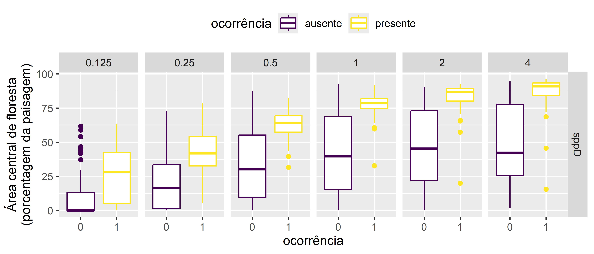
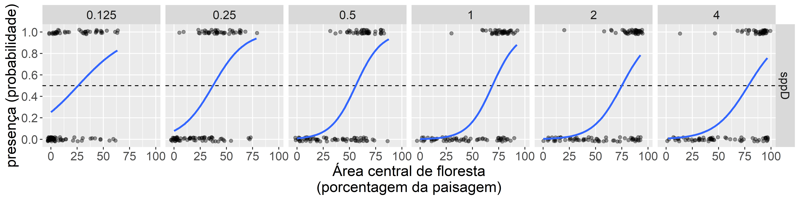

\newpage{}

# Respostas multiescala de espécies {#cap03}

## Apresentação

Este capitulo pretende ilustrar a abordagem geral de identificação de escalas de efeitos nas relações ambientais usando R. Usaremos conteudo baseado no Capítulo 2 do livro [Spatial Ecology and Conservation Modeling](https://doi.org/10.1007/978-3-030-01989-1) [@fletcher2018] . Aqui interpretamos a escala em que as espécies podem responder ao habitat, como a cobertura florestal. Para fazer isso, quantificamos a quantidade de floresta que ocorre a várias distâncias dos pontos de amostragem e, em seguida, determinamos a escala em que a cobertura florestal melhor prevê a ocorrência de espécies. 

Consideramos como podemos relacionar diferenças de escala (extensão) com a ocorrência de espécies para ajudar a identificar a escala característica (ou escala de efeito) da cobertura florestal na ocorrência de espécies. Este é um problema cada vez mais considerado na ecologia aplicada (Holland et al. 2004; Jackson e Fahrig 2015; McGarigal et al. 2016; Miguet et al. 2016).

Existem várias maneiras de quantificar a escala de efeito. Uma abordagem é usar zonas tampão (daqui adiante "buffers") de diferentes tamanhos para medir a paisagem circundante aos locais de amostragem. Essa abordagem foi popularizada por Pearson (1993) e é amplamente utilizada por outros pesquisadores (Holland et al. 2004; Jackson e Fahrig 2015).

Um método alternativo emprega uma função de suavização ponderada pela distância - Kernels espaciais.  Os kernels podem ser usados para ponderar os dados com base na distância do local de amostreagem. Isso ajuda a capturar melhor os efeitos da vizinhança, ponderando mais os locais próximos do que os distantes. Chandler e Hepinstall-Cymerman [-@chandler2016estimating] mostraram como os kernels espaciais podem ser usados para selecionar a escala de efeito sem recorrer a binning a priori (como por exemplo, os buffers de 1 km no capítulo "Métricas").

Neste capitulo, primeiramente ilustramos o uso de buffers de diferentes distancias e depois ilustramos o uso de kernels espaciais.

## Pacotes e dados

### Pacotes
Carregar pacotes (que deve esta instalado antes): 
```{r load-packages-species, message=FALSE, warning=FALSE}
library(eprdados)
library(tidyverse)
library(tidymodels)
library(GGally)
library(siland)
```


Caso os pacotes não tenham sido instalados, o R vai avisar atraves um mensagem tipo: `r kableExtra::text_spec("Error in library(nomepacote)  there is no package called nomepacote", color = "red")`. Neste caso, para instalá-los consulte o capitulos aqui [Capitulo 4 instalação de pacotes](https://livro.curso-r.com/4-1-instala%C3%A7%C3%A3o-de-pacotes.html) e aqui [Capitulo 4 pacotes](https://analises-ecologicas.com/cap4#pacotes-1) .


### Dados necessarios

A fazer.


## Buffers

Agora investigamos a escala em que as espécies podem responder ao habitat, como a cobertura florestal. Para fazer isso, quantificamos a quantidade de floresta que ocorre em várias distâncias e, em seguida, determinamos a escala em que a cobertura florestal melhor explica a ocorrência das espécies.


### Floresta
Primeiramente, olhamos a proporção de cobertura florestal em diferentes escalas (distâncias de buffer) para todos os pontos. Esses dados ja foram calculados seguindo os passos no capitulo "Métricas".  Para nos auxilia à ter uma visão geral do conjunto de dados e de suas interrelações podemos apresentar como um gráfico pareado. Esse gráfico também é chamado de "pairs plot" ou "correlograma". A função `r kableExtra::text_spec("ggpairs()", background = "#dedede")` do pacote [GGally](https://ggobi.github.io/ggally/index.html) permite criar múltiplos gráficos pareados comparando as variáveis contínuas no seu conjunto de dados. Além de demonstrar gráficos de dispersão de cada par de variáveis, ela apresenta gráficos de densidade de cada variável individualmente e, além disso, os valores de correlação entre os pares analisados. Mais detalhes sobre a função `r kableExtra::text_spec("ggpairs()", background = "#dedede")` no Capítulo \@ref(cap23).


Ao fazê-lo, descobrimos que a percentagem de cobertura florestal em diferentes escalas tende a ser altamente correlacionada. Isto não é surpreendente, dado que os cálculos com um tamanho de buffer maior incluem a área em tamanhos de buffer menores. 

```{r data-forest, echo=FALSE}
head(forest_cover_interviews) 
```


plot correlations
```{r plot-pairs, echo = FALSE, message = FALSE, warning = FALSE, out.width = "75%", out.height = "75%", fig.align="center", fig.cap="Cobertura florestal em torno dos locais de amostragem, calculada em diferentes escalas. São mostrados gráficos de dispersão da porcentagem de cobertura florestal para cada combinação de escalas em pares. Observe o alto grau de correlação entre as escalas similares (125 e 250 metros por exemplo) e escalas maiores (acima de 1 km)."}
forest_cover_interviews |> 
  filter(buff_dist_km <16) |> 
  pivot_wider(id_cols = aid, 
              names_from = buff_dist_km, 
              values_from = value_median) |>
  dplyr::select(!aid) |>
GGally::ggpairs() -> fig_pairs
png("figures/fig_pairs.png", width=7, height=7, 
    units="in", res = 600)
fig_pairs
invisible(dev.off())
knitr::include_graphics("figures/fig_pairs.png")
```


### Especies
```{r, eval=FALSE, echo=FALSE}
carnivoros |> 
  filter(buff_dist_km < 16) |>
  dplyr::select(sp_name, buff_dist_km, aid, value_median) |>
  pivot_wider(names_from = buff_dist_km, 
              values_from = value_median) |>
    dplyr::select(!aid) |>
GGally::ggpairs(mapping = aes(color = sp_name))
  
```


Para entender como a cobertura florestal afeta a ocorrência de espécies, usamos um modelo de regressão logística. Esse modelo é usado para prever a probabilidade de um evento ocorrer, como a presença de uma espécie. No caso da regressão logística, o evento é a presença de uma espécie (1) ou sua ausência (0). A regressão logística funciona de forma semelhante à regressão linear, mas é adaptada para dados binários. Na regressão linear, o modelo prevê um valor contínuo, como o tamanho do corpo de um animal. Na regressão logística, o modelo prevê a probabilidade de um evento ocorrer, como a presença de uma espécie. O modelo de regressão logística que usamos é simples, e não leva em conta todos os fatores que podem afetar a ocorrência de espécies. No entanto, é útil para ilustrar como efeitos de escala na cobertura florestal pode afetar nossa entendimento sobre a ocorrência de espécies.

Comparamos diferentes modelos com base em medições de cobertura florestal em diferentes escalas - extensões locais (tamanhos de buffer). Para comparar os modelos com tamanhos de buffer diferentes, podemos usar medidas, como medidas de ajuste (verossimilhança), a variação explicada e/ou o sucesso preditivo.

Para comparar o ajuste de modelos diferentes, usamos a log-verossimilhança, que tem um forte base filosófica em estatística. log-verossimilhanças são baseadas no conceito de máxima verossimilhança e quantificam a plausibilidade de um modelo, dados os dados. Ela é baseada no conceito de máxima verossimilhança, que é uma técnica estatística para estimar os parâmetros de um modelo a partir dos dados.

Neste estudo, comparamos modelos que possuem o mesmo número de parâmetros. Isso é importante porque permite que os resultados sejam interpretados com mais confiança. Se os modelos tivessem diferentes números de parâmetros, seria difícil dizer se as diferenças nos resultados eram devido às diferenças nas escalas espaciais ou ao número de parâmetros. Assim sendo, neste caso, o uso de alternativos como critérios de seleção de modelos, como o Critério de Informação de Akaike, que penaliza a log-verossimilhança com base no número de parâmetros (Burnham e Anderson 1998), forneceria resultados idênticos.

Primeiramente vamos rodar as analises para uma especie.
Isso seria um exemplo mostrando os passos.

#### terminologia

Vamos nos referir a:

 * `r kableExtra::text_spec("sp_pa", background = "#dedede")` como variável dependente/resposta, com o valor observado (1 ou 0) denominado respostas.

As outras variáveis são referidas como variáveis independentes, mas classificaremos adicionalmente:

 * A `r kableExtra::text_spec("buff_dist_km", background = "#dedede")`  como variável de desenho (isto foi controlada pelo experimentador). 
 
 * A `r kableExtra::text_spec("value_median", background = "#dedede")` como variável independente/explanatoria; um covariável específica do ponto de amostragem (proprieadade rural) e distância de buffer.

A forma estrutural do modelo de regressão logística é:

<div align="center">$logit( E[Y_i | X_i]) = logit(p_i) = ln(\frac{p_i}{1 - p_i}) = \beta_0 + \beta_1 X_{1i} + \epsilon$</div> \

Typical notation of the linear regression include:

* $Y_i$ denotes the outcome (or dependent) variable for subject $i$; this is a binary variable
* $X_{1i}$ denotes the predictor of interest or the independent variable ($X_1$) for subject $i$
* $\beta_0$ denotes the Y-intercept when $X$ is zero; this is not informative for logistic regression models
* $\beta_1$ denotes the slope or the change in $Y$ with a 1-unit change in $X$
* $p_{i}$ denotes the probability of the event occurring
* $\epsilon$ denotes the errors


Neste exemplo, analisamos a ocorrência da espécie "sppD" em relação à cobertura florestal. Para variáveis independentes contínuas como proporção de floresta ( `r kableExtra::text_spec("value_median", background = "#dedede")` ), podemos tentar gráficos de caixa (boxplots) de cada variável independente com a variável dependente (presença-ausencia) tratada como um fator de agrupamento. Usamos boxplots para uma análise exploratória preliminar. Os boxplots mostram que, onde a espécie está presente, a cobertura florestal é, em média, mais elevada do que onde a espécie está ausente. No entanto, há uma variação substancial na cobertura florestal nos locais onde a espécie está ausente. Essa variação sugere que, embora a cobertura florestal seja um fator importante que influencia a ocorrência da espécie, outros fatores também podem desempenhar um papel. Por exemplo, a espécie pode estar sujeita a outros fatores de pressão, como a caça ou a competição com outras espécies.

```{r fig-sppD, echo = FALSE, warning=FALSE, message=FALSE, out.width = "90%", out.height = "90%", fig.cap="Gráfico para explorar as relações entre as variáveis. Boxplot comparando área core de floresta entre a presença-ausença de uma espécie em escalas diferentes (distâncias de 0.125 a 4 km)."}

eprdados::carnivoros |> 
  dplyr::filter(sp_name == "sppD", buff_dist_km < 8) |>
  ggplot(aes(x= factor(sp_pa), y = value_median)) + 
  geom_boxplot(aes(colour=factor(sp_pa))) + 
  facet_grid(sp_name~buff_dist_km) + 
  scale_color_viridis_d("ocorrência", 
                        labels = c("ausente", "presente")) +
  theme(legend.position='top') +
  labs(x = "ocorrência", 
       y = "área core de floresta (%)") -> fig_sppD_box

png("figures/fig_sppD_box.png", width=7, height=3, 
    units="in", res = 600)
fig_sppD_box
invisible(dev.off())


```

#### Pergunta 1

`r kableExtra::text_spec(enc2utf8('Identifique a espécie "sppD". Com base nos resultados dos boxplots e lendo os artigos (Michalski & Peres 2005; Michalski & Peres 2007), sugerem três espécies de carnívoros que poderiam apresentar os mesmos padrões do sppD? Que informações/resultados adicionais o ajudariam a identificar a espécie sppD com maior certeza? Justifique suas escolhas de forma clara e concisa.'), color = "blue", bold = TRUE)`


--------------------------------------------------


Os boxplots são muito úteis para análises exploratórias, mas não fornecem muitas informações para a compreensão da escala do efeito. O modelo de regressão logística é um modelo preditivo para dados binários. Conseqüentemente, o modelo de regressão logística pode gerar probabilidades de que uma amostra terá o resultado discreto dada(s) uma(s) variável(ões) de entrada. O modelo de regressão logística usa estimativa de máxima verossimilhança (Maximum Likelihood Estimation - MLE), que é uma probabilidade condicional que classifica o resultado se um determinado limite for atingido (por exemplo, > 0,50). Portanto, o intervalo de probabilidade de um modelo de regressão logística está entre 0 e 1. A figura abaixo fornece um exemplo de função logística. Ele usa uma função logit para modelar um resultado binário. A função logit é o logaritmo natural das probabilidades. Por exemplo, se a probabilidade for > 0,5, a função logit é positiva, se a probabilidade for <0,5, a função logit é negativa.

 
Agora plotamos os dados, ajustando uma regressão logística para obter uma representação visual. É útil executar isso antes de executar os modelos, para que tenhamos uma ideia dos padrões que existem nos dados.

```{r fig-sppd-lr, echo = FALSE, warning=FALSE, message=FALSE, out.width = "90%", out.height = "90%", fig.cap="Gráfico para explorar as relações entre as variáveis. Comparando a resposta de presença-ausença de uma espécie em escalas diferentes (distâncias de 0.125 a 4 km). Pontos mostram presença-ausência da espécie em 106 propriedades rurais. A linha azul é o ajuste de uma regressão logística."}

carnivoros |> 
  dplyr::filter(sp_name == "sppD", buff_dist_km < 8) |>
  ggplot(aes(x=value_median, y = sp_pa)) + 
      geom_jitter(width=3, height=0.02, alpha=0.4) + 
  geom_hline(yintercept = 0.5, linetype="dashed") +
  geom_smooth(method="glm", 
              method.args = list(family = "binomial"), 
              se = FALSE) + 
  facet_grid(sp_name~buff_dist_km) + 
  scale_y_continuous("presença (probabilidade)", 
                     c(0,1), breaks = c(0,0.2,0.4,0.6,0.8,1.0)) +
  labs(x = "área core de floresta (%)") -> fig_sppD_lr


png("figures/fig_sppD_lr.png", width=12, height=3, 
    units="in", res = 600)
fig_sppD_lr + theme(text = element_text(size = 16))
invisible(dev.off())

```

Os graficos mostrarm a mesma padrao que os boxplots.
Uma impressão visual é útil. Mas devemos utilizar modelos estatísticos para fornecer evidências mais robustas e objetivas. 
Usamos código que executará modelos simultaneamente para todas as distâncias de buffer. Podemos rodar a mesma com modelos e reultados separadamente para cada distância de buffer. Mas, seria pelo menos 50 linhas de codigo para rodar modelos e obter os resultados que precisamos. Aqui usamos funções oriundos do tinyverse e tidymodels para rodar os modelos e obter os resumos que precisamos em menos de 10 linhas.

Em menos de 10 linhas, incluimos funçoes para obter um conjunto de 8 modelos diferentes (um modelo para cada distância de buffer) e resultados associados.
```{r models-lr-sppD}
# Run models for sppD and 8 buffer distances
modelos_sppD <- carnivoros |>
# filtro a especie desejada
  dplyr::filter(sp_name == "sppD") |>
# selecionar as colunas que faz parte dos modelos
  dplyr::select(sp_name, sp_pa, value_median, buff_dist_km) |> 
# agrupar para rodar modelos diferentes para especie 
# e escala (distância de buffer)
  tidyr::nest(.by = c(sp_name, buff_dist_km)) |>
# especificar modelo e resumos desejados
  dplyr::mutate(
    fit = map(data, ~ glm(sp_pa ~ value_median,
      data = .x, family = "binomial") 
      ),
    tidied = map(fit, broom::tidy, conf.int = TRUE, conf.level = 0.95),
    glanced = map(fit, broom::glance)
  )
```

Olhar os resultados.
```{r}
modelos_sppD |> 
  tidyr::unnest(glanced)

modelos_sppD |> 
  tidyr::unnest(tidied)


```

Compara scale of effect. 
Pergunta: qual escala melhor se ajusta aos dados de presença-ausencia de sppD?

Para identificar a escala do efeito da cobertura florestal na ocorrência de sppD, plotamos as log-verossimilhanças e AIC de diferentes modelos de regressão logística ajustados aos dados em função da cobertura florestal calculada em diferentes escalas, variando de 0.125 m a 16 km. Esperaríamos que a escala que melhor se ajustasse aos dados fosse a que melhor explicasse a variação na ocorrência. Nesse caso, descobrimos que a cobertura florestal dentro de 1 km é a que melhor se ajusta aos dados.
```{r, fig-sppd-scale, echo = FALSE, warning=FALSE, message=FALSE, out.width = "90%", out.height = "90%", fig.cap="a fazer"}

modelos_sppD |> 
  tidyr::unnest(glanced) |> 
  select(sp_name, buff_dist_km, logLik, AIC) |> 
  pivot_longer(cols = c(logLik, AIC)) |> 
  ggplot(aes(x = buff_dist_km, y = value)) + 
  geom_vline(xintercept = 1, linetype = "dashed", colour="blue") +
  geom_point() + 
  geom_line() + 
  scale_x_continuous(breaks = c(0,2,4,6,8,10, 12,14,16)) +
  facet_wrap(~name, nrow = 2, scales = "free_y") +
  labs(x = "distância (km)") -> figg_sppD_logLikAIC

png("figures/figg_sppD_logLikAIC.png", width=6, height=5, 
    units="in", res = 600)
figg_sppD_logLikAIC 
invisible(dev.off())

 
```


Pergunta: A relação entre a ocorrência de espécie sppD e a cobertura florestal é a mesma em diferentes escalas?
However, when plotting the β terms at different scales (Fig. 2.11b), we find that relationships are identical when forest cover is measured at 2 km or greater buffer sizes. In this situation, only at 500 m do we see a weak relationship with forest cover.

```{r fig-sppd-scale-est, echo = FALSE, warning=FALSE, message=FALSE, out.width = "90%", out.height = "90%", fig.cap="mais a fazer"}
modelos_sppD |> 
  tidyr::unnest(glanced) |> 
  dplyr::mutate(dev_exp = (null.deviance - deviance)/null.deviance
  ) |> 
  dplyr::select(sp_name, buff_dist_km, dev_exp) |> 
  ggplot(aes(y = dev_exp, x = buff_dist_km)) + 
  geom_vline(xintercept = 1, linetype = "dashed", colour="blue") +
  geom_point() + 
  geom_line() + 
  scale_x_continuous(breaks = c(0,2,4,6,8,10, 12,14,16)) + 
  labs(x = "distância (km)", 
       y = "desvio explicado") -> fig_sppD_dev
  
  
modelos_sppD |> 
  tidyr::unnest(tidied) |> 
  dplyr::filter(term == "value_median") |>
  dplyr::mutate(p.value = round(p.value,4) ) |> 
  dplyr::select(sp_name, buff_dist_km, term, 
                estimate, conf.low, conf.high, p.value) |> 
  ggplot(aes(x = buff_dist_km, y = estimate)) + 
  geom_vline(xintercept = 1, linetype = "dashed", colour="blue") +
  geom_errorbar(aes(ymin = conf.low, ymax = conf.high), width = .1) +
  geom_point() + 
  scale_x_continuous(breaks = c(0,2,4,6,8,10, 12,14,16)) + 
  ggplot2::labs(x = "distância (km)", 
       y = "estimativa (IC 95%)") -> fig_sppD_est

png("figures/figg_sppD_scale_est.png", width=6, height=5, 
    units="in", res = 600)
gridExtra::grid.arrange(fig_sppD_dev, fig_sppD_est, nrow=3)
invisible(dev.off())


```


Primeiro plotamos os dados.
```{r fig-species-logistic}

carnivoros |> 
  dplyr::filter(buff_dist_km < 4) |>
  ggplot(aes(x=value_median, y = sp_pa)) + 
      geom_jitter(width=5, height=0.05, alpha=0.4) + 
  geom_hline(yintercept = 0.5, linetype="dashed") +
  geom_smooth(method="glm", 
              method.args = list(family = "binomial"), 
              se = FALSE) + 
  facet_grid(sp_name~buff_dist_km) + 
  scale_y_continuous("presença (probabilidade)", 
                     c(0,1), breaks = c(0,0.2,0.4,0.6,0.8,1.0)) +
  labs(x = "área core de floresta (%)") -> fig_spp_near
fig_spp_near

carnivoros |>
  ggplot(aes(x=value_median, y = sp_pa)) + 
      geom_jitter(width=5, height=0.05, alpha=0.4) + 
  geom_hline(yintercept = 0.5, linetype="dashed") +
  geom_smooth(method="glm", 
              method.args = list(family = "binomial"), 
              se = FALSE) + 
  facet_grid(sp_name~buff_dist_km) + 
  scale_y_continuous("presença (probabilidade)", 
                     c(0,1), breaks = c(0,0.2,0.4,0.6,0.8,1.0)) +
  labs(x = "área core de floresta (%)") -> fig_spp

fig_spp
```


Modelos.
```{r models-carnivore-scale-effect}

#Run models for three species and 8 buffer distances
carnivoros|>
  dplyr::select(sp_name, sp_pa, value_median, buff_dist_km) |>
  tidyr::nest(data = -c(sp_name, buff_dist_km)) |>
  dplyr::mutate(
    fit = map(data, ~ glm(sp_pa ~ value_median, 
                          data = .x, family = "binomial")),
    tidied = map(fit, tidy), 
    glanced = map(fit, glance)
  ) -> modelos_carnivoros
```

Models resutls.
```{r}
modelos_carnivoros |> 
  tidyr::unnest(glanced) |> 
  dplyr::mutate(dev_exp = (null.deviance - deviance)/null.deviance
  ) |> 
  dplyr::select(sp_name, buff_dist_km, logLik, null.deviance, deviance, dev_exp, AIC) |> 
  left_join(modelos_carnivoros |> 
  tidyr::unnest(tidied) |> 
  dplyr::filter(term == "value_median") |>
  dplyr::mutate(p.value = round(p.value,4) ) |> 
  dplyr::select(sp_name, buff_dist_km, term, estimate, p.value) 
  ) |> 
  dplyr::arrange(sp_name, desc(dev_exp))
```

Plot model results.
```{r}

modelos_carnivoros |> 
  tidyr::unnest(glanced) |> 
  dplyr::mutate(dev_exp = (null.deviance - deviance)/null.deviance
  ) |> 
  dplyr::select(sp_name, buff_dist_km, logLik, null.deviance, deviance, dev_exp, AIC) |> 
  left_join(modelos_carnivoros |> 
  tidyr::unnest(tidied) |> 
  dplyr::filter(term == "value_median") |>
  dplyr::mutate(p.value = round(p.value,4) ) |> 
  dplyr::select(sp_name, buff_dist_km, term, estimate, p.value) 
  ) -> model_summary

model_summary |>
  ggplot(aes(x=buff_dist_km, y = AIC)) + 
  geom_point() + 
  geom_line() + 
  scale_x_continuous(breaks = c(0,2,4,6,8,10, 12,14,16)) +
  facet_wrap(~sp_name, nrow = 3) + 
  labs(x = "distância (km)") -> fig_scale_effect_AIC

fig_scale_effect_AIC

model_summary  |> 
  ggplot(aes(x=buff_dist_km, y = logLik)) + 
  geom_point() + 
  geom_line() + 
  scale_x_continuous(breaks = c(0,2,4,6,8,10, 12,14,16)) +
  facet_wrap(~sp_name, nrow = 3) + 
  labs(x = "distância (km)", 
       y = "log-verossimilhança") -> fig_scale_effect_loglik

fig_scale_effect_loglik

model_summary  |> 
  ggplot(aes(x=buff_dist_km, y = dev_exp)) + 
  geom_point() + 
  geom_line() + 
  scale_x_continuous(breaks = c(0,2,4,6,8,10, 12,14,16)) +
  facet_wrap(~sp_name, nrow = 3) + 
  labs(x = "distância (km)", 
       y = "variação explicada") -> fig_scale_effect_dev

fig_scale_effect_dev

```


 No entanto, quando plotamos os parâmetros β dos modelos em diferentes escalas, descobrimos que as relações são idênticas quando a cobertura florestal é medida em 2 km ou em tamanhos de buffer maiores. Apenas em escalas menores (125 a 500 m) vemos uma fraca relação com a cobertura florestal. Essa incerteza quanto à escala do efeito é provavelmente uma consequência da cobertura florestal estar altamente correlacionada entre escalas, como vimos anteriormente. No entanto, há evidências consistentes de que a ocorrência de carnivoros mudar com a cobertura florestal na paisagem, independentemente da escala.


#### Pergunta 7

`r kableExtra::text_spec("Vimos como a incerteza quanto à escala do efeito é provavelmente, pelo menos em parte, uma consequência da  correlação entre escalas. Também é possível que, além da cobertura florestal, existam outros fatores que afetem a ocorrência das espécies na paisagem estudada.  Usando como base o conteudo das aulas, leitura disponivel no Google Classroom (Base teórica 4 Dados, métricas, analises), e/ou exemplos apresentados aqui no tutorial, apresentam algumas hipóteses alternativas que poderiam explicar a incerteza nos modelos. Forneça recomendações para variáveis adicionais que poderiam ser incluídas nos modelos para testar suas hipóteses. Justifique sua seleção de forma clara e concisa, apoie sua escolha com exemplos da literatura científica.", color = "blue", bold = TRUE)`

------------------------------------------------------------------------


Essa foi a última pergunta. O que se segue é um exemplo que mostra uma abordagem alternativa.


\newpage


## Kernels

Nesta seção usaremos funções no pacote  `r kableExtra::text_spec("siland", background = "#dedede")` para executar uma análise de escala de efeito usando Kernels espaciais.

```{r fig-kerneltypes, fig.align = 'center', out.width = "50%", out.height = "50%", echo = FALSE, fig.cap = "Esquema ilustrativo demonstrando diferentes tipos de kernels espaciais: (A) diagrama representando a estrutura geral de um filtro espacial baseado em kernel; (B) os cinco tipos mais comuns de distribuições espaciais de kernel; (C) núcleos espaciais de largura de banda de distância fixa (estática); e (D) núcleos espaciais de distância adaptativa. Observe que a figura é baseada nas seguintes fontes: Figura 3.4 na página 86 de Bailey e Gatrell (1995); Fotheringham et al. (2002) Figuras 2.11 e 2.13 nas páginas 45 e 47 respectivamente; Figura 3.2 na página 37 de Wang (2006); páginas 67-68 de Smith e Bruce (2008); e Figura 4-47 na página 177 de de Smith et al. (2009)."}

# Figura Jennifer Lentz 2012 Developing a Geospatial Protocol for Coral 
# Epizootiology. https://www.researchgate.net/figure/Cross-sections-of-different-ty# pes-of-spatial-kernels-A-diagram-depicting-the-general_fig15_296695387

knitr::include_graphics(path = "figures/spatialkernels.png")
```


A abordagem de Kernels fornece uma maneira rigorosa de estimar as escalas nas quais as variáveis da paisagem afetam respostas ecologicas, e pode ser incorporado na maioria das classes de modelos estatísticos (@chandler2016estimating). Esta abordagem pode reduzir o viés do modelo e levar a interpretações mais precisas das relações espécie-paisagem [@Aue2012; @chandler2016estimating; @Miguet2017dwm]. A função de suavização Kernel assume que o efeito de uma variável da paisagem é mais forte perto do local focal e decai em função da distância. Assim fornecendo uma representação mais realista de muitos processos ecológicos como por exemplo, dispersão de sementes [@bullock2017] e movimentos de forrageadoras de lugar central (Orians e Pearson 1979).

## Links uteis

Tidy Modeling with R: https://www.tmwr.org/
models: https://www.tmwr.org/models
workflow: https://www.tmwr.org/workflows

R for Data Science Many Models: https://r4ds.had.co.nz/many-models.html