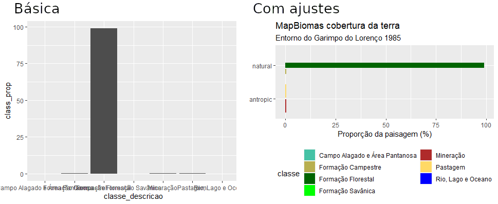

\newpage{}

# (PART) Exemplos de caso {-}

\newpage{}

# Garimpo do Lourenço

## Apresentação
Mudanças na paisagem ao redor do Garimpo do Lourenço. 
Changes in the landscape surrounding the Lourenço gold mine.


Código de [R](https://cran.r-project.org/) e dados para calcular 
métricas de paisagem associadas com a exploração de recursos minerários. 

O objetivo é calcular métricas de paisagem e descrever a composição e 
a configuração da paisagem no entorno do Garimpo do Lourenço.

As métricas de paisagem são a forma que os ecólogos de paisagem usam 
para descrever os padrões espaciais de paisagens para depois avaliar 
a influência destes padrões espaciais nos padrões e processos ecológicos. 

Nesta exemplo (https://rpubs.com/darren75/lourenco) aprenderemos sobre como analisar a cobertura da terra com métricas de paisagem em R.

Este exemplo tem como base teórica o modelo 
"mancha-corredor-matriz" - uma representação da paisagem em manchas 
de habitat (fragmentos). 

\newpage 


## Pacotes necessarios:
```{r load-packages, warning=FALSE, message=FALSE}
library(tidyverse)
library(readxl)
library(terra)
library(sf)
library(landscapemetrics)
library(mapview)
library(knitr) 
library(gridExtra)
```


## Área de estudo
Para alcançar o objetivo de caracterizar a paisagem no entorno do 
Garimpo do Lourenço, precisamos estabelecer a extensão da área de estudo.
Isso seria estabelicida com base nos objetivos e estudos anteriores.
Sabemos que atividades asociados com a mineração pode aumentar a perda
da floresta até 70 km além dos limites do processo de mineração:
Sonter et. al. 2017.
Mining drives extensive deforestation in the Brazilian Amazon
https://www.nature.com/articles/s41467-017-00557-w

Para visualizar um exemplo com a [Extração de bauxita na Flona Saracá-Taquera](https://cpisp.org.br/mais-uma-uc-na-amazonia-sob-risco-mineracao-ameaca-flona-saraca-taquera-no-para/):
https://earthengine.google.com/timelapse/#v=-1.70085,-56.45017,8.939,latLng&t=2.70

E aqui com o Garimpo do Lourenço: 
https://earthengine.google.com/timelapse#v=2.2994,-51.68423,11.382,latLng&t=0.03


## Dados


### Ponto de referência (EPSG: 4326)
Aqui vamos incluir um raio de 20 km além do ponto de acesso para 
o Garimpo do Lourenço em 1985.
Isso representa uma área quadrada de 40 x 40 km (1600 km2).

```{r access-point}
# Tabela de dados com coordenados de acesso em 1985.
acesso <- data.frame(nome = "garimpo do Lourenço", 
           coord_x = -51.630871, 
           coord_y = 2.318514)
           
# Converter para objeto espacial, com sistema de coordenados geográfica.
sf_acesso <- st_as_sf(acesso, 
               coords = c("coord_x", "coord_y"),
            crs = 4326)


```

Visualizar para verificar.
```{r show-fig-map, eval=FALSE}
# 
plot(sf_acesso) # teste basica
mapview(sf_acesso) #verificar com mapa de base (OpenStreetMap)
```

```{r plot-fig-map, echo=FALSE, warning=FALSE, message=FALSE, out.width="80%", out.height="80%"}
knitr::include_graphics("figures/fig_garimpo_access.png")
```

### Ponto de referência (EPSG: 31976)
As análises da paisagem com o modelo "mancha-corredor-matriz" depende 
de uma classificação categórica. Portanto, deve 
optar para uma sistema de coordenados projetados, com pixels de 
área igual e com unidade em metros. Temos um raio de 20 km, que é um area geografica onde o retângulo envolvente é menor que um fuso [UTM](https://forest-gis.com/2016/06/um-pouco-sobre-a-projecao-utm.html/).
Assim sendo, vamos adotar a sistema de coordenados projetados de 
datum SIRGAS 2000, especificamente EPSG:31976 (SIRGAS 2000/UTM zone 22N).

Precisamos então reprojetar o objeto original (em coordenados geográficas) 
para a sistema de coordenados projetados. Em seguida, vamos produzir 
um polígono com raio de 20 km no entorno do ponto.

```{r crs-reproject}
# Reprojetar o ponto.
sf_acesso_utm <- st_transform(sf_acesso, crs = 31976)
# Polígono com raio de 500 metros no entorno do ponto.
sf_acesso_500m <- st_buffer(sf_acesso_utm, dist=500) %>% 
  mutate(raio_km = 0.5)
# Polígono com raio de 1 km no entorno do ponto.
sf_acesso_1km <- st_buffer(sf_acesso_utm, dist=1000) %>% 
  mutate(raio_km = 1)
# Polígono com raio de 2 km no entorno do ponto.
sf_acesso_2km <- st_buffer(sf_acesso_utm, dist=2000) %>% 
  mutate(raio_km = 2)
# Polígono com raio de 4 km no entorno do ponto.
sf_acesso_4km <- st_buffer(sf_acesso_utm, dist=4000) %>% 
  mutate(raio_km = 4)
# Polígono com raio de 20 km no entorno do ponto.
sf_acesso_20km <- st_buffer(sf_acesso_utm, dist=20000)

acesso_buffers <- bind_rows(sf_acesso_500m, sf_acesso_1km, 
                            sf_acesso_2km, sf_acesso_4km)
```

### Verificar com mapa de base (OpenStreetMap).
```{r show-fig-reproject, eval=FALSE}
# 
mapview(sf_acesso_20km) + 
  mapview(sf_acesso_utm, color = "black", col.regions = "yellow")
```

```{r plot-fig-pointbuffer, echo=FALSE, warning=FALSE, message=FALSE, out.width="80%", out.height="80%"}
knitr::include_graphics("figures/mapview_point_buffer.png")
```

### Dados: MapBiomas cobertura da terra

Agora vamos olhar cobertura e uso da terra no espaco que preciso (área de estudo). 
Para isso, vamos utilizar um arquivo de raster do projeto [MapBiomas](https://mapbiomas.org/) 
com cobertura de terra ao redor do Garimpo do Lourenço em 1985. 
Este arquivo no formato raster, tem apenas valores inteiros, em que 
cada célula/pixel representa uma área considerada homogênea, 
como uso do solo ou tipo de vegetação. 
Arquivo ".tif" disponível aqui: [utm_cover_AP_lorenco_1985.tif](https://github.com/darrennorris/Amapa-mine/blob/main/data/raster/Mapbiomas_cover_lourenco_utm/utm_cover_AP_lorenco_1985.tif)

Não vamos construir mapas, portanto os cores nas visualizações 
não corresponde ao mundo real (por exemplo, verde não é floresta).
Para visualizar em QGIS preciso baixar um arquivo com a legenda e cores 
para Coleção¨6 (https://mapbiomas.org/codigos-de-legenda) e 
segue tutoriais: https://www.youtube.com/watch?v=WtyotodHK8E .

Este vez, a entrada de dados espaciais seria atraves a importação de 
um raster (arquivo de .tif). Lembre-se, para facilitar, os arquivos deve 
ficar no mesmo diretório do seu código 
(verifique com <code>getwd()</code>). 
Como nós já sabemos a sistema de coordenados desejadas, 
o geoprocessamento da raster foi concluído antes de começar com as 
análises da paisagem.


```{r , eval=FALSE}
r1985 <- rast("utm_cover_AP_lorenco_1985.tif")
r1985

#class       : SpatRaster 
#dimensions  : 1341, 1341, 1  (nrow, ncol, nlyr)
#resolution  : 29.87713, 29.87713  (x, y)
#extent      : 409829.5, 449894.7, 236241.1, 276306.3  (xmin, xmax, ymin, ymax)
#coord. ref. : SIRGAS 2000 / UTM zone 22N (EPSG:31976) 
#source      : utm_cover_AP_lorenco_1985.tif 
#name        : classification_1985 
#min value   :                   3 
#max value   :                  33 

```
Ou use o função <code>file.choose()</code>, que faz a busca 
para arquivos. 

```{r, eval=FALSE}
r1985 <- rast(file.choose())
r1985
```


```{r, echo=FALSE}

r_85 <- "C:\\Users\\user\\Documents\\Articles\\gis_layers\\gisdata\\inst\\raster\\mapbiomas_cover_lourenco_utm\\utm_cover_AP_lorenco_1985.tif"
r1985 <- rast(r_85)
# 2003
r_03 <- "C:\\Users\\user\\Documents\\Articles\\gis_layers\\gisdata\\inst\\raster\\mapbiomas_cover_lourenco_utm\\utm_cover_AP_lorenco_2003.tif"
# 2020 
r_20 <- "C:\\Users\\user\\Documents\\Articles\\gis_layers\\gisdata\\inst\\raster\\mapbiomas_cover_lourenco_utm\\utm_cover_AP_lorenco_2020.tif"

# combinação com os 3 arquivos para juntar 3 anos
r_85a20 <- c(r_85, r_03, r_20)
mapbiomas_85a20 <- rast(r_85a20)
gc()
```

Agora que o arquivo foi importado, podemos visualizá- lo.


```{r fig-plot-raster, warning = FALSE, message=FALSE}
# Visualizar para verificar
# Gradiente de cores padrão não corresponde 
# ao mundo real (por exemplo verde não é floresta)
plot(r1985, type="classes") 
plot(sf_acesso_20km, add = TRUE, lty ="dashed", color = "black")
plot(sf_acesso_utm, add = TRUE, cex = 2, pch = 19, color = "black")

```

## Calculo de métricas

Vamos olhar alguns exemplos de métricas para cada nível da análise:


 * landscape (métricas para a paisagem como um todo).
 * class (métricas por classe ou tipo de habiat).
 * patch (para a mancha ou fragmento).

Primeiro, pecisamos verificar se o raster está no formato correto.
```{r, warning = FALSE}
check_landscape(r1985)
#  layer crs    units   class n_classes OK
#  1  projected   m   integer         7  v
```
Tudo certo (veja a coluna do "OK")!

### Métricas para a paisagem

Vamos começar avaliando a área total da paisagem (área) de estudo.

```{r, warning = FALSE}
area.total <- lsm_l_ta(r1985) 
area.total #160264 Hectares
```
Agora vamos ver a distância total de borda (te= “total
edge”).

```{r, echo = FALSE}
gc()
```

```{r, warning = FALSE}
te <- lsm_l_te(r1985)
te # 547140 metros
```
Total de borda mede a configuração da paisagem porque uma paisagem 
altamente fragmentada terá muitas bordas. No entanto, a borda total 
é uma medida absoluta, dificultando comparações entre paisagens com  
áreas totais diferentes. Mas pode ser aplicado para comparar a 
configuração na mesma paisagem em anos diferentes. 

Agora vamos ver a densidade de Borda (“Edge Density”). 
Densidade de Borda mede a configuração da paisagem porque uma paisagem 
altamente fragmentada terá valores mais altas. "Densidade" é uma medida 
adequado para comparacoes de paisagens com áreas totais diferentes.

```{r, warning = FALSE}
ed <- lsm_l_ed(r1985) 
ed #3.41 metros por hectare
```


### Métricas para as classes

Area de cada classe em hectares.

```{r, warning = FALSE}
lsm_c_ca(r1985) 

```
Como tem varios classes é dificil de interpretar os resultados porque 
os numeros (3, 4, 11.....) não tem uma referncia do mundo real.
Para entender os resultados, precisamos acrescentar nomes para os valores. 
Ou seja incluir uma coluna de legenda com os nomes para cada classe. Para isso 
precisamos outro arquivo com os nomes.


Baixar a arquivo de legenda:  [mapbiomas_6_legend.xlsx](https://github.com/darrennorris/Amapa-mine/blob/main/data/raster/Mapbiomas_cover_lourenco_utm/mapbiomas_6_legend.xlsx).

Agora carregar o arquivo com o codigo a seguir.
```{r, eval=FALSE, warning = FALSE}
class_nomes <- read_excel(file.choose())

```

```{r, echo=FALSE, warning = FALSE, message=FALSE}
class_nomes <- read_excel("C:\\Users\\user\\Documents\\Articles\\gis_layers\\gisdata\\inst\\raster\\mapbiomas_cover_lourenco_utm\\mapbiomas_6_legend.xlsx")

```

Agora rodar de novo, com os resultados juntos com a legenda 
de cada classe. Nos resultados acima, os valores na coluna "class" 
são as mesmas que tem na coluna "aid" no objeto "class_nomes", onde também 
tem os nomes . Assim, podemos repetir, mas agora incluindo os nomes 
para cada valor de class, com base na ligação (join) entre as colunas. 

```{r, eval=FALSE, warning = FALSE}
# Área de cada classe em hectares, incluindo os nomes para cada classe
lsm_c_ca(r1985) %>% 
  left_join(class_nomes, by = c("class" = "aid"))
  
# Numero de fragmentos (manchas)
lsm_c_np(r1985) %>% 
  left_join(class_nomes, by = c("class" = "aid"))
  
# Maior numero de manchas em classes de cobertura classificadas como 
# pasto (pasture) e formação campestre (grassland).

#  layer level class    id metric value class_description  group_description
#     1 class     3    NA np        28 Forest Formation     Natural forest         
#     1 class     4    NA np         2 Savanna Formation    Natural forest           
#     1 class    11    NA np         7 Wetlands             Natural non fore
#     1 class    12    NA np       246 Grassland            Natural non fore.           
#     1 class    15    NA np       262 Pasture              Farming              
#     1 class    30    NA np        35 Mining               Non vegetated           
#     1 class    33    NA np        50 River,Lake and Ocean Water             
  
```


### Métricas para as manchas
Vamos calcular o tamanho de cada mancha agora.

```{r, warning = FALSE, eval=FALSE}
mancha_area <- lsm_p_area(r1985) # 630 manchas
mancha_area

```
Agora queremos saber o tamanho da maior mancha em cada class, e 
portanto o tamanho da maior mancha de mineração.

```{r, warning = FALSE, eval=FALSE}
mancha_area %>% 
group_by(class) %>% 
summarise(max_ha = max(value))
# 30.8 hectares (class 15 = mineração)

```

### Quais métricas devo escolher?

A decisão deve ser tomada com base em uma combinação de fatores.
Incluindo tais fatores como: base teórica, considerações estatísticas, 
relevância para o objetivo/hipótese e a escala e heterogeneidade 
na paisagem de estudo.

Queremos caracterizar áreas de mineração na paisagem, e aqui vamos 
olhar somente uma paisagem, em um momento do tempo. Então as métricas 
para a paisagem como todo não tem relevância.

Estamos olhando uma classe (mineração), portanto vamos incluir as 
métricas para classes. Alem disso, as métricas de paisagem em nível de 
classe são mais eficazes na definição de processos ecológicos 
(Tischendorf, L. Can landscape indices predict ecological processes 
consistently?. Landscape Ecology 16, 235–254 (2001). 
https://doi.org/10.1023/A:1011112719782.).

```{r, warning = FALSE, eval=FALSE}
# métricas de composição para a paisagem por classes
list_lsm(level = "class", type = "area and edge metric")

# métricas de configuração para a paisagem por classes
list_lsm(level = "class", type = "aggregation metric")

```


### Métricas por classe de mineração

Aqui vamos calcular todos as métricas por classe (função <code>calculate_lsm()</code>)).

```{r, warning = FALSE}
# métricas de composição para a paisagem por classes
metrics_comp <- calculate_lsm(r1985, level = "class", type = "area and edge metric")

# métricas de configuração para a paisagem por classes
metrics_config <- calculate_lsm(r1985, level = "class", type = "aggregation metric")

```

E aqui, calcular correlações entre todos as métricas por classe 
(função <code>show_correlation()</code>)).

```{r, warning = FALSE}

show_correlation(data = metrics_comp, method = "pearson", labels = TRUE)

show_correlation(data = metrics_config, method = "pearson", labels = TRUE)

```

Temos muitos valores e muitas métricas. 
Este se chama um "tiro no escuro", algo cujo resultado se desconhece 
ou é imprevisível. Isso não é recomendado. 
Para fazer uma escolha melhor (mais robusta), seguindo princípios 
básicos da ciência, precisamos ler os estudos anteriores 
(artigos) para obter as métricas mais relevantes para nosso objetivo e 
a hipótese a ser testada. Com base em os estudos anteriores e os 
objetivos vamos incluir 8 métricas nos resultados. 


### Exportar as métricas
O próximo passo é comunicar os resultados obtidos. Para isso 
precisamos resumir e apresentar as métricas selecionadas em tabelas e 
figuras. Agora já fizemos os cálculos, as tabelas e 
figuras podem ser feitas no R ([figuras](https://www.youtube.com/watch?v=0RxEDDiRzQY)), tanto quanto 
em aplicativos diferentes 
(por exemplo tabelas atraves ["tabelas dinamicas"] no [Microsoft Excel](https://www.techtudo.com.br/dicas-e-tutoriais/2018/10/como-fazer-tabela-dinamica-no-excel.ghtml) ou [LibreOffice calc](https://www.youtube.com/watch?v=Mqi5BJwzAzo)).
Mas por isso, primeiramente precisamos exportar os resultados 
(veja mais exemplos aqui: [Introdução ao R import-export](https://www.lampada.uerj.br/arquivosdb/_book2/importexport.html). 

O arquivo vai sai no mesmo diretório do seu código 
(verifique com <code>getwd()</code>).

```{r, warning = FALSE, eval=FALSE}

bind_rows(metrics_comp, metrics_config) -> metricas_1985
write.csv2(metricas_1985, "metricas_lourenco_1985.csv", row.names=FALSE)

```


## Preparando os resultados
A entrada de dados seria com as métricas da paisagem calculados 
anteriormente.  

Vocês devem baixar o arquivo de Excel [metricas_lourenco_1985.xlsx](https://github.com/darrennorris/Amapa-mine/blob/main/data/metricas_lourenco_1985.xlsx).
Lembre-se, para facilitar, os dados deve ficar no 
mesmo diretório do seu código (verifique com <code>getwd()</code>).

No caso de um arquivo de Excel simples, a importação poderia ser 
feita através menu de "Import Dataset" na janela/panel "Environment" 
de Rstudio.
Ou com linhas de código: 
```{r eval=FALSE}
metricas_1985 <- read_excel("metricas_lourenco_1985.xlsx")
metricas_1985

#  layer level class id    metric     value
#   <dbl> <chr> <dbl> <chr> <chr>      <dbl>
#     1 class     3 NA    area_cv  529.   
#     1 class     4 NA    area_cv   22.3  
#     1 class    11 NA    area_cv   71.2  
```

Ou use o função <code>file.choose()</code>, que faz a busca 
para arquivos. 

```{r, eval=FALSE}

metricas_1985 <- read_excel(file.choose())
metricas_1985

```


```{r, echo=FALSE}
excel_in <- "data/metricas_lourenco_1985.xlsx"
metricas_1985 <- read_excel(excel_in)
metricas_1985
```
Os dados são padronizados ("tidy"), mas ainda não parece adequados para apresentação em tabelas ou figuras.
Temos muitos valores e muitas métricas (listadas na coluna "metric"). 
Com base em os estudos anteriores e os objetivos vamos incluir 8 métricas 
(4 de composição e 4 de configuração).

Métricas de composição:


* mean patch area (<code>lsm_c_area_mn</code>) Área médio das manchas por classe.
* SD patch area (<code>lsm_c_area_sd</code>) Desvio padrão das áreas dos manchas por classe.
* class area percentage of landscape (<code>lsm_c_pland</code>) Porcentagem de área na paisagem por classe.
* largest patch index (<code>lsm_c_lpi</code>) Índice de maior mancha (proporção da paisagem).

Métricas de configuração:


* aggregation index (<code>lsm_c_ai</code>) Índice de agregação.
* patch cohesion index (<code>lsm_c_cohesion</code>) Índice de coesão das manchas.
* number of patches (<code>lsm_c_np</code>) Número de manchas.
* patch density (<code>lsm_c_pd</code>) Densidade de manchas.

Escolheremos (atraves um filtro) as métricas que queremos para obter uma 
tabela de dados. Mantendo os dados originais, 
assim sendo para acresentar mais métricas nos resultados, 
preciso somente acrescentar mais no codigo.


```{r}
# Arquivo com os nomes das classes
class_in <- "C:\\Users\\user\\Documents\\Articles\\gis_layers\\gisdata\\inst\\raster\\mapbiomas_cover_lourenco_utm\\mapbiomas_6_legend.xlsx"
class_nomes <- read_excel(class_in)

# Especificar métricas desejados
met_comp <- c("pland", "lpi", "area_mn", "area_sd")
met_conf <- c("ai", "cohesion", "np", "pd")
met_todos <- c(met_comp, met_conf)

# Escholer métricas desejados do conjunto completo
metricas_1985 %>% 
filter(metric %in% met_todos) %>% 
left_join(class_nomes, by = c("class" = "aid")) -> metricas_nomes
```

\newpage


## Uma tabela versatil
Mas, ainda não tem uma coluna com os nomes das métricas. 
Portanto, solução simples é de exportar no formato de .csv e 
finalizar/editar no Excel / calc. 

Outra opção que pode facilitar, particularmente quando pode há mudanças 
e revisões, é produzir a tabela no R. Aqui vamos repetir no R os 
passos que vocês conhecem com as ferramentas de Excel (arraste e solte, 
copiar-colar, filtro, tabela dinâmica).


## Reorganização
Escolhendo as colunas desejadas (<code>select</code>), reorganizando para as 
métricas ficam nas colunas (<code>pivot_wider</code>) e colocando as colunas novas na sequência desejada (<code>select</code>).

```{r}
metricas_nomes %>% 
# Escholer métricas desejados do conjunto completo de métricas.
dplyr::select(c(type_class, classe_descricao, hexadecimal_code, 
metric, value)) %>% 
# reorganizando
pivot_wider(names_from = metric, values_from = value) -> metricas_tab

```


\newpage

## Uma figura elegante 
Uma imagem vale mais que mil palavras. 
Portanto, gráficos/figuras/imagens são uma das mais importantes formas 
de comunicar a ciência. 

Como exemplo ilustrativo, aqui vamos produzir 
gráficos comparando métricas de composição e configuração da paisagem 
ao redor do Garimpo do Lourenço.

É uma boa ideia gastar bastante tempo para tornar figuras científicas 
as mais informativas e atraentes possíveis. Escusado será dizer que a 
precisão empírica é primordial. E por isso, o que fica excluído/omitido 
é tão importante quanto o que foi incluído. Para ajudar, você deve se 
perguntar o seguinte ao criar uma figura: eu apresentaria essa figura 
em uma apresentação para um grupo de colegas? Eu o apresentaria a um 
público de não especialistas? Eu gostaria que essa figura aparecesse 
em um artigo de notícias sobre meu trabalho? É claro que todos esses 
locais exigem diferentes graus de precisão, complexidade e estética, 
mas uma boa figura deve servir para educar simultaneamente públicos 
muito diferentes.


Tabelas versus gráficos — A primeira pergunta que você deve se fazer 
é se você pode transformar aquela tabela (chata e feia) em algum tipo 
de gráfico. Você realmente precisa dessa tabela no texto principal? 
Você não pode simplesmente traduzir as entradas das células em um 
gráfico de barras/colunas/xy? Se você pode, você deve. Quando uma 
tabela não pode ser facilmente traduzida em uma figura, na maioria 
das vezes a provavelmente pertence às 
Informações Suplementares/Anexos/Apêndices.


### Gráfico de barra

Primeiramente, vamos produzir uma gráfico de barra comparando a 
proporção que cada classe representa na paisagem.

```{r}
# Inclundo cores conforme legenda da Mapbiomas Coleção 6
# Legenda nomes ordem alfabetica
classe_cores <- c("Campo Alagado e Área Pantanosa" = "#45C2A5", 
"Formação Campestre" = "#B8AF4F", 
"Formação Florestal" = "#006400", 
"Formação Savânica" = "#00ff00", 
"Mineração" = "#af2a2a", 
"Pastagem" = "#FFD966", 
"Rio, Lago e Oceano" = "#0000FF") 

```

E agora o grafico.......
```{r, eval=FALSE}
# Grafico de barra basica
metricas_tab %>% 
mutate(class_prop = pland) %>% 
ggplot(aes(x = classe_descricao, y = class_prop)) +
geom_col()


# Agora com ajustes
# Agrupando por tipo (natural e antropico)
# Com cores conforme legenda da Mapbiomas Coleção 6
# Corrigindo texto dos eixos.
# Mudar posição da leganda para o texto com nomes longas encaixar.
metricas_tab %>% 
mutate(class_prop = pland) %>% 
ggplot(aes(x = type_class, y = class_prop, 
fill = classe_descricao)) + 
scale_fill_manual("classe", values = classe_cores) +
geom_col(position = position_dodge2(width = 1)) + 
coord_flip() + 
labs(title = "MapBiomas cobertura da terra", 
subtitle = "Entorno do Garimpo do Lorenço 1985",
y = "Proporção da paisagem (%)", 
x = "") + 
theme(legend.position="bottom") + 
guides(fill = guide_legend(nrow = 4))

```

Uma imagem vale mais que mil palavras:



Mas existe uma separação grande na faixa de valores e ainda é 
difícil de ver todas as classes. Temos uma distribuição com valores 
muito mais altos comparada com os outros. 
extremos. Uma solução seria uma transformação (por exemplo "log"), 
assim os valores ficarem mais proximos.


### Gráfico de boxplot

Agora com uma métrica de configuração: 


```{r}
# Métrica de configuração: Densidade de manchas (coluna "pd").
# Agrupando por tipo (natural e antrópico)
# Incluindo boxplot indicando tendência central (mediano)
# Com cores conforme legenda da Mapbiomas Coleção 6
# Tamanho dos pontos proporcional o numero de manchas
# Corrigindo texto dos eixos.
# Mudar posição da leganda para o texto com nomes longas encaixar.
metricas_tab %>% 
ggplot(aes(x = type_class, y = pd)) + 
geom_boxplot(colour = "grey50") +
geom_point(aes(size = np, colour = classe_descricao)) + 
scale_color_manual("classe", values = classe_cores) +
scale_size(guide = "none") +
coord_flip() + 
labs(title = "MapBiomas cobertura da terra", 
subtitle = "Entorno do Garimpo do Lorenço 1985",
y = "Densidade de manchas (número por 100 hectares)", 
x = "") + 
theme(legend.position="bottom") + 
guides(col = guide_legend(nrow = 4)) 

```

## Comparação entre anos

Calcular as métricas para 3 anos.
```{r}
# metricas desejados
what_metricas <- c("lsm_c_pland", "lsm_c_lpi", "lsm_c_area_mn", "lsm_c_area_sd", 
                   "lsm_c_ai", "lsm_c_cohesion", "lsm_c_np", "lsm_c_pd")
# rodar
metricas_anos <- sample_lsm(landscape = mapbiomas_85a20, 
                            y = acesso_buffers,
                           plot_id = data.frame(acesso_buffers)[, 'raio_km'],
                             what = what_metricas, 
                           edge_depth = 1)

# Organizar dados
# Dados rferentes os buffers
resultados_anos <- acesso_buffers %>% 
  left_join(metricas_anos %>%
              dplyr::mutate(value = round(value,2), 
         ano = case_when(layer==1 ~1985, 
                         layer==2~2003, 
                         layer==3~2020)) %>%
              dplyr::select(ano, plot_id, class, metric, value), 
            by=c("raio_km"="plot_id"))
# Dados referentes os classes
resultados_anos <- resultados_anos %>%
left_join(class_nomes, by = c("class" = "aid"))
```

Agora grafico de barra com varios anos

```{r}
# It's recommended to use a named vector
# Legenda nomes ordem alfabetica
classe_cores <- c("Campo Alagado e Área Pantanosa" = "#45C2A5", 
"Formação Campestre" = "#B8AF4F", 
"Formação Florestal" = "#006400", 
"Formação Savânica" = "#00ff00", 
"Mineração" = "#af2a2a", 
"Pastagem" = "#FFD966", 
"Rio, Lago e Oceano" = "#0000FF",
"Outras Lavouras Temporárias" = "#e787f8") 

resultados_anos %>% 
  mutate(rcor = paste("#", hexadecimal_code, sep="")) %>% 
  filter(metric=="pland") %>%
  ggplot(aes(x=ano, y=value)) + 
  geom_col(position="stack", aes(fill=classe_descricao)) + 
  scale_fill_manual(values = classe_cores) +
  facet_grid(raio_km~type_class)
```

Agora com "pland" e densidade de manchas juntos.

```{r}

resultados_anos %>% 
  mutate(rcor = paste("#", hexadecimal_code, sep="")) %>% 
  filter(metric=="pland") %>%
  ggplot(aes(x=ano, y=value)) + 
  geom_col(position="stack", aes(fill=classe_descricao)) + 
  scale_fill_manual("classe", values = classe_cores) +
  scale_y_continuous(breaks=c(0,50,100)) + 
  scale_x_continuous(breaks=c(1985,2003, 2020)) +
  facet_grid(raio_km~type_class) + 
  labs(title = "MapBiomas cobertura da terra", 
subtitle = "Entorno do Garimpo do Lorenço 1985-2020",
y = "Porcentagem da paisagem", 
x = "Ano") + 
theme(legend.position="bottom", 
      legend.title = element_text(size = 3), 
              legend.text  = element_text(size = 3),
              legend.key.size = unit(0.1, "lines")) + 
guides(fill = guide_legend(nrow = 4)) -> fig_pland

# Densidade de manchas
resultados_anos %>% 
  mutate(rcor = paste("#", hexadecimal_code, sep="")) %>% 
  filter(metric=="pd") %>%
ggplot(aes(x = factor(ano), y = value)) + 
geom_boxplot(colour = "grey50") + 
geom_point(aes(colour = classe_descricao)) + 
scale_color_manual("classe", values = classe_cores) +
scale_size(guide = "none") + 
facet_grid(raio_km~type_class) +
labs(title = "MapBiomas cobertura da terra", 
subtitle = "Entorno do Garimpo do Lorenço 1985-2020",
y = "Densidade de manchas (número por 100 hectares)", 
x = "Ano") + 
theme(legend.position="bottom", 
      legend.title = element_text(size = 3), 
              legend.text  = element_text(size = 3),
              legend.key.size = unit(0.1, "lines")) + 
guides(fill = guide_legend(nrow = 4)) -> fig_pd

grid.arrange(fig_pland, fig_pd, nrow=1)

```

\newpage

## Conclusões e próximos passos

Os resultados apresentados na figura anterior não segam os resultados esperados que a cobertura de classes antrópicos ia aumentar ao longo do tempo.
Para entender melhor os padores, precisamos: 

 * Verficar padrões nas outras metricas calculados
 * Verficar padrões com mais anos 
 * Verficar padrões usando poligonos/pontos dos processos de mineração (dados no SIGMINE https://www.gov.br/anm/pt-br e https://app.anm.gov.br/dadosabertos/SIGMINE/PROCESSOS_MINERARIOS/) 
 
 
Alem disso, seria relevante buscar complementar os dados de MapBiomas com uma classificação supervisionado usando imagens de Sentinel-2 (exemplo com QGIS Semi-Automatic Classification plugin  aqui: https://fromgistors.blogspot.com/2016/09/basic-tutorial-2.html). Assim para aumentar a precisão dos resultados.

Uma forma alternativa para visualização as mudanças entre anos seria um diagrama "Sankey"/"Alluvial". Como exemplo, veja figura 3 no artigo "Rapid land use conversion in the Cerrado has affected water transparency in a hotspot of ecotourism, Bonito, Brazil" https://doi.org/10.1177/19400829221127087 . 

```{r plot-fig-sankey, echo=FALSE, warning=FALSE, message=FALSE, out.width="50%", out.height="50%", fig.align='center',fig.cap= "Diagrama Sankey mostrando a mudança de uso da terra na bacia do rio Prata entre 2010 (lado esquerdo) e 2020 (lado direto). Fonte: Figura 3. Chiaravalloti et. al. 2022. Tropical Conservation Science. doi:10.1177/19400829221127087"}
knitr::include_graphics("figures/images_large_10.1177_19400829221127087-fig3.jpeg")
```

No R pode fazer com o pacote "networkD3" segue tutoriais: 

* https://www.displayr.com/sankey-diagrams-r/

* https://epirhandbook.com/en/diagrams-and-charts.html#alluvialsankey-diagrams

* https://rpubs.com/droach/CPP526-codethrough

\newpage