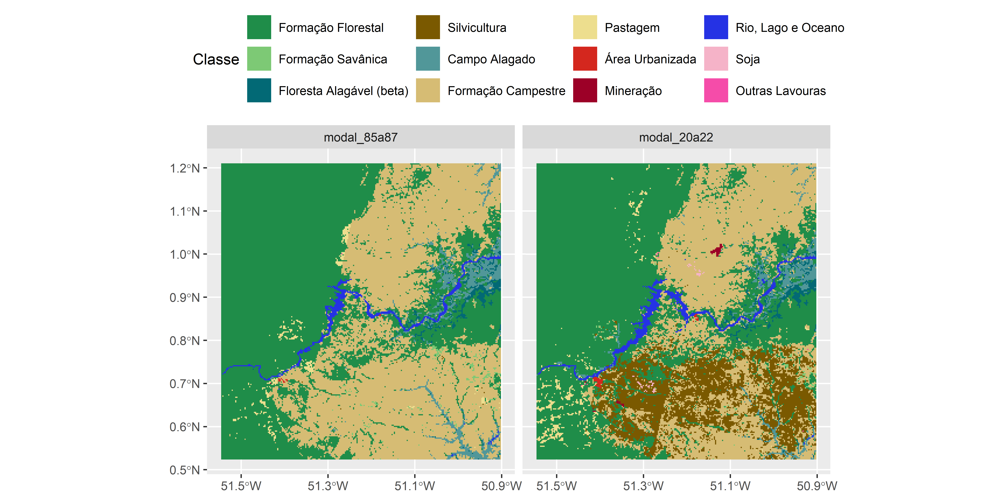
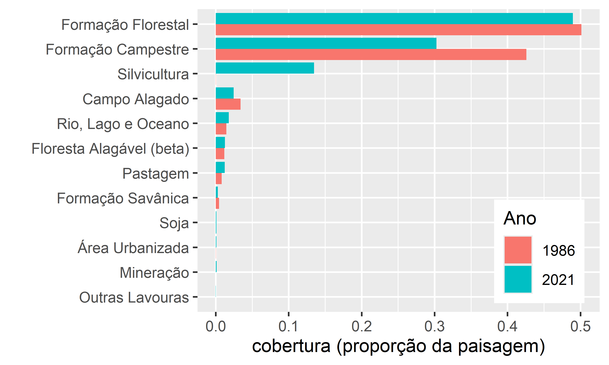
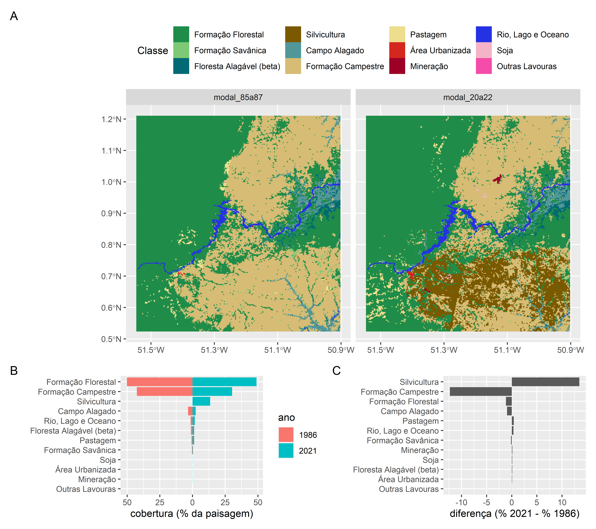
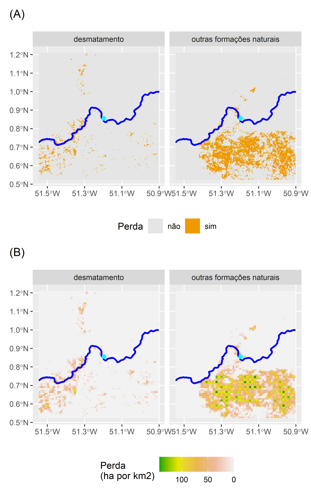

\newpage{}

# Mudanças na cobertura vegetal {#cap03}

```{r make-data, echo=FALSE, eval=FALSE}
# Prepare data for use in example

library(tidyverse)
library(sf)
library(terra)
library(tmap)
library(mapview)
library(eprdados)
library(geobr)
library(patchwork)

#### AMCEL    ------------------------------------------
amfile <- "C:\\Users\\user\\Documents\\Articles\\gis_layers\\shapes\\rivers\\amcelap.shp"
amcel <- read_sf(amfile)
mapview(r22_modal) + 
  mapview(amcel)

#### Reservatorios --------------------------------------
filemassa <- "C:\\Users\\user\\Documents\\CA\\CA_2023\\EP\\vectors\\geoft_bho_massa_dagua_v2019\\geoft_bho_massa_dagua_v2019.shp"
AP_res_31976 <- read_sf(filemassa) |> 
  filter(detipomass=="Artificial") |>
  filter(nmufe %in% c("AMAPÁ", "AMAPÁ, PARÁ"), 
         nmgenerico == "UHE") |> 
  st_transform(31976) |> 
  st_make_valid()
# ANEEL. Correct geometry in QGIS. 
# Drop Z dimension so is valid
fileres <- "C:\\Users\\user\\Documents\\rbooks\\epr\\data\\vector\\AP_reserv_ANEEL\\reserv_fixed_geom.shp"
AP_res_ANEEL_31976 <- st_read(fileres) |> 
  st_transform(31976) |> 
  st_zm()

res_simple <- AP_res_ANEEL_31976 |> 
  st_simplify(preserveTopology = TRUE, dTolerance = 10) |> 
  st_cast("MULTIPOLYGON")


res_ferreira_gomes <-  AP_res_31976 |> 
  filter(nmoriginal == "UHE Ferreira Gomes") 
res_ferreira_gomes_b32km <- st_buffer(res_ferreira_gomes,
                                        dist = 32000)
ext_res_b32k <- ext(vect(res_ferreira_gomes_b32km))

mapview(AP_res_31976) +
  mapview(AP_res_ANEEL_31976) + 
  mapview(res_simple)
#### Barragens ----------------------------------------
# dados de
# ANEEL (SIGEL) Aproveitamento Hidrelétricos - AHE: 
# <https://sigel.aneel.gov.br/portal/home/index.html>

bin <- "data/vector/AHE/Aproveitamento_Hidrelétricos_-_AHE.shp"
ahe <- read_sf(bin)
AP_UHE_31976 <- ahe |> 
  filter(UF_1 == "AP", 
         TIPO_AHE == "UHE", 
         FASE == "Operação") |> 
  st_transform(31976)

#### States  and municipalites ----------------------

AP_31976 <- read_state(code_state="AP", year=2020) |> 
  st_transform(31976)
AP_muni_31976 <- read_municipality(code_muni = "AP", 
                                   year = 2020) |> 
  st_transform(31976)

#### Ferreira Gomes -----------------------------------
# Define the text string with longitude and latitude. Values are not correct. Use ANA.
text_string <- "51º11’41.071ºW / 00º51’20.126ºN"

# Extract longitude and latitude components
lon_str <- str_extract(text_string,
                       "^-?\\d+º\\d+’\\d+.\\d+º[EW]")
lat_str <- str_extract(text_string,
                       "\\d+º\\d+’\\d+.\\d+º[NS]$")

parse_dms <- function(dms_str) {
  parts <- str_split(dms_str, "º|’|º")[[1]]
  degrees <- as.numeric(parts[1])
  minutes <- as.numeric(parts[2])
  seconds <- as.numeric(parts[3])
  # Determine sign
  sign <- ifelse(grepl("[WS]", dms_str), -1, 1)  
  decimal_degrees <- (degrees + (minutes / 60) + (seconds / 3600)) * sign
  return(decimal_degrees)
}

longitude_dd <- parse_dms(lon_str)
latitude_dd <- parse_dms(lat_str)

# Create a point geometry
point <- st_point(c(longitude_dd, latitude_dd))

# Create an sf object with a geographic CRS
ferreira_gomes <-  st_sf(nome = "Ferreira Gomes", 
                    geom = st_sfc(point), 
                    crs = 4326)

ferreira_gomes_31976 <- st_transform(ferreira_gomes, 31976)
ferreira_gomes_31976_b50km <- st_buffer(ferreira_gomes_31976,
                                        dist = 50000)
myexent <- ext(vect(ferreira_gomes_31976_b50km))
mapview(ferreira_gomes_31976)

## Ferreira Gomes raster data -----------------------
rent <- rast("data/raster/mapbiomas/utm_cover_AP_entrevistas_85a22_noriver.tif")
r82a22 <- crop(rent, ext_res_b32k, snap="out")
r22 <- subset(r82a22, 38)
writeRaster(r82a22, "utm_cover_UHEFerreiraGomes_85a22.tif",
            datatype = "INT1U",
            gdal=c("COMPRESS=DEFLATE"), overwrite = TRUE)

#### Make vector data  ---------------------------------
# write files
st_write(AP_res_31976, 
         dsn = "data/vector/barragens.gpkg",
         layer = "AP_reservatorios", delete_layer = TRUE,
         append = TRUE)
st_write(res_simple, 
         dsn = "data/vector/barragens.gpkg",
         layer = "AP_reservatorios_ANEEL", delete_layer = TRUE,
         append = TRUE)
# UHE barragens
st_write(AP_UHE_31976, 
         dsn = "data/vector/barragens.gpkg",
         layer = "AP_UHE", delete_layer = TRUE,
         append = TRUE)

# Cachoeira Caldeirão
AP_res_31976 |> 
  filter(nmoriginal == "UHE Cachoeira Caldeirão") |> 
  st_write(dsn = "data/vector/barragens.gpkg",
         layer = "CC_reservatorio", delete_layer = TRUE, 
         append = TRUE)
AP_UHE_31976 |>
  filter(NOME == "Cachoeira Caldeirão") |>
st_write(dsn = "data/vector/barragens.gpkg",
         layer = "CC_ponto", delete_layer = TRUE,
         append = TRUE)

# Coaracy Nunes
AP_res_31976 |> 
  filter(nmoriginal == "UHE Coaracy Nunes") |> 
  st_write(dsn = "data/vector/barragens.gpkg",
         layer = "CN_reservatorio", delete_layer = TRUE, 
         append = TRUE)
AP_UHE_31976 |>
  filter(NOME == "Coaracy Nunes") |>
st_write(dsn = "data/vector/barragens.gpkg",
         layer = "CN_ponto", delete_layer = TRUE,
         append = TRUE)
# Ferreria Gomes
st_write(res_ferreira_gomes, 
         dsn = "data/vector/barragens.gpkg",
         layer = "FG_reservatorio", delete_layer = TRUE, 
         append = TRUE)
#st_write(ferreira_gomes_31976, 
#         dsn = "data/vector/barragens.gpkg",
#         layer = "FG_ponto", delete_layer = TRUE, 
#         append = TRUE)
AP_UHE_31976 |>
  filter(NOME == "Ferreira Gomes") |>
st_write(dsn = "data/vector/barragens.gpkg",
         layer = "FG_ponto", delete_layer = TRUE,
         append = TRUE)

# Santo Antônio do Jari 
AP_res_31976 |> 
  filter(nmoriginal == "UHE Santo Antônio do Jari") |>
st_write(dsn = "data/vector/barragens.gpkg",
         layer = "SA_reservatorio", delete_layer = TRUE, 
         append = TRUE)
AP_UHE_31976 |>
  filter(NOME == "Santo Antônio do Jari") |>
st_write(dsn = "data/vector/barragens.gpkg",
         layer = "SA_ponto", delete_layer = TRUE,
         append = TRUE)

#check
st_layers("data/vector/barragens.gpkg")
```

## Apresentação

Este capítulo apresenta uma metodologia para calcular mudanças na cobertura da terra usando o software R. 

A metodologia consiste em aplicar métodos de geoprocessamento para elaborar mapas de perda de formações naturais, com base em mapas de cobertura da terra de uma região do Amapá, nos anos 1986 e 2021. A metodologia é uma ferramenta importante para o monitoramento da cobertura da terra e para a avaliação dos impactos das atividades humanas sobre o meio ambiente.

As principais etapas da metodologia são as seguintes:

1.  Obtenção dos dados: Os mapas de cobertura da terra de 1986 e 2021 são obtidos do projeto MapBiomas.

2.  Recorte dos dados: Os mapas são recortados para a área de estudo no Amapá.

3.  Classificação dos dados: As classes de cobertura da terra dos mapas são reclassificadas para facilitar a análise.

4.  Cálculo das mudanças: As mudanças na cobertura da terra são calculadas usando métodos de geoprocessamento, como o cálculo de áreas e o cálculo de proporções.

5.  Elaboração dos mapas: Os mapas de perda de formações naturais são elaborados a partir dos resultados do cálculo das mudanças.

A metodologia apresentada é uma ferramenta útil para a análise de mudanças na cobertura da terra. Ela permite identificar as formações naturais que foram perdidas ou que sofreram alterações significativas ao longo do tempo. Além das etapas apresentadas, a metodologia pode ser complementada com outros procedimentos, como:

-   Análise da qualidade dos dados:    
É importante avaliar a qualidade dos dados de cobertura da terra antes de realizar o cálculo das mudanças.

-   Validação dos resultados:    
Os resultados do cálculo das mudanças podem ser validados comparando-os com dados de campo ou com informações de outras fontes.


## Área de estudo

A paisagem de estudo é a área de um raio de 32 km ao redor do reservatório da Usina Hidrelétrica Ferreira Gomes. A UHE Ferreira Gomes é uma usina hidrelétrica localizada no Amapá, com capacidade instalada de 252 MW. Coordenadas geográficas (longitude / latitude): 51º11’41,071ºW / 00º51’20,126ºN (<https://ferreiragomesenergia.com.br/usina/>). A usina foi inaugurada em etapas, com a primeira turbina entrando em operação comercial em novembro de 2014 e a terceira turbina em maio de 2015.


Link para serie temporal (Landsat timelapse): 
<https://earthengine.google.com/timelapse#v=0.89999,-51.42342,8.79,latLng&t=3.53&ps=50&bt=19840101&et=20221231>

Link para mudanças na superfice de agua:
<https://global-surface-water.appspot.com/map#v=0.85826,-51.1794,10,latLng&t=0.00&l=wc>


## Pacotes e Fontes de dados

### Pacotes

Carregar pacotes (que deve esta instalado antes):

```{r packages-barragens, message=FALSE, warning=FALSE}
library(tidyverse)
library(sf)
library(terra)
library(mapview)
library(tmap)
library(eprdados)
library(landscapemetrics)
library(tidyterra)
library(patchwork)

```

Caso os pacotes não tenham sido instalados, o R vai avisar atraves um mensagem tipo: `r kableExtra::text_spec("Error in library(nomepacote)  there is no package called nomepacote", color = "red")`. Neste caso, para instalá-los consulte o Capítulo \@ref(cap20) ou os capitulos aqui [Capitulo 4 instalação de pacotes](https://livro.curso-r.com/4-1-instala%C3%A7%C3%A3o-de-pacotes.html) e aqui [Capitulo 4 pacotes](https://analises-ecologicas.com/cap4#pacotes-1) . Prestando atenção nas requisitos diferenciados para instalar um pacote como `eprdados` que vem do [GitHub](https://github.com/).

### Fontes de dados

As etapas da metodologia requer um conjunto de dados espaciais incluindo camadas de vetor e raster.

#### Arquivos de vetor
Os dados necessários estão disponíveis no pacote `eprdados`.
As fontes originais dos dados vetoriais foram:

-   Reservatorios\
    Agência Nacional de Águas e Saneamento Básico (ANA) Massas d'Água: <https://metadados.snirh.gov.br/files/7d054e5a-8cc9-403c-9f1a-085fd933610c/geoft_bho_massa_dagua_v2019.zip>

-   Barragens\
    Agência Nacional de Energia Elétrica (ANEEL SIGEL) Aproveitamento Hidrelétricos - AHE e reservatorios (bacia 1): <https://sigel.aneel.gov.br/portal/home/index.html>

Agora carregar as camadas de pontos (barragem), linhas (rios) e poligonos (reservatorio e área de estudo).

```{r dados-vector, message=FALSE, warning=FALSE, results='hide'}

FG_ponto <- st_read(system.file("vector/UHE_Ferreira_Gomes.gpkg", 
                                package="eprdados"),
                    layer ="FG_ponto")
FG_araguari <- st_read(system.file("vector/UHE_Ferreira_Gomes.gpkg", 
                                package="eprdados"),
                    layer ="FG_curso_araguari")
FG_rios <- st_read(system.file("vector/UHE_Ferreira_Gomes.gpkg", 
                                package="eprdados"),
                    layer ="FG_curso_agua")
FG_reservatorio <- st_read(system.file("vector/UHE_Ferreira_Gomes.gpkg",
                                       package="eprdados"), 
                           layer ="FG_reservatorio")
FG_extensao <- st_read(system.file("vector/UHE_Ferreira_Gomes.gpkg",
                                       package="eprdados"), 
                           layer ="fg_extensao")
# Outros barragens no Rio Araguari
res_cn <- st_read(system.file("vector/barragens.gpkg",
                              package="eprdados"), 
                  layer ="CN_reservatorio")
res_cc <- st_read(system.file("vector/barragens.gpkg",
                              package="eprdados"), 
                  layer ="CC_reservatorio")
# três juntos
res_ara <- st_read(system.file("vector/barragens.gpkg",
                               package="eprdados"), 
                   layer ="AP_reservatorios") |> 
  filter(nmoriginal != "UHE Santo Antônio do Jari")
```

#### Arquivos de raster

Mapbiomas Coleção 8. 
-   Cobertura da terra\
    A Coleção 8 do MapBiomas de mapas anuais de cobertura e uso da terra do Brasil. Dados anuais para o período de 1985 a 2022: <https://brasil.mapbiomas.org/>

Os dados do mapbiomas de 1985 a 2022 foram baixados e recortados para a área de estudo no Amapá.
O arquivo "utm_cover_UHEFerreiraGomes_85a22.tif" tem uma classificação de terra dentro de um raio de 32 km ao redor do reservatorio. Dentro do arquivo tem 38 camadas, um para cada ano entre 1985 e 2022.

Baixar arquivo com os dados (formato ".tif"), link: [https://github.com/darrennorris/epr/blob/main/data/raster/mapbiomas/utm_cover_UHEFerreiraGomes_85a22.tif](https://github.com/darrennorris/epr/blob/main/data/raster/mapbiomas/utm_cover_UHEFerreiraGomes_85a22.tif){target="_blank"} .
Lembrando-se de salvar o arquivo ("utm_cover_UHEFerreiraGomes_85a22.tif") em um local conhecido no seu computador. 

```{r dados-raster, echo=FALSE, warning=FALSE, message=FALSE, results='hide'}
# Mapbiomas
rfile <- "C:\\Users\\user\\Documents\\rbooks\\epr\\data\\raster\\mapbiomas\\utm_cover_UHEFerreiraGomes_85a22.tif"
r85a22 <- rast(rfile)

# legend
# Mapbiomas legend
mfile <- "C:\\Users\\user\\Documents\\rbooks\\epr\\data\\raster\\mapbiomas\\legend\\Codigos-da-legenda-colecao-8.csv"
# load legend and shorten long descriptions
# read.csv2 adding X.. to column name.
#mapbiomas_legend <- read.csv2(mfile, as.is = TRUE) 

mapbiomas_legend <- read_delim(mfile, delim = ";", escape_double = FALSE, trim_ws = TRUE)|> 
  mutate(Descricao_novo = case_when(Descricao == "Campo Alagado e Área Pantanosa" ~ "Campo Alagado", 
                                    Descricao == "Outras Lavouras Temporárias" ~ "Outras Lavouras")) |> 
  mutate(Descricao = coalesce(Descricao_novo, Descricao))

```

Para carregar o arquivo trabalhamos com o pacote [terra](https://CRAN.R-project.org/package=terra). O pacote tem varios funçoes para a análise e modelagem de dados geográficos. Nós podemos ler os dados de cobertura da terra no arquivo ".tif" com a função `r kableExtra::text_spec( "rast()", background = "#d3d3d3")`. Incluímos outra função `file.choose()` que abrirá uma nova janela (explorador de Windows). Assim, você encontre o local onde o arquivo baixado foi salvo e selecione o arquivo "utm_cover_UHEFerreiraGomes_85a22.tif".
```{r eval=FALSE, echo=TRUE, message=FALSE, warning=FALSE}
#
r85a22 <- rast(file.choose())
```


Verifique algumas camadas usando um mapa:

```{r plot-layers}
# Selecione um ano e agregue para acelerar o processamento.
r22 <- subset(r85a22, 38)
r22_modal <- aggregate(r22, fact=10, fun="modal") 

# Mapa
mapview(FG_reservatorio) + 
  mapview(FG_ponto, col.regions = "yellow") + 
  mapview(as.factor(r22_modal))
```

```{r summary-studyarea, echo=FALSE, message=FALSE, warning=FALSE}
# Overall landscape area.
area_m2 <- ncell(r22) * (xres(r22) * yres(r22))
area_ha <- (ncell(r22) * (xres(r22) * yres(r22))) / 10000
area_km2 <- ncell(r22) * (xres(r22) * yres(r22)) / 1000000
```

## Mudanças na paisagem: indo além de desmatamento
Precisamos entender o uso da terra na paisagem. Para isso vamos olhar as mudancas durante 36 anos, comparando a percentual das diferentes classes em 1986 com 2021. A metodologia possui as seguintes etapas:

1.  Suavizar a variação nas estimativas de dados anuais:    
Essa abordagem visa reduzir flutuações temporais abruptas (por exemplo erros na classificação) e realçar padrões de mudança de cobertura terrestre, proporcionando uma visão mais estável e representativa ao longo do tempo.

2.  Análise exploratória:    
As mudanças na cobertura da terra são calculadas usando métricas da paisagem como áreas e  proporções de classes diferentes.

3.  Classificação dos dados:    
Com base nas análises exploratórias, as classes de cobertura da terra são reclassificadas para facilitar a análise.

4.  Cálculo das mudanças:    
As mudanças na cobertura da terra são calculadas usando métodos de geoprocessamento para obter áreas e taxas de mudança nas classes diferentes.

5.  Elaboração dos mapas:    
Os mapas de perda de formações naturais são elaborados a partir dos resultados do cálculo das mudanças.


### Definação
A perda florestal e o desmatamento são dois conceitos relacionados, mas que possuem significados diferentes. A perda florestal é um conceito mais amplo que o desmatamento, e inclui todos os fatores que podem levar à redução da cobertura florestal. O desmatamento é um "tipo" específico de perda florestal que ocorre quando a cobertura florestal é removida para uso em outros fins por seres humanos, como agricultura, pecuária, mineração ou urbanização. É importante lembrar que tanto a perda florestal, quanto o desmatamento não inclui alterações em habitats não florestais como formaçoes campestres ou campos alagados.


### Suavizar a variação nas estimativas anuais
Aqui usamos a modal de três anos para suavizar a variação nas estimativas de dados anuais da classificação de cobertura terrestre do MapBiomas. Para os três anos usamos:

-   

    i)  o ano atual,

-   

    ii) o ano anterior e

-   

    iii) o ano seguinte.

Ou seja, o primerio ano seria 1986, com cada célula o valor modal dos anos 1985, 1986 e 1987. Embora isso reduza o número de anos de 38 para 36, ainda temos 7 anos após a barragem entrou em operação (ano da primeira turbina foi 2014). A utilização da modal de três anos para suavizar a variação nas estimativas anuais oferece vários benefícios para análise e interpretação:

-   Redução do ruído e das flutuações:\
    As estimativas anuais de sensoriamento remoto podem ser suscetíveis a ruído e flutuações de curto prazo devido a diversos fatores, como:

    -   Condições climáticas:\
        Cobertura de nuvens, precipitação e variações sazonais podem afetar a qualidade e a interpretação das imagens de satélite.

    -   Variações do sensor:\
        Diferentes satélites e sensores possuem suas próprias características de calibração e sensibilidade, o que leva a discrepâncias sutis entre os anos.

    -   Erros de classificação:\
        Erros menores nos algoritmos de classificação automatizados podem levar a flutuações em categorias específicas de cobertura da terra.

A utilização da modal de três anos atua como um filtro simples, mas eficaz, atenuando o impacto dessas flutuações e fornecendo uma estimativa mais robusta de mudança na cobertura da terra. Isso resulta em:

-   Melhora na detecção de tendências:\
    Ao suavizar o ruído, torna-se mais fácil identificar tendências e padrões verdadeiros na mudança da cobertura da terra ao longo do tempo. Isso é crucial para entender as dinâmicas ecológicas de longo prazo e o impacto de atividades humanas, como desmatamento ou projetos de infraestrutura.

-   Aumento da precisão:\
    Embora não esteja provado estatisticamente que seja definitivamente mais preciso, o suavização pode reduzir o potencial de outliers e flutuações aleatórias distorcerem a imagem geral da distribuição da cobertura da terra.

Passos para obter o modal de três anos para suavizar a variação nas estimativas: selecionar os três anos com `subset()` , aggregar pixels para reduzir tempo de processamento `aggregate()` e calcular o valor modal de cada pixel para os três anos `modal()`.

```{r compare-years, warning=FALSE, message=FALSE, results='hide'}
# 85 a 87
r86 <- subset(r85a22, c(2, 1, 3))
r86_agg10 <- aggregate(r86, fact=10, fun="modal") 
r86_agg10_mod <- modal(r86_agg10, ties = "first")
names(r86_agg10_mod) <- "modal_85a87"
# 2020 a 2022
r21 <- subset(r85a22, c(37, 38, 36))
r21_agg10 <- aggregate(r21, fact=10, fun="modal") 
r21_agg10_mod <- modal(r21_agg10, ties = "first")
names(r21_agg10_mod) <- "modal_20a22"

r86a21 <- c(r86_agg10_mod, r21_agg10_mod)

```

Faça um mapa.

```{r}
classes_fg86a21 <- c(3, 4, 6, 9, 11, 12, 15, 24, 30, 33, 39, 41)
mapbiomas_fg <- mapbiomas_legend |>
  filter(Class_ID %in% classes_fg86a21) |> 
  arrange(Class_ID)
mybreaks <- as.character(c(3, 4, 6, 9, 11, 12, 15, 24, 30, 33, 39, 41))
# PLot
fig_mapa <- ggplot() +
  geom_spatraster(data = as.factor(r86a21)) + 
  scale_fill_manual("Classe", breaks= mybreaks,
                      labels= mapbiomas_fg$Descricao, 
                      values = mapbiomas_fg$Color) + 
    scale_x_continuous(breaks = 
                       c(-51.5, -51.3, -51.1, -50.9)) +
  facet_wrap(~lyr, ncol = 2) +
       theme(legend.position = "top")

png("figures/fig_fg_mapa.png", width=10, height=5, 
    units="in", res = 600)
fig_mapa
invisible(dev.off())

```

Podemos ver nos mapas que as maiores mudanças ocorreram ao sul do rio Araguari e envolveram plantações florestais (silvicultura).

### Análise exploratória

Para isso vamos comparar a área total e percentual das diferentes classes em 1986 com 2021.

```{r manual-metrics}
res_m2 <- xres(r86a21) * yres(r86a21)
pixels_total <- ncell(r86a21)
area_m2_agg10 <- res_m2 * pixels_total
area_ha_agg10 <- (res_m2 * pixels_total) / 10000
area_km2_agg10 <- (res_m2 * pixels_total) / 1000000

valores <- values(r86a21)
classe_frequencia_85a87 <- table(valores[ ,'modal_85a87'])
df_classe_frequencia_85a87 <- data.frame(classe_frequencia_85a87)
df_classe_frequencia_85a87 <- df_classe_frequencia_85a87 |> 
  mutate(ano = 1986, 
         Classe = as.numeric(as.character(Var1)), 
         Classe_area_m2 = Freq * res_m2) |> 
  mutate(Classe_prop = Classe_area_m2 / area_m2_agg10) |> 
  left_join(mapbiomas_legend, 
            by = c("Classe" = "Class_ID"))

```

Repetir o mesmo processo com valores de 2021.
```{r}
classe_frequencia_20a22 <- table(valores[ ,'modal_20a22'])
df_classe_frequencia_20a22 <- data.frame(classe_frequencia_20a22)
df_classe_frequencia_20a22 <- df_classe_frequencia_20a22 |> 
  mutate(ano = 2021, 
         Classe = as.numeric(as.character(Var1)), 
         Classe_area_m2 = Freq * res_m2) |> 
  mutate(Classe_prop = Classe_area_m2 / area_m2_agg10) |> 
  left_join(mapbiomas_legend, 
            by = c("Classe" = "Class_ID"))
```

Combinar os dados de ambos os anos em um único dataframe.
```{r}

df_classe_frequencia_anos <- bind_rows(df_classe_frequencia_85a87, 
                                       df_classe_frequencia_20a22)
```

Podemos visualizar os resultados em um grafico:
```{r}
fig_anos_simples <- ggplot(df_classe_frequencia_anos, 
       aes(x = fct_reorder(Descricao, Classe_prop, mean), 
           y = Classe_prop)) + 
  geom_col(aes(fill=factor(ano)), position = "dodge") + 
  coord_flip()  + 
  scale_fill_discrete("Ano") +
  labs(x = "", 
       y = "cobertura (proporção da paisagem)") + 
  theme(legend.position = c(0.85, 0.2))

png("figures/fig_anos_simples.png", width=5, height=3, 
    units="in", res = 600)
fig_anos_simples
invisible(dev.off())


```

A paisagem tem uma área total de cerca `r paste0(round(area_ha,0))` hectares ou `r round(area_km2,0)` quilômetros quadrados. Assim sendo, 1% da paisagem de estudo é `r round((area_ha/100*1),0)` hectares ou `r round((area_km2/100*1), 0)` quilômetros quadrados. 

E agora o mesmo processo com o pacote [landscapemetrics](https://r-spatialecology.github.io/landscapemetrics/):

```{r landscape-metrics}
mymetrics <- c("lsm_c_pland", "lsm_c_ca")
lmet <- landscapemetrics::calculate_lsm(r86a21, 
                                        what = mymetrics) |> 
  mutate(ano = case_when(layer == 1 ~ "1986", 
                         layer == 2 ~ "2021")) |>
  left_join(mapbiomas_legend, by = c("class" = "Class_ID")) 

```


Usando as métricas calculados podemos comparar as mudanças na paisagem entre 1986 e 2021. 

Podemos apresentar os mapas juntamente com gráficos resumindo as métricas da paisagem em uma figura composta usando o pacote [patchwork](https://patchwork.data-imaginist.com/){target="_blank"}. Uma figura composta permite-nos ver a distribuição espacial das mudanças (mapas) juntamente com os valores associados (gráficos). Uma única figura composta pode transmitir as mesmas informações que várias figuras individuais, economizando espaço e reduzindo a confusão visual. Ao combinar dados relacionados em uma única figura, os leitores podem facilmente comparar e contrastar tendências e relações entre diferentes variáveis. Por exemplo, as figuras compostas permitem uma entendimento mais completa e unificada com seus dados. Em vez de pular entre figuras separadas, os leitores podem compreender a narrativa geral de suas descobertas em uma única imagem. Isso pode melhorar o fluxo e a coerência do seu texto, tornando-o mais envolvente e impactante. Isto pode ser especialmente importante em artigos com espaço limitado para figuras ou conjuntos de dados complexos.

```{r compare-metrics, echo=FALSE, warning=FALSE, fig.cap="Mudanças na paisagem de 1986 até 2021. Comparação de cobertura da terra de 1986 a 2021 no entorno da barragem Ferreira Gomes. (A) Mapeamento da classificação de cobertura da terra do MapBiomas Coleção 8 usada para quantificar as diferenças na cobertura da terra entre 1986 e 2021. (B) Comparação da percentagem das diferentes classes de cobertura da terra na paisagem. (C) Diferenças na cobertura  de cada classe entre 1986 e 2021."}
paisagem_metricas <- lmet |> 
  filter(level == "class") |> 
  pivot_wider(id_cols = class, names_from = c(metric, ano), 
              names_sep = "_",
              values_from = value, values_fill = 0) |> 
  mutate(diff_pland_per = pland_2021 - pland_1986, 
         diff_pland_abs = abs(pland_2021 - pland_1986),
         diff_ca_ha = ca_2021 - ca_1986) |>
  left_join(mapbiomas_legend, by = c("class" = "Class_ID")) 

# cobertura
  lmet |> 
    filter(metric == "pland") |> 
    mutate(pland_per2 = if_else(ano == "1986" , -1*value, 
                                value)) |>
    ggplot(aes(x = fct_reorder(Descricao, value, mean),
             y = pland_per2)) + 
  geom_col(aes(fill = ano)) + 
    scale_y_continuous( labels = c("50", "25", "0", "25", "50")) +
  coord_flip() + 
  labs(x = "", 
       y = "cobertura (% da paisagem)") -> fig_comp
# diferenças  
  ggplot(paisagem_metricas, 
         aes(x = fct_reorder(Descricao, diff_pland_abs), 
             y = diff_pland_per)) + 
  geom_col() + 
  coord_flip() + 
  labs(x = "", 
       y = "diferença (% 2021 - % 1986)") -> fig_diff

fig_g <- (fig_mapa / (fig_comp | fig_diff))  + 
  plot_layout(heights = c(1, 0.5)) +
  plot_annotation(tag_levels = "A")

png("figures/fig_fg_86a21.png", width=9, height=8, 
    units="in", res = 600)
fig_g
invisible(dev.off())

```

```{r landscape-summaries, echo=FALSE, message=FALSE}
# summaries
# change in plantation
plantation_change <- paisagem_metricas |> 
  filter(class == 9) |> pull(diff_pland_per) |> round(1)
grass_lost <- paisagem_metricas |> 
  filter(class == 12) |> pull(diff_ca_ha) |> round(1)
grass_change <- paisagem_metricas |> 
  filter(class == 12) |> pull(diff_pland_per) |> round(1)
# % paisagem de estudo em 2021
forest_2021 <- lmet |> filter(metric == "pland", 
               ano == "2021", class == 3) |> 
  pull(value) |> round(1)
grass_2021 <- lmet |> 
  filter(metric == "pland", 
         ano == "2021", class == 12) |> 
  pull(value) |> round(1)
grass_1986 <- lmet |> 
  filter(metric == "pland", 
         ano == "1986", class == 12) |> 
  pull(value) |> round(1)
plantation_1986 <- lmet |> 
  filter(metric == "pland", 
         ano == "1986", class == 9) |> 
  pull(value) |> round(2)
plantation_2021 <- lmet |> 
  filter(metric == "pland", 
         ano == "2021", class == 9) |> 
  pull(value) |> round(1)
```

Atualmente (2021) a paisagem de estudo é composta principalmente por classes florestais (`r forest_2021` %) e campestres (`r grass_2021` %). Ao longo de três décadas, a criação de plantações florestais gerou as maiores mudanças, principalmente na perda das áreas campestres. Ao longo deste período, as plantações florestais aumentaram de `r plantation_1986` para `r plantation_2021` por cento da paisagem, enquanto as campestres foram reduzidas em `r abs(grass_change)` por cento da paisagem (de `r grass_1986` em 1986 para `r grass_2021` em 2021), ou seja uma perda de `r paste0(abs(grass_lost))` hectares.

### Reclassificação

Identificaremos áreas onde as formações naturais foram convertidas para uso humano da terra. Como a análise exploratória mostrou que em 1986 a paisagem era composta principalmente por dois classes de cobertura, analisaremos separadamente a floresta e as outras formações naturais.

#### Dados de reservatorios.

Primeiramente atualizamos a classificação de MapBiomas com uma nova valor de "35" para representar os reservatorios na área de estudo.

Atualizar 1986 com o reservatorio de Coracy Nunes (operacional desde 1975):

```{r mapbiomas-coracy-nunes}
rnew <- r86_agg10_mod
v_cn <- vect(res_cn |> mutate(reservoir = 100))
z <- rasterize(v_cn, rnew, "reservoir")
z[is.na(z)] <- 0
xrc <- r86_agg10_mod + z

rcxrc <- classify(xrc, cbind(100, 170, 35), 
           include.lowest=TRUE, right=TRUE)
```

Atualizar 2021 com os três reservatorios:

```{r}
rnew <- r21_agg10_mod
v_ara <- vect(res_ara |> mutate(reservoir = 100))
z <- rasterize(v_ara, rnew, "reservoir")
z[is.na(z)] <- 0
xrc <- r21_agg10_mod + z

rcxrc21 <- classify(xrc, cbind(100, 170, 35), 
           include.lowest=TRUE, right=TRUE)
rcxrc86a21 <- c(rcxrc, rcxrc21)
```

Update legend.

```{r}
mapbiomas_legend_new <- mapbiomas_legend |> 
                          add_row(Class_ID = 35, Level = 2, 
                                  Description = "Reservoir", 
                                  Descricao = "Reservatorio", 
                                  Color = "#00FFFF", 
                                  Descricao_novo = NA)
```

Agora vamos reclassificar para três categorias: florestal, outras formações e não natural. Em seguida, combinamos os mapas de 1986 e 2021 para gerar um mapa das áreas de mudança durante este período.

```{r reclassify-matrix}
human_class <- c(14, 15, 18, 19, 39, 20, 40, 62, 41, 
                 36, 46, 47, 35, 48, 9, 21, 22, 24, 25, 30, 31, 35)
forest_class <- c(3, 4, 5, 6)
other_natural <- c(11, 12, 32, 29, 50, 13)
water <- 33
old_class <- c(human_class, forest_class, 
               other_natural, water)
new_class <- c(rep(0, length(human_class)), 
               rep(1, length(forest_class)), 
               rep(2, length(other_natural)), 
               rep(3, length(water)))
reclass_m <- as.matrix(data.frame(old = old_class,
                                  new_value = new_class))

reclass_m
```

Agora reclassificar usando a função `classify()`.

```{r reclassify-three}
r86a21res <- classify(rcxrc86a21, reclass_m) 
f86 <- classify(rcxrc, reclass_m) 
f21 <- classify(rcxrc21, reclass_m)
```

### Mudanças

#### Distribuição espacial de mudanças

Agora, vamos combinar os mapas reclassificadas de 1986 e 2021 para gerar um mapa das áreas onde a vegetação natural foi perdida/convertida para uso humano durante este período.
Aqui usamos uma operação lógica de álgebra para identificar pixels com perda: onde as áreas  com vegetação natural em 1986 (codificadas 1 ou 2 no mapa) ficaram sem cobertura natural em 2021 (codificadas 0 no mapa). Para isso precisamos escrever uma função, incluindo a função `ifelse()`, que contém uma condição e os valores de saída no caso da condição se cumplir ou ñao, no caso de floresta: `ifelse(x == 1 & y == 0, 1, 0)`, permite obter um mapa binário das áreas desmatadas (valor de 1) entre 1986 e 2021. Para executar isso para objetos raster, usamos a função `lapp()`, que aplica uma função a raster, usando as camadas como argumentos.
```{r}
# 1) Função para duas camadas, 
# A primeira camada é x a segunda camada é y.
fv1 <- function(x,y) {ifelse(x == 1 & y == 0, 1, 0)}
fv2 <- function(x,y) {ifelse(x == 2 & y == 0, 1, 0)}

# 2) testar a função
dados <- list(c(1:4, NA, NA), c(0, 0, 1, NA, 4, NA))
do.call(fv1, dados)
do.call(fv2, dados)

# 3) Rodar a função usando objeto que tem as 2 camadas
# 3.1) Desmatamento. 
def <- lapp(r86a21res, fun =  fv1)
# 3.2) Perda de outra vegetação natural.
gloss <- lapp(r86a21res, fun =  fv2)

# 4) Junte-se aos dois novos arquivos
cover_loss <- c(def, gloss)
names(cover_loss) <- c("desmatamento", 
                       "outras formações naturais")

```

#### Taxa de mudanças
Taxa de desmatamento (área desmatada por km^2^ por ano). Devido ao fato da resolução espacial do mapa binário de desmatamento ser de `r round(xres(f86), 1)` metros, as células correspondem a `r round((xres(f86) * yres(f86)) / 10000, 1)` ha. Assim, é necessário multiplicar a soma das células por `r round((xres(f86) * yres(f86)) / 10000, 1)`, para obtenção de um mapa indicativo da quantidade de hectares desmatados por km^2^. E depois dividir por 36 para obter a taxa anual.

Para fazer isso fazemos uma grade poligonal com pixels de 1 km. Em seguida, resumimos a perda de vegetação em cada uma das “zonas” da grade de 1 km.
```{r}
# 1)
area_m2 <- xres(r86a21res) * yres(r86a21res)
area_ha <- area_m2 / 10000

# 2) Polígono - grade de 1 km
v <- st_as_sf(as.polygons(f21))
zones_1km <- st_make_grid(v, cellsize = 1000) |> 
  st_sf()
zones_1km <- zones_1km |> 
  mutate(aid = 1:nrow(zones_1km))

# 3) soma de mudanças hectares por km2
# Calcular estatísticas zonais, ou seja, resumir os valores da raster 
# para cada "zona" definida por um polígono.
# 3.1) desmatamento
def_sum_r <- (zonal(def, vect(zones_1km), 
                 "sum", na.rm=TRUE, 
                 as.raster = TRUE) * area_ha) / 36
# 3.2) outras formaçoes naturais
gloss_sum_r <- (zonal(gloss, vect(zones_1km), 
                 "sum", na.rm=TRUE, 
                 as.raster = TRUE) * area_ha) / 36

# 4) Junte-se aos dois novos arquivos
cover_loss_rate <- c(def_sum_r, gloss_sum_r)
names(cover_loss_rate) <- c("desmatamento", 
                       "outras formações naturais")
```

### Mapeamento de mudanças

Por fim, apresente os resultados em um mapa.

```{r plot-loss, out.width="70%", out.height="70%", fig.cap="Distribuição e taxa de mudança na cobertura da terra. Comparação da mudança de cobertura da terra de 1986 a 2021 no entorno da barragem Ferreira Gomes (ponto azul claro) ao longo do rio Araguari (linha azul) Amapá, Brasil. Classificação de cobertura da terra do MapBiomas Coleção 8 usada para identificar (A) a distribuição e (B) a taxa de mudança de cobertura da terra entre 1986 e 2021. Mudança identificada como a transição das classes de cobertura natural para antrópicas."}
# Plot with facets
# Deforestation
fig_perda <- ggplot() +
  geom_spatraster(data = as.factor(cover_loss)) +
    geom_sf(data = FG_araguari, color = "blue", 
          linewidth = 1) +
  geom_sf(data = FG_ponto, color = "#00FFFF", fill = NA, 
          size = 2) + 
  scale_x_continuous(breaks = 
                       c(-51.5, -51.3, -51.1, -50.9)) + 
  scale_fill_manual(values = c("grey90","orange2"), 
                    labels = c("não", "sim")) +
  facet_wrap(~lyr, ncol = 2) + 
  labs(title = "(A)", 
       fill = "Perda") + 
  theme(plot.title.position = "plot", 
        legend.position="bottom")

# rate of natural cover loss
fig_perda_taxa <- ggplot() +
  geom_spatraster(data = cover_loss_rate) +
  facet_wrap(~lyr, ncol = 2) + 
    geom_sf(data = FG_araguari, color = "blue", 
          linewidth = 1) +
  geom_sf(data = FG_ponto, color = "#00FFFF", fill = NA, 
          size = 2) + 
  scale_fill_gradientn(colours = terrain.colors(5), 
                       trans = "reverse",
                       na.value = "white") + 
  scale_x_continuous(breaks = 
                       c(-51.5, -51.3, -51.1, -50.9)) +
  labs(title = "(B) ", 
       fill = "Perda\n(ha por km2)") + 
  theme(plot.title.position = "plot", 
        legend.position="bottom")

fig_taxa <- fig_perda / fig_perda_taxa
png("figures/fig_taxa.png", width=5, height=8, 
    units="in", res = 600)
fig_taxa
invisible(dev.off())


```

### Conclusão

Se tivéssemos simplesmente nos concentrado no desmatamento, teríamos ignorado muitas das mudanças na paisagem ao longo de três décadas. Na escala da paisagem a maior parte das mudanças ocorreu ao sul (perda de vegetação natural) e leste/amontante (desmatamento) da UHE Ferreira Gomes. Olhando para estes resultados preliminares, fica claro que será necessária uma análise mais refinada para quantificar os impactos a jusante da UHE Ferreira Gomes na cobertura vegetal nativa. Isto envolve o estabelecimento de escalas espaciais e temporais mais detalhadas e a inclusão de técnicas que nos permitem levar em consideração a natureza linear e gradientes longitudinais associados com os rios.

-   Natureza linear e gradientes longitudinais:\
    Ao contrário das florestas, os rios são sistemas lineares com fortes gradientes longitudinais (por exemplo, mudanças na velocidade do fluxo, concentrações de nutrientes). A escolha da escala deve levar em conta esses gradientes para evitar interpretações errôneas. Extensões menores podem perder impactos importantes a jusante, enquanto extensões maiores podem mascarar variações localizadas.

-   Escala e conectividade:\
    A conectividade fluvial para organismos aquáticos como peixes é altamente dependente da escala. A análise das barreiras à circulação pode exigir a concentração nos obstáculos locais (escala precisa), enquanto a avaliação da dinâmica populacional pode exigir a consideração dos alcances a montante e a jusante (escala ampla).

-   Escala e qualidade da água:\
    Os parâmetros de qualidade da água, como temperatura e oxigênio dissolvido, podem variar dramaticamente ao longo dos rios. A escolha da escala apropriada para amostragem e análise garante uma representação precisa desses padrões dinâmicos.

Mas lembre-se que estas análises baseados nos dados obtidos de sensorimento remoto não consideram impactos como alterações no vazão do rio e interacções sinérgicas que podem ir além dos dados disponíveis.

## Metodologia Espacialmente Explícita para Quantificar os Impactos A Jusante da Hidrelétrica Ferreira Gomes na Cobertura Vegetal Nativa

Considerando as padrões gerais identificadas, para compreender o impacto da barragem hidroeléctrica de Ferreira Gomes, precisamos olhar para escalas espaciais mais detalhadas. Adotaremos uma análise utilizando autocorrelação espacial para examinar os impactos da barragem nos padrões de mudança da paisagem. Esta metodologia envolve a extração de informações de cobertura da terra ao longo dos anos, o cálculo de gradientes e, em seguida, a realização de uma análise de autocorrelação espacial usando semivariogramas. Os mapas de superfície anisotrópica resultantes fornecem informações sobre os padrões espaciais de mudanças na cobertura vegetal nativa a jusante da barragem hidroeléctrica de Ferreira Gomes.

Esta metodologia descreve uma abordagem espacialmente explícita para analisar os impactos a jusante da hidrelétrica Ferreira Gomes na cobertura vegetal nativa usando mapas anuais de cobertura da terra com resolução de 30 metros do MapBiomas.

Recomenda-se que você leia os capítulos anteriores antes de iniciar este. Para ajudar a acompanhar e entender os exemplos no capítulo, você deve ler os seguintes artigos:

-   Erős, T., Lowe, W.H. (2019).    
The Landscape Ecology of Rivers: from Patch-Based to Spatial Network Analyses. Current Landscape Ecology Reports  4, 103–112: <https://doi.org/10.1007/s40823-019-00044-6>

-   Bishop‐Taylor, R., Tulbure, M. G., & Broich, M. (2017)    
Surface‐water dynamics and land use influence landscape connectivity across a major dryland region. Ecological Applications, 27(4), 1124-1137:
<https://doi.org/10.1002/eap.1507>

-   Bishop-Taylor, R., Tulbure, M. G., & Broich, M. (2018).    
Evaluating static and dynamic landscape connectivity modelling using a 25-year remote sensing time series. Landscape Ecology, 33, 625-640: <https://doi.org/10.1007/s10980-018-0624-1>

-   Huang, J., & Gergel, S. E. (2023).    
Effectiveness of landscape indicators for explaining the variability of benthic macro-invertebrates in urban streams. Journal of Environmental Management, 342, 118130: <https://doi.org/10.1016/j.jenvman.2023.118130>

Cópias dos artigos estão no Google Classroom e também podem ser baixadas [aqui](https://drive.google.com/drive/folders/1oMQKn3Y1Wy3-p5L9sndBjdzCJ3adpKUw?usp=sharing): <https://drive.google.com/drive/folders/1oMQKn3Y1Wy3-p5L9sndBjdzCJ3adpKUw?usp=sharing>

### Dados:

-   Mapas anuais de cobertura da terra do MapBiomas (resolução de 30 metros):\
    Esses mapas fornecem informações espaciais explícitas sobre as mudanças na cobertura da terra ao longo do tempo.
    
-   Mapas anuais de cobertura de agua da Global surface water:    
<https://global-surface-water.appspot.com/> . Baixar os dados diretamente no R atraves o pacote [ecochange](https://cran.r-project.org/web/packages/ecochange/vignettes/EcochangeTutorial.html). Artigo: [ecochange: An R-package to derive ecosystem change indicators from freely available earth observation products](https://doi.org/10.1111/2041-210X.13986) :<https://doi.org/10.1111/2041-210X.13986>


-   Dados operacionais da hidrelétrica Ferreira Gomes:\
    Datas de construção, enchimento do reservatório e quaisquer mudanças significativas no fluxo de água ou transporte de sedimentos. Inclusive:

    -   Área Diretamente Afetada (ADA): área na qual o empreendimento será instalado. No caso de hidroelétricas a ADA inclui o reservatório, a barragem, o vertedouro e a Área de Preservação Permanente (APPs) que envolve o reservatório.

    -   Área de Influência Direta (AID): engloba a Área Diretamente Afetada e é o local em que os impactos gerados afetam diretamente o meio ambiente e a sociedade. Tipicamente compreende além da área do reservatório, uma faixa marginal que variou de 1 Km a 7 Km [@carvalho2018criterios].

-   Imagens de alta resolução (opcional):\
    Imagens de satélite com resolução mais fina (por exemplo, Sentinel-2) podem ser usadas para validar as classificações e analisar áreas específicas de interesse - dados anuais desde 2016 versão beta aqui: <https://brasil.mapbiomas.org/mapbiomas-cobertura-10m/>.

-   Degradação (opcional):\
    Camadas de desmatamento e vegetação secundâria: <https://brasil.mapbiomas.org/colecoes-mapbiomas/>

### Metodologia:

1.  Definir a área de estudo:

Delinear a área a jusante potencialmente afetada pela barragem, considerando fatores como:

-   Fluxo do rio e morfologia da bacia.
-   Mudanças esperadas nos níveis de água e transporte de sedimentos.
-   Distribuição da cobertura vegetal existente.

2.  Pré-processamento dos dados do MapBiomas:

Baixe os mapas anuais de cobertura da terra do MapBiomas para os anos antes, durante e após a construção da barragem (idealmente, vários anos antes e depois). Aplique filtros espaciais para suavizar erros de classificação e melhorar a qualidade dos dados.

3.  Análise de gradientes:

-   Calcule as métricas de paisagem relevantes.

-   Calcule as mudanças. Isso depende do objetivo do estudo, mas pode incluir:

    -   Porcentagem de perda de cobertura vegetal nativa em cada ano em relação ao ano base (pré-barragem).
    -   Use métricas como matrizes de transição de cobertura para analisar tipos específicos de perda de vegetação (por exemplo, floresta para pastagem).

-   Visualize a distribuição espacial das mudanças na cobertura vegetal e sua relação com a distância da barragem.

4.  Análise estatística:

Realize testes estatísticos para avaliar a significância das mudanças observadas na cobertura vegetal em diferentes classes de distância e ao longo do tempo. Isso depende do objetivo do estudo, mas pode incluir:

-   Use semivariogramas para criar mapas de superfície anisotrópica.
    -   Os semivariogramas revelam a autocorrelação espacial nos gradientes de mudança. A escolha de um modelo adequado proporciona insights sobre a estrutura e alcance da dependência espacial.
    -   Krigagem para Mapas de Superfície Anisotrópica: A krigagem é utilizada para interpolar os gradientes de mudança, criando um mapa de superfície anisotrópica. Esse mapa visualiza como as mudanças se propagam espacialmente, identificando áreas com impactos significativos.
-   Empregue modelos de regressão para identificar possíveis relações entre a distância da barragem (superfície anisotrópica), e fatores específicos de impacto (por exemplo, inundação) e a magnitude da perda de cobertura vegetal.

6.  Validação e refinamento:

Se disponível, use imagens de alta resolução para validar as classificações do MapBiomas, particularmente em áreas de mudanças significativas. Considere incorporar fontes de dados adicionais, como levantamentos de campo ou conhecimento da comunidade local, para refinar ainda mais a análise e a interpretação dos resultados.

7.  Resultados e implicações:

Desenvolva mapas e figuras que representem os padrões espaciais e temporais das mudanças na cobertura vegetal a jusante da barragem. Quantifique o impacto geral da barragem na perda de cobertura vegetal nativa e identifique as áreas mais afetadas. Analise as possíveis consequências ecológicas da perda de cobertura vegetal, como declínio da biodiversidade, erosão do solo e alteração dos serviços ecossistêmicos. Use as descobertas para informar as práticas de gestão ambiental e estratégias de mitigação para reduzir os impactos negativos da barragem na cobertura vegetal nativa.

Considerações adicionais:

Considere fatores de confusão que possam influenciar as mudanças na cobertura vegetal, como os drivers de desmatamento não relacionados à barragem (por exemplo, agricultura, extração de madeira, silvicultura). Considere incorporar variáveis de paisagem, como topografia e tipos de solo, para melhorar a análise dos gradientes de impacto. Esta metodologia pode ser adaptada para estudar os impactos a jusante de outros tipos de projetos de infraestrutura em diferentes ecossistemas.

## Links uteis

Mas, J. F., Horta, M. B., de Vasconcelos, R. N., & Cambui, E. C. B. Análise espacial com R. 2019. UEFS Editora. <https://www.academia.edu/download/59341189/LivroR_completo20190521-63855-yz3c44.pdf>
