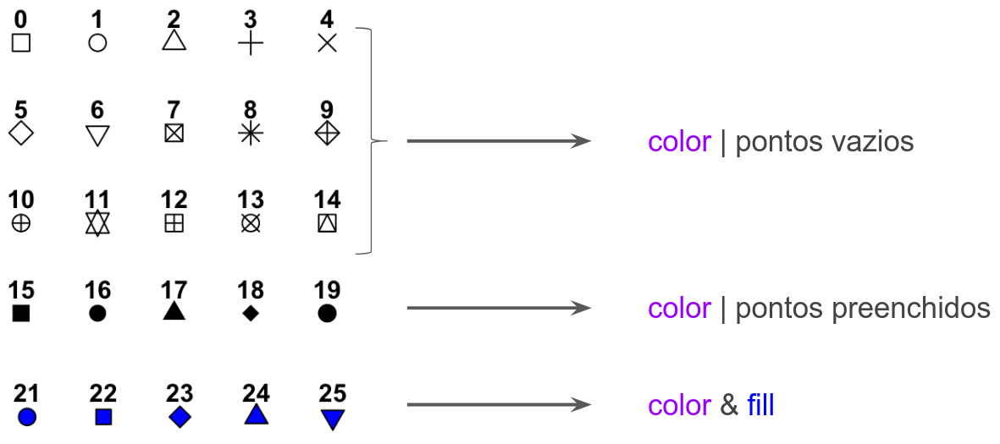

\newpage{}

# Visualização de dados {#cap23}

Conteudo copiado, com pequenas alterações e atualizações de [Capítulo 6 Visualização de dados](https://analises-ecologicas.com/cap6), do livro [Análises Ecológicas no R](https://analises-ecologicas.com/) . O livro está licenciado sob a licença [BY-NC-ND 4.0](https://creativecommons.org/licenses/by-nc-nd/4.0/) : https://creativecommons.org/licenses/by-nc-nd/4.0/.


## Pré-requisitos do capítulo {-}

Pacotes que serão utilizados nesse capítulo.

```{r}
## Pacotes
library(tidyverse)
library(palmerpenguins)
library(datasauRus)
library(gridExtra)

## Dados
penguins <- palmerpenguins::penguins |> 
  na.omit()

## Edição dos nomes das colunas para português
penguins <- penguins |> 
  rename("especies" = "species", 
         "ilha" = "island", 
         "comprimento_bico" = "bill_length_mm", 
         "profundidade_bico" = "bill_depth_mm", 
         "comprimento_nadadeira" = "flipper_length_mm", 
         "massa_corporal" = "body_mass_g", 
         "sexo" = "sex", 
         "ano" = "year")

```

## Contextualização

A visualização de dados através de gráficos frequentemente é a melhor forma de apresentar e interpretar informações ecológicas pois sintetiza os dados e facilita o entendimento de padrões. Geralmente, os gráficos são necessários em quase todas as análises estatísticas, além de enriquecer a argumentação e discussão de hipóteses levantadas para publicações, trabalhos de consultoria, TCCs, dissertações, teses, entre outros.

Existem vários tipos de gráficos para representar os padrões em seus dados para diferentes finalidades. Esses diferentes tipos de gráficos podem até mesmo ser usados para representar o mesmo tipo de dado. Nesta seção, focaremos nos gráficos mais simples para representar uma ou duas variáveis (i.e., gráficos bidimensionais). Dependendo do tipo de variável (categórica ou contínua), os gráficos mais indicados para representar os dados mudam. De forma simplificada, os gráficos são representações dos nossos dados tabulares, de modo que os eixos representam as colunas e as feições (pontos, linhas, barras, caixas, etc.) representam as linhas.

Comumente nos gráficos são representados uma ou duas colunas, quando muito três, em gráficos de três dimensões. Para mais colunas, partimos para dados agregados que podem ser vistos nas análises multivariadas. Além disso, a utilização de mais de duas colunas pode estar relacionado com outras partes estéticas (e.g. `aes()` no pacote `ggplot2`) do gráfico como cor, forma ou tamanho de pontos, linhas ou outras feições.

Dessa forma, dedicamos esse capítulo inteiramente a apresentar os principais conceitos, como a gramática de gráficos, e uma apresentação geral que pode funcionar como "um guia de bolso" de gráficos, uma vez que apresentamos os principais tipos de gráficos para análises ecológicas e estatísticas. Além disso, no último tópico focamos na finalização (ajustes finos) de gráficos para publicações. Este capítulo fornece a base conceitual necessária para entender a visualização gráfica de dados apresentada ao longo do livro.

Existe uma ampla gama de pacotes para fazer gráficos no R, sendo esse um ponto muito forte dessa linguagem. Além disso, essa grande disponibilidade de pacotes e funções permitem a visualização dos mais diferentes tipos de dados, o que torna a linguagem R detentora de alta praticidade, uma vez que a maior parte dos pacotes possui uma sintaxe relativamente simples para a apresentação de gráficos excelentes e de ótima qualidade. Mais adiante no Capítulo \@ref(cap25), ampliamos a discussão da visualização gráfica com ferramentas para visualização de dados geoespaciais no R.

Este capítulo foi organizado em quatro partes: i) principais pacotes, ii) gramática dos gráficos, iii) tipos de gráficos (um guia de bolso para visualização de vários gráficos no R), e iv) edição de gráficos com alta qualidade para publicação. Apesar de apresentarmos diferentes pacotes com grande potencial para visualização gráfica, focaremos neste capítulo no pacote `ggplot2`, talvez o pacote mais utilizado e com maior gama de possibilidades de criação de excelentes gráficos.

::: {.alert .alert-info}
<strong>  Importante </strong>\
Neste capítulo, vamos ensinar gradativamente os comandos para construir gráficos e como editar suas diferentes camadas. Por este motivo, o leitor não verá uma padronização nos temas dos gráficos (fonte, cor, fundo do painel, etc.), uma vez que os gráficos sem edição (padrão do ggplot2) possuem temas pré-definidos. Desse modo, para fazer um gráfico com maior qualidade (chamamos aqui de versão "com ajustes finos") será necessário adicionar comandos extras que são exatamente o foco deste capítulo. Em alguns comandos básicos o leitor vai perceber que devido aos dados utilizados, os eixos vão possuir palavras em inglês misturadas com as palavras em português. Optamos por não traduzir esses nomes para preservar o padrão que será visualizado nos primeiros comandos que cada leitor irá fazer em seu computador.  
:::

Usaremos os dados disponíveis no pacote `palmerpenguins` para exemplificar as funções do `ggplot2`, descrito no Capítulo \@ref(cap22).

## Principais pacotes

A seguir, apresentamos uma listagem dos principais pacotes para visualização de dados no R, além das principais funções desses pacotes.

-   [*graphics*](http://search.r-project.org/R/library/graphics/html/00Index.html): é o pacote padrão (*default*) do R para produzir gráficos simples, porém útil para visualizações rápidas de quase todos as classes de objetos. Possui funções como: `plot()`, `hist()`, `barplot()`, `boxplot()`, `abline()`, `points()`, `lines()` e `polygon()`. Destacamos que a função `plot()` pode estar presente em diversos pacotes

-   [*ggplot2*](https://ggplot2.tidyverse.org/): pacote integrado ao *tidyverse* (Capítulo \@ref(cap22)), possui uma sintaxe própria baseada na gramática de gráficos por camadas (*layers*), necessitando de funções específicas para objetos de classes diferentes, demandando geralmente mais tempo para a construção dos códigos. Possui funções como `ggplot()`, `aes()`, `geom_*()`, `facet_*()`, `stats_*()`, `coord_*()` e `theme_*()`, que são conectadas pelo operador `+`

-   [*ggplot2 extentions*](https://exts.ggplot2.tidyverse.org/): conjunto de pacotes que adicionam diversas expansões ao pacote `ggplot2`. Exemplos: [*gganimate*](https://gganimate.com/), [*GGally*](https://ggobi.github.io/ggally/), [*patchwork*](https://patchwork.data-imaginist.com/) e [*esquisse*](https://dreamrs.github.io/esquisse/)

-   [*visdat*](https://docs.ropensci.org/visdat/): cria visualizações preliminares de dados exploratórios de um conjunto de dados inteiro para identificar problemas ou recursos inesperados usando 'ggplot2'. Possui diversas funções específicas: `vis_dat()` para visão geral dos dados, `vis_miss()` para visão de dados faltantes (`NA`) e `vis_compare()` para visualizar a diferença entre dados

-   [*ggpubr*](https://rpkgs.datanovia.com/ggpubr/): pacote que fornece funções simplificadas para criar e personalizar gráficos para publicação, baseados no `ggplot2`. Possui funções específicas: `gghistogram()`, `ggdensity()`, `ggboxplot()`, `ggviolin()`, `ggbarplot()` e `ggscatter()`

-   [lattice](http://lattice.r-forge.r-project.org/): pacote para visualização de dados inspirado nos gráficos treliça (do inglês *Trellis*, geralmente para dados com muitas variáveis que geram uma matriz retangular de gráficos). Também possui funções específicas: `xyplot()`, `histogram()`, `densityplot()`, `barchart()`, `bwplot()` e `dotplot()`. O pacote [latticeExtra](http://latticeextra.r-forge.r-project.org/) disponibiliza algumas possibilidades a mais para esse pacote

-   [plotly](https://plotly.com/r/): pacote para criar gráficos interativos da web por meio da biblioteca gráfica de JavaScript de código aberto [plotly.js](https://plotly.com/). Também possui funções específicas: `plot_ly()`, `add_histogram()`, `add_bars()`, `add_boxplot()`, `add_markers()`, `add_paths()`, `add_lines()` e `add_polygons()`

## Grámatica dos gráficos

O livro *The Grammar of Graphics* [@wilkinson2005] utiliza uma analogia da linguística para criar uma "gramática" para a visualização gráfica. Segundo ele, a língua se torna expressiva pelo fato da gramática criar um sistema de regras que tornam as declarações com significado conhecido. De maneira semelhante, a ideia da *gramática dos gráficos* cria regras para representação gráfica dos dados a partir de atributos estéticos (do inglês *aesthetic*) como cor, forma e tamanho que definem a geometria dos objetos, como pontos, linhas e barras [@wickham2016]. Além disso, esta gramática reconhece que tais elementos podem ser organizados em camadas, tal como construímos um mapa com diferentes camadas como elevação, hidrografia, rodovias, limites políticos, etc.

Inspirado pela *gramática dos gráficos* proposta por Wilkinson & Wills [-@wilkinson2005], Hadley Wickham criou o pacote `ggplot2`, onde "gg" representa a contração de *Grammar of Graphics* [@wickham2016]. As camadas nesta gramática (*layered-grammar*) são organizadas da seguinte forma:

- **Camada 1** - dados `ggplot()`: são as informações no formato `data.frame` que serão usadas nas diferentes camadas nas funções `aes()`, `geom_*()`, `stat_*()`, `facet_*()` e `scale_*()`
- **Camada 2** - mapeamento `aes()`: atributos estéticos, determina que colunas do `data.frame` serão usadas para as representações geométricas, assim como tamanho, forma, cor, preenchimento e transparência
- **Camada 3** - definição da geometria `geom_*()`: define o tipo de gráfico, como pontos, boxplots, violino, linhas, polígonos, entre outros
- **Camada 4** - transformações estatísticas `stat_*()`: modificam, quando necessário, os dados que serão incluídos no gráfico, além de produzir estatísticas como regressões
- **Camada 5** - sistema de coordenadas `coords_*()`: descreve como as coordenadas dos dados são mapeadas para o plano do gráfico
- **Camada 6** - facetas `facets_*()`: especifica como a visualização dos elementos `aes()` são divididos em diferentes "janelas gráficas"
- **Camada 7** - escala `scale_*()`: permite o controle das características visuais (cor, forma e tamanho) dos elementos declarados em `aes()`
- **Camada 8** - temas `theme*()`: controla a aparência visual dos elementos do gráfico, como fontes, cores e legenda

Estruturalmente podemos observar a estrutura da Figura \@ref(fig:fig-camadas).

```{r fig-camadas, echo=FALSE, out.width = "65%", out.height = "65%", fig.align="center",  fig.cap="Esquema gráfico ilustrando as camadas que definem a strutura de organização aditiva da gramática dos gráficos (ggplot2). No exemplo, a partir de um banco de dados, o mapeamento de quais colunas representam o eixo Y e X e de um atributo gráfico (pontos) é possível construir um gráfico de dispersão que ilustra a relação quantitativa entre a variável Y e X."}
knitr::include_graphics("figures/cap06_fig01.png")
```

Em resumo, o mapeamento gráfico do ggplot2 segue a seguinte estrutura [@wickham2017]:

```r
ggplot(data = <DATA>) + 
    <GEOM_FUNCTION>(
        mapping = aes(<MAPPINGS>),
        stat = <STAT>, 
        position = <POSITION>
        ) +
    <COORDINATE_FUNCTION> +
    <FACET_FUNCTION> +
    <SCALE_FUNCTION> +
    <THEME_FUNCTION>
```

## Tipos de gráficos

Nesta seção, listamos os principais tipos de gráficos e fazemos uma descrição de quantas colunas e o tipo de variável que eles representam.

-   **Histograma (*histogram*)**: distribuição de frequência de uma coluna para dados contínuos (cores diferentes podem representar espécies, populações ou grupos distintos)
-   **Gráfico de densidade (*density plot*)**: distribuição da densidade de uma coluna para dados contínuos (assim como no histograma, cores diferentes podem ser utilizadas para representar espécies, populações ou grupos distintos)
-   **Gráfico de dispersão (*scatter plot*) e gráfico de linha**: relação entre valores de duas colunas para dados contínuos (X e Y)
-   **Diagrama de pontos (*dot plot*)**: distribuição da quantidade de valores agrupados de uma coluna para dados contínuos
-   **Gráfico de setores (*pie chart* e *donut chart*)**: representação da quantidade de valores de uma coluna para dados categóricos, geralmente em proporção ou porcentagem
-   **Gráfico de barras (*bar plot*)**: representação da quantidade de valores de uma ou mais colunas para dados categóricos
-   **Gráfico de caixa (*box plot* e *violin plot*)**: distribuição de valores contínuos de uma coluna (Y) para dois ou mais fatores categóricos de outra coluna (X) no formato de caixas e também no formato de "violinos" (considerando a variação e distribuição)
-   **Gráfico pareado (*pairs plot*)**: relação entre valores de duas colunas para dados contínuos (X e Y), para colunas par-a-par

Para facilitar a compreensão das regras da gramática dos gráficos, cada tipo de gráfico segue a mesma estrutura de organização, que respeita as camadas de informação descritas na seção anterior. Podemos perceber, portanto, que algumas camadas não são necessárias dependendo do tipo de gráfico ou do conjunto de dados que pretendemos analisar. 

Nos exemplos a seguir, a *versão padrão* se refere à representação determinada no *default* das funções do pacote `ggplot2`. Desse modo, somente informamos as variáveis que serão utilizadas dentro de cada camada e a forma geométrica (i.e., tipo de gráfico) desejada. Porém, para cada tipo gráfico apresentamos funções e argumentos para ajustes finos e personalizados.

### Histograma (*histogram*)

O [histograma](https://www.data-to-viz.com/graph/histogram.html) é um gráfico extremamente popular, sendo bastante útil para visualizar a distribuição de variáveis contínuas. É bem provável que você já tenha visto um histograma quando aprendeu pela primeira vez a famosa *distribuição normal* (Figura \@ref(fig:fig-hist-norm)).

```{r fig-hist-norm, out.width = "75%", out.height = "75%", fig.cap="Histograma de uma distribuição normal com 10000 observações."}
## Dados
dist_normal <- data.frame(x = rnorm(10000, mean = 0, sd = 1))

## Histograma de uma variável contínua
ggplot(data = dist_normal, 
       aes(x = x)
       ) +
    geom_histogram()
```

Neste histograma é possível entender que a maioria dos valores da variável `x` do objeto dist_normal estão próximos ao valor da média, i.e., zero. Em Ecologia, os histogramas são utilizados para visualizar, por exemplo, a variação morfológica entre espécies (subespécies, gênero, famílias, etc.), variação de parâmetros populacionais entre diferentes espécies ou dentro da mesma espécie em diferentes localidades.

**Versão padrão**

Vamos utilizar o conjunto de dados *palmerpenguins* para construir um histograma da distribuição da variável "comprimento_nadadeira" com a função `geom_hitogram()`. Esta função utiliza uma variável contínua no eixo X e a frequência de cada categoria de intervalo de valores no eixo Y. O gráfico a seguir representa a frequência de uma variável (neste caso, a medida de todos os pinguins, independente da espécie).

```{r fig-hist-flipper, eval = FALSE, out.width = "75%", out.height = "75%", fig.cap = "Histograma de comprimento_nadadeira."}
## Histograma da coluna flipper_length_mm
ggplot(data = penguins, 
       aes(x = comprimento_nadadeira)
       ) +
    geom_histogram()
```


**Definindo o número de classes**

Vamos utilizar o argumento `bins` para definir em quantas classes de agrupamentos a variável `x` deve ser dividida.

```{r fig-hist-bins, fig.cap="Histograma de comprimento_nadadeira para diferentes classes."}
## Histograma com 10 classes
ggplot(data = penguins, 
       aes(x = comprimento_nadadeira)) +
    geom_histogram(bins = 10) +
    labs(title = "10 classes")

## Histograma com 30 classes
ggplot(data = penguins, 
       aes(x = comprimento_nadadeira)) +
    geom_histogram(bins = 30) +
    labs(title = "30 classes")
```

**Comparando múltiplas categorias**

Se quisermos comparar a distribuição de uma variável contínua entre diferentes categorias, podemos utilizar o argumento `fill` para colorir o gráfico. No exemplo abaixo, utilizamos cores diferentes para ilustrar a distribuição da variável X (`x = comprimento_nadadeira`) entre espécies diferentes (`fill = especies`) (Figura \@ref(fig:fig-hist-cat)).

```{r fig-hist-cat, fig.cap="Histograma de comprimento_nadadeira para diferentes espécies."}
## Histograma com cores para diferentes categorias com sobreposição
ggplot(data = penguins, 
       aes(x = comprimento_nadadeira, fill = especies)) +
    geom_histogram(alpha = .4) +
    labs(title = "Com sobreposiçao")

## Histograma com cores para diferentes categorias sem sobreposição
ggplot(data = penguins, 
       aes(x = comprimento_nadadeira, fill = especies)) + 
      geom_histogram(position = "dodge") + 
       labs(title = "Sem sobreposiçao")
```

**Ajustes finos (versão personalizada)**

```{r fig-hist-fino, out.width="75%", out.height="75%", fig.align="center", fig.cap="Histograma da variável comprimento_nadadeira com ajustes finos."}
## Histograma exemplo
ggplot(data = penguins, aes(x = comprimento_nadadeira, fill = especies)) +
    geom_histogram(alpha = .4, position = "identity") +
    scale_fill_manual(values = c("darkorange", "darkorchid", "cyan4")) +
    theme_bw(base_size = 14) +
    labs(x = "Comprimento da nadadeira (mm)", 
         y = "Frequência absoluta", fill = "Espécies")
```

**Principais camadas utilizadas na função `geom_histogram()`**

- `aes()`
- Eixo X (`x`): variável contínua ("comprimento_nadadeira")
- Preenchimento (`fill`): variável categórica (`especies`) que define as cores tendo como base o número de níveis dentro desta categoria
- `geom()` 
- `geom_histogram()`: para que a variável contínua seja plotada como histograma
- Transparência das linhas e preenchimentos (`alpha`): 0.5 (varia de 0, transparência máxima, a 1, sem transparência)
- Posição das barras: o argumento `position` define se as barras devem ser inseridas de maneira sobreposta (`position = "identity"`) ou não (`position = "dodge"`)
- `scale()`
- `scale_fill_manual()`: para definir manualmente as cores
- `theme()`
- `theme_bw()`: para selecionar o tema com fundo branco 
- `labs()`: para personalizar os títulos dos eixos X e Y, e da legenda

### Gráfico de densidade (*density plot*)

Nesta seção aprenderemos a criar um [gráfico de densidade](https://www.data-to-viz.com/graph/density.html) no R utilizando o `ggplot2`. Assim como o histograma, o **gráfico de densidade** é utilizado para visualizar a distribuição de uma variável contínua em intervalos. Esse gráfico é uma variação do histograma que utiliza [Kernel Smoother](https://en.wikipedia.org/wiki/Kernel_smoother) e, além de ser muito útil para visualizar distribuições, pode ser usado para testar várias hipóteses ecológicas.

**Versão padrão**

Vamos utilizar o conjunto de dados *palmerpenguins* para plotar a distribuição da variável "comprimento_nadadeira" em um gráfico de densidade. Utilizaremos a função `geom_density()` para plotar uma variável no eixo X (Figura \@ref(fig:fig-dens-flipper)).

```{r fig-dens-flipper, out.width = "75%", out.height = "75%", fig.cap="Gráfico de densidade da variável comprimento_nadadeira."}
## Gráfico de densidade
ggplot(data = penguins, aes(x = comprimento_nadadeira)) +
    geom_density()
```

Além da versão de densidade em linha, é possível utilizar o argumento `fill` para definir a cor de preenchimento do gráfico e o argumento `alpha` para definir a transparência do preenchimento. Utilizamos ainda o argumento `color` para definir a cor da linha (Figura \@ref(fig:fig-dens-flipper-color)).

```{r fig-dens-flipper-color, out.width = "75%", out.height = "75%", fig.cap = "Gráfico de densidade da variável comprimento_nadadeira com cor e preenchimento."}
## Argumento fill
ggplot(data = penguins, aes(x = comprimento_nadadeira)) +
    geom_density(fill = "cyan4")

## Argumento fill, color e alpha
ggplot(data = penguins, aes(x = comprimento_nadadeira)) +
    geom_density(fill = "cyan4", color = "black", alpha = .4)
```

**Comparando múltiplas categorias**

Em algumas situações queremos comparar a distribuição de uma variável contínua entre diferentes categorias. Dessa forma, podemos utilizar o argumento `fill` para colorir o gráfico. No exemplo abaixo, utilizamos cores diferentes para ilustrar a distribuição da variável x entre espécies diferentes (`fill = especies`) (Figura \@ref(fig:fig-dens-flipper-cat)).

```{r fig-dens-flipper-cat, out.width = "75%", out.height = "75%", fig.cap = "Gráfico de densidade da variável comprimento_nadadeira para diferentes espécies com e sem transparência."}
## O argumento fill preenche cada nível da coluna "especies" (sem transparência: alpha = 1)
ggplot(data = penguins, aes(x = comprimento_nadadeira, fill = especies)) +
    geom_density() +
    scale_fill_manual(values = c("darkorange", "darkorchid", "cyan4")) +
    labs(title = "Sem transparência")

## Gráfico de densidade com cores para diferentes categorias com sobreposição
ggplot(data = penguins, aes(x = comprimento_nadadeira, fill = especies)) +
    geom_density(alpha = .4) +
    scale_fill_manual(values = c("darkorange", "darkorchid", "cyan4")) +
    labs(title = "Com transparência")
```

**Ajustes finos (versão personalizada)**

```{r fig-dens-fino, out.width = "75%", out.height = "75%", fig.cap="Gráfico de densidade da variável comprimento_nadadeira com ajustes finos."}
## Gráfico de densidade exemplo
ggplot(data = penguins, aes(x = comprimento_nadadeira, fill = especies)) +
    geom_density(alpha = .4) +
    scale_fill_manual(values = c("darkorange", "darkorchid", "cyan4")) +
    scale_x_continuous(breaks = seq(from = 160, to = 240, by = 10), limits = c(160, 240)) +
    scale_y_continuous(breaks = seq(from = 0, to = .07, by = .01)) +
    theme_bw(base_size = 14) +
    labs(x = "Comprimento da nadadeira (mm)", y = "Densidade", fill = "Espécies")
```

**Principais camadas utilizadas na função `geom_density()`**

- `r kableExtra::text_spec("aes()", background = "#dedede")`
- Eixo X (`r kableExtra::text_spec("x", background = "#dedede")`): variável contínua ( `r kableExtra::text_spec("comprimento_nadadeira", background = "#dedede")`  )
- Preenchimento ( `r kableExtra::text_spec("fill", background = "#dedede")`): variável categórica ("especies") que define as cores tendo como base o número de níveis dentro desta categoria
- `r kableExtra::text_spec("geom()", background = "#dedede")` 
- `r kableExtra::text_spec("geom_density()", background = "#dedede")`: para que a variável contínua seja plotada como densidade
- Transparência  (`alpha`): 0.5 (varia de 0, transparência máxima, a 1, sem transparência)
- `scale_fill_manual()`: para definir manualmente as cores de preferência do usuário
- `scale_x_continuous()` e `scale_y_continuous()`: determinam os limites (valores mínimos e máximos) para os dois eixos e, além disso, os intervalos entre os valores (`breaks`)
- `theme_bw()`: para selecionar o tema com fundo branco
- `labs()`: para personalizar os títulos dos eixos X e Y, e da figura.

### Diagrama de pontos (*dot plot*)

Uma alternativa ao histograma e ao gráfico de densidade é o diagrama de pontos ([Dot plot](https://datavizproject.com/data-type/dot-plot/), apesar de ser relativamente menos usado em Ecologia.

**Versão padrão**

Vamos utilizar o conjunto de dados palmerpenguins para visualizar a distribuição da variável "comprimento_nadadeira" com o diagrama de pontos com a função `geom_dotplot()` (Figura \@ref(fig:fig-dot-flipper)).

```{r fig-dot-flipper, out.width = "75%", out.height = "75%", fig.cap = "Diagrama de pontos da variável comprimento_nadadeira."}
## Gráfico de pontos
ggplot(data = penguins, 
       aes(x = comprimento_nadadeira)) +
    geom_dotplot(dotsize = .6)
```

**Comparando múltiplas categorias**

Assim como nas funções `geom_histogram()` e `geom_density()`, é possível comparar categorias na função `geom_dotplot()` utilizando o argumento `fill`, bem como os argumentos `color`, `alpha` e `dotsize` (Figura \@ref(fig:fig-dot-flipper-cat)).

```{r fig-dot-flipper-cat, out.width = "75%", out.height = "75%", fig.cap = "Diagrama de pontos da variável comprimento_nadadeira para diferentes espécies com e sem transparência."}
## O argumento fill preenche cada nível da coluna "especies" (sem transparência: alpha = 1)
ggplot(data = penguins, 
       aes(x = comprimento_nadadeira, fill = especies)) +
    geom_dotplot(dotsize = .9)

## Diagrama de pontos com cores para diferentes categorias com sobreposição
ggplot(data = penguins, 
       aes(x = comprimento_nadadeira, fill = especies)
       ) +
    geom_dotplot(dotsize = .7, color = "black", alpha = .4)
```

**Ajustes finos (versão personalizada)**

```{r fig-dot-flipper-fino, out.width = "75%", out.height = "75%", fig.cap = "Diagrama de pontos da variável comprimento_nadadeira com ajustes finos."}
## Diagrama de pontos exemplo
ggplot(data = penguins, 
       aes(x = comprimento_nadadeira, fill = especies)) +
    geom_dotplot(color = "black", alpha = .7, position = "dodge") +
    scale_fill_manual(values = c("darkorange", "darkorchid", "cyan4")) +
    scale_x_continuous(breaks = seq(from = 170, to = 240, by = 10), limits = c(170, 240)) +
    scale_y_continuous(breaks = seq(from = 0, to = 1.4, by = .2), limits = c(0, 1.4)) +
    theme_bw(base_size = 14) +
    labs(x = "Comprimento da nadadeira (mm)", y = "Frequência", fill = "Espécies")
```

::: {.alert .alert-info}
<strong> Importante </strong>\
Uma das limitações do diagrama de pontos é que a sobreposição dos pontos pode não permitir a visualização apropriada desses valores sobrepostos entre diferentes grupos quando comparados.
:::

**Principais camadas utilizadas na função `geom_dotplot()`**

- `aes()`
- Eixo X (`x`): variável contínua ("comprimento_nadadeira")
- Preenchimento (`fill`): variável categórica ("especies") que define as cores tendo como base o número de níveis dentro desta categoria
- `geom()` 
- `geom_dotplot()`: para que a variável contínua seja plotada como diagrama de pontos
- Transparência dos pontos (`alpha`): 0.5 (varia de 0, transparência máxima, a 1, sem transparência)
- Cor da borda do ponto (`color`): valor padrão (se não for especificado) é `black`
- Tamanho dos pontos (`dotsize`): valor padrão (se não for especificado) é 1
- Posição dos pontos: o argumento `position` define se os pontos devem ser inseridos de maneira sobreposta (`position = "identity"`) ou não (`position = "dodge"`)
- `scale()`
- `scale_fill_manual()`: para definir manualmente as cores de preferência do usuário
- `scale_x_continuous()`: e `scale_y_continuous()` determinam os limites (valor mínimo e máximo) para os dois eixos e, além disso, os intervalos entre os valores (`breaks`)
- `theme()` 
- `theme_bw()`: para selecionar o tema com fundo branco
- `labs()`: para personalizar os títulos dos eixos X e Y, e da legenda

### Gráfico de barras (*bar plot*)

O [gráfico de barras](https://www.data-to-viz.com/graph/barplot.html) é um dos gráficos mais usados em artigos e livros de Ecologia, uma vez que permite comparar valores absolutos ou médios (combinados com alguma medida de variação, como desvio padrão) de uma variável contínua entre diferentes níveis de uma variável categórica.

**Versão padrão**

O gráfico de barras utiliza retângulos para representar uma variável contínua ou a contagem de uma variável categórica, sendo que o comprimento dos retângulos é proporcional ao valor que ele representa. Por exemplo, é possível comparar qual a quantidade de indivíduos medidos para cada espécie de pinguim (Figura \@ref(fig:fig-bar-species)).

```{r fig-bar-species, out.width = "75%", out.height = "75%", fig.cap = "Gráfico de barras indicando a quantidade de indivíduos medidos de cada espécie de pinguim."}
## Número de indivíduos coletados
penguins_count <- penguins |> 
  dplyr::count(especies)
penguins_count

## Gráfico de barras
ggplot(data = penguins_count, aes(x = especies, y = n)) + 
    geom_bar(stat = "identity")
```

Além disso, é possível alterar as cores (`color`) e o preenchimento (`fill`) das barras, bem como sua transparência (`alpha`) e largura (`width`), como demonstrado nos próximos quatro gráficos.

```{r fig-bar-species-color, out.width = "75%", out.height = "75%", fig.cap="Gráficos de barras indicando a quantidade de indivíduos medidos de cada espécie de pinguim, modificando cor, preenchimento, transparência e largura das barras."}
## Modificando o preenchimento
ggplot(data = penguins_count, aes(x = especies, y = n)) + 
    geom_bar(stat = "identity", fill = "cyan4")

## Modificando a cor e o preenchimento
ggplot(data = penguins_count, aes(x = especies, y = n)) + 
    geom_bar(stat = "identity", color = "cyan4", fill = "white")

## Modificando a largura da barra = .75
ggplot(data = penguins_count, aes(x = especies, y = n)) +
    geom_bar(stat = "identity", width = .75) +
    labs(title = "Largura = .75")

## Modificando a largura da barra = .25
ggplot(data = penguins_count, aes(x = especies, y = n)) +
    geom_bar(stat = "identity", width = .25) +
    labs(title = "Largura = .25") 
```

Outra possibilidade para representação do gráfico de barras é inverter a direção das barras com a função `coord_flip()` (Figura \@ref(fig:fig-bar-species-invert)).

```{r fig-bar-species-invert, out.width = "75%", out.height = "75%", fig.cap="Gráficos de barras indicando a quantidade de indivíduos medidos de cada espécie de pinguim, invertendo a direção das barras."}
## Barras vertical
ggplot(data = penguins_count, aes(x = especies, y = n)) +
    geom_bar(stat = "identity", width = .6)

## Barras horizontal
ggplot(data = penguins_count, aes(x = especies, y = n)) +
    geom_bar(stat = "identity", width = .6) + 
    coord_flip()
```

É possível utilizar variáveis categóricas para definir cores e preenchimento e ilustrar, por exemplo, tratamentos ou espécies diferentes com os argumentos `fill` e `color` (Figura \@ref(fig:fig-bar-species-fill)).

```{r fig-bar-species-fill, out.width = "75%", out.height = "75%", fig.cap="Gráfico de barras indicando a quantidade de indivíduos medidos de cada espécie de pinguim, para diferentes espécies."}
## Gráfico de barras com preenchimento colorido
ggplot(data = penguins_count, aes(x = especies, y = n, fill = especies)) +
    geom_bar(stat = "identity")
```

**Adicionando medidas de variação**

Em algumas comparações, utilizar somente os valores absolutos pode não ser a visualização mais apropriada, como, por exemplo, em desenhos  entre grupos e dentro de grupos, tipicamente analisados com ANOVA (Análise de Variância). Desse modo, ao invés do valor máximo da barra representar o valor absoluto (e.g., número de indivíduos de uma espécie), ele vai representar o valor médio. Além disso, linhas adicionais (chamadas barras de erro) vão representar alguma medida de variação como desvio padrão, erro padrão, intervalo de confiança, entre outros (Figura \@ref(fig:fig-bar-species-sd)).

```{r fig-bar-species-sd, out.width = "75%", out.height = "75%", fig.cap="Gráfico de barras indicando os valores médios e o desvio padrão da variável comprimento_nadadeira para cada espécie de pinguim."}
## Calcular o desvio padrão por espécie
penguins_media <- penguins |> 
    dplyr::group_by(especies) |> 
    dplyr::summarise(media = mean(comprimento_nadadeira, na.rm = TRUE),
                     desvio = sd(comprimento_nadadeira, na.rm = TRUE))

## Gráfico de barras com desvio padrão
ggplot(data = penguins_media, aes(x = especies, y = media, fill = especies)) +
    geom_bar(stat = "identity", alpha = .4) +
    geom_errorbar(aes(ymin = media-desvio, ymax = media+desvio), width = .1) + 
    geom_point()
```

**Ajustes finos (versão personalizada)**

```{r fig-bar-species-fino, out.width = "75%", out.height = "75%", fig.cap="Gráfico de barras indicando a quantidade de indivíduos medidos de cada espécie de pinguim, com ajustes finos."}
## Gráfico de barra exemplo
ggplot(data = penguins_count, aes(x = especies, y = n, fill = especies)) +
    geom_bar(stat = "identity") +
    geom_label(aes(label = n), fill = "white") +
    scale_fill_manual(values = c("darkorange", "purple", "cyan4")) +
    theme_bw(base_size = 14) +
    labs(x = "Espécies", y = "Número de indivíduos", fill = "Espécies")
```

### Gráfico de setores (*pie chart* e *donut chart*)

Além do gráfico de barras, o [gráfico de setores](https://www.data-to-viz.com/caveat/pie.html) representa uma alternativa para comparar a proporção entre categorias. Tais gráficos podem ser representados como [*pie charts*](https://datavizproject.com/data-type/pie-chart/) ou [*donut charts*](https://datavizproject.com/data-type/donut-chart/), como demonstrado abaixo. No exemplo abaixo, utilizamos a mesma comparação realizada no item acima. Porém, os valores de contagem (número de indivíduos por espécie) devem ser transformados previamente em proporção.

**Gráfico de setores (*pie chart*)**

Gráfico de setores do tipo *pie* (Figura \@ref(fig:fig-pie)).

```{r fig-pie, out.width = "75%", out.height = "75%", fig.cap="Gráfico de setores indicando a proporção de indivíduos medidos de cada espécie de pinguim."}
## Cálculo da proporção - pie
penguins_prop <- penguins |>
    dplyr::count(especies) |> 
    dplyr::mutate(prop = round(n/sum(n), 4)*100)

## Gráfico de setores
ggplot(data = penguins_prop, aes(x = "", y = prop, fill = especies)) + 
    geom_bar(stat = "identity", color = "white") +
    geom_text(aes(label = paste0(prop, "%")), color = "white", 
              position = position_stack(vjust = .5), size = 6) +
    scale_fill_manual(values = c("darkorange", "purple", "cyan4")) +
    coord_polar("y", start = 0) +
    theme_void() +
    labs(fill = "Espécies")
```

**Gráfico de setores (*donut chart*)**

Gráfico de setores do tipo *donuts* (Figura \@ref(fig:fig-donut)).

```{r fig-donut, out.width = "75%", out.height = "75%", fig.cap="Gráfico de setores do tipo *donuts* indicando a proporção de indivíduos medidos de cada espécie de pinguim."}
## Gráfico de setores - donut
ggplot(data = penguins_prop, aes(x = 2, y = prop, fill = especies)) +
    geom_bar(stat = "identity") +
    geom_text(aes(label = paste0(prop, "%")), color = "white",
              position = position_stack(vjust = .5), size = 4) +
    scale_fill_manual(values = c("darkorange", "purple", "cyan4")) +
    xlim(0, 2.5) +
    coord_polar(theta = "y", start = 0) +
    theme_void() +
    theme(legend.position = c(.5, .5),
          legend.title = element_text(size = 20),
          legend.text = element_text(size = 15)) +
    labs(fill = "Espécies")
```

**Comparando gráficos de setores com gráfico de barras**

O mesmo conjunto de dados pode ser visualizado de diferentes formas. Não diferente, a comparação da proporção de ocorrências de diferentes categorias pode ser feita de várias maneiras. Abaixo, apresentamos a comparação da proporção de indivíduos de cada uma das três espécies no banco de dados `penguins` (Figura \@ref(fig:fig-prop)).

```{r fig-prop, fig.cap = "Comparação da proporção de indivíduos por cada uma das três espécies dos dados feita através de gráfico de barras, setores do tipo *pie* e setores do tipo *donuts*.", message=FALSE, warning=FALSE, out.width="100%"}
## Gráfico de barras - vertical  
g_bar_v <- ggplot(data = penguins_prop, aes(x = especies, y = prop, fill = especies)) +
    geom_bar(stat = "identity") +
    geom_label(aes(label = prop), fill = "white") +
    scale_fill_manual(values = c("darkorange", "purple", "cyan4")) +
    theme_bw() +
    theme(legend.position = "none") +
    labs(title = "Gráfico de Barras (Vertical)", x = "Espécies", 
         y = "Número de indivíduos", fill = "Espécies")

## Gráfico de barras - horizontal  
g_bar_h <- ggplot(data = penguins_prop, aes(x = especies, y = prop, fill = especies)) +
    geom_bar(stat = "identity") +
    geom_label(aes(label = prop), fill = "white") +
    scale_fill_manual(values = c("darkorange", "purple", "cyan4")) +
    coord_flip() +
    theme_bw() +
    theme(legend.position = "none") +
    labs(title = "Gráfico de Barras (Horizonal)", x = "Espécies", 
         y = "Número de indivíduos", fill = "Espécies")

## Gráfico de setores - pie
g_pie <- ggplot(data = penguins_prop, aes(x = "", y = prop, fill = especies)) + 
    geom_bar(stat = "identity", color = "white") +
    geom_text(aes(label = paste0(prop, "%")), color = "white", 
              position = position_stack(vjust = .5), size = 3) +
    scale_fill_manual(values = c("darkorange", "purple", "cyan4")) +
    coord_polar("y", start = 0) +
    theme_void() +
    labs(title = "Pie chart", fill = "Espécies")

## Gráfico de setores - donut
g_donut <- ggplot(data = penguins_prop, aes(x = 2, y = prop, fill = especies)) +
    geom_bar(stat = "identity") +
    geom_text(aes(label = paste0(prop, "%")), color = "white",
              position = position_stack(vjust = .5), size = 2) +
    scale_fill_manual(values = c("darkorange", "purple", "cyan4")) +
    coord_polar(theta = "y", start = 0) +
    xlim(0, 2.5) +
    theme_void() +
    theme(legend.position = "none") +
    labs(title = "Donut chart", fill = "Espécies")

## Combinação dos gráfigos
grid.arrange(g_bar_v, g_bar_h, g_pie, g_donut, nrow = 2)
```

**Principais camadas utilizadas no gráfico de barras e de setores: `geom_bar()`**

- `aes()`
- Eixo X (`x`): variável categórica ("especies")
- Eixo Y (`y`): variável contínua ("comprimento_nadadeira")
- Preenchimento (`fill`): a variável categórica ("especies") define a cor do preenchimento e os níveis dentro desta categoria determinam o número de cores que devem ser indicadas no `scale_fill_manual()`
- `geom()`
- `geom_bar()`: para que as variáveis categóricas sejam plotadas como gráficos de barra ou setores
- Transparência das barras (`alpha`): 0.5 (varia de 0, transparência máxima, a 1, sem transparência)
- `stat`: é necessário usar o argumento `identity` quando os valores do eixo Y são adicionados pelo usuário
- `geom_label()`: forma geométrica que adiciona rótulo dos valores absolutos das barras por categoria (`especies`)
- `geom_errorbar()`: `ymin`e `ymax` delimitam os valores mínimos e máximos, respectivamente, das barras de erro. Tais valores são representados pelo valor da média menos (no caso do ymin) ou mais (no caso do ymax) o valor do intervalo de confiança, desvio ou erro padrão
- `coord`
- `coord_polar()`: sistema de coordenadas para gerar barras circulares sobrepostas (*stacked*) que são usadas nos gráficos de setores (*pie chart* e *donut chart*)
- o argumento `start = 0` indica o local de início do gráfico que, neste caso, começa na "hora" 0 em um "relógio" de 12 horas
- `scale()`
- `scale_fill_manual()`: para definir manualmente as cores de preferência do usuário
- `theme()`
- `theme_bw()`: para selecionar o tema com fundo branco
- `labs()`: para personalizar os títulos dos eixos X e Y, e da legenda.

### Gráfico de caixa (*boxplot*)

O gráfico de caixa, também conhecido como [boxplot](https://www.data-to-viz.com/caveat/boxplot.html), e amplamente utilizado nos artigos e livros de Ecologia, é uma visualização gráfica que sintetiza informações importantes de dados contínuos como mediana e variação (Figura \@ref(fig:fig-boxplot-desc)) para diferentes níveis de uma variável categórica.

```{r fig-boxplot-desc, fig.cap="Estrutura e elementos do boxplot.", out.width = "75%", out.height = "75%",  echo=FALSE}
knitr::include_graphics("figures/cap06_fig03.png")
```

**Versão padrão**

Vamos plotar uma variável contínua ("comprimento_nadadeira") no eixo y em função de uma variável categórica no eixo x (`especies`). A definição de qual coluna do bando de dados é a x e qual é a y é feita dentro do na função `aes()` (Figura \@ref(fig:fig-boxplot)).

```{r fig-boxplot, out.width = "75%", out.height = "75%", fig.cap="Gráfico de caixa para a variável comprimento_nadadeira para cada espécie de pinguim."}
## Gráfico de caixas das coluna comprimento_nadadeira e espécies
ggplot(data = penguins, 
       aes(y = comprimento_nadadeira, x = especies)) +
    geom_boxplot()
```

É possível destacar, se houver, os pontos referentes aos *outliers* (valores discrepantes) com o argumento `outlier.color`. Caso tenha interesse, é possível também remover os outliers do gráfico (Figura \@ref(fig:fig-boxplot-outlier)).

```{r fig-boxplot-outlier, out.width = "75%", out.height = "75%", fig.cap="Gráfico de caixa para a variável comprimento_nadadeira para cada espécie de pinguim, destacando e removendo os outliers."}
## Destaque dos outliers
ggplot(data = penguins, 
       aes(y = comprimento_nadadeira, x = especies)
       ) +
    geom_boxplot(outlier.color = "red") +
    labs(title = "Outliers vermelhos")

## Remoção dos outliers
ggplot(data = penguins, 
       aes(y = comprimento_nadadeira, x = especies)
       ) +
    geom_boxplot(outlier.shape = NA) +
    labs(title = "Outliers removidos")
```

Outra opção para os gráficos do tipo boxplot é utilizar o argumento `notch = TRUE` para produzir diagramas de caixa entalhados (*notched*). Estes diagramas são úteis para inferir de forma aproximada se existe diferença significativa entre as médias dos grupos (Figura \@ref(fig:fig-boxplot-notched)).

```{r fig-boxplot-notched, out.width = "75%", out.height = "75%", fig.cap="Gráfico de caixa para a variável comprimento_nadadeira para cada espécie de penguim, com entalhamentos."}
## Gráfico com caixa entalhadas
ggplot(data = penguins, 
       aes(y = comprimento_nadadeira, x = especies)
       ) +
    geom_boxplot(notch = TRUE) +
    labs(title = "Caixas entalhadas")
```

**Comparando múltiplas categorias**

No exemplo abaixo, utilizamos cores diferentes para ilustrar espécies diferentes através do argumento `fill = especies` (Figura \@ref(fig:fig-boxplot-cat)).

```{r fig-boxplot-cat, out.width = "75%", out.height = "75%", fig.cap="Gráfico de caixa para a variável comprimento_nadadeira para cada espécie de pinguim, com preenchimentos diferentes."}
## Modificando o preenchimento
ggplot(data = penguins, 
       aes(y = comprimento_nadadeira, x = especies, fill = especies)
       ) +
    geom_boxplot()
```

**Combinando boxplot com pontos (*jitter*)**

Podemos ainda acrescentar pontos para mostrar a distribuição dos dados, fazendo uma "agitação" (*jitter*) dos pontos sobre as caixas (Figura \@ref(fig:fig-boxplot-jitter)).

```{r fig-boxplot-jitter, fig.cap="Gráfico de caixa para a variável comprimento_nadadeira para cada espécie de penguim, com distribuição dos dados."}
## Boxplot com jitters
ggplot(data = penguins, 
       aes(y = comprimento_nadadeira, 
           x = especies, 
           fill = especies)) +
    geom_boxplot() +
    geom_jitter(size = .5)
```

**Gráfico de violino (*violin plot*) como alternativa ao boxplot**

Além das caixas no boxplot, podemos utilizar o formato de "violino" ([gráfico de violino](https://datavizproject.com/data-type/violin-plot/)) para representar a variação dos dados contínuos para as categorias. A informação adicional ao boxplot que o gráfico de violino permite visualizar é a densidade e distribuição dos pontos, assim como apresentamos acima no gráfico de densidades `geom_density()`. A diferença é que a densidade é espelhada e, desse modo, podemos visualizar os intervalores dos dados com maior ou menor concentração de valores (Figura \@ref(fig:fig-violin)).

```{r fig-violin, fig.cap="Gráfico de violino para a variável comprimento_nadadeira para cada espécie de penguim, com distribuição dos dados."}
## Gráfico de violino
ggplot(data = penguins, 
       aes(y = comprimento_nadadeira, x = especies, fill = especies)
       ) +
    geom_violin() +
    geom_jitter(size = .5)
```

É possível também combinar boxplot e gráfico de violino em um único gráfico (Figura \@ref(fig:fig-boxplot-violin)).

```{r fig-boxplot-violin, fig.cap="Gráfico de caixa e de violino para a variável comprimento_nadadeira para cada espécie de penguim."}
## Combinando o gráfico de violino com o de caixas
ggplot(data = penguins, 
       aes(y = comprimento_nadadeira, x = especies, fill = especies)
       ) +
    geom_violin() +
    geom_boxplot(width = .1, fill = "gray")
```

**Ajustes finos (versão personalizada)**

```{r fig-boxplot-violin-fino, fig.cap="Gráfico de caixa combinado ou não com Gráfico de violino e jitter para a variável comprimento_nadadeira para cada espécie de penguim, com ajustes finos."}
## Gráfico de caixas exemplo
ggplot(data = penguins, 
       aes(x = especies, y = comprimento_nadadeira, fill = especies)
       ) +
    geom_boxplot(width = .5, show.legend = FALSE) +
    scale_fill_manual(values = c("darkorange", "purple", "cyan4")) +
    theme_bw(base_size = 14) +
    labs(title = "Boxplot sem pontos", x = "Espécies", y = "Comprimento da nadadeira (mm)")

## Gráfico de violino exemplo
ggplot(data = penguins, 
       aes(x = especies, y = comprimento_nadadeira, fill = especies)
       ) +
    geom_violin(width = .5, show.legend = FALSE) +
    geom_jitter(alpha = .4, show.legend = FALSE, 
                position = position_jitter(width = .15, seed = 0)) +
    scale_fill_manual(values = c("darkorange", "purple", "cyan4")) +
    theme_bw(base_size = 14) +
    labs(title = "Gráfico de violino com jitter", x = "Espécies", y = "Comprimento da nadadeira (mm)")

## Gráfico de caixas e violino exemplo
ggplot(data = penguins, 
       aes(x = especies, y = comprimento_nadadeira, fill = especies)
       ) +
    geom_violin(width = .5, show.legend = FALSE) +
    geom_boxplot(width = .3, fill = "gray", show.legend = FALSE) +
    scale_fill_manual(values = c("darkorange", "purple", "cyan4")) +
    theme_bw(base_size = 14) +
    labs(title = "Gráfico de violino com boxplot", x = "Espécies", y = "Comprimento da nadadeira (mm)")
```

**Principais camadas utilizadas no `geom_boxplot()` e `geom_violin()`**

- `aes()`
- Eixo X (`x`): variável categórica ("especies")
- Eixo Y (`y`): variável contínua ("comprimento_nadadeira")
- Preenchimento (`fill`): a variável categórica ("especies") define a cor do preenchimento e os níveis dentro desta categoria determinam o número de cores que devem ser indicadas no `scale_fill_manual()`.
- `geom()`
- `geom_boxplot()`: para que as variáveis contínuas e categóricas sejam plotadas como gráficos de caixas ou violinos
- `width`: largura das barras ou dos pontos(valor padrão: width = 1)
- `fill`: pode definir uma cor padrão (caso não tenha utilizado o fill dentro do argumento `aes()`) como `fill = "gray"`
- `notch`: para utilizar a caixa entalhada o argumento deve ser `notch = TRUE`, a escolha padrão da função `geom_boxplot()` é `notch = FALSE`
- `geom_violin()`: assim como nas outras formas geométricas, é possível controlar largura, cor, preenchimento e transparências dos violinos
- `geom_jitter()`: esta função basicamente "agita" aleatoriamente os pontos para evitar a sobreposição de valores idênticos. Esta função produz a mesma representação se usar a função `geom_point(position = "jitter")`
- `scale()`
- `scale_fill_manual()`: para definir manualmente as cores de preferência do usuário
- `theme()`
- `theme_bw()`: para selecionar o tema com fundo branco 
- `labs()`: para personalizar os títulos dos eixos X e Y, e da legenda

### Gráfico de dispersão (*scatter plot*)

O [gráfico de dispersão](https://datavizproject.com/data-type/scatter-plot/) (em inglês, *scatter plot*) é famoso na Ecologia por ser a visualização preferida para representar a relação entre área e riqueza de espécies. Neste gráfico, os eixos X e Y são representados por variáveis contínuas. Em especial, os gráficos de dispersão são usados para representar os resultados testados por análises estatísticas como regressão linear, ANCOVA, mantel, PCA, PCoA, nMDS entre outros. 

**Versão padrão**

Vamos utilizar o conjunto de dados *palmerpenguins* para construir um gráfico de dispersão relacionando as variáveis "comprimento_bico" e "comprimento_nadadeira" com a função `geom_point()`. Esta função utiliza variável contínuas no eixo X e no Y. O gráfico mostra os pares ordenados das medidas das duas variáveis (Figura \@ref(fig:fig-scatter)).

```{r fig-scatter, fig.cap="Gráfico de dispersão relacionando as variáveis `comprimento_bico` e comprimento_nadadeira."}
## Gráfico de dispersão das coluna comprimento_nadadeira e comprimento_bico
ggplot(data = penguins, 
       aes(x = comprimento_bico, y = comprimento_nadadeira)
       ) +
    geom_point()
```

**Definindo a cor, tamanho, forma e preenchimento dos pontos**

Da mesma forma que para os outros gráficos, podemos alterar cor, tamanho, forma e preenchimento dos pontos (Figura \@ref(fig:fig-scatter-col)).

```{r fig-scatter-col, fig.cap="Gráfico de dispersão relacionando as variáveis `comprimento_bico` e comprimento_nadadeira para cada espécie de penguim, com alterações na cor, tamanho e preenchimento dos pontos."}
## Cor e tamanho dos pontos 
ggplot(data = penguins, 
       aes(x = comprimento_bico, y = comprimento_nadadeira)
       ) +
    geom_point(color = "cyan4", size = 4) + 
    labs(title = "Sem transparência")

## Cor, tamanho dos pontos e transparência
ggplot(data = penguins, 
       aes(x = comprimento_bico, y = comprimento_nadadeira)
       ) +
    geom_point(color = "cyan4", size = 4, alpha = .4) +
    labs(title = "Com transparência")
```

A forma dos pontos permite dois controles importantes: a forma em si (símbolos como círculo, quadrado, etc.) e a possibilidade de preenchimento da forma. A figura a seguir discrimina esses símbolos e o valor que deve ser utilizado para desenhar a forma preferida. É importante notar que os símbolos 21 a 25 possuem dois argumentos: (i) color, que, na verdade é a cor da borda do símbolo e (ii) fill, a cor de preenchimento do símbolo. O tipo de símbolo é definido pelo argumento `shape` (Figura \@ref(fig:fig-point-shape)).

```{r fig-point-shape, out.width ="50%", fig.align = "center", echo=FALSE, fig.cap="Tipos de símbolos disponíveis para representar pontos."}

```

Assim, é possível controlar cores, formas e preenchimento combinado os argumentos `shape`, `fill` e `color` com a função `scale_manual()`. É importante notar que para os símbolos entre 15 e 20 só podemos controlar o argumento cor, enquanto os símbolos entre 21 e 25 podemos controlar a cor e o preenchimento (Figura \@ref(fig:fig-scatter-shape)).

```{r fig-scatter-shape, fig.cap="Gráfico de dispersão relacionando as variáveis `comprimento_bico` e comprimento_nadadeira para cada espécie de pinguim, com variações na cor e no preenchimento dos pontos."}
## Formato e tamanho
ggplot(data = penguins, 
       aes(x = comprimento_bico, y = comprimento_nadadeira)
       ) +
    geom_point(shape = 1, size = 4)

## Formato e tamanho para espécies
ggplot(data = penguins, 
       aes(x = comprimento_bico, y = comprimento_nadadeira, color = especies)
       ) +
    geom_point(shape = 19, size = 4)

## Formato e tamanho e cor
ggplot(data = penguins, 
       aes(x = comprimento_bico, y = comprimento_nadadeira, fill = especies)
       ) +
    geom_point(shape = 21, size = 4, color = "black")
```

**Definindo linhas de ajuste**

Quando usamos modelos estatísticos como, por exemplo, `lm()`, `glm()`, `gam()`, podemos utilizar os valores preditos para demonstrar a relação entre as variáveis X e Y. No `ggplot2`, a função `geom_smooth()` faz esse ajuste com certa simplicidade (Figura \@ref(fig:fig-scatter-smooth)).

```{r fig-scatter-smooth, fig.cap="Gráfico de dispersão relacionando as variáveis `comprimento_bico` e comprimento_nadadeira para cada espécie de penguim, com linhas de ajustes estatísticos."}
## Linha de ajuste
ggplot(data = penguins, aes(x = comprimento_bico, y = comprimento_nadadeira)) +
    geom_point(shape = 20, size = 4, color = "black") +
    geom_smooth(method = lm)
```

**Ajustes finos (versão personalizada)**

```{r fig-scatter-fino, fig.cap="Gráfico de dispersão relacionando as variáveis `comprimento_bico` e comprimento_nadadeira para cada espécie de penguim, com ajustes finos."}
## Gráfico de dispersão exemplo
ggplot(data = penguins, aes(x = comprimento_bico, y = comprimento_nadadeira,
                            color = especies, shape = especies)) +
    geom_point(size = 4, alpha = .7) +
    geom_smooth(method = "lm", se = FALSE) +
    scale_shape_manual(values = c(19, 15, 17)) +
    scale_color_manual(values = c("darkorange", "purple", "cyan4")) +
    theme_bw(base_size = 16) +
    labs(x = "Comprimento do bico (mm)", y = "Comprimento da nadadeira (mm)", 
         color = "Espécies", shape = "Espécies")
```

Além disso, podemos relacionar dados não tão usuais. Recomendamos a leitura do artigo de Matejka & Fitzmaurice [-@matejka_same_2017] que apresenta as armadilhas típicas que dados podem gerar quando evitamos de visualizá-los previamente (Figura \@ref(fig:fig-scatter-dino)).

```{r fig-scatter-dino, fig.cap="Gráfico de dispersão relacionando as variáveis `x` e `y` formando um dinossauro."}
## Gráfico do dinossauro
datasaurus_dozen |> 
    dplyr::filter(dataset == "dino") |> 
    ggplot() +
    aes(x = x, y = y) +
    geom_point(colour = "black", fill = "black", 
               size = 4, alpha = .7, shape = 21) +
    theme_bw() +
    theme(axis.title = element_text(size = 24),
          axis.text.x = element_text(size = 20),
          axis.text.y = element_text(size = 20))
```

### Visualização de múltiplos gráficos pareados

Muitas vezes precisamos plotar a relação de mais de uma variável, e muitas vezes essas variáveis são de mais de um tipo (contínua, categórica, etc.). O gráfico mais indicado nesses casos é o gráfico pareado [@emerson_generalized_2013] que nos auxilia à ter uma visão geral do conjunto de dados e de suas interrelações. Esse gráfico também é chamado de *pairs plot* ou [correlograma](https://www.data-to-viz.com/graph/correlogram.html).

**Gráfico pareado com variáveis contínuas**

A função `ggpairs()` do pacote `GGally` permite criar múltiplos gráficos pareados comparando as variáveis contínuas no seu conjunto de dados. Além de demonstrar gráficos de dispersão de cada par de variáveis, ela apresenta gráficos de densidade de cada variável individualmente e, além disso, os valores de correlação entre os pares analisados com ou sem uma potencial variável categórica (neste caso, `especies`) (Figura \@ref(fig:fig-pairs-cont)).

```{r fig-pairs-cont, fig.cap="Gráfico pareado relacionando várias variáveis contínuas para as espécies de penguins."}
## Gráfico pareado com variáveis contínuas
penguins |>
    dplyr::select(massa_corporal, comprimento_bico, profundidade_bico, comprimento_nadadeira) |>
    GGally::ggpairs(aes(color = penguins$especies)) +
    scale_colour_manual(values = c("darkorange", "purple", "cyan4")) +
    scale_fill_manual(values = c("darkorange", "purple", "cyan4")) +
    theme_bw()
```

**Gráfico pareado com vários tipos de variáveis**

Como alternativa, a função **`ggpairs()`** permite também incluir variáveis categóricas nas comparações. Neste caso, ela reconhece o tipo de gráfico (boxplot, dispersão, etc.) a partir dos modos das variáveis (Figura \@ref(fig:fig-pairs-cont-cat)).

```{r fig-pairs-cont-cat, fig.cap="Gráfico pareado relacionando várias variáveis contínuas e categóricas para as espécies de penguins."}
## Gráfico pareado com variáveis contínuas e categóricas
penguins |>
    dplyr::select(sexo, massa_corporal, comprimento_bico, profundidade_bico, comprimento_nadadeira) |>
    GGally::ggpairs(aes(color = sexo)) +
    scale_colour_manual(values = c("darkorange", "purple", "cyan4")) +
    scale_fill_manual(values = c("darkorange", "purple", "cyan4")) +
    theme_bw()
```

### Erros comuns dos usuários do `ggplot2` e como evitá-los

Abaixo, apresentamos uma lista não exaustiva dos erros mais comuns que cometemos (e vimos muitos usuários cometerem) ao fazer gráficos no ggplot2.

- Utilizar ajuste manual nas funções `scale_shape_manual()`, `scale_color_manual()` ou `scale_fill_manual()` sem indicar no argumento `aes()` as variáveis que devem definir cada um desses elementos gráficos

- Utilizar ajuste manual na função `scale_size_manual()` indicando uma variável categórica em vez de numérica

- Número de cores indicadas como valores no `scale_fill_manual()` ou `scale_color_manual()`: ao definir as cores de maneira personalizada (ou seja, não usando o padrão da função) é muito comum utilizarmos o número de cores usados por algum tutorial ou livro. Com frequência, o exemplo seguido e seus dados não possuem o mesmo número de cores dos nossos dados. Deste modo, você pode usar códigos no R para ajudar a quantificar o número de cores necessárias. Por exemplo, para os dados `penguins`, o código a seguir indica o número de cores necessárias: `length(levels(penguins\$species))`. Assim, será necessário indicar três cores diferentes dentro da função `scale_*()`.

- Função `geom_smooth()`: como explicado acima, a função `geom_smooth()` é muito útil (e simples) para gerar as linhas de ajuste (*best fit*) típicas de modelos lineares e não lineares. Porém, fique alerta ao usar, por exemplo, `geom_smooth(method = lm)`, o modelo linear utilizado para testar sua predição foi o `lm()`. Se tiver utilizado `glm()`ou `gam()` o ajuste deve ser produzido a partir desses modelos.

- Uso incorreto do modo das variáveis: neste caso, o usuário utilizar uma variável numérica (por exemplo, 1, 2 e 3) como variável categórica. Neste caso, é preciso transformar a variável numérica em variável categóricas (antes de fazer o ggplot2 ou dentro do `aes()`). 

Veja exemplos (Figura \@ref(fig:fig-plot-error)).

```{r fig-plot-error, fig.cap="Gráficos mostrando erros comuns na criação de gráficos no pacote `ggplot2`."}
## Figura incorreta, sem a transformação da variável ano
penguins |>
    ggplot(aes(x = ano, y = comprimento_bico)) +
    geom_boxplot() + 
    theme_bw() +
    labs(title = "Figura incorreta")

## Figura correta, com transformação interna da variável ano
penguins |>
    ggplot(aes(x = factor(ano), y = comprimento_bico)) +
    geom_boxplot() + 
    theme_bw() +
    labs(title = "Figura correta com transformação interna")

## Figura correta, com transformação prévia da variável ano
penguins |>
    mutate(ano_f = as.factor(ano)) |> 
    ggplot(aes(x = ano_f, y = comprimento_bico)) +
    geom_boxplot() + 
    theme_bw() +
    labs(title = "Figura correta com transformação prévia")
```

## Finalização de gráficos para publicação

### Posição, cores e fonte da legenda

É possível controlar a posição, cores e fonte da legenda em diversos locais com alguns argumentos dentro da função `theme()`:

- `legend.position`: controla a posição na área do gráfico: `top`, `right`, `bottom`, `left` ou `none`. Além disso, é possível inserir a legenda internamente no gráfico indicando as posições nos eixos X e Y

- `legend.box`: determina as características do retângulo onde a legenda é inserida: `legend.box.background` (combinado com `element_rect()`) e `legend.box.margin` (combinado com `margin()`)

- `legend.text`: controla a cor e tamanho da legenda (as duas informações devem ser inseridas dentro da função `element_text()`)

- `legend.title`: personaliza a cor e tamanho da legenda também dentro da função `element_text()`

Vejamos alguns exemplos (Figura \@ref(fig:fig-plot-final-legenda)).

```{r fig-plot-final-legenda, fig.cap="Gráficos mostrando a finalização de gráficos para publicação em relação à posição, cores e fonte da legenda no pacote `ggplot2`."}
## Legenda acima
ggplot(data = penguins, 
       aes(x = comprimento_bico, y = comprimento_nadadeira,
           color = especies, shape = especies)) +
    geom_point(size = 4, alpha = .7) +
    geom_smooth(method = "lm", se = FALSE) +
    scale_shape_manual(values = c(19, 15, 17)) +
    scale_color_manual(values = c("darkorange", "purple", "cyan4")) +
    theme_bw(base_size = 14) +
    theme(legend.position = "top") +
    labs(title = "Legenda acima do gráfico", x = "Comprimento do bico (mm)", 
         y = "Profundidade do bico (mm)", color = "Espécies", shape = "Espécies")

## Leganda abaixo
ggplot(data = penguins, 
       aes(x = comprimento_bico, y = comprimento_nadadeira,
           color = especies, shape = especies)) +
    geom_point(size = 4, alpha = .7) +
    geom_smooth(method = "lm", se = FALSE) +
    scale_shape_manual(values = c(19, 15, 17)) +
    scale_color_manual(values = c("darkorange", "purple", "cyan4")) +
    theme_bw(base_size = 14) +
    theme(legend.position = "bottom") +
    labs(title = "Legenda abaixo do gráfico", x = "Comprimento do bico (mm)", 
         y = "Profundidade do bico (mm)", color = "Espécies", shape = "Espécies")

## Sem legenda
ggplot(data = penguins, 
       aes(x = comprimento_bico,  y = comprimento_nadadeira,
           color = especies, shape = especies)) +
    geom_point(size = 4, alpha = .7) +
    geom_smooth(method = "lm", se = FALSE) +
    scale_shape_manual(values = c(19, 15, 17)) +
    scale_color_manual(values = c("darkorange", "purple", "cyan4")) +
    theme_bw(base_size = 14) +
    theme(legend.position = "none") +
    labs(title = "Sem legenda", x = "Comprimento do bico (mm)", 
         y = "Profundidade do bico (mm)", color = "Espécies", shape = "Espécies")

## Legenda personalizada
ggplot(data = penguins, 
       aes(x = comprimento_bico, y = comprimento_nadadeira,
           color = especies, shape = especies)) +
    geom_point(size = 4, alpha = .7) +
    geom_smooth(method = "lm", se = FALSE) +
    scale_shape_manual(values = c(19, 15, 17)) +
    scale_color_manual(values = c("darkorange", "purple", "cyan4")) +
    theme_bw(base_size = 14) +
    theme(legend.position = "right",
          legend.text = element_text(size = 14, colour = "red"),
          legend.title = element_text(face = "bold"),
          legend.box.background = element_rect(color="red", size=2),
          legend.margin = margin(6, 6, 6, 6)) +
    labs(title = "Legenda personalizada", x = "Comprimento do bico (mm)", 
         y = "Profundidade do bico (mm)", color = "Espécies", shape = "Espécies")

## Legenda interna
ggplot(data = penguins, 
       aes(x = comprimento_bico, y = comprimento_nadadeira,
           color = especies, shape = especies)) +
    geom_point(size = 4, alpha = .7) +
    geom_smooth(method = "lm", se = FALSE) +
    scale_shape_manual(values = c(19, 15, 17)) +
    scale_color_manual(values = c("darkorange", "purple", "cyan4")) +
    theme_bw(base_size = 16) +
    theme(legend.position = c(.2, .8),
          legend.title = element_blank(),
          legend.key =  element_blank(),
          legend.background = element_blank(),
          legend.text = element_text(size = 12, face = "bold")) +
    labs(title = "Legenda interna", x = "Comprimento do bico (mm)", 
         y = "Profundidade do bico (mm)", color = "Espécies", shape = "Espécies")
```

### Elementos gráficos: eixo, fonte, gride

O gráfico padronizado (sem edição extra) geralmente não traz elementos mínimos para publicação em revistas, livros ou periódicos. Além do controle da posição, cor e tamanho da legenda, é fundamental personalizar os seguintes elementos: eixo, fonte e gride.

- Eixos
- Variação: define limites mínimos e máximos para os eixos X (`xlim()`) e Y (`ylim()`)
- Intervalo: define o valor intervalo entre os números dos eixos X e Y

Vejamos mais alguns exemplos (Figura \@ref(fig:fig-plot-final-eixos)).

```{r fig-plot-final-eixos, fig.cap="Gráficos mostrando a finalização de gráficos para publicação em relação aos elementos gráficos de eixo, fonte e gride no pacote `ggplot2`."}
## Nome dos eixos
ggplot(data = penguins,  
       aes(x = comprimento_bico, y = comprimento_nadadeira, 
           color = especies, shape = especies)) +
    geom_point(size = 4, alpha = .4) +
    ylim(170, 230) +
    xlim(30, 60) +
    labs(title = "Nome dos eixos", x = "Eixo X", y = "Eixo Y")

## Intervalo dos eixos
ggplot(data = penguins, 
       aes(x = comprimento_bico, y = comprimento_nadadeira,
           color = especies, shape = especies)) +
    geom_point(size = 4, alpha = .4) +
    scale_x_continuous(limits = c(30, 60), breaks = seq(30, 60, 2)) +
    labs(title = "Intervalo dos eixos", x = "Eixo X", y = "Eixo Y")
```

- Fonte dos eixos X e Y
- Tipo
- Tamanho
- Cor
- Face (itálico, negrito, etc.)
- Ângulo

Vejamos outros exemplos com mudanças nos eixos (Figura \@ref(fig:fig-plot-final-eixos-fonte)).

```{r fig-plot-final-eixos-fonte, fig.cap="Gráficos mostrando a finalização de gráficos para publicação em relação aos eixos no pacote `ggplot2`."}
## Cor e fonte dos eixos
ggplot(data = penguins, 
       aes(x = comprimento_bico, y = comprimento_nadadeira,
           color = especies, shape = especies)) +
    geom_point(size = 4, alpha = .4) +
    theme(axis.title.x = element_text(face = "bold", size = 20, colour = "cyan4"),
          axis.text.x = element_text(size = 14),
          axis.title.y = element_text(face = "bold", size = 20, colour = "cyan4"),
          axis.text.y = element_text(size = 14)) +
    labs(title = "Cor e fonte dos eixos", x = "Eixo X", y = "Eixo Y")

## Intervalo e ângulos do texto dos eixos
ggplot(data = penguins, 
       aes(x = comprimento_bico, y = comprimento_nadadeira,
           color = especies, shape = especies)) +
    geom_point(size = 4, alpha = .4) +
    scale_x_continuous(limits = c(20, 60), breaks = seq(20, 60, 2)) +
    theme(axis.title.x = element_text(face = "bold", size = 20, colour = "cyan4"),
          axis.text.x = element_text(size = 14, angle = 45),
          axis.title.y = element_text(face = "bold", size = 20, colour = "cyan4"),
          axis.text.y = element_text(size = 14)) +
    labs(title = "Intervalo e ângulos do texto dos eixos", x = "Eixo X", y = "Eixo Y")
```

- Gride
- Linhas de grade principais (`panel.grid.major`)
- Linhas de grade secundárias (`panel.grid.minor`)
- Borda do gráfico (`panel.border`)

Vejamos outros exemplos com mudanças ao gride (Figura \@ref(fig:fig-plot-final-gride)).

```{r fig-plot-final-gride, fig.cap="Gráficos mostrando a finalização de gráficos para publicação em relação ao gride no pacote `ggplot2`."}
## Linhas de grade principais
ggplot(data = penguins, 
       aes(x = comprimento_bico, y = comprimento_nadadeira,
           color = especies, shape = especies)) +
    geom_point(size = 4, alpha = .4) +
    scale_x_continuous(limits = c(30, 60), breaks = seq(30, 60, 5)) +
    theme(axis.title.x = element_text(face = "bold", size = 16),
          axis.text.x = element_text(size = 12),
          axis.title.y = element_text(face = "bold", size = 16),
          axis.text.y = element_text(size = 12),
          panel.grid.minor = element_blank()) +
    labs(title = "Linhas de grade principais", x = "Eixo X", y = "Eixo Y")

## Retirar linhas de grade
ggplot(data = penguins, 
       aes(x = comprimento_bico, y = comprimento_nadadeira,
           color = especies, shape = especies)) +
    geom_point(size = 4, alpha = .4) +
    scale_x_continuous(limits = c(30, 60), breaks = seq(30, 60, 5)) +
    theme(axis.title.x = element_text(face = "bold", size = 16),
          axis.text.x = element_text(size = 12),
          axis.title.y = element_text(face = "bold", size = 16),
          axis.text.y = element_text(size = 12),
          panel.grid.minor = element_blank(),
          panel.grid.major = element_blank()) +
    labs(title = "Retirar linhas de grade", x = "Eixo X", y = "Eixo Y")

## Borda do gráfico
ggplot(data = penguins, 
       aes(x = comprimento_bico, y = comprimento_nadadeira,
           color = especies, shape = especies)) +
    geom_point(size = 4, alpha = 0.5) +
    scale_x_continuous(limits = c(30, 60), breaks = seq(30, 60, 5)) +
    theme(axis.title.x = element_text(face = "bold", size = 16),
          axis.text.x = element_text(size = 12),
          axis.title.y = element_text(face = "bold", size = 16),
          axis.text.y = element_text(size = 12),
          panel.grid.minor = element_blank(),
          panel.grid.major = element_blank(),
          panel.border = element_rect(size = 2, colour = "black", fill = NA)) +
    labs(title = "Borda do gráfico", x = "Eixo X", y = "Eixo Y")

## Borda do gráfico
ggplot(data = penguins, 
       aes(x = comprimento_bico, y = comprimento_nadadeira,
           color = especies, shape = especies)) +
    geom_point(size = 4, alpha = .4) +
    scale_x_continuous(limits = c(30, 60), breaks = seq(30, 60, 5)) +
    theme(axis.title.x = element_text(face = "bold", size = 16),
          axis.text.x = element_text(size = 12),
          axis.title.y = element_text(face = "bold", size = 16),
          axis.text.y = element_text(size = 12),
          panel.grid.minor = element_blank(),
          panel.grid.major = element_blank(),
          axis.line = element_line(size = 1)) +
    labs(title = "Borda do gráfico", x = "Eixo X", y = "Eixo Y")
```

### Temas personalizados `ggtheme()`

Existem vários temas criados dentro do universo [`ggtheme()`](https://ggplot2.tidyverse.org/reference/ggtheme.html) que podem facilitar a escolha de um tema com ótima qualidade para publicação. Abaixo, demonstramos algumas temas mais utilizados: 

```{r fig-plot-final-ggtheme, fig.cap="Gráficos mostrando a finalização de gráficos para publicação em relação ao `ggtheme()` no pacote `ggplot2`."}
## theme_gray
ggplot(data = penguins, 
       aes(x = comprimento_bico, y = comprimento_nadadeira,
           color = especies, shape = especies)) +
    geom_point(size = 4, alpha = .7) +
    geom_smooth(method = "lm", se = FALSE) +
    scale_shape_manual(values = c(19, 15, 17)) +
    scale_color_manual(values = c("darkorange", "purple", "cyan4")) +
    theme_gray(base_size = 16) +
    labs(title = "theme_gray()", x = "Comprimento do bico (mm)", 
         y = "Profundidade do bico (mm)", color = "Espécies", shape = "Espécies") 
## theme_bw()
ggplot(data = penguins, 
       aes(x = comprimento_bico, y = comprimento_nadadeira,
           color = especies, shape = especies)) +
    geom_point(size = 4, alpha = .7) +
    geom_smooth(method = "lm", se = FALSE) +
    scale_shape_manual(values = c(19, 15, 17)) +
    scale_color_manual(values = c("darkorange", "purple", "cyan4")) +
    theme_bw(base_size = 16) +
    labs(title = "theme_bw()", x = "Comprimento do bico (mm)",
         y = "Profundidade do bico (mm)", color = "Espécies", shape = "Espécies") 
## theme_classic()
ggplot(data = penguins, 
       aes(x = comprimento_bico, y = comprimento_nadadeira,
           color = especies, shape = especies)) +
    geom_point(size = 4, alpha = .7) +
    geom_smooth(method = "lm", se = FALSE) +
    scale_shape_manual(values = c(19, 15, 17)) +
    scale_color_manual(values = c("darkorange", "purple", "cyan4")) +
    theme_classic(base_size = 16) +
    labs(title = "theme_classic()", x = "Comprimento do bico (mm)", 
         y = "Profundidade do bico (mm)", color = "Espécies", shape = "Espécies")
```


### Exportando gráficos com alta qualidade com a função `ggsave()`

O último passo para construir gráficos com qualidade de publicação é exportar em um formato específico, como .png, .pdf ou .svg (entre outros). A função `ggsave()` não só permite que você tenha o controle sobre o formato, mas também sobre a qualidade e tamanho desejados com os seguintes argumentos:

- `width`: largura do gráfico
- `height`: altura do gráfico
- `units`: unidade de medida (cm, mm) do gráfico para definir largura e tamanho
- `dpi`: resolução ou qualidade da imagem, medida em pontos por polegada (*dots per inch*) (padrão = 300)

Vejamos um último exemplo (Figura \@ref(fig:fig-plot-final-export)).

```{r fig-plot-final-export, fig.cap="Gráfico criado para a exportação no pacote `ggplot2`."}
## Gráfico
g1 <- ggplot(data = penguins, 
             aes(x = comprimento_bico, y = comprimento_nadadeira,
                 color = especies, shape = especies)) +
    geom_point(size = 4, alpha = .7) +
    geom_smooth(method = "lm", se = FALSE) +
    scale_shape_manual(values = c(19, 15, 17)) +
    scale_color_manual(values = c("darkorange", "purple", "cyan4")) +
    theme(legend.position = c(.1, .1),
          legend.title = element_blank(),
          legend.key =  element_blank(),
          legend.background = element_blank()) +
    labs(x = "Comprimento do bico (mm)", y = "Profundidade do bico (mm)", 
         color = "Espécies", shape = "Espécies")
g1
```

Podemos exportar esse gráfico de diferentes formas.

```{r eval=FALSE}
## Exportar no formato PDF
ggsave(filename = "g1.pdf", 
       plot = g1, 
       width = 15, 
       height = 15, 
       dpi =300,
       units = "cm")

## Exportar no formato PNG
ggsave(filename = "g1.png", 
       plot = g1, 
       width = 15, 
       height = 15, 
       dpi =300,
       units = "cm")

## Exportar no formato SVG
ggsave(filename = "g1.svg", 
       plot = g1, 
       width = 15, 
       height = 15, 
       dpi =300,
       units = "cm")
```

## Para se aprofundar

Listamos abaixo livros e links que recomendamos para seguir com sua aprendizagem em R e gráficos.

### Livros

Recomendamos aos interessados os livros: i) Chang [-@chang_r_2018] R Graphics Cookbook, ii) Healy [-@healy_data_2018] Data Visualization: a practical introduction, iii) Rahlf [-@rahlf_data_2019] Data Visualisation with R: 111 Examples, iv) Sievert [-@sievert_interactive_2020] Interactive web-based data visualization with R, plotly, and shiny, v) Wickham [-@wickham2016] ggplot2: elegant graphics for data analysis, vi) Wilke [-@wilke_fundamentals_2019] Fundamentals of Data Visualization, vii) Wilkinson e colaboradores [-@wilkinson2005] The Grammar of Graphics.

### Links
Existem centenas de ferramentas online para aprender visualização de dados e ggplot2. Tais ferramentas são bastante variadas, incluindo desde a escolha de tipos de gráficos à seleção de cores. Dentre elas, indicamos os seguintes links em inglês:  

**Visualização**
- [Data Visualization with R - Rob Kabacoff](https://rkabacoff.github.io/datavis/)
- [The Data Visualisation Catalogue](https://datavizcatalogue.com/index.html)
- [The R Graph Gallery](https://www.r-graph-gallery.com/index.html)
- [From Data to Viz](https://www.data-to-viz.com/)
- [Data Viz Project](https://datavizproject.com/)
- [QuickChart](https://quickchart.io/)
- [Chart.js](https://www.chartjs.org/)
- [drawdata.xyz](https://drawdata.xyz)

**Seleção de cores (paletas)**
- [Color Brewer: color advice](https://colorbrewer2.org/)
- [Wes Anderson Palletes](https://github.com/karthik/wesanderson)
- [Choosing colors for data visualization](https://blog.datawrapper.de/colors/)

## Exercícios

**6.1**
Utilizando o banco de dados `penguins` compare o comprimento do bico entre as diferentes espécies de penguins. Utilize um gráfico de caixa ([boxplot](https://analises-ecologicas.netlify.app/cap6.html#gr%C3%A1fico-de-caixa-boxplot)) para ilustrar a variação intraespecífica e possíveis outliers nos dados. Para melhorar o seu gráfico, lembre-se de nomear os dois eixos corretamente, definir um tema e posicionar a legenda.

**6.2**
Utilizando o banco de dados `penguins` faça um [histograma](https://analises-ecologicas.netlify.app/cap6.html#histograma-histogram) com a distribuição da massa corporal para cada uma das espécies. Utilize uma cor de preenchimento para cada espécie.

**6.3**
Utilizando o banco de dados `penguins`, faça três gráficos com o mesmo eixo Y e eixo X. Coloque o comprimento das nadadeiras no eixo Y e as espécies de pinguins no eixo X. No primeiro gráfico, utilize o `geom_jitter()` para plotar os dados brutos. No segundo gráfico, utilize o `geom_violin()` para mostrar a distribuição de densidade dos dados. No terceiro gráfico, utilize o `geom_boxplot()` para destacar a mediana e os quartis.

**6.4**
Se você conseguiu resolver o exercício 6.3, agora dê um passo a mais e compare os três gráficos lado a lado utilizando a função `grid.arrange()`. Lembre-se de colocar um título informativo em cada um dos gráficos antes de juntá-los em uma prancha única. Ao comparar os três tipos de gráficos, qual você considera mais informativo? Experimente combinar mais de um "geom" (camadas) e produzir gráficos ainda mais interessantes.

**6.5**
Utilize o conjunto de dados `ecodados::anova_dois_fatores` para construir um [gráfico de barras](https://analises-ecologicas.netlify.app/cap6.html#gr%C3%A1fico-de-barras-bar-plot) com a média e o erro padrão do Tempo (Tempo para eliminar a droga do corpo) no eixo Y em função da variável Pessoas (XX, ou XY) e Idade (jovem ou idoso). Antes de fazer o gráfico leia com atenção a descrição do mesmo através do comando `?ecodados::anova_dois_fatores`. Uma dica, utilize `fill` dentro do `aes()` para representar um dos fatores (ex. Pessoas). O outro fator você pode representar no eixo X. Veja se consegue, se não conseguir pode olhar a cola com a solução para aprender como é feito. Outra dica, pesquise sobre a função `stat_summary()` ela irá te ajudar a calcular a média e o erro padrão dentro do comando que gera o gráfico.

**6.6**
Utilize o banco de dados `penguins` para criar um [gráfico de dispersão](https://analises-ecologicas.netlify.app/cap6.html#gr%C3%A1fico-de-dispers%C3%A3o-scatter-plot) entre o tamanho da nadadeira (eixo Y) e a massa corporal (eixo X). Utilize o argumento `fill` para ilustrar com cores as diferenças entre os sexos e utilize a função `facte_grid()` para criar um gráfico separado para cada espécie de pinguim. Se você não conhece essa função, dê uma olhada no help `?facet_grid()`. Você também pode utilizar a função `drop_na()` para excluir os dados faltantes da coluna `sexo`.

[Soluções dos exercícios](https://exercicios-livro-aer.netlify.app/cap.-6---visualiza%C3%A7%C3%A3o-de-dados.html).
