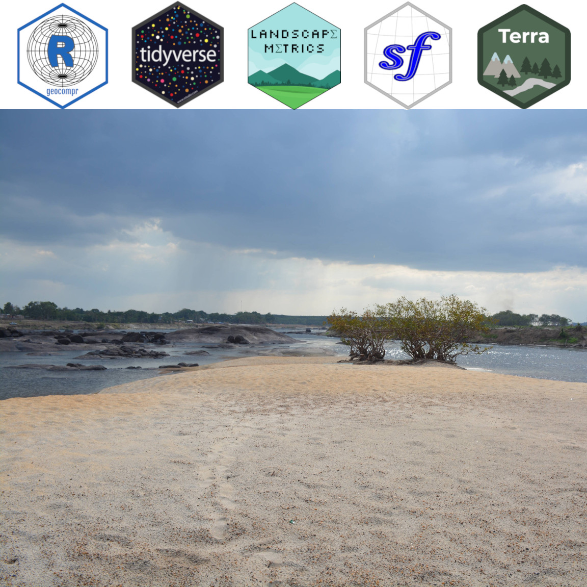
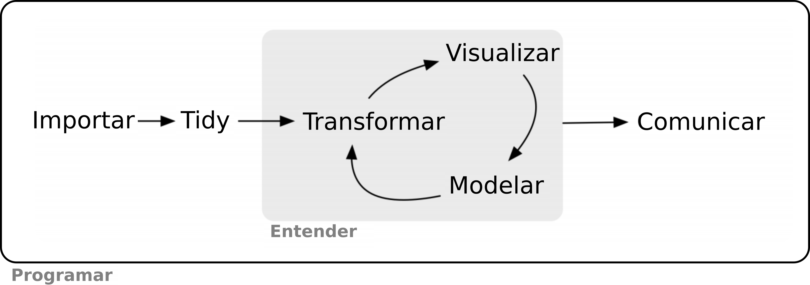
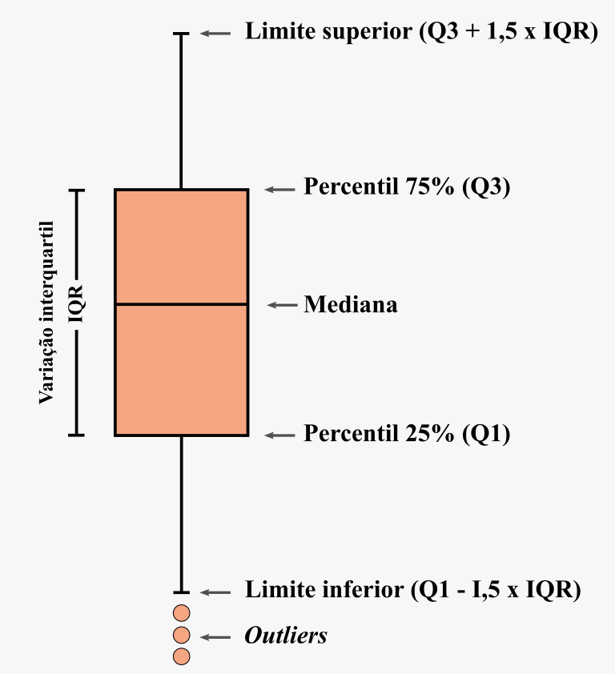

--- 
title: "Ecologia de Paisagens com R"
author: 'Darren Norris: darren.norris@unifap.br'
date: "`r Sys.setlocale('LC_TIME', 'Portuguese'); format(Sys.time(), '%d %B, %Y')`"
site: bookdown::bookdown_site
bibliography: references.bib
url: "https\\://darrennorris.github.io/epr/pref%C3%A1cio-%C3%A0-primeira-edi%C3%A7%C3%A3o.html/"
cover-image: cover.jpg
description: This is a minimal example.
github-repo: darrennorris/epr
toc-title: Sumário
urlcolor: blue
---

\newpage{}

# (PART) Apresentação {-}

# Bem-vindos {.unnumbered}




Este é um trabalho em andamento do 1ª edição:
**"Ecologia de Paisagens com R"**.

Versoes: 

-  web: https://darrennorris.github.io/epr/  

-  pdf: https://github.com/darrennorris/epr/blob/main/docs/epr.pdf

Este é um material introdutório destinado principalmente a estudantes de graduação e cursos de pós-graduação em ecologia e áreas correlatas.

O objetivo é de apresentar os capacidades e opções para desenvolver e integrar pesquisas na Ecologia da Paisagem no ambiente estatística de R.

Esperamos que ele seja utilizado tanto por quem quer se aprofundar em análises comumente utilizadas em Ecologia da Paisagem, mesmo por quem tem poucas habilidades quantitativas. 

O conteudo e organização dos capítulos esta separado em partes.

-   O primeiro parte é "Apresentação".    
o objetivo dessa parte é inclui os aspectos mais gerais sobre os componentes e da estrutura do livro e seus objetivos.

-   O segundo é "Escala e Padrões".    
Aqui, os capitulos inclui um breve introdução usando R para explorar alguns componentes chaves da Ecologia da Paisagem. 

-   A terceira é "Exemplos de caso".    
Aqui, os capítulos apresentam a aplicação de análises específicas e atualmente utilizadas em Ecologia da Paisagem.

-   A quarta parte do livro é chamada de "R e RStudio".    
Esta parte trata o funcionamento da linguagem R. Aqui, nós aprendemos desde como instalar o R e o RStudio até a manipulação e visualização de dados geoespaciais no R.

-   A parte final é "Encerramento".    
Aqui os capítulos apresentam a bibliografia, alguns apêndices (exemplos de código) e soluções dos exercícios dos capítulos anteriores.


## Agradecimentos {.unnumbered}

Este livro não é apenas o resulto dos autores. Mas é o resultado de muitas pessoas na comunidade R e Ecologia da Paisagem no Brasil.
Muito obrigado!

<!--chapter:end:index.Rmd-->


\newpage{}

# Prefácio à primeira edição {.unnumbered}

Há quem diga que a velocidade com que a tecnologia e a ciência avançam tende a tornar livros e manuais sobre métodos rapidamente obsoletos. A evolução dos computadores pessoais e a ampliação do acesso a estes e à Internet têm transformado o jeito como aprendemos e ensinamos. As pessoas estão cada vez mais familiarizados com a tecnologia e esperam que o ensino seja dinâmico e interativo.

Portanto, um livro aberto e disponível livremente, que as pessoas possam compartilhar e contribuir torna-se uma opção cada vez mais relevante. A intenção é para o livro seja utilizado como material de referência (fornecendo informações atualizadas); Como ferramenta de aprendizagem (apresentando diferentes ideias e abordagens) e como projeto de colaboração (permitindo que pessoas trabalhem juntos para criar um recurso educacional valioso).

<!--chapter:end:00-preface.Rmd-->


\newpage{}

# Introdução {.unnumbered}

Ecologia da Paisagem é uma disciplina empolgante que permite transformar dados brutos em compreensão, insight e conhecimento.

## O que você vai aprender {.unnumbered}
Ecologia da Paisagem é um campo vasto e não há como dominar tudo lendo um único livro.
Este livro visa fornecer uma base sólida nas ferramentas mais importantes e conhecimento suficiente para encontrar os recursos para aprender mais quando necessário. Um modelo das etapas de um projeto típico de Ecologia da Paisagem se parece com.....


Six key steps for functional landscape analyses of habitat
change https://doi.org/10.1007/s10980-020-01048-y 
- Acknowledge ecological theory and conceptual paradigms
- Evaluate the fit of available data
- Assess the three facets of the scale concept
- Recognize different sampling designs
- Use proper conceptual models
- Measure meaningful raster characteristics

## Como este livro está organizado {.unnumbered}
A descrição anterior das ferramentas da Ecologia da Paisagem é organizada aproximadamente de acordo com a ordem em que você as usa em uma análise (embora, é claro, você as itere várias vezes).
Em nossa experiência, no entanto, aprender a importar e organizar os dados primeiro não é o ideal, porque 80% do tempo é rotineiro e chato e, nos outros 20% do tempo, é estranho e frustrante.
Esse é um péssimo lugar para começar a aprender um novo assunto!
Em vez disso, começaremos com a visualização e transformação dos dados que já foram importados e organizados.
Dessa forma, quando você ingerir e organizar seus próprios dados, sua motivação permanecerá alta porque você sabe que a dor vale o esforço.

Dentro de cada capítulo, tentamos aderir a um padrão consistente: comece com alguns exemplos motivadores para que você possa ver o quadro geral e depois mergulhe nos detalhes.
Cada seção do livro é combinada com exercícios para ajudá-lo a praticar o que aprendeu.
Embora possa ser tentador pular os exercícios, não há melhor maneira de aprender do que praticar em problemas reais.

## O que você não vai aprender {.unnumbered}

Base teorica pra tras os conceitos e calculos. O foco é sobre a aplicação, e isso não preciso avanços teoricas. Incluimos referencias para que é possivel obter maior detalhes sobre os conceitos e teorias ecologicos e caluclos usados na Ecologia da Paisagem.

## Prerequisites {.unnumbered}
Fizemos algumas suposições sobre o que você já sabe para aproveitar ao máximo este livro.
Você deve ser geralmente alfabetizado numericamente, e com conhecimento previsa de ecologia, geoprocessamento e uso de sistemas de informação geografica.


Você precisa de quatro coisas para executar o código deste livro: R, RStudio, uma coleção de pacotes R chamada **tidyverse** e um punhado de outros pacotes.
Os pacotes são as unidades fundamentais do código R reproduzível.
Eles incluem funções reutilizáveis, documentação que descreve como usá-los e dados de amostra.

### R {.unnumbered}

Para fazer o download do R, acesse CRAN, a **c**omprehensive **R** **a**rchive **n**network, <https://cloud.r-project.org>.
Uma nova versão principal do R é lançada uma vez por ano e há 2 a 3 versões secundárias a cada ano.
É uma boa ideia atualizar regularmente.
A atualização pode ser um pouco complicada, especialmente para as versões principais que exigem a reinstalação de todos os seus pacotes, mas adiar só piora as coisas.
Recomendamos R 4.2.0 ou posterior para este livro.

### RStudio {.unnumbered}

RStudio é um ambiente de desenvolvimento integrado, ou IDE, para programação R, que você pode baixar em <https://posit.co/download/rstudio-desktop/>.
O RStudio é atualizado algumas vezes por ano e avisa automaticamente quando uma nova versão é lançada, para que não haja necessidade de verificar novamente.
É uma boa ideia atualizar regularmente para aproveitar os melhores e mais recentes recursos.
Para este livro, certifique-se de ter pelo menos o RStudio 2022.02.0.

### O universo arrumado - tidyverse {.unnumbered}

Você também precisará instalar alguns pacotes do R.
Um **pacote** do R é uma coleção de funções, dados e documentação que estende os recursos do R base.
O uso de pacotes é a chave para o uso bem-sucedido do R.
A maioria dos pacotes que você aprenderá neste livro faz parte do chamado tidyverse.
Todos os pacotes no tidyverse compartilham uma filosofia comum de programação de dados e R e são projetados para trabalhar juntos.

Você pode instalar o tidyverse completo com uma única linha de código:
```{r}
#| eval: false
install.packages("tidyverse")
```

No seu computador, digite essa linha de código no console e pressione enter para executá-lo.
R irá baixar os pacotes do CRAN e instalá-los em seu computador.

Você não poderá usar as funções, objetos ou arquivos de ajuda em um pacote até carregá-lo com `library()`.
Depois de instalar um pacote, você pode carregá-lo usando a função `library()`:

```{r}
#| eval: false
library(tidyverse)
```

Isso diz a você que o tidyverse carrega nove pacotes: dplyr, forcats, ggplot2, lubridate, purrr, readr, stringr, tibble, alignr.
Eles são considerados o **núcleo** do tidyverse porque você os usará em quase todas as análises.

Os pacotes no tidyverse mudam com bastante frequência.
Você pode ver se há atualizações disponíveis executando `tidyverse_update()`.

### Outros pacotes {.unnumbered}

Existem muitos outros pacotes excelentes que não fazem parte do tidyverse porque resolvem problemas em um domínio diferente ou são projetados com um conjunto diferente de princípios subjacentes.
Isso não os torna melhores ou piores, apenas diferentes.
Em outras palavras, o complemento do tidyverse não é o universo bagunçado, mas muitos outros universos de pacotes inter-relacionados.
Ao lidar com mais projetos de Ecologia da Paisagem com R, você aprenderá novos pacotes e novas formas de pensar sobre os dados.

Usaremos outras pacotes de fora do tidyverse neste livro.
Por exemplo, usaremos os seguintes pacotes porque eles fornecem conjuntos de funcões e dados interessantes para trabalharmos no processo de aprendizado de R:

```{r}
#| eval: false
install.packages(c("sp", "sf","raster", "mapview","tmap", 
                   "terra", "kableExtra", "landscapemetrics"))
```


## Codigo no livro {.unnumbered}


-   Objetivo não é de apresentar detalhes sobre os cálculos/métodos estatísticas ou os funções no [R](https://cran.r-project.org/). Existem diversos exemplos disponíveis ["Ciência de Dados com R--Introdução......":](https://cdr.ibpad.com.br/cdr-intro.pdf) e com google "r cran introdução tutorial"....... Alem disso, existem grupos de ajuda, como por exemplo: [R Brasil](https://www.facebook.com/groups/rbrasilprogramadores/) e [Stack Overflow em Português](https://pt.stackoverflow.com/questions/tagged/r)

-   O objetivo é de apresentar um livro mostrado os capacidades e opções para desenvolver e integrar pesquisas na ecologia da paisagem no ambiente estatística de [R](https://cran.r-project.org/)

Obviamente, todas as tarefas de geoprocessamento podem ser desenvolvidas anteriormente em um SIG ([QGIS](https://docs.qgis.org/3.22/pt_BR/docs/training_manual/)). Então porque use R? R tem a capacidade (baseada em codigo) para alternar entre tarefas de processamento, modelagem e visualização de dados geográficos e não geográficos. Alem disso, como é possível importar, modificar, analisar e visualizar dados espaciais no mesmo ambiente com script/codigo, o R permite fluxos de trabalho transparentes e reproduzíveis ([A Ciência Aberta](https://foster.gitbook.io/manual-de-formacao-em-ciencia-aberta/02introducaoacienciaaberta/01conceito_e_principios_da_ciencia_aberta)).

Aliás, atualmente a grande maioria dos artigos científicos publicados na revista [Landscape Ecology](https://www.springer.com/journal/10980/) incluir análises usando R.

\newpage

### Organização do codigo no livro {.unnumbered}

O capitulo está organizado em etapas de processamento, com blocos de código em caixas cinzas:

```{r, eval=FALSE}
codigo de R para executar
```

Para segue os passos, os blocos de código precisam ser executados em sequência. Se você pular uma etapa, ou rodar fora de sequência o próximo bloco de código provavelmente não funcionará.

As linhas de codigo de R dentro de cada caixa tambem preciso ser executados em sequência. O simbolo `r kableExtra::text_spec("#", bold = TRUE)` é usado para incluir comentarios sobre os passos no codgio (ou seja, linhas começando com `r kableExtra::text_spec("#", bold = TRUE)` não é codigo de executar).

```{r, eval=FALSE}
# Passo 1
codigo de R passo 1 # texto e numeros tem cores diferentes
# Passo 2
codigo de R passo 2
# Passo 3
codigo de R passo 3
```

Alem disso, os simbolos `r kableExtra::text_spec("#>", bold = TRUE)` e/ou `r kableExtra::text_spec("[1]", bold = TRUE)` no início de uma linha indica o resultado que você verá no console de R.

```{r, echo=TRUE, results='asis', evaluate = TRUE, collapse = TRUE}
# Passo 1
1+1

# Passo 2
x <- 1 + 1
# Passo 3
x

# Passo 4
x + 1

```


<!--chapter:end:00-intro.Rmd-->

---
bibliography: references.bib
---

\newpage{}

# (PART) Escala e padrões {-}

\newpage{}

# Escala

## Apresentação

Nesta capitulo vamos entender a importância de escala na ecologia da paisagem através cálculos com a proporção de floresta. Durante o capitulo você aprenderá a

1.  Alterar escala (resolução e extensão espacial),\
2.  Calcular a área de uma classe de habitat,\
3.  Desenvolve uma comparação multiescala.

<br> É muito importante ficar claro para você o que é escala (e o que não é!), e qual a importância desse conceito na elaboração do desenho amostral, na coleta de dados, nas análises e na tomada de decisão. Nesse tutorial usaremos conteudo baseado no Capítulo 2 do livro [Spatial Ecology and Conservation Modeling](https://doi.org/10.1007/978-3-030-01989-1) [@fletcher2018] e ["Tutorial Escala"](https://www.needs.ufscar.br/tutorial_escala.pdf) do Dr. Alexandre Martensen.

## Escala: breve definação

Todos os processos e padrões ecológicos têm uma dimensão temporal e espacial. Assim sendo, o conceito de <b>escala</b> não somente representar essas dimensões, mas também, ajudar nos apresentá-los de uma forma que facilite o entendimento sobre os processos e padrões sendo estudados.

Na ecologia o termo escala refere-se à dimensão ou domínio espaço-temporal de um processo ou padrão. Na ecologia da paisagem, a escala é frequentemente descrita por sua componentes: resolução e extensão.

-   **Resolução**: menor unidade espacial de medida para um padrão ou processo.
-   **Extensão**: descreve o comprimento ou tamanho de área sob investigação.

Resolução e extensão tendem a covariar -- estudos com maior extensão tendem a ter resolução maiores também. Parte dessa covariância é prática: é difícil trabalhar em grandes extensões com dados coletados em tamanhos de resolução finos. No entanto, parte dessa covariância também é conceitual: muitas vezes em grandes extensões, podemos esperar que processos operando em resolução muito finos forneçam somente "ruído" e não dados/informações relevantes sobre os sistemas. Como os desafios computacionais diminuíram e a disponibilidade de dados de alta resolução aumentou, a covariância entre resolução e extensão nas investigações diminuiu.

Lembrando, na primeira aula, vimos que a escala espacial pode ser interpretada com base em três dimensoes:

-   no fenômeno de interesse;
-   na amostragem que ocorre; 

e/ou

-   na análise

Para que a Ecologia da Paisagem gere evidências científicas robustas e úteis, a escala nas três dimensões deve ser consistente e apropriada para o estudo. Aqui nos concentramos na dimensão “análise”, e aprendemos como a escala espacial pode ser alterada e representada em modelos ecológicos.


\newpage

## Pacotes e dados

Em geral é necessário baixar alguns pacotes para que possamos fazer as nossas análises. Neste caso precisamos os seguintes pacotes, que deve esta instalado antes:

-   [tidyverse](https://www.tidyverse.org/),
-   [sf](https://r-spatial.github.io/sf/),
-   [terra](https://rspatial.org/pkg/1-introduction.html),
-   [mapview](https://r-spatial.github.io/mapview/),
-   [tmap](https://r-tmap.github.io/tmap-book/).

### Pacotes

No R, carregar os pacotes necessarios com o codigo:

```{r escala-packages, message=FALSE, warning=FALSE}
library(tidyverse)
library(sf)
library(terra)
library(mapview)
library(tmap)
library(eprdados)
```

Caso os pacotes não tenham sido instalados, o R vai avisar atraves um mensagem tipo: `r kableExtra::text_spec("Error in library(nomepacote)  there is no package called nomepacote", color = "red")`. Neste caso, para instalá-los consulte o capitulos aqui [Capitulo 4 instalação de pacotes](https://livro.curso-r.com/4-1-instala%C3%A7%C3%A3o-de-pacotes.html) e aqui [Capitulo 4 pacotes](https://analises-ecologicas.com/cap4#pacotes-1) .

\newpage

### Dados

Vamos olhar um exemplo do mundo real. Uma pequena amostra do Rio Araguari, perto de Porto Grande. O ponto central é de longitude: -51.406312 latitude: 0.726236. Para visualizar o ponto no Google Earth: https://earthengine.google.com/timelapse#v=0.72154,-51.41543,11.8,latLng&t=2.24&ps=25&bt=19840101&et=20201231&startDwell=0&endDwell=0 .

Vammos trabalhar com os dados de [MapBiomas](https://mapbiomas.org/), que produz mapeamento anual da cobertura e uso da terra no Brasil desde 1985. Os dados de MapBiomas vem no formato de raster, que tem uma  classificação da terra feito a partir da classificação pixel a pixel de imagens das satélites Landsat. Todo processo é feito com algoritmos de aprendizagem de máquina (machine learning) através da plataforma Google Earth Engine, que oferece imensa capacidade de processamento na nuvem. Mais detalhes sobre a metodologia aqui: [Metodologia MapBiomas](https://brasil.mapbiomas.org/visao-geral-da-metodologia/). 


Para carregar um arquivo raster trabalhamos com o pacote [terra](https://CRAN.R-project.org/package=terra). O pacote tem varios funçoes para a análise e modelagem de dados geográficos. Nós podemos ler os dados de cobertura da terra no arquivo ".tif" com a função `rast`.

```{r load-ramostra, eval=TRUE, echo=TRUE, message=FALSE, warning=FALSE}
# arquivo no pacote "eprdados"
arquivo <- system.file("raster/amostra_mapbiomas_2020.tif", 
                       package = "eprdados")
# carregar
ramostra <- rast(arquivo)
```


Plotar para verificar.


```{r plot-ramostra, fig.width = 4, fig.height = 2.5, fig.cap = "Mapbiomas 2020. Uma pequena amostra do Rio Araguari, perto de Porto Grande."}
plot(ramostra)
```

Podemos também verificar informações sobre o raster (metadados) - simplesmente rodar o nome do objeto:

```{r run-name}
ramostra
```

Isso nos mostra informações sobre escala espacial (resolução e extensão) e a sistema de coordenadas (SIRGAS 2000 / UTM zone 22N , [EPSG:31976](https://epsg.io/31976)). Além disso é possível obter informações específicas através de funções específicas.

```{r get-raster-info, eval= FALSE, echo = TRUE}
# Obter informações sobre escala espacial
# resolução, comprimento e largura do pixel em metros
res(ramostra)
# numero de colunas
ncol(ramostra)
# numero de linhas
nrow(ramostra)

```


#### Pergunta 1

`r kableExtra::text_spec(enc2utf8("Sobre o objeto ramostra. Com base nos resultados obtidos, qual o área do pixel em metros quadrados? Qual o área total da paisagem em hectares e quilometros quadrados?"), color = "blue", bold = TRUE)`

------------------------------------------------------------------------

\newpage

Olhando a mapa (Figura \@ref(fig:plot-ramostra)), existem três classes com valores de 3, 12 e 33. O objetivo principal não é de fazer mapas, mas, a visualização dos dados é um passo importante para verificar e entender os padrões. Portanto, segue exemplo mostrando uma forma de visualizar o arquivo de raster como mapa.

Para entender o que os valores (3, 12, 33) representam no mundo real precisamos de uma referência (legenda). Para a MapBiomas Coleção 6, arquivo: [Cod_Class_legenda_Col6_MapBiomas_BR.pdf](https://mapbiomas-br-site.s3.amazonaws.com/downloads/Colecction%206/Cod_Class_legenda_Col6_MapBiomas_BR.pdf). Existe também arquivos para fazer as mapas com cores corretas em [QGIS](https://mapbiomas-br-site.s3.amazonaws.com/downloads/Colecction%206/MapBiomas_Col6_classes_colors.qml) ou [ArcGIS](https://mapbiomas-br-site.s3.amazonaws.com/downloads/Colecction%206/Legenda_Col6_MapBiomas.lyr).

Olhando a legenda ([Cod_Class_legenda_Col6_MapBiomas_BR.pdf](https://mapbiomas-br-site.s3.amazonaws.com/downloads/Colecction%206/Cod_Class_legenda_Col6_MapBiomas_BR.pdf)), sabemos que "3", "12" e "33" representem cobertura de "Formação Florestal", "Formação Campestre", e "Rio, Lago e Oceano". Então podemos fazer um mapa mostrando tais informações.

Daqui pra frente vamos aproveitar uma forma mais elegante de apresentar mapas e gráficos. Isso seria atraves funçoes em 2 pacotes:

-   [tmap](https://cran.r-project.org/web/packages/tmap/vignettes/tmap-getstarted.html) é utilizado para gerar mapas temáticos

-   [ggplot2](https://ggplot2.tidyverse.org/), que faz parte do "tidyverse", e é utilizado para produção de gráficos, e pode representar dados geoespacias. 


Exemplos : 
[Pacotes ggplot2 e tmap](https://www.youtube.com/watch?v=OYON-VzPFmw )

Mais exemplos sobre o uso de [ggplot2](https://ggplot2.tidyverse.org/) no [R cookbook](http://www.cookbook-r.com/Graphs/) : http://www.cookbook-r.com/Graphs/ .

E com mais exemplos de mapas e dados espaciais no R: [sf e ggplot2](https://www.r-spatial.org/r/2018/10/25/ggplot2-sf.html) : https://www.r-spatial.org/r/2018/10/25/ggplot2-sf.html

[Capitulo 9](https://geocompr.robinlovelace.net/adv-map.html) no livro [Geocomputation with R](https://geocompr.robinlovelace.net/) : https://geocompr.robinlovelace.net/adv-map.html

Primeiramente precisamos incluir as informações relevantes da legenda. Ou seja, incluir os nomes para cada valor de classe.

```{r legenda-amostra}
# legenda e cores na sequencia correta
classe_valor <- c(3, 12, 33)
classe_legenda <- c("Formação Florestal", 
                   "Formação Campestre", "Rio, Lago e Oceano")
classe_cores <- c("#006400", "#B8AF4F", "#0000FF") 
```

Agora podemos fazer o mapa com as classes e os cores seguindo o padrão recomendado pela MapBiomas para Coleção 6.

```{r mapa-mapbiomas-cores, fig.cap = "Paisagem com valores e classes de cobertura da terra. Mapbiomas 2020. Uma pequena amostra do Rio Araguari, perto de Porto Grande."}

tm_shape(ramostra) + 
  tm_raster(style = "cat", 
            palette = c("3" = "#006400", "12" ="#B8AF4F", 
                        "33"= "#0000FF"), legend.show = FALSE) + 
  tm_grid(labels.format = list(big.mark = "")) +
  tm_add_legend(type = "fill", labels = classe_legenda,
    col = classe_cores, title = "Classe") + 
tm_compass(position = c("right", "bottom")) +
tm_scale_bar(breaks = c(0, 0.05, 0.1), text.size = 1, 
             text.color = "white", position=c("right", "bottom")) + 
tm_layout(legend.position = c("right","top"),legend.bg.color = "white")


```

\newpage

## Alterando a resolução

Alterando a resolução serve como exemplo mostrando como os passos/etapas/cálculos mude dependendo o tipo de dados. Ou seja, é preciso adotar metodologias diferentes para dados categóricos (por exemplo classificação de cobertura da terra) e dados contínuos (por exemplo distância até rio).

Alterando a resolução às vezes seria necessário, por exemplo, quando preciso padronizar dados/imagens oriundos de fontes diferentes com resoluções diferentes e/ou para reduzir a complexidade da modelagem. Lembrando - em cada nível de resolução, são observáveis processos e padrões que não podem necessariamente ser inferidos daqueles abaixo ou acima.

Agora iremos degradar a resolução desses dados, ou seja, iremos alterar o tamanho dos pixels. Como exemplo, iremos juntar (agregar) 3 pixels em um único pixel. Como você acha que podemos fazer isso? Quais valores esse pixel que vai substituir os 3 originais deve ter? Existem diversas maneiras de se fazer isso, como por exemplo através a média ou valor modal (valor mais comum). O valor mais comum da área, é particularmente adequado quando temos um mapa categórico, como por exemplo a classificação do MapBiomas. Segue exemplo de codigo para agregar com a média e o valor mais frequente (modal).

```{r}
# Média
ramostra_media <- aggregate(ramostra, fact=3, fun="mean")
ramostra_media <- resample(ramostra, ramostra_media)

# Modal
ramostra_modal <- aggregate(ramostra, fact=3, fun="modal")
ramostra_modal <- resample(ramostra, ramostra_modal, method="near")
```


#### Pergunta 2

`r kableExtra::text_spec("Utilizando as funções disponíveis no pacote tmap, crie mapas temáticos dos objetos ramostra_media e ramostra_modal. Inclua cópias do seu código e mapas na sua resposta. Você pode usar o printscreen para mostrar o RStudio com seu código e mapas.", color = "blue", bold = TRUE)`

------------------------------------------------------------------------

\newpage


Visualizar os resultados apresentados em Figura 1.4. Os valores calculados pela média não fazem sentido para uma classificação categórica.
Os valores calculados pela modal são consistentes com o original e fazem sentido.

\newpage

Em cada nível de resolução, são observáveis processos e padrões que não podem necessariamente ser inferidos daqueles abaixo ou acima. Aqui por exemplo, mudamos a proporção de cobertura florestal em nossa pequeno paisagem quando juntamos 3 pixels em um único: a proporção de floresta moudou de 4% (3/72) para 11% (1/9). Ou seja, com cada passo mudamos a representção do mundo.

```{r fig-mud-agg, echo=FALSE, message=FALSE, warning=FALSE, dpi = 300, fig.width = 9, fig.height = 5,  fig.cap = "Mudanças causadas pela agregação."}
bind_rows(as.polygons(ramostra, dissolve = FALSE) %>% 
  st_as_sf() %>% mutate(type = "original"), 
  as.polygons(ramostra_media, dissolve = FALSE) %>% 
     st_as_sf() %>% mutate(type = "media", 
                           mapbiomas_2020 = round(mapbiomas_2020,1)),
  as.polygons(ramostra_modal, dissolve = FALSE) %>% 
     st_as_sf() %>% mutate(type = "modal")) -> sf_grids
#class values
classe_valor_all <- c(3, 12, 14.3, 23.5, 23.8, 30, 31.3, 32.1, 32.5, 32.6, 33)
class_val_grey <- c("grey95", "grey90", "grey85", "grey80", "grey75", 
                    "grey70", "grey65", "grey60")
classe_cores_all <- c("#006400","#B8AF4F", class_val_grey,  "#0000FF") 

sf_grids %>% 
  ggplot() + 
  geom_sf(aes(fill = factor(mapbiomas_2020))) + 
  scale_fill_manual("classe", values = classe_cores_all) +
  scale_x_continuous(breaks = c(-51.4075, -51.4065, -51.4055)) +
  facet_wrap(~type) + 
  theme(legend.position="top") + 
  guides(fill=guide_legend(nrow=2,byrow=TRUE))

```

#### Pergunta 3

`r kableExtra::text_spec("Confira o codigo e os resultados obtidos anteriormente, quando mudamos a resolução da ratser ramostra (por exemplo figura 1.4). Explique o que aconteceu. Como e porque moudou os valores em cada caso (média e modal)?", color = "blue", bold = TRUE)`

------------------------------------------------------------------------

\newpage

## Escala espacial e desenho amostral


```{r buffer-figure, echo = FALSE, message = FALSE, warning = FALSE, out.width = "60%", out.height = "60%", fig.cap = "A cobertura florestal ao redor de um ponto de amostragem pode variar em escalas diferentes. Para entender essas variações, podemos criar buffers circulares de diferentes extensões ao redor dos pontos de amostragem. Esses buffers representam áreas de diferentes tamanhos ao redor de cada ponto. Quantificando a quantidade de floresta que ocorre em cada buffer, podemos obter uma visão geral da escala em que a cobertura florestal muda ao redor dos pontos de amostragem. Por exemplo, podemos descobrir que a cobertura florestal é mais alta dentro de um buffer de 5 km do que em um buffer de 10 km."}

rio_pontos_31976 <- st_transform(rio_pontos, 31976)
# 1000 m
rio_pontos_31976_b1000 <- st_buffer(rio_pontos_31976[1, ], dist = 1000)
# 2000 m
rio_pontos_31976_b2000 <- st_buffer(rio_pontos_31976[1, ], dist = 2000)
# 4000 m
rio_pontos_31976_b4000 <- st_buffer(rio_pontos_31976[1, ], dist = 4000)
# 8000 m
rio_pontos_31976_b8000 <- st_buffer(rio_pontos_31976[1, ], dist = 8000)
# 16000 m
rio_pontos_31976_b16000 <- st_buffer(rio_pontos_31976[1, ], dist = 16000)

meuSIGr <- system.file("raster/utm_cover_AP_rio_2020.tif", 
                       package = "eprdados")
# carregar
mapbiomas_2020 <- rast(meuSIGr)
floresta_2020 <- mapbiomas_2020
# Com valor de 0
values(floresta_2020) <- 0
# Atualizar categorias florestais agrupados com valor de 1
floresta_2020[mapbiomas_2020 == 3 | mapbiomas_2020 == 4] <- 1

buffer.forest1.16000m <- crop(floresta_2020, rio_pontos_31976_b16000)
buffer.forest1.16000m <- mask(buffer.forest1.16000m, rio_pontos_31976_b16000)

#fig all together
line_col <- "black"
fig_together <- tm_shape(buffer.forest1.16000m) +
  tm_raster(style = "cat", 
            palette = c("0" = "#E974ED", 
                        "1" ="#129912"), legend.show = FALSE) + 
  tm_shape(rio_pontos_31976[1, ]) + 
    tm_symbols(shape =21, col = "yellow", 
            border.col = "black", border.lwd = 0.2, size=0.5) + 
  tm_shape(rio_pontos_31976_b1000) +
    tm_borders(col = line_col, lwd = 4, lty = "dashed") + 
  tm_shape(rio_pontos_31976_b2000) +
    tm_borders(col = line_col, lwd = 4, lty = "dashed") + 
  tm_shape(rio_pontos_31976_b4000) +
    tm_borders(col = line_col, lwd = 4, lty = "dashed") + 
  tm_shape(rio_pontos_31976_b8000) +
    tm_borders(col = line_col, lwd = 4, lty = "dashed") + 
  tm_shape(rio_pontos_31976_b16000) +
    tm_borders(col = line_col, lwd = 4, lty = "dashed") + 
  tm_add_legend(type = "fill", 
    labels = c("não-floresta", "floresta"),
    col = c("#E974ED", "#129912"),
    title = "Classe") + 
tm_scale_bar(breaks = c(0, 2, 4), text.size = 1, 
             position=c("left", "bottom")) +
tm_layout(legend.position = c("right","top"),
          legend.bg.color = "white")
fig_together

```


Dado o papel que a escala pode desempenhar em nossa compreensão dos padrões e processos ecológicos, como escala deve ser considerada no desenho do estudo? Claramente, a resposta a esta pergunta irá variar dependendo dos fenômenos de interesse, mas ecologistas e estatísticos têm forneceu algumas orientações importantes. As questões-chave incluem o tamanho da unidade de amostragem (resoloção), o tipo de unidade de amostra e localizações da unidade de amostra, incluindo o espacamento entre as amostras (distância entre as amostras) e o tamanho da área de estudo.

Com a disponibilidade de imagens de satélite é possível responder questões importantes relacionadas ao desenho do estudo antes de qualquer trabalho de campo. Uma tecnica de geoprocessamento (bordas - [Buffers](https://docs.qgis.org/3.16/pt_BR/docs/gentle_gis_introduction/vector_spatial_analysis_buffers.html)) é um dos mais frequentemente adotados para quantificar escala espacial na ecologia da paisagem.

O objetivo é criar buffers circulares de diferentes extensões ao redor dos sitios de amostragem (pontos, pixels, manchas, transetos lineares etc). Aqui, vamos entender a escala em que a cobertura de floresta muda ao redor dos rios. Para isso, quantificamos a quantidade de floresta que ocorre em várias distâncias em pontos ao longo dos rios a montante das hidrelétricas no Rio Araguari. Para ilustrar esta abordagem geral, usamos o banco de dados MapBiomas Coleção 6 de 2020, e vincule esses dados de cobertura da terra aos pontos de amostragem em rios.

### Obter e carregar dados (vectores)

Antes de quantificar a quantidade de floresta, precisamos carregar os dados de rios e pontos de amostragem.
O formato de vector é diferente de "tif" (raster), portanto o processo de importação é diferente. 
Aqui, nós só precisamos de duas dessas camadas, ambos do pacote 'eprdados': "rio_linhacentral" e "rio_pontos".
A primeira camada de dados contém o eixo central de 260 km de rios a montante da Barragem Cachoeira Caldeirão. Os dados foram obtidos a partir de registros de trajetória GPS durante levantamentos de barco. Os rios foram divididos em 52 seções, cada uma com aproximadamente 5 km de extensão. A segunda camada de dados, "rio_pontos", contém 52 pontos espaçados regularmente ao longo dos rios. Cada ponto está localizado a aproximadamente 5 km de distância do ponto anterior. 

\newpage

### Visualizar os arquivos (camadas vector)

Visualizar para verificar. Mapa com ambos a linha central e pontos de rios em trechos de 5km.

```{r map-pontod-rio, fig.width = 6, fig.height = 4, fig.cap = "Pontos ao longo dos rios a montante das hidrelétricas no Rio Araguari."}
ggplot(rio_linhacentral) +
  geom_sf(aes(color=rio)) +
  geom_sf(data = rio_pontos, shape=21, aes(fill=zone))
```

<br> Mapa interativo (funcione somente com internet) Mostrando agora com fundo de mapas "base" (OpenStreetMap/ESRI etc)

```{r fig.width=4, fig.height=4, echo=TRUE, warning=FALSE, fig.cap="Linhas dos rios a montante das hidrelétricas no Rio Araguari."}
#
mapview(rio_linhacentral, zcol = "rio") 

```

<br>

\newpage

### Obter e carregar dados (raster)

```{r echo=FALSE, eval=TRUE, message=FALSE, warning=FALSE}
meuSIGr <- system.file("raster/utm_cover_AP_rio_2020.tif", 
                       package = "eprdados")
fs2 <- file.size(meuSIGr)/(1024^2)
mapbiomas_2020 <- rast(meuSIGr)
```

Mais uma vez vamos aproveitar os dados de MapBiomas. Agora um arquivo raster com cobertura de terra no entorno dos rios em 2020, (formato ".tif", tamanho `r round(fs2,1)` MB).O código abaixo vai carregar os dados e criar o objeto "mapbiomas_2020":

```{r echo=TRUE, eval=FALSE}
meuSIGr <- system.file("raster/utm_cover_AP_rio_2020.tif", 
                       package = "eprdados")
# carregar
mapbiomas_2020 <- rast(meuSIGr)
```


### Visualizar os arquivos (camadas raster e vector)

Visualizar para verificar. É possível de visualizar varios camadas de raster e vetor juntos com funcões no pacote tmap (https://r-tmap.github.io/tmap-book/index.html).

```{r fig.width = 5, fig.height = 5, warning = FALSE, message = FALSE, fig.cap =" Cobertura da terra ao redor do Rio Araguari em 2020. Mostrando os pontos de amostragem (pontos amarelas) cada 5 quilômetros ao longo do rio."}
# Passo necessario para agilizar o processamento
mapbiomas_2020_modal <- aggregate(mapbiomas_2020, 
                                  fact = 10, 
                                  fun = "modal")
# Plot
tm_shape(mapbiomas_2020_modal) +
  tm_raster(title = "Classe", style = "cat", palette = "Set3") + 
tm_shape(rio_linhacentral) + 
  tm_lines(col="blue") + 
tm_shape(rio_pontos) + 
  tm_dots(size = 0.2, col = "yellow") + 
tm_compass(position=c("left", "top")) +
tm_scale_bar(breaks = c(0, 25, 50), text.size = 1, 
             position=c("left", "bottom")) +
tm_layout(legend.position = c("right","top"), legend.bg.color="white")
```

<br>

\newpage

### Reclassificação

<br>

Para simplificar nossa avaliação de escala, reclassificamos a camada mapbiomas_2020 em uma camada binária de floresta/não-floresta. Essa tarefa de geoprocessamento pode ser realizada anteriormente usando SIG ([QGIS](https://docs.qgis.org/3.22/pt_BR/docs/training_manual/rasters/terrain_analysis.html#moderate-fa-reclassifying-the-raster)). Aqui vamos reclassificar as categorias de cobertura da terra (agrupando diferentes áreas de cobertura florestal tipos) usando alguns comandos genéricos do R para criar uma nova camada com a cobertura de floresta em toda a região de estudo. Para isso, criamos um mapa do mesmo resolução e extensão, e então podemos redefinir os valores do mapa. Neste caso, queremos agrupar a cobertura da terra categorias 3 e 4 (Formação Florestal e Formação Savânica, respectivamente).

```{r reclass-example, eval = FALSE, echo = TRUE, message = FALSE, warning = FALSE}
# criar uma nova camada de floresta
floresta_2020 <- mapbiomas_2020
# Com valor de 0
values(floresta_2020) <- 0
# Atualizar categorias florestais agrupados com valor de 1
floresta_2020[mapbiomas_2020 == 3 | mapbiomas_2020 == 4] <- 1 
```

\newpage

Vizualizar para verificar.

```{r, fig.width = 5, fig.height = 5, fig.cap = "Floresta ao redor do Rio Araguari. MapBiomas 2020 reclassificado em floresta e não-floresta. Mostrando os pontos de amostragem (pontos amarelas) cada 5 quilômetros ao longo do rio."}
# Passo necessario para agilizar o processamento
floresta_2020_modal <- aggregate(floresta_2020, 
                                 fact=10, 
                                 fun="modal")
# Plot
tm_shape(floresta_2020_modal) +
  tm_raster(style = "cat", 
            palette = c("0" = "#E974ED", "1" ="#129912"), legend.show = FALSE) + 
  tm_add_legend(type = "fill", labels = c("não-floresta", "floresta"),
    col = c("#E974ED", "#129912"), title = "Classe") +
tm_shape(rio_linhacentral) + 
  tm_lines(col="blue") + 
tm_shape(rio_pontos) + 
  tm_dots(size = 0.2, col = "yellow") + 
tm_scale_bar(breaks = c(0, 25, 50), text.size = 1, 
             text.color = "white", position=c("left", "bottom")) +
tm_layout(legend.position = c("right","top"),legend.bg.color = "white")
```

<P style="page-break-before: always">

## Comparação multiescala

Em seguida, com as coordenadas dos pontos de amostragem, podemos calcular a quantidade de floresta que circunda cada local de amostragem em diferentes extensões. Primeiramente, vamos fazer so para um ponto, assim para entender o processo e os passos melhor.

```{r}
rio_pontos_31976 <- st_transform(rio_pontos, 31976) 
# Buffer
rio_pontos_31976_b1000 <- st_buffer(rio_pontos_31976[1, ], dist = 1000)

# Recorte com buffer de 1000 metros (mudando a extensão).
buffer.forest1.1km <- crop(floresta_2020, snap="out", rio_pontos_31976_b1000)
# Máscara para que os pixels fora do polígono sejam nulos.
buffer.forest1.1km <- mask(buffer.forest1.1km, rio_pontos_31976_b1000, touches=TRUE)
names(buffer.forest1.1km) <- "forest_2020_1km"

```

\newpage

Vizualizar para verificar.

```{r fig.width=3, fig.height=3, fig.cap="Ilustração da determinação da quantidade de habitat ao redor de um ponto. Para um determinada extensão, o habitat de interesse é isolado. Um buffer (linha tracejada) é colocado ao redor de um ponto (amarela) e o número de células (pixels) que contém o habitat é somado e multiplicado pela área de cada pixel."}
# Plot
tm_shape(buffer.forest1.1km) +
  tm_raster(style = "cat", 
            palette = c("0" = "#E974ED", 
                        "1" ="#129912"), legend.show = FALSE) + 
tm_shape(rio_pontos_31976[1, ]) + 
  tm_symbols(shape =21, col = "yellow", 
            border.col = "black", border.lwd = 0.2, size=0.5) + 
tm_shape(rio_pontos_31976_b1000) +
  tm_borders(col = "black", lwd = 4, lty = "dashed") + 
tm_add_legend(type = "fill",  labels = c("não-floresta", "floresta"),
    col = c("#E974ED", "#129912"), title = "Classe") + 
tm_compass(position=c("left", "top")) +
tm_scale_bar(breaks = c(0, 0.5, 1), text.size = 1, 
             position=c("left", "bottom")) +
tm_layout(legend.position = c("right","top"), legend.bg.color = "white")
```

### Pergunta 4

`r kableExtra::text_spec("Qual é a extensão em número de pixels desse recorte (buffer.forest1.1km)?", color = "blue", bold = TRUE)`

------------------------------------------------------------------------


\newpage


Temos valores de 0 (não-floresta) e 1 (floresta). Então, para saber a aréa de floresta podemos somar o número de células (pixels) que contém o habitat e multiplica pela área de cada pixel conforme o codigo:

```{r}
# 1) Somatório. 
# No caso igual o numero de pixels de floresta. 
# Para todo a paisagem, somatorio "global".
# Não deve incluir pixels nulos, então use "na.rm = TRUE".
soma_floresta <- global(buffer.forest1.1km, "sum", na.rm = TRUE) 
soma_floresta

# 2) Área de cada pixel.
# Sabemos o sistema de coordenadas (EPSG = 31976).
# EPSG 31976 é uma sistema projetado com unidade em metros.
buffer.forest1.1km

# Portanto, o tamanho de cada pixel é igual.
area_pixel_m2 <- 29.89281 * 29.89281
area_pixel_m2

# 3) Calculos de aréa.
# Aréa de floresta m2
area_floresta_m2 <- soma_floresta * area_pixel_m2
area_floresta_m2
# Aréa de floresta hectares
area_floresta_ha <- area_floresta_m2 / 10000
area_floresta_ha
  
```

\newpage

Para uma comparação multiescala, vamos repetir o mesmo processo, mas agora com distancias de 250, 500, 1000, 2000 e 4000 metros, doubrando a escala (extensão) em cada passo.

```{r mapa-exte-pontos, echo=FALSE, fig.width = 15, fig.height = 5, dpi = 300, fig.cap="Cobertura florestal em extensões diferentes ao redor de um local de amostragem."}
rio_pontos_31976 <- st_transform(rio_pontos, 31976) 
#250 m
rio_pontos_31976_b250 <- st_buffer(rio_pontos_31976[1, ], dist = 250)
buffer.forest1.250m <- crop(floresta_2020, rio_pontos_31976_b250, snap="out")
buffer.forest1.250m <- mask(buffer.forest1.250m, rio_pontos_31976_b250, touches=TRUE)
# 500 m
rio_pontos_31976_b500 <- st_buffer(rio_pontos_31976[1, ], dist = 500)
buffer.forest1.500m <- crop(floresta_2020, snap="out", rio_pontos_31976_b500)
buffer.forest1.500m <- mask(buffer.forest1.500m, touches=TRUE, rio_pontos_31976_b500)
# 1000 m
rio_pontos_31976_b1000 <- st_buffer(rio_pontos_31976[1, ], dist = 1000)
buffer.forest1.1km <- crop(floresta_2020, rio_pontos_31976_b1000)
buffer.forest1.1km <- mask(buffer.forest1.1km, rio_pontos_31976_b1000)
# 2000 m
rio_pontos_31976_b2000 <- st_buffer(rio_pontos_31976[1, ], dist = 2000)
buffer.forest1.2000m <- crop(floresta_2020, rio_pontos_31976_b2000)
buffer.forest1.2000m <- mask(buffer.forest1.2000m, rio_pontos_31976_b2000)
# 4000 m
rio_pontos_31976_b4000 <- st_buffer(rio_pontos_31976[1, ], dist = 4000)
buffer.forest1.4000m <- crop(floresta_2020, rio_pontos_31976_b4000)
buffer.forest1.4000m <- mask(buffer.forest1.4000m, rio_pontos_31976_b4000)
#fig 250
fig_250m <- tm_shape(buffer.forest1.250m) +
  tm_raster(style = "cat", 
            palette = c("0" = "#E974ED", 
                        "1" ="#129912"), legend.show = FALSE) + 
  tm_shape(rio_pontos_31976[1, ]) + 
  tm_symbols(shape =21, col = "yellow", 
            border.col = "black", border.lwd = 0.2, size=0.5) + 
  tm_shape(rio_pontos_31976_b250) +
  tm_borders(col = "black", lwd = 4, lty = "dashed") + 
  tm_add_legend(type = "fill", 
    labels = c("não-floresta", "floresta"),
    col = c("#E974ED", "#129912"),
    title = "Classe") + 
tm_scale_bar(breaks = c(0, 0.125, 0.25), text.size = 1, position=c("left", "bottom")) +
tm_layout(title = "raio = 250 m", 
          legend.position = c("right","top"),
          legend.bg.color = "white")
# fig 500 m
fig_500m <- tm_shape(buffer.forest1.500m) +
  tm_raster(style = "cat", 
            palette = c("0" = "#E974ED", 
                        "1" ="#129912"), legend.show = FALSE) + 
  tm_shape(rio_pontos_31976[1, ]) + 
  tm_symbols(shape =21, col = "yellow", 
            border.col = "black", border.lwd = 0.2, size=0.5) + 
  tm_shape(rio_pontos_31976_b500) +
  tm_borders(col = "black", lwd = 4, lty = "dashed") + 
  tm_add_legend(type = "fill", 
    labels = c("não-floresta", "floresta"),
    col = c("#E974ED", "#129912"),
    title = "Classe") + 
tm_scale_bar(breaks = c(0, 0.25, 0.5), text.size = 1, 
             position=c("left", "bottom")) +
tm_layout(title = "raio = 500 m", 
          legend.position = c("right","top"),
          legend.bg.color = "white")
# fig 1000 m
fig_1000m <- tm_shape(buffer.forest1.1km) +
  tm_raster(style = "cat", 
            palette = c("0" = "#E974ED", 
                        "1" ="#129912"), legend.show = FALSE) + 
  tm_shape(rio_pontos_31976[1, ]) + 
  tm_symbols(shape =21, col = "yellow", 
            border.col = "black", border.lwd = 0.2, size=0.5) + 
  tm_shape(rio_pontos_31976_b1000) +
  tm_borders(col = "black", lwd = 4, lty = "dashed") + 
  tm_add_legend(type = "fill", 
    labels = c("não-floresta", "floresta"),
    col = c("#E974ED", "#129912"),
    title = "Classe") + 
tm_scale_bar(breaks = c(0, 0.5, 1), text.size = 1, 
             position=c("left", "bottom")) +
tm_layout(title = "raio = 1000 m", 
legend.position = c("right","top"),
          legend.bg.color = "white")
# fig 2000 m
fig_2000m <- tm_shape(buffer.forest1.2000m) +
  tm_raster(style = "cat", 
            palette = c("0" = "#E974ED", 
                        "1" ="#129912"), legend.show = FALSE) + 
  tm_shape(rio_pontos_31976[1, ]) + 
  tm_symbols(shape =21, col = "yellow", 
            border.col = "black", border.lwd = 0.2, size=0.5) + 
  tm_shape(rio_pontos_31976_b2000) +
  tm_borders(col = "black", lwd = 4, lty = "dashed") + 
  tm_add_legend(type = "fill", 
    labels = c("não-floresta", "floresta"),
    col = c("#E974ED", "#129912"),
    title = "Classe") + 
tm_scale_bar(breaks = c(0, 1, 2), text.size = 1, 
             position=c("left", "bottom")) +
tm_layout(title = "raio = 2000 m", 
legend.position = c("right","top"),
          legend.bg.color = "white")
#fig 4000 m 
fig_4000m <- tm_shape(buffer.forest1.4000m) +
  tm_raster(style = "cat", 
            palette = c("0" = "#E974ED", 
                        "1" ="#129912"), legend.show = FALSE) + 
  tm_shape(rio_pontos_31976[1, ]) + 
  tm_symbols(shape =21, col = "yellow", 
            border.col = "black", border.lwd = 0.2, size=0.5) + 
  tm_shape(rio_pontos_31976_b4000) +
  tm_borders(col = "black", lwd = 4, lty = "dashed") + 
  tm_add_legend(type = "fill", 
    labels = c("não-floresta", "floresta"),
    col = c("#E974ED", "#129912"),
    title = "Classe") + 
tm_scale_bar(breaks = c(0, 2, 4), text.size = 1, 
             position=c("left", "bottom")) +
tm_layout(title = "raio = 4000 m", 
legend.position = c("right","top"),
          legend.bg.color = "white")
#plot
tmap_arrange(fig_250m, fig_500m, fig_1000m, fig_2000m, fig_4000m, nrow=1)
```

<br> Aspectos quantitativos das paisagens mudam fundamentalmente com a escala. Por exemplo, nesse caso, parece que a proporção de floresta aumenta à medida que a extensão aumenta de 500 para 4000 metros. Esta percepção visual é confirmada pelos valores calculados, onde as áreas são:

-   raio 250 m = 0 hectares de floresta
-   raio 500 m = 6,3 hectares de floresta
-   raio 1000 m = 84,3 hectares de floresta
-   raio 2000 m = 502.6 hectares de floresta
-   raio 4000 m = 3351.0 hectares de floresta

### Pergunta 5

`r kableExtra::text_spec("Usando os valores listadas acima de raio e área de floresta para os diferentes buffers circulares, calcule a proporção de floresta em cada uma das diferentes extensões de buffer. Apresente 1) os resultados incluindo cálculos. 2) um gráfico com valores de extensão no eixo x e proporção da floresta no eixo y. 3) Em menos de 200 palavras apresente a sua interpretação do gráfico.", color = "blue", bold = TRUE)`

------------------------------------------------------------------------

### Pergunta 6

`r kableExtra::text_spec("A modelagem multiescala quantifica as condições do ambiente em múltiplas escalas alterando o resolução ou a extensão da análise e, em seguida, avaliando qual das escalas consideradas  explica melhor um padrão ou processo. Escolha 1 espécie aquático e 1 espécie terrestre que ocorram na região a montante das hidrelétricas no Rio Araguari. Com base nas diferenças entre extensões (indicados no exemplo anterior) e as características funcionais das espécies (por exemplo área de vida), escolher as extensões mais adequadas para um estudo multiescala de cada espécie.", color = "blue", bold = TRUE)`

------------------------------------------------------------------------

## Próximos passos: repetindo para muitas amostras.

Neste exemplo comparamos a área de floresta em torno de um único ponto de amostragem. Para calcular o mesmo para todos os 52 pontos, seriam necessárias varias repetições (52 pontos x 5 extensões = 260 repetições).

Poderíamos escrever código para executar esse processo automaticamente. Felizmente, alguém já escreveu funções para fazer isso e muito mais. O próximo tutorial sobre métricas de paisagem mostrará exemplos usando o pacote "landscapemetrics" (https://r-spatialecology.github.io/landscapemetrics/).

<br>

<!--chapter:end:01-escala.Rmd-->


\newpage{}

# Métricas da paisagem

## Apresentação
As métricas da paisagem nos ajudam a entender as mudanças na paisagem de diferentes perspectivas (visual, ecológica, cultural). 

Asssim sendo, análises com métricas de paisagem é um atividade fundamental na ecologia da paisagem. Nesta capitulo aprenderemos sobre como analisar a cobertura da terra com métricas de paisagem em R. As tecnicas será ilustrada através cálculos usando a cobertura florestal ao redor do Rio Araguari. Ao longo do caminho, revisaremos modelos lineares e não lineares, aprenderemos sobre manipulação de dados em R e aprenderemos como criar gráficos com o pacote ggplot2.

No capitulo você aprenderá a:  

 * Importar e plotar dados raster em R e mapear locais de amostragem com os pacotes [terra](https://rspatial.org/pkg/index.html), [sf](https://cran.r-project.org/web/packages/sf/vignettes/sf1.html) e [tmap](https://r-tmap.github.io/tmap/).  
 
 * Calcular métricas de paisagem com o pacote [landscapemetrics](https://r-spatialecology.github.io/landscapemetrics/).  
 
 * Calcular métricas de paisagem em locais de amostragem e dentro de um buffer ao redor deles (comparação multiescala).  
 
 * Construir gráficos com o pacote [ggplot2](https://ggplot2.tidyverse.org/).
 
 * Comparação de padrões lineares e não-lineares.
 


\newpage

## Métricas da paisagem e pacote "landscapemetrics"

As métricas de paisagem são a forma que os ecólogos de paisagem usam para descrever os padrões espaciais de paisagens para depois avaliar a influência destes padrões espaciais nos padrões e processos ecológicos.

A paisagem objeto de análise é definida pelo usuário e pode representar qualquer fenômeno espacial. As métricas simplesmente quantifica a heterogeneidade espacial da paisagem representada no mapa categórico; cabe ao usuário estabelecer uma base sólida para definir e dimensionar a paisagem em termos de conteúdo temático e resolução e extensão espacial. É importante ressaltar que o resultado das métricas só é relevante se a paisagem definida for adequado em relação ao fenômeno em consideração.
 

[landscapemetrics](https://r-spatialecology.github.io/landscapemetrics/) tem funções para calcular métricas de paisagem em paisagems categóricos (onde tem uma classificação de cobertura de terra/habitat - modelo mancha-corredor-matriz), em um fluxo de trabalho organizado. O pacote pode ser usado como um substituto do FRAGSTATS ([McGarigal et al. 1995](https://doi.org/10.2737/PNW-GTR-351),  https://doi.org/10.2737/PNW-GTR-351), pois oferece um fluxo de trabalho reproduzível para análise de paisagem em um único ambiente. Pode tambem obter FRAGSTATS aqui: https://fragstats.org/  .
[landscapemetrics](https://r-spatialecology.github.io/landscapemetrics/) também permite cálculos de quatro métricas teóricas de complexidade da paisagem:  entropia marginal, entropia condicional, entropia conjunta e informação mútua ([Nowosad e Stepinski 2019](https://doi.org/10.1007/s10980-019-00830-x) https://doi.org/10.1007/s10980-019-00830-x).


### Pacotes

Além do "landscapemetrics", precisamos carregar alguns pacotes a mais para facilitar a organização e apresentação de dados espaciais (vector e raster) e os resultados.

Carregar pacotes (que deve esta instalado antes): 
```{r, message=FALSE, warning=FALSE}
library(tidyverse)
library(sf)
library(raster)
library(terra)
library(tmap)
library(gridExtra)
library(kableExtra)
library(mgcv)
library(eprdados)
```

#### landscapemetrics
Agora, vamos para o pacote principal [landscapemetrics](https://r-spatialecology.github.io/landscapemetrics/). Digite o código abaixo e veja o resultado. Leia com atenção e preste particular atenção na organização da página de ajuda.

```{r, message=FALSE, echo=FALSE, eval=TRUE,  warning=FALSE}
library(landscapemetrics)
```

```{r, message=FALSE, eval=FALSE, warning=FALSE}
library(landscapemetrics)
# Olhar a pagina de ajuda
?landscapemetrics
```

No final da página você vai encontrar a palavra "Index". Clique nela e você verá todas as funções do pacote. Desca até as lsm_. . . e clique em algumas delas ali. Explorar!
Para listar todas as métricas disponíveis, você pode usar a função `r kableExtra::text_spec("list_lsm()", background = "#dedede")` . A função também permite mostrar métricas filtradas por nível, tipo ou nome da métrica. Para obter mais informações sobre as métricas, consulte os arquivos de ajuda correspondentes ou https://r-spatialecology.github.io/landscapemetrics.

Digite o código abaixo e veja o resultados, mostrando exemplos das métricas diferentes disponíveis no pacote.

```{r, message=FALSE, eval=FALSE, warning=FALSE}
# métricas de agregação, nível de fragmento
landscapemetrics::list_lsm(level = "patch", type = "aggregation metric")
# métricas de agregação, nível de classe
landscapemetrics::list_lsm(level = "class", type = "aggregation metric")
# 
landscapemetrics::list_lsm(metric = "area")
# ajudar com opções da função
?landscapemetrics::list_lsm
```


Nesse pacote o formato geral para uma função é em trés partes "lsm_nível_métrica". A primeira parte é sempre lsm_ ("landscapemetric"), seguinda do “nível_” e por fim a “métrica”:  

 1. Ou seja, todas as funções que calculam métricas começam com lsm_ .......   

 2. Daí você deve incluir o nível da análise: “p”, "c" ou "l".    
Sendo, “p” para patch (ou seja, para a mancha/fragmento), “c” para classe e “l” para landscape ou seja, métricas para a paisagem como um todo.  

 3. E daí existem inúmeras métricas.    
Como por exemplo a `r kableExtra::text_spec("cpland", background = "#dedede")`, que é o percentual de área central - “core area” na paisagem, como vimos na aula teórica. Assim sendo, a função `r kableExtra::text_spec("lsm_c_cpland", background = "#dedede")` vai calacular a métrica porcentagem da área central em cada classe. Lembrando existem metricas que podem se calculados nos trés niveis, e metricas que so pode se calculados somente para um nivel espcifco. 
Ja sabendo o nome da função, podemos buscar ajudar para entender mais detalhes.
Digite o código abaixo e veja o resultado, mostrando um exemplo para uma métrica.

```{r, message=FALSE, eval=FALSE, warning=FALSE}
# ajudar com opções para uma função especifica
?landscapemetrics::lsm_c_cpland
```


#### Pergunta 1
`r kableExtra::text_spec("Descreva brevemente 2 métricas de cada nível (patch, class, landscape) usando ajudar (usando ? e/ou list_lsm) e/ou a leitura disponivel no Google Classroom (Base teórica 4 Dados, métricas, analises). Incluindo na descrição - o nome, porque serve, unidades de medida, e relevância ecológica.", color = "blue", bold = TRUE)`


--------------------------------------------------


\newpage

## Dados

Vamos continuar as analises que começo no capítulo "Escala", trabalhando com os mesmos bancos de dados. 
Então, primeiramente carregar os dados de cobertura da terra com a função <code>rast</code>. E, em seguida implementar uma reclassificação para gerar uma camada binaria de floresta (valor de "1") e não-floresta (valor de "0").

```{r eval=TRUE, echo=TRUE, message=FALSE, warning=FALSE}
# Carregar
mapbiomas_2020 <- rast(utm_cover_AP_rio_2020)

# Reclassificação - 
# Criar uma nova camada de floresta (novo objeto de raster copiando mapbiomas_2020, 
# assim para ter os mesmos coordenados, resolução e extensão)
floresta_2020 <- mapbiomas_2020
# Todos os pixels com valor de 0
values(floresta_2020) <- 0
# Atualizar com valor de 1 quando pixels originais são de floresta (classe 3 e 4)
floresta_2020[mapbiomas_2020==3 | mapbiomas_2020==4] <- 1 
```


\newpage


Plotar para verificar, incluindo nomes e os cores para classes de floresta (valor = 1) e não-floresta (valor = 0).

```{r, eval = FALSE, echo = TRUE}
# Passo necessario para agilizar o processamento
floresta_2020_modal <- aggregate(floresta_2020, 
                                 fact=10, 
                                 fun="modal")
# Plot
tm_shape(floresta_2020_modal) +
  tm_raster(style = "cat", 
            palette = c("0" = "#E974ED", "1" ="#129912"), legend.show = FALSE) + 
  tm_add_legend(type = "fill", labels = c("não-floresta", "floresta"),
    col = c("#E974ED", "#129912"), title = "Classe") + 
tm_layout(legend.bg.color = "white")
```

Se esta todo certo, voces devem ter uma imagem assim:

```{r, echo = FALSE, fig.width = 5, fig.height = 5, fig.cap = "Floresta ao redor do Rio Araguari. MapBiomas 2020 reclassificado em floresta e não-floresta."}
# Passo necessario para agilizar o processamento
floresta_2020_modal<-aggregate(floresta_2020, fact=10, fun="modal")
# Plot
tm_shape(floresta_2020_modal) +
  tm_raster(style = "cat", 
            palette = c("0" = "#E974ED", "1" ="#129912"), legend.show = FALSE) + 
  tm_add_legend(type = "fill", labels = c("não-floresta", "floresta"),
    col = c("#E974ED", "#129912"), title = "Classe") + 
tm_layout(legend.bg.color = "white")
```

### Exibir dados raster e sobreposição com locais de amostragem
Agora temos a paisagem, precisamos tambem os pontos de amostra. Por isso, precisamos carregar os dados de rios e pontos de amostragem que usamos no tutorial Escala. Vamos carregar as camadas, e no mesmo tempo implementar uma reprojeção, assim para que as sistemas de coordenados ficam iguais para todas as camadas - tanto de vector quanto raster. 

No codigo abaixo, usamos `r kableExtra::text_spec("|>", bold = TRUE)`, que estabelece a ligação entre os passos do processo. Ou seja, `r kableExtra::text_spec("|>", bold = TRUE)` passa o objeto anterior automaticamente para a próxima função como primeiro argumento. 
Primeiro, carregamos os dados. Em seguida, usamos a função `r kableExtra::text_spec("st_transform", background = "#dedede")` para converter as coordenadas para o mesmo sistema de referência do arquivo raster. As duas etapas ficam ligados através a função `r kableExtra::text_spec("|>", bold = TRUE)`.

```{r, echo = TRUE, eval = TRUE, message = FALSE, warning=FALSE, results='hide'}
# pontos cada 5 km
rio_pontos_31976 <- rio_pontos |> 
  st_transform(31976) 
# linha central de rios
rio_linhacentral_31976 <- rio_linhacentral |> 
  st_transform(31976) 
```


\newpage

Visualizer para verificar. 
```{r, eval=FALSE}
# Passo necessario para agilizar o processamento
floresta_2020_modal <- aggregate(floresta_2020, 
                                 fact=10, 
                                 fun="modal")
# Mapa
tm_shape(floresta_2020_modal) +
  tm_raster(style = "cat", 
            palette = c("0" = "#E974ED", "1" ="#129912"), legend.show = FALSE) + 
  tm_add_legend(type = "fill", labels = c("não-floresta", "floresta"),
    col = c("#E974ED", "#129912"), title = "Classe") + 
tm_shape(rio_linhacentral_31976) + 
  tm_lines(col="blue") + 
tm_shape(rio_pontos_31976) + 
  tm_dots(size = 0.2, col = "yellow") + 
tm_layout(legend.bg.color="white")
```

Depois de executar ("run") o código acima, você deverá ver a figura a seguir.

```{r, echo = FALSE, fig.width = 5, fig.height = 5, fig.cap="Cobertura da terra ao redor do Rio Araguari em 2020. Mostrando os pontos de amostragem (pontos amarelas) cada 5 quilômetros ao longo do rio (linha azul)."}
# Passo necessario para agilizar o processamento
mapbiomas_2020_modal <- aggregate(mapbiomas_2020, 
                                  fact=10, 
                                  fun="modal")
# Plot
tm_shape(floresta_2020_modal) +
  tm_raster(style = "cat", 
            palette = c("0" = "#E974ED", "1" ="#129912"), legend.show = FALSE) + 
  tm_add_legend(type = "fill", labels = c("não-floresta", "floresta"),
    col = c("#E974ED", "#129912"), title = "Classe") + 
tm_shape(rio_linhacentral_31976) + 
  tm_lines(col="blue") + 
tm_shape(rio_pontos_31976) + 
  tm_dots(size = 0.2, col = "yellow") + 
tm_layout(legend.bg.color="white")
```

--------------------------------------------


\newpage


## Calculo de métricas

Agora com todos as camadas organizados e verifcados podemos calcular as métricas de paisagem. Para ilustrar como rodar as funções e cálculos com landscapemetrics, vamos calcular o percentual de área central na paisagem ( `r kableExtra::text_spec("cpland", background = "#dedede")`). Vamos estudar uma classe (floresta), portanto vamos incluir as métricas para nível de classe. No geral, as métricas de paisagem em nível de classe são mais eficazes na definição de processos ecológicos (Tischendorf, L. Can landscape indices predict ecological processes consistently?. Landscape Ecology 16, 235–254 (2001). 
https://doi.org/10.1023/A:1011112719782.).

Para calcular as métricas de paisagem dentro de um certo buffer em torno de pontos de amostra, existe a função `r kableExtra::text_spec("sample_lsm()", background = "#dedede")`. Através da função `r kableExtra::text_spec("sample_lsm()", background = "#dedede")` podemos calcular mais de 50 métricas da paisagem, dentro de buffers (raios/distancias) diferentes.


###  Ponto único, raio único, métrica única

Métricas de área central ("core area") são consideradas medidas da qualidade de hábitat, uma vez que indica quanto existe realmente de área efetiva de um fragmento/classe, após descontar-se o efeito de borda. Vamos calcular a percentual de área central ("core area") no entorno de um ponto de amostragem. Isso seria, a percentual de áreas centrais (excluídas as bordas de 30 m) de cada classe em relação à área total da paisagem.

Para a função `r kableExtra::text_spec("sample_lsm()", background = "#dedede")` funcionar, precisamos informar 
(i) a paisagem (arquivo de raster), (ii) ponto (arquivo vector), 
(iii) raio do buffer desejada, (iv) forma do buffer (círculo ou quadrado) e por final (v) a métrica  desejada. Cada opção tem especificações particulares, assim para que a função pode receber dados em formatos diferentes e produzir resultados conforme as necessidades de diversos casos. 

Para este primeiro exemplo trabalharemos com apenas um ponto. Fazemos isso selecionando a primeira linha (primeiro ponto) do objeto com os 52 pontos de amostragem ("rio_pontos_31976") usando colchetes: `r kableExtra::text_spec("[1, ]", background = "#dedede")` .

```{r, echo=TRUE, message=FALSE, warning=FALSE}
# com a paisagem "floresta_2020", 
# fazer uma amostragem de um ponto "rio_pontos_31976[1, ]"
# dentro de uma buffer com raio de 1000 metros e forma circular
# e calcular a métrica "cpland"

minha_amostra_1000 <- sample_lsm(landscape = floresta_2020, 
                                 y = rio_pontos_31976[1, ], 
                                size = 1000, 
                                shape = "circle", 
                                metric = "cpland", 
                                edge_depth = 1) 
```

Depois que executar ("run"), podemos olhar os dados com o codigo a seguir. 
Rodando o nome do obejto, como no proximo bloco de codigo podemos verifcar os resultados. 
```{r, eval=FALSE}
minha_amostra_1000
```

Os dados deve ter os valores (coluna "value") da métrica (coluna "metric") de cada classe (coluna "class") conforme a proxima tabela:
```{r, echo=FALSE, message=FALSE, warning=FALSE}
minha_amostra_1000 |> 
  kbl() |>
  kable_styling(full_width = F,  latex_options = "hold_position")
```

#### Pergunta 2

`r kableExtra::text_spec("O modelo mancha-corredor-matriz é frequentemente adotado na ecologia da paisagem. Com base nas aulas teóricas e usando os valores no objeto minha_amostra_1000 apresentados na tabela acima, identificar qual classe representar a matriz na paisagem. Há alguma informação faltando que limita a sua capacidade de identificar qual classe representar a matriz? Se sim, o que precisa ser adicionado? Justifique as suas respostas de forma clara e concisa.", color = "blue", bold = TRUE)`

----------------------------------------------------------------


\newpage

### Ponto único, distâncias variados, métrica única

```{r, echo = FALSE, message = FALSE, fig.cap = "Cobertura florestal em extensões diferentes ao redor de um ponto de amostragem."}
# 1000 m
rio_pontos_31976_b1000 <- st_buffer(rio_pontos_31976[1, ], 
                                    dist = 1000)
# 2000 m
rio_pontos_31976_b2000 <- st_buffer(rio_pontos_31976[1, ], 
                                    dist = 2000)
# 4000 m
rio_pontos_31976_b4000 <- st_buffer(rio_pontos_31976[1, ], 
                                    dist = 4000)
# 8000 m
rio_pontos_31976_b8000 <- st_buffer(rio_pontos_31976[1, ], 
                                    dist = 8000)
# 16000 m
rio_pontos_31976_b16000 <- st_buffer(rio_pontos_31976[1, ], 
                                     dist = 16000)
buffer.forest1.16000m <- crop(floresta_2020, 
                              rio_pontos_31976_b16000, 
                              mask = TRUE)

#fig all together
line_col <- "black"
fig_together <- tm_shape(buffer.forest1.16000m) +
  tm_raster(style = "cat", 
            palette = c("0" = "#E974ED", 
                        "1" ="#129912"), legend.show = FALSE) + 
  tm_shape(rio_pontos_31976[1, ]) + 
    tm_symbols(shape =21, col = "yellow", 
            border.col = "black", border.lwd = 0.2, size=0.5) + 
  tm_shape(rio_pontos_31976_b1000) +
    tm_borders(col = line_col, lwd = 4, lty = "dashed") + 
  tm_shape(rio_pontos_31976_b2000) +
    tm_borders(col = line_col, lwd = 4, lty = "dashed") + 
  tm_shape(rio_pontos_31976_b4000) +
    tm_borders(col = line_col, lwd = 4, lty = "dashed") + 
  tm_shape(rio_pontos_31976_b8000) +
    tm_borders(col = line_col, lwd = 4, lty = "dashed") + 
  tm_shape(rio_pontos_31976_b16000) +
    tm_borders(col = line_col, lwd = 4, lty = "dashed") + 
  tm_add_legend(type = "fill", 
    labels = c("não-floresta", "floresta"),
    col = c("#E974ED", "#129912"),
    title = "Classe") + 
tm_scale_bar(breaks = c(0, 2, 4), text.size = 1, 
             position=c("left", "bottom")) +
tm_layout(legend.position = c("right","top"),
          legend.bg.color = "white")
fig_together
```


Para uma comparação multiescala, vamos calcular a mesma métrica, no mesmo ponto, mas agora com extensões diferentes. Continuando o exemplo no tutorial anteriio (Escala), vamos repetir o mesmo processo, mas agora com raios de 250, 500, 1000, 2000, 4000, 8000 e 16000 metros, doubrando a escala (extensão) em cada passo. 

\newpage

Para obter resultados com extensões diferentes, precisamos primeiramente repetir o código, ajustando para cada extensão, e depois juntar os resultados. 
O código a seguir calculará a mesma métrica para as diferentes distâncias.
No exemplo, usamos `r kableExtra::text_spec("|>", bold = TRUE)`, que estabelece a ligação entre os passos do processo. Neste caso, para incluir uma coluna nova ("raio") para manter o valor das diferentes distâncias.

```{r, echo=TRUE, message=FALSE, warning=FALSE}
# raio 250 metros
sample_lsm(floresta_2020, y = rio_pontos_31976[1, ], 
           size = 250, shape = "circle", 
           metric = "cpland") |> 
  mutate(raio = 250) -> minha_amostra_250 
# raio 500 metros
sample_lsm(floresta_2020, y = rio_pontos_31976[1, ], 
           size = 500, shape = "circle", 
           metric = "cpland")  |> 
  mutate(raio = 500) -> minha_amostra_500
# raio 1 km (1000 metros)
sample_lsm(floresta_2020, y = rio_pontos_31976[1, ], 
           size = 1000, shape = "circle", 
           metric = "cpland")  |> 
  mutate(raio = 1000) -> minha_amostra_1000
# raio 2 km
sample_lsm(floresta_2020, y = rio_pontos_31976[1, ], 
           size = 2000, shape = "circle", 
           metric = "cpland") |> 
  mutate(raio = 2000) -> minha_amostra_2000
# raio 4 km
sample_lsm(floresta_2020, y = rio_pontos_31976[1, ], 
           size = 4000, shape = "circle", 
           metric = "cpland")  |> 
  mutate(raio = 4000) -> minha_amostra_4000
# raio 8 km
sample_lsm(floresta_2020, y = rio_pontos_31976[1, ], 
           size = 8000, shape = "circle", 
           metric = "cpland")  |> 
  mutate(raio = 8000) -> minha_amostra_8000
# raio 16 km
sample_lsm(floresta_2020, y = rio_pontos_31976[1, ], 
           size = 16000, shape = "circle", 
           metric = "cpland")  |> 
  mutate(raio = 16000) -> minha_amostra_16000
```

\newpage

E agora, o código a seguir juntará os resultados das diferentes extensões.

```{r, echo=TRUE, message=FALSE, warning=FALSE}
bind_rows(minha_amostra_250, 
          minha_amostra_500, 
          minha_amostra_1000, 
          minha_amostra_2000, 
          minha_amostra_4000, 
          minha_amostra_8000, 
          minha_amostra_16000) -> amostras_metrica

```


Depois que executar ("run"), podemos olhar os dados "amostras_metrica" com o codigo a seguir. 
```{r, eval=FALSE}
amostras_metrica
```

Os dados deve ter os valores (coluna value) da métrica (coluna metric) de cada classe (coluna class) para cada distância (coluna raio):
```{r, echo=FALSE, message=FALSE, warning=FALSE}
amostras_metrica |> 
  mutate_if(is.numeric, format, digits=1,nsmall = 0) |>
  kbl() |>
  kable_styling(full_width = F,  latex_options = "hold_position")
```

\newpage


#### Faça um gráfico


```{r, met-fig-logo, echo = FALSE, message = FALSE, warning = FALSE, out.width = "65%", out.height = "65%", fig.align="center"}
knitr::include_graphics("www/logo_gg_lsm.png")


```

Uma imagem vale mais que mil palavras. Portanto, gráficos/figuras/imagens são uma das mais importantes formas de comunicar a ciência. Os dados apresentados em uma tabela podem ser difíceis de entender. Portanto, a primeira pergunta que você deve se fazer é se você pode transformar aquela tabela (chata e feia) em algum tipo de gráfico. Lembrando, sempre pode incluir a tabela como anexo. 

Aqui, vamos fazer um grafico com os dados amostras_metrica,
usando o pacote [ggplot2](https://ggplot2.tidyverse.org/index.html).

O ggplot2 faz parte do conjunto de pacotes [tidyverse](https://tidyverse.tidyverse.org/articles/paper.html), e é um pacote de visualização de dados. "gg" se refere a uma gramática de gráficos. A ideia principal é criar um gráfico como se fosse uma frase, onde cada elemento do gráfico seria uma palavra, organizados em uma sequencia logica para construir uma frase completo (gráfico final). Você fornece os dados, informa ao ggplot2 como mapear variáveis para estética, quais tipos/formatos gráficas usar e ele cuida dos detalhes.

Isto nos permite construir gráficos tão complexos quanto quisermos. Os gráficos criados com ggplot2 são, em geral, mais elegantes do que os gráficos tradicionais do R. Para mais exemplos e tutoriais com mais detalhes veja os capitulos sobre ggplot2 nos livros:  

 * [Ciência de Dados com R](http://sillasgonzaga.com/material/cdr/ggplot2.html)  
 * [Análises Ecológicas no R](https://analises-ecologicas.com/cap6.html)

 * No livro em ingles [R Graphics Cookbook](https://r-graphics.org/) . 

 * E sempre pode buscar exemplos no Google, por exemplo digitando: ggplot2 grafico de barra no Google, tem mais de 50 mil resultados com  paginas de imagens, codigo pronto e exemplos no YouTube.

O ggplot2 exige que os dados a serem plotados estejam em um "dataframe" ([tabela de dados](https://bookdown.org/wevsena/curso_r_tce/curso_r_tce.html#data-frames-e-tibbles)). Ou seja, sempre teremos que transformar os dados para dataframe ou construir um dataframe com os dados que possuímos. Dataframe é um formato comum e fácil de trabalhar. Por exemplo, se você importar uma planilha de dados, o resultado seria como dataframe (para mais detalhes veja [Estrutura e manipulação de objetos](https://analises-ecologicas.com/cap4.html#estrutura-e-manipula%C3%A7%C3%A3o-de-objetos) e [lendo dados](http://sillasgonzaga.com/material/cdr/lendo-os-dados.html) ). Além disso, o resultado dos funções de [landscapemetrics](https://r-spatialecology.github.io/landscapemetrics/) é sempre um dataframe, ou seja os resultados da função `r kableExtra::text_spec("sample_lsm()", background = "#dedede")` são prontos para um grafico.

\newpage

O principal função a ser utilizado é `r kableExtra::text_spec("ggplot()", background = "#dedede")`. 
Para ggplot, precisamos os dados (dataframe), e depois cria o “mapeamento” das variáveis, normalmente usando `r kableExtra::text_spec("aes", background = "#dedede")` (de aesthetics). Ou seja, você especifica quais são as variáveis dos eixos x e y dentro de `r kableExtra::text_spec("aes()", background = "#dedede")`. Através dele vamos definir qual é a variável preditora/explanatora (eixo x) e qual é a variável resposta (eixo y) em nosso conjunto de dados.
Depois da função `r kableExtra::text_spec("ggplot()", background = "#dedede")`, na sequencia no codigo nós especificamos qual tipo de grafico com um "geom". Por exemplo, `r kableExtra::text_spec("geom_point()", background = "#dedede")` para plotar pontos, `r kableExtra::text_spec("geom_boxplot()", background = "#dedede")`  para um boxplot, etc. Para a lista completa de geoms e todas as outras opções do pacote, visite a página do projeto ggplot2 https://ggplot2.tidyverse.org/index.html .

Aqui vamos fazer um gráfico com valores de extensão no eixo x e proporção da floresta central no eixo y.
Assim sendo, com o codigo a segir, vamos informar (i) os dados, selecionando classe de floresta atraves de um filtro e acresentando uma coluna nova ("ext_m") com a extensão em metros, (ii) as colunas para os eixos x e y, (iii) tipo de grafico (grafico de pontos - `r kableExtra::text_spec("geom_point()", background = "#dedede")` e grafico de linha - `r kableExtra::text_spec("geom_line()", background = "#dedede")`), (iv) nomes para os eixos. No exemplo, usamos `r kableExtra::text_spec("|>", bold = TRUE)`, que estabelece a ligação entre os passos do processo, ligando os dados (amostras_metrica) e o grafico `r kableExtra::text_spec("ggplot", background = "#dedede")`. Note que no codigo a seguir, adicionamos um geom com um “+”. No ggplot2, nós criamos gráficos em camadas, e adicionamos camada a camada com um “+”. Assim, é posivel ajustar qualquer elemento do grafico.
```{r, eval=FALSE}
# arrumar os dados
amostras_metrica |> 
  filter(class==1) |> mutate(ext_m = 2*raio) |>
# fazer o grafico
  ggplot(aes(x=ext_m, y=value)) + 
  geom_point() +  geom_line() +
  labs(x = "Extensão (metros)", 
       y = "Área central de floresta (porcentagem da paisagem)")
```

Depois de executar (“run”) o código acima, você deverá ver o grafico a seguir.
```{r, echo=FALSE, out.width = "50%", out.height = "50%", fig.align = "center"}
amostras_metrica |> 
  filter(class==1) |> mutate(ext_m = 2*raio) |>
  ggplot(aes(x=ext_m, y=value)) + 
  geom_point() + geom_line() +
  labs(x = "Extensão (metros)", 
       y = "Área central de floresta (porcentagem da paisagem)") + 
  theme(text = element_text(size = 14))
```

#### Pergunta 3
`r kableExtra::text_spec("Em vez de extensão, você preciso incluir o tamanho (área do circulo) correspondente a cada raio. Incluir uma cópia do código ajustado para produzir uma figura com tamanho (área em quilômetros quadrados) no eixo x.", color = "blue", bold = TRUE)`

--------------------------------------------

\newpage


#### Faça um gráfico elegante

Podemos ajustar qualquer elemento do grafico com ggplot2. Agora, vamos mudar as unidades de metros para quilometros, aumentar o tamanho dos pontos, incluir uma linha reta para ilustrar a tendência geral, colocar o titulo longo do eixo y em duas linhas, e aumentar o tamanho da fonte para o texto ficar mais claro. 
```{r, out.width = "55%", out.height = "55%", fig.cap = "Comparação da área central de floresta em diferentes extensões.", fig.align="center" }
# arrumar os dados
amostras_metrica |> 
  filter(class==1) |> 
  mutate(ext_m = 2*raio, 
         ext_km = (2*raio)/1000) |>
# fazer o grafico
  ggplot(aes(x=ext_km, y=value)) + 
  geom_point(size = 4) + 
  geom_line() +
  stat_smooth(method = "lm", se = FALSE, color = "green", 
              linetype = "dashed") + 
  labs(x = "Extensão (quilômetros)", 
       y = "Área central de floresta\n(porcentagem da paisagem)") + 
  theme(text = element_text(size = 18)) 
```

#### Pergunta 4

`r kableExtra::text_spec("Em menos de 200 palavras apresente a sua interpretação do gráfico em figura 5.2.", color = "blue", bold = TRUE)`

-----------------------------------------


\newpage

#### Modelos linear e não linear

Um dos desafios mais frequentes é como melhor representar os dados observados para gerar evidências científicas robustas e informações confiáveis. Nós vimos que as mudancas na métrica porcentagem de área central de floresta não segue uma linha reta em relação de escala (extensão). Para ir além de uma descrição simplista dos padrões observados, na ecologia da paisagem uma variedade de modelos estatísticos são usados.Não vamos rodar modelos (ainda), mas é importante entender algumas das opções disponíveis ao interpretar os gráficos.

Por exemplo, modelos de regressão são amplamente usados em diversas aplicações
para descrever a relação entre uma variável resposta Y e uma variável
explicativa x. Os modelos lineares são uma generalização dos testes de hipótese clássicos mais simples ([Modelos linear](http://sillasgonzaga.com/material/cdr/modelos.html#modelo-linear) e [ Modelos lineares](https://analises-ecologicas.com/cap7.html)). Uma regressão linear, só pode ser aplicada para dados em que tanto a variável preditora quanto a resposta são contínuas, enquanto uma análise de variância é utilizada quando a variável preditora/explicativa é categórica. Os modelos lineares generalizados não têm essa limitação, podemos usar variáveis contínuas ou categóricas indistintamente ([Modelos Lineares Generalizados](https://analises-ecologicas.com/cap8.html)).

Mas, no caso de padroes ecologicas, sera que um modelo linear é o melhor modelo para representar a relação que explica “y” em função de “x”?  Um número crescente de pesquisadores compartilham o sentimento de que as relações entre variáveis biológicas/ecologicas são melhores descritas por funções não lineares. Processos ecologicas (como por exemplo crescimento, mortalidade, dispersão, e competição) raramente são relacionadas linearmente às variáveis explicativas. 

A principal vantagem do modelo não linear sobre o linear é que 1) sua
escolha está associada à conhecimento prévio sobre a relação a ser modelada e 2) geralmente apresenta interpretação prática para os parâmetros. Em modelos não-linear dados observados de uma variável resposta são descritos por uma função de uma ou mais variáveis explicativas que é não linear seus parâmetros. Assim como nos modelos lineares o objetivo é identificar e estabelecer a relação entre variáveis explicativas e resposta. Entretanto, enquanto os modelos lineares definem, em geral, relações empíricas/teoricas, os modelos não-lineares são, em grande parte das vezes, motivados pelo conhecimento do tipo de relação entre as variáveis. Desta forma, as aplicações surgem nas diversas áreas onde relações físicas, biológicas, cinéticas, químicas, fisiológicas, dentre outras, são estabelecidas por funções não lineares que devem ter coeficientes (parâmetros) identificados (estimados) a partir de dados observados, dados experimentais e/ou dados simulados.

Como as mudanças na estrutura da paisagem caracterizam-se por serem não-lineares, para desenvolver análises estatísticas robustos pode (i) aplicar uma transformação (por exemplo, "log") ou (ii) adotar modelos não-lineares. 
```{r met-create-fig-comp, echo=FALSE, message=FALSE, warning=FALSE}
amostras_metrica |> 
  filter(class==1) |>
  ggplot(aes(x=(2*raio)/1000, y=value)) + 
  geom_point() + 
  geom_line() +
  stat_smooth(method = "lm", color = "green", 
              linetype="dashed") + 
  coord_cartesian(ylim = c(0,100)) +
  labs(title = "(A) Modelo linear", 
       subtitle = "dados sem transformação",
       x = "Extensão (quilômetros)", 
       y = "Área central de floresta\n(porcentagem da paisagem)") + 
  theme_bw() -> fig_lm

amostras_metrica |> 
  filter(class==1) |>
  ggplot(aes(x=log((2*raio)/1000), y=value)) + 
  geom_point() + 
  geom_line() +
  stat_smooth(method = "lm", color = "green", 
              linetype="dashed") + 
  coord_cartesian(ylim = c(0,100)) +
  labs(title = "(B) Modelo linear", 
       subtitle = "dados com transformação",
       x = "Extensão (quilômetros - logaritmo natural)", 
       y = "Área central de floresta\n(porcentagem da paisagem)") + 
  theme_bw() -> fig_lmtrans

amostras_metrica |> 
  filter(class==1) |>
  ggplot(aes(x=(2*raio)/1000, y=value)) + 
  geom_point() + 
  geom_line() +
  stat_smooth(method = "gam", formula = y ~ s(x, k = 5), 
              linetype="dashed") + 
  coord_cartesian(ylim = c(0,100)) +
  labs(title = "(C) Modelo não-linear", 
       subtitle = "dados sem transformação",
       x = "Extensão (quilômetros)", 
       y = "Área central de floresta\n(porcentagem da paisagem)") + 
  theme_bw() -> fig_gam

pdf("figures/fig_comp_linear.pdf", width=11, height=3)
grid.arrange(fig_lm, fig_lmtrans, fig_gam, nrow=1)
invisible(dev.off())

png("figures/fig_comp_linear.png", width=11, height=3, 
    units="in", res = 600)
grid.arrange(fig_lm, fig_lmtrans, fig_gam, nrow=1)
invisible(dev.off())

```


```{r met-insert-fig-comp2, echo=FALSE, message=FALSE, warning=FALSE, out.width="98%", out.height="98%", fig.cap="Comparação de padrões lineares e não-lineares."}
knitr::include_graphics("figures/fig_comp_linear.png")
```


#### Pergunta 5
`r kableExtra::text_spec("Comparar os resultados apresentados nas figuras com modelos lineares e não-lineares. Como podemos estabelecer qual seria o melhor modelo? Qual modelo seria mais adequado para identificar limiares no padrão de área central de floresta?", color = "blue", bold = TRUE)`

-------

\newpage

### Ponto único, distâncias variados, métricas variadas

No exemplo anterior comparamos uma métrica da paisagem em torno de um único ponto de amostragem. Mas sabemos que uma combinação de várias métricas é necessária para entender os padrões na paisagem.
Aqui mostraremos como incluir cálculos de diferentes métricas de paisagem ao mesmo tempo.


```{r met-insert-fig-buffmetrics, fig.cap="Ilustração da determinação de métricas da paisagem diferentes ao redor de um ponto. Exemplo com a estrutura da paisagem representado com trés caracteristicas (A) Área central, (B) Borda e (C) Vizinho mais próximo. O habitat de interesse (classe) é isolado. Um buffer (linha tracejada) é colocado ao redor de um ponto (amarela) e as métricas calculadas. E em seguida o processo é repetido em diferentes extensões.", echo=FALSE, warning=FALSE, message=FALSE}
ragg <- aggregate(buffer.forest1.16000m, fact=5, fun="median")
ragg_forest <- ragg
# Com valor de NA
values(ragg_forest) <- NA
# Atualizar categorias florestais agrupados com valor de 1
ragg_forest[ragg==1] <- 1 

#ragg10 <- aggregate(buffer.forest1.16000m, fact=10, fun="median")

my_metric_r_all = spatialize_lsm(ragg_forest, level = "patch", metric = "enn")
r_enn <- my_metric_r_all$layer_1$lsm_p_enn

fig_enn <- tm_shape(r_enn) +
  tm_raster(title = "distância", n=9, palette = "-viridis") + 
tm_shape(rio_pontos_31976[1, ]) + 
    tm_symbols(shape =21, col = "yellow", 
            border.col = "black", border.lwd = 0.2, size=0.5) + 
tm_shape(rio_pontos_31976_b1000) +
    tm_borders(col = line_col, lwd = 4, lty = "dashed") + 
tm_shape(rio_pontos_31976_b2000) +
    tm_borders(col = line_col, lwd = 4, lty = "dashed") + 
tm_shape(rio_pontos_31976_b4000) +
    tm_borders(col = line_col, lwd = 4, lty = "dashed") + 
tm_shape(rio_pontos_31976_b8000) +
    tm_borders(col = line_col, lwd = 4, lty = "dashed") + 
tm_shape(rio_pontos_31976_b16000) +
    tm_borders(col = line_col, lwd = 4, lty = "dashed") + 
tm_scale_bar(breaks = c(0, 2, 4), text.size = 1, 
             position=c("left", "bottom")) + 
tm_layout(main.title = "(C) Vizinho mais próximo", main.title.size = 1)

classpoly <- as.polygons(ragg)
# https://gis.stackexchange.com/questions/392505/can-i-use-r-to-do-a-buffer-inside-polygons-shrink-polygons-negative-buffer/392525
shrinkIfPossible <- function(sf, size) {
  # compute inward buffer
  sg <- st_buffer(st_geometry(sf), -size)
  
  # update geometry only if polygon is not degenerate
  st_geometry(sf)[!st_is_empty(sg)] = sg[!st_is_empty(sg)]
   
  # return updated dataset
  return(sf)
}
classpoly_sf <- st_as_sf(classpoly) |> 
  st_make_valid()
SelForest <- which(classpoly_sf$mapbiomas_cover_2020==1)
shp_buffered <- shrinkIfPossible(classpoly_sf[SelForest, ], 300)

fig_core <- tm_shape(buffer.forest1.16000m) +
  tm_raster(style = "cat", 
            palette = c("0" = "#E974ED", 
                        "1" ="#129912"), legend.show = FALSE) + 
  tm_shape(shp_buffered) + 
   tm_fill("lightgreen") + 
   tm_shape(rio_pontos_31976[1, ]) + 
    tm_symbols(shape =21, col = "yellow", 
            border.col = "black", border.lwd = 0.2, size=0.5) + 
  tm_shape(rio_pontos_31976_b1000) +
    tm_borders(col = line_col, lwd = 4, lty = "dashed") + 
  tm_shape(rio_pontos_31976_b2000) +
    tm_borders(col = line_col, lwd = 4, lty = "dashed") + 
  tm_shape(rio_pontos_31976_b4000) +
    tm_borders(col = line_col, lwd = 4, lty = "dashed") + 
  tm_shape(rio_pontos_31976_b8000) +
    tm_borders(col = line_col, lwd = 4, lty = "dashed") + 
  tm_shape(rio_pontos_31976_b16000) +
    tm_borders(col = line_col, lwd = 4, lty = "dashed") + 
tm_add_legend(type = "fill", 
    labels = c("não-floresta", "floresta", "área central"),
    col = c("#E974ED", "#129912", "lightgreen")) + 
tm_scale_bar(breaks = c(0, 2, 4), text.size = 1, 
             position=c("left", "bottom")) +
  tm_layout(legend.position = c("right","top"),
          legend.bg.color = "white") + 
tm_layout(main.title = "(A) Área central", main.title.size = 1)

fig_edge <- tm_shape(buffer.forest1.16000m) +
  tm_raster(style = "cat", 
            palette = c("0" = "#E974ED", 
                        "1" ="lightgray"), legend.show = FALSE) + 
  tm_shape(shp_buffered) + 
   tm_fill("#129912") + 
   tm_shape(rio_pontos_31976[1, ]) + 
    tm_symbols(shape =21, col = "yellow", 
            border.col = "black", border.lwd = 0.2, size=0.5) + 
  tm_shape(rio_pontos_31976_b1000) +
    tm_borders(col = line_col, lwd = 4, lty = "dashed") + 
  tm_shape(rio_pontos_31976_b2000) +
    tm_borders(col = line_col, lwd = 4, lty = "dashed") + 
  tm_shape(rio_pontos_31976_b4000) +
    tm_borders(col = line_col, lwd = 4, lty = "dashed") + 
  tm_shape(rio_pontos_31976_b8000) +
    tm_borders(col = line_col, lwd = 4, lty = "dashed") + 
  tm_shape(rio_pontos_31976_b16000) +
    tm_borders(col = line_col, lwd = 4, lty = "dashed") + 
tm_add_legend(type = "fill", 
    labels = c("não-floresta", "floresta", "borda"),
    col = c("#E974ED", "#129912", "lightgray")) + 
tm_scale_bar(breaks = c(0, 2, 4), text.size = 1, 
             position=c("left", "bottom")) +
  tm_layout(legend.position = c("right","top"),
          legend.bg.color = "white") + 
tm_layout(main.title = "(B) Borda", main.title.size = 1)

tmap_arrange(fig_core, fig_edge, fig_enn, nrow=1)

```


-------

\newpage

 > Não deve calcular todas as métricas disponíveis, mas sim, escolher aquelas que podem ser realmente adequadas para sua pergunta de pesquisa.
 
Calculando todas as métricas se chama um "tiro no escuro", algo cujo resultado se desconhece ou é imprevisível. Isso não é recomendado. Para fazer uma escolha melhor (mais robusta), seguindo princípios básicos da ciência, precisamos ler os estudos anteriores (artigos) para obter as métricas mais relevantes para nosso objetivo, pergunta e/ou a hipótese a ser testada.
Aqui, como exemplo illustrativa vamos calcular alguns das métricas mais comums. Mas, isso não representa necessariamente as métricas mais adequados ou recommendadas.

 * Métricas de área e borda (area and edge metrics). Quantificam a composição da paisagem:  
 
    *  `r kableExtra::text_spec("pland", background = "#dedede")` =  percentage of landscape. Percentagem da paisagem. Porcentagem de cobertura da classe na paisagem.
    * `r kableExtra::text_spec("ed", background = "#dedede")` = edge density . Densidade de borda que é igual à soma dos comprimentos (m) de todos os segmentos de borda que envolvem o fragmento, dividida pela área total da paisagem (m²), sendo posteriormente convertido em hectares.
    * `r kableExtra::text_spec("cpland", background = "#dedede")` = core area percentage of landscape. Percentual de área central ("core") na paisagem.
Percentual de áreas centrais (excluídas as bordas de 30 m) em relação à área total da paisagem. O termo "Core area" foi traduzido como área central ou área núcleo. Aqui vamos adotar área central.

 * Métricas de agregação. Quantificam a configuração da paisagem:
    * `r kableExtra::text_spec("enn", background = "#dedede")` = euclidian nearest neighbour distance. Distância euclidiana do vizinho mais próximo. 
    * `r kableExtra::text_spec("enn_cv", background = "#dedede")` = Coefficient of variation of euclidean nearest-neighbor distance. Coeficiente de variação da distância euclidiana do vizinho mais próximo. A métrica resume cada classe como o Coeficiente de variação das distâncias euclidianas do vizinho mais próximo entre as manchas pertencentes à classe. O valor de enn_cv = 0 se a distância euclidiana do vizinho mais próximo for idêntica para todas as manchas. Aumenta, sem limite, à medida que a variação do ENN aumenta.
    * `r kableExtra::text_spec("enn_sd", background = "#dedede")` = Standard deviation of euclidean nearest-neighbor distance. Desvio padrão da distância euclidiana do vizinho mais próximo. 
    * `r kableExtra::text_spec("pd", background = "#dedede")` = Patch density. Densidade das manchas.
    * `r kableExtra::text_spec("cohesion", background = "#dedede")` = Cohesion index. Índice de coesão das manchas.
    
Para incluir cálculos de diferentes métricas de paisagem ao mesmo tempo, precisamos  acrescentar somente uma nova linha de codigo. Uma nova linha, que cria um objeto com os nomes das funções para as métricas que queremos calcular..... Também precisamos usar a opção "what" na função para aceitar os nomes das funções . 

```{r, echo=TRUE, message=FALSE, warning=FALSE}
# Objeto com os nomes das funções para calcular as métricas desejadas.
# 6 métricas, 
# um (enn) com 3 estatisticas (mn = media, 
#                              sd = desvio padrão, 
#                              cv = coeficiente de variação)
minhas_metricas <- c("lsm_c_pland", "lsm_c_ed", "lsm_c_cpland", 
                     "lsm_c_enn_mn", "lsm_c_enn_sd", "lsm_c_enn_cv",
                     "lsm_c_pd","lsm_c_cohesion")

# 6 Métricas calculadas para cada extensão
# raio 250 metros
sample_lsm(floresta_2020, y = rio_pontos_31976[1, ], 
           size = 250, shape = "circle", 
           what = minhas_metricas) |> 
  mutate(raio = 250) -> metricas_amostra_250 
# raio 500 metros
sample_lsm(floresta_2020, y = rio_pontos_31976[1, ], 
           size = 500, shape = "circle", 
           what = minhas_metricas)  |> 
   mutate(raio = 500) -> metricas_amostra_500
# raio 1 km (1000 metros)
sample_lsm(floresta_2020, y = rio_pontos_31976[1, ], 
           size = 1000, shape = "circle", 
           what = minhas_metricas)  |> 
   mutate(raio = 1000) -> metricas_amostra_1000
# raio 2 km (2000 metros)
sample_lsm(floresta_2020, y = rio_pontos_31976[1, ], 
           size = 2000, shape = "circle", 
           what = minhas_metricas) |> 
  mutate(raio = 2000) -> metricas_amostra_2000
# raio 4 km (4000 metros)
sample_lsm(floresta_2020, y = rio_pontos_31976[1, ], 
           size = 4000, shape = "circle", 
           what = minhas_metricas)  |> 
  mutate(raio = 4000)  -> metricas_amostra_4000
# raio 8 km (8000 metros)
sample_lsm(floresta_2020, y = rio_pontos_31976[1, ], 
           size = 8000, shape = "circle", 
           what = minhas_metricas)  |> 
  mutate(raio = 8000) -> metricas_amostra_8000
# raio 16 km (16000 metros)
sample_lsm(floresta_2020, y = rio_pontos_31976[1, ], 
           size = 16000, shape = "circle", 
           what = minhas_metricas)  |> 
  mutate(raio = 16000) -> metricas_amostra_16000
```

E agora, o código a seguir juntará os resultados das diferentes extensões.

```{r, echo=TRUE, message=FALSE, warning=FALSE}
bind_rows(metricas_amostra_250, 
          metricas_amostra_500, 
          metricas_amostra_1000, 
          metricas_amostra_2000, 
          metricas_amostra_4000, 
          metricas_amostra_8000, 
          metricas_amostra_16000) -> amostras_metricas

```

Depois que executar ("run"), podemos olhar os dados com o codigo a seguir. 
```{r, eval=FALSE}
amostras_metricas
```

Os dados deve ter os valores (coluna "value") das métricas (coluna metric) 
de cada classe (coluna "class") para cada distância (coluna "raio"):
```{r, echo=FALSE, message=FALSE, warning=FALSE}
head(amostras_metricas, n=10) |> 
  mutate(value = round(value,2), 
         percentage_inside = round(percentage_inside,1)) |>
  kbl() |>
  kable_styling(full_width = F,  latex_options = "hold_position")
```

Agora, vamos fazer um grafico com os dados amostras_metricas, usando o pacote ggplot2. Para ajudar na visualização incluímos quais métricas são para composição e configuração e nomes que são mais fáceis de entender. A função `r kableExtra::text_spec( "mutate", background = "#d3d3d3")` é usado para incluir novas colunas. 

```{r met-insert-fig-multiplemetrics, message=FALSE, warning=FALSE}
metricas_composicao <- c("pland", "ed", "cpland")
# arrumar dados
amostras_metricas |> 
  filter(class==1) |>
  mutate(ext_km = (2*raio)/1000, 
         met_cat = if_else(metric %in% metricas_composicao, 
                           "composição", "configuração")) |>
# fazer grafico
  ggplot(aes(x=ext_km, y=value)) + 
  geom_point() + 
  geom_line() +
  facet_wrap(met_cat~metric, scales = "free_y") +
  labs(title = "Comparação multiescala de várias métricas",
    x = "extensão (quilômetros)", 
    y = "metric value")
```


#### Pergunta 6

`r kableExtra::text_spec("Com base nos resultados apresentados (figura e tabela) caracterisar as mudançãs na paisagem em função de extensões diferentes. Olhando os graficos prever como seria o padrão para extensões maiores (lembrando que valores são doubrados - por exemplo raio de 250 metros gerar uma extensão de 500 metros). Seria relevante repetir incluindo calculos para extensões maiores (por exemplo 64 km e 128 km)? Justifique sua caracterização e previsões de forma clara e concisa, apoie sua escolha com exemplos da literatura científica.", color = "blue", bold = TRUE)`


#### Pergunta 7

`r kableExtra::text_spec("Usando como base o conteudo das aulas, leitura disponivel no Google Classroom (Base teórica 4 Dados, métricas, analises), e/ou exemplos apresentados aqui no tutorial, selecione pelo menos oito métricas de nível classe para caracterizar a paisagem de estudo e objectivos da sua projeto. Justifique sua seleção de forma clara e concisa, apoie sua escolha com exemplos da literatura científica.", color = "blue", bold = TRUE)`

----------------------------------------------------------

```{r, echo=FALSE, eval=FALSE}
#https://bnu-landscape-ecology.netlify.app/post/2020-10-23-lsm/
#example so no need to repeat by different sizes
# 5 minutos para rodar 5 pontos * 8 metricas * 7 distancias * 2 classes
buffer_sizes <- c(250,500,1000, 2000, 4000, 8000, 16000) 
r <- raster(floresta_2020)
buffer_results <- buffer_sizes |> #buffer data
  set_names() |> #use the given names
  #map_dfr() return a data frame created by row-binding
  map_dfr(~sample_lsm(list(r), 
                      what=minhas_metricas, #metrics 
                      y = rio_pontos_31976[1:5, ], #locations
                      plot_id = data.frame(rio_pontos_31976)[1:5, 'subz_id'],
                      size = .),  #from each element of the data
          .id = "raio") #the variable name for each element of buffer_size

```


<!--chapter:end:02-metricas.Rmd-->


\newpage{}

# (PART) Exemplos de caso {-}

\newpage{}

# Garimpo do Lourenço

## Apresentação
Mudanças na paisagem ao redor do Garimpo do Lourenço. 
Changes in the landscape surrounding the Lourenço gold mine.


Código de [R](https://cran.r-project.org/) e dados para calcular 
métricas de paisagem associadas com a exploração de recursos minerários. 

O objetivo é calcular métricas de paisagem e descrever a composição e 
a configuração da paisagem no entorno do Garimpo do Lourenço.

As métricas de paisagem são a forma que os ecólogos de paisagem usam 
para descrever os padrões espaciais de paisagens para depois avaliar 
a influência destes padrões espaciais nos padrões e processos ecológicos. 

Nesta exemplo (https://rpubs.com/darren75/lourenco) aprenderemos sobre como analisar a cobertura da terra com métricas de paisagem em R.

Este exemplo tem como base teórica o modelo 
"mancha-corredor-matriz" - uma representação da paisagem em manchas 
de habitat (fragmentos). 

\newpage 


## Pacotes necessarios:
```{r load-packages, warning=FALSE, message=FALSE}
library(tidyverse)
library(readxl)
library(terra)
library(sf)
library(landscapemetrics)
library(mapview)
library(knitr) 
library(gridExtra)
```


## Área de estudo
Para alcançar o objetivo de caracterizar a paisagem no entorno do 
Garimpo do Lourenço, precisamos estabelecer a extensão da área de estudo.
Isso seria estabelicida com base nos objetivos e estudos anteriores.
Sabemos que atividades asociados com a mineração pode aumentar a perda
da floresta até 70 km além dos limites do processo de mineração:
Sonter et. al. 2017.
Mining drives extensive deforestation in the Brazilian Amazon
https://www.nature.com/articles/s41467-017-00557-w

Para visualizar um exemplo com a [Extração de bauxita na Flona Saracá-Taquera](https://cpisp.org.br/mais-uma-uc-na-amazonia-sob-risco-mineracao-ameaca-flona-saraca-taquera-no-para/):
https://earthengine.google.com/timelapse/#v=-1.70085,-56.45017,8.939,latLng&t=2.70

E aqui com o Garimpo do Lourenço: 
https://earthengine.google.com/timelapse#v=2.2994,-51.68423,11.382,latLng&t=0.03


## Dados


### Ponto de referência (EPSG: 4326)
Aqui vamos incluir um raio de 20 km além do ponto de acesso para 
o Garimpo do Lourenço em 1985.
Isso representa uma área quadrada de 40 x 40 km (1600 km2).

```{r access-point}
# Tabela de dados com coordenados de acesso em 1985.
acesso <- data.frame(nome = "garimpo do Lourenço", 
           coord_x = -51.630871, 
           coord_y = 2.318514)
           
# Converter para objeto espacial, com sistema de coordenados geográfica.
sf_acesso <- st_as_sf(acesso, 
               coords = c("coord_x", "coord_y"),
            crs = 4326)


```

Visualizar para verificar.
```{r show-fig-map, eval=FALSE}
# 
plot(sf_acesso) # teste basica
mapview(sf_acesso) #verificar com mapa de base (OpenStreetMap)
```

```{r plot-fig-map, echo=FALSE, warning=FALSE, message=FALSE, out.width="80%", out.height="80%"}
knitr::include_graphics("figures/fig_garimpo_access.png")
```

### Ponto de referência (EPSG: 31976)
As análises da paisagem com o modelo "mancha-corredor-matriz" depende 
de uma classificação categórica. Portanto, deve 
optar para uma sistema de coordenados projetados, com pixels de 
área igual e com unidade em metros. Temos um raio de 20 km, que é um area geografica onde o retângulo envolvente é menor que um fuso [UTM](https://forest-gis.com/2016/06/um-pouco-sobre-a-projecao-utm.html/).
Assim sendo, vamos adotar a sistema de coordenados projetados de 
datum SIRGAS 2000, especificamente EPSG:31976 (SIRGAS 2000/UTM zone 22N).

Precisamos então reprojetar o objeto original (em coordenados geográficas) 
para a sistema de coordenados projetados. Em seguida, vamos produzir 
um polígono com raio de 20 km no entorno do ponto.

```{r crs-reproject}
# Reprojetar o ponto.
sf_acesso_utm <- st_transform(sf_acesso, crs = 31976)
# Polígono com raio de 500 metros no entorno do ponto.
sf_acesso_500m <- st_buffer(sf_acesso_utm, dist=500) %>% 
  mutate(raio_km = 0.5)
# Polígono com raio de 1 km no entorno do ponto.
sf_acesso_1km <- st_buffer(sf_acesso_utm, dist=1000) %>% 
  mutate(raio_km = 1)
# Polígono com raio de 2 km no entorno do ponto.
sf_acesso_2km <- st_buffer(sf_acesso_utm, dist=2000) %>% 
  mutate(raio_km = 2)
# Polígono com raio de 4 km no entorno do ponto.
sf_acesso_4km <- st_buffer(sf_acesso_utm, dist=4000) %>% 
  mutate(raio_km = 4)
# Polígono com raio de 20 km no entorno do ponto.
sf_acesso_20km <- st_buffer(sf_acesso_utm, dist=20000)

acesso_buffers <- bind_rows(sf_acesso_500m, sf_acesso_1km, 
                            sf_acesso_2km, sf_acesso_4km)
```

### Verificar com mapa de base (OpenStreetMap).
```{r show-fig-reproject, eval=FALSE}
# 
mapview(sf_acesso_20km) + 
  mapview(sf_acesso_utm, color = "black", col.regions = "yellow")
```

```{r plot-fig-pointbuffer, echo=FALSE, warning=FALSE, message=FALSE, out.width="80%", out.height="80%"}
knitr::include_graphics("figures/mapview_point_buffer.png")
```

### Dados: MapBiomas cobertura da terra

Agora vamos olhar cobertura e uso da terra no espaco que preciso (área de estudo). 
Para isso, vamos utilizar um arquivo de raster do projeto [MapBiomas](https://mapbiomas.org/) 
com cobertura de terra ao redor do Garimpo do Lourenço em 1985. 
Este arquivo no formato raster, tem apenas valores inteiros, em que 
cada célula/pixel representa uma área considerada homogênea, 
como uso do solo ou tipo de vegetação. 
Arquivo ".tif" disponível aqui: [utm_cover_AP_lorenco_1985.tif](https://github.com/darrennorris/Amapa-mine/blob/main/data/raster/Mapbiomas_cover_lourenco_utm/utm_cover_AP_lorenco_1985.tif)

Não vamos construir mapas, portanto os cores nas visualizações 
não corresponde ao mundo real (por exemplo, verde não é floresta).
Para visualizar em QGIS preciso baixar um arquivo com a legenda e cores 
para Coleção¨6 (https://mapbiomas.org/codigos-de-legenda) e 
segue tutoriais: https://www.youtube.com/watch?v=WtyotodHK8E .

Este vez, a entrada de dados espaciais seria atraves a importação de 
um raster (arquivo de .tif). Lembre-se, para facilitar, os arquivos deve 
ficar no mesmo diretório do seu código 
(verifique com <code>getwd()</code>). 
Como nós já sabemos a sistema de coordenados desejadas, 
o geoprocessamento da raster foi concluído antes de começar com as 
análises da paisagem.


```{r , eval=FALSE}
r1985 <- rast("utm_cover_AP_lorenco_1985.tif")
r1985

#class       : SpatRaster 
#dimensions  : 1341, 1341, 1  (nrow, ncol, nlyr)
#resolution  : 29.87713, 29.87713  (x, y)
#extent      : 409829.5, 449894.7, 236241.1, 276306.3  (xmin, xmax, ymin, ymax)
#coord. ref. : SIRGAS 2000 / UTM zone 22N (EPSG:31976) 
#source      : utm_cover_AP_lorenco_1985.tif 
#name        : classification_1985 
#min value   :                   3 
#max value   :                  33 

```
Ou use o função <code>file.choose()</code>, que faz a busca 
para arquivos. 

```{r, eval=FALSE}
r1985 <- rast(file.choose())
r1985
```


```{r, echo=FALSE}

r_85 <- "C:\\Users\\user\\Documents\\Articles\\gis_layers\\gisdata\\inst\\raster\\mapbiomas_cover_lourenco_utm\\utm_cover_AP_lorenco_1985.tif"
r1985 <- rast(r_85)
# 2003
r_03 <- "C:\\Users\\user\\Documents\\Articles\\gis_layers\\gisdata\\inst\\raster\\mapbiomas_cover_lourenco_utm\\utm_cover_AP_lorenco_2003.tif"
# 2020 
r_20 <- "C:\\Users\\user\\Documents\\Articles\\gis_layers\\gisdata\\inst\\raster\\mapbiomas_cover_lourenco_utm\\utm_cover_AP_lorenco_2020.tif"

# combinação com os 3 arquivos para juntar 3 anos
r_85a20 <- c(r_85, r_03, r_20)
mapbiomas_85a20 <- rast(r_85a20)
gc()
```

Agora que o arquivo foi importado, podemos visualizá- lo.


```{r fig-plot-raster, warning = FALSE, message=FALSE}
# Visualizar para verificar
# Gradiente de cores padrão não corresponde 
# ao mundo real (por exemplo verde não é floresta)
plot(r1985, type="classes") 
plot(sf_acesso_20km, add = TRUE, lty ="dashed", color = "black")
plot(sf_acesso_utm, add = TRUE, cex = 2, pch = 19, color = "black")

```

## Calculo de métricas

Vamos olhar alguns exemplos de métricas para cada nível da análise:


 * landscape (métricas para a paisagem como um todo).
 * class (métricas por classe ou tipo de habiat).
 * patch (para a mancha ou fragmento).

Primeiro, pecisamos verificar se o raster está no formato correto.
```{r, warning = FALSE}
check_landscape(r1985)
#  layer crs    units   class n_classes OK
#  1  projected   m   integer         7  v
```
Tudo certo (veja a coluna do "OK")!

### Métricas para a paisagem

Vamos começar avaliando a área total da paisagem (área) de estudo.

```{r, warning = FALSE}
area.total <- lsm_l_ta(r1985) 
area.total #160264 Hectares
```
Agora vamos ver a distância total de borda (te= “total
edge”).

```{r, echo = FALSE}
gc()
```

```{r, warning = FALSE}
te <- lsm_l_te(r1985)
te # 547140 metros
```
Total de borda mede a configuração da paisagem porque uma paisagem 
altamente fragmentada terá muitas bordas. No entanto, a borda total 
é uma medida absoluta, dificultando comparações entre paisagens com  
áreas totais diferentes. Mas pode ser aplicado para comparar a 
configuração na mesma paisagem em anos diferentes. 

Agora vamos ver a densidade de Borda (“Edge Density”). 
Densidade de Borda mede a configuração da paisagem porque uma paisagem 
altamente fragmentada terá valores mais altas. "Densidade" é uma medida 
adequado para comparacoes de paisagens com áreas totais diferentes.

```{r, warning = FALSE}
ed <- lsm_l_ed(r1985) 
ed #3.41 metros por hectare
```


### Métricas para as classes

Area de cada classe em hectares.

```{r, warning = FALSE}
lsm_c_ca(r1985) 

```
Como tem varios classes é dificil de interpretar os resultados porque 
os numeros (3, 4, 11.....) não tem uma referncia do mundo real.
Para entender os resultados, precisamos acrescentar nomes para os valores. 
Ou seja incluir uma coluna de legenda com os nomes para cada classe. Para isso 
precisamos outro arquivo com os nomes.


Baixar a arquivo de legenda:  [mapbiomas_6_legend.xlsx](https://github.com/darrennorris/Amapa-mine/blob/main/data/raster/Mapbiomas_cover_lourenco_utm/mapbiomas_6_legend.xlsx).

Agora carregar o arquivo com o codigo a seguir.
```{r, eval=FALSE, warning = FALSE}
class_nomes <- read_excel(file.choose())

```

```{r, echo=FALSE, warning = FALSE, message=FALSE}
class_nomes <- read_excel("C:\\Users\\user\\Documents\\Articles\\gis_layers\\gisdata\\inst\\raster\\mapbiomas_cover_lourenco_utm\\mapbiomas_6_legend.xlsx")

```

Agora rodar de novo, com os resultados juntos com a legenda 
de cada classe. Nos resultados acima, os valores na coluna "class" 
são as mesmas que tem na coluna "aid" no objeto "class_nomes", onde também 
tem os nomes . Assim, podemos repetir, mas agora incluindo os nomes 
para cada valor de class, com base na ligação (join) entre as colunas. 

```{r, eval=FALSE, warning = FALSE}
# Área de cada classe em hectares, incluindo os nomes para cada classe
lsm_c_ca(r1985) %>% 
  left_join(class_nomes, by = c("class" = "aid"))
  
# Numero de fragmentos (manchas)
lsm_c_np(r1985) %>% 
  left_join(class_nomes, by = c("class" = "aid"))
  
# Maior numero de manchas em classes de cobertura classificadas como 
# pasto (pasture) e formação campestre (grassland).

#  layer level class    id metric value class_description  group_description
#     1 class     3    NA np        28 Forest Formation     Natural forest         
#     1 class     4    NA np         2 Savanna Formation    Natural forest           
#     1 class    11    NA np         7 Wetlands             Natural non fore
#     1 class    12    NA np       246 Grassland            Natural non fore.           
#     1 class    15    NA np       262 Pasture              Farming              
#     1 class    30    NA np        35 Mining               Non vegetated           
#     1 class    33    NA np        50 River,Lake and Ocean Water             
  
```


### Métricas para as manchas
Vamos calcular o tamanho de cada mancha agora.

```{r, warning = FALSE, eval=FALSE}
mancha_area <- lsm_p_area(r1985) # 630 manchas
mancha_area

```
Agora queremos saber o tamanho da maior mancha em cada class, e 
portanto o tamanho da maior mancha de mineração.

```{r, warning = FALSE, eval=FALSE}
mancha_area %>% 
group_by(class) %>% 
summarise(max_ha = max(value))
# 30.8 hectares (class 15 = mineração)

```

### Quais métricas devo escolher?

A decisão deve ser tomada com base em uma combinação de fatores.
Incluindo tais fatores como: base teórica, considerações estatísticas, 
relevância para o objetivo/hipótese e a escala e heterogeneidade 
na paisagem de estudo.

Queremos caracterizar áreas de mineração na paisagem, e aqui vamos 
olhar somente uma paisagem, em um momento do tempo. Então as métricas 
para a paisagem como todo não tem relevância.

Estamos olhando uma classe (mineração), portanto vamos incluir as 
métricas para classes. Alem disso, as métricas de paisagem em nível de 
classe são mais eficazes na definição de processos ecológicos 
(Tischendorf, L. Can landscape indices predict ecological processes 
consistently?. Landscape Ecology 16, 235–254 (2001). 
https://doi.org/10.1023/A:1011112719782.).

```{r, warning = FALSE, eval=FALSE}
# métricas de composição para a paisagem por classes
list_lsm(level = "class", type = "area and edge metric")

# métricas de configuração para a paisagem por classes
list_lsm(level = "class", type = "aggregation metric")

```


### Métricas por classe de mineração

Aqui vamos calcular todos as métricas por classe (função <code>calculate_lsm()</code>)).

```{r, warning = FALSE}
# métricas de composição para a paisagem por classes
metrics_comp <- calculate_lsm(r1985, level = "class", type = "area and edge metric")

# métricas de configuração para a paisagem por classes
metrics_config <- calculate_lsm(r1985, level = "class", type = "aggregation metric")

```

E aqui, calcular correlações entre todos as métricas por classe 
(função <code>show_correlation()</code>)).

```{r, warning = FALSE}

show_correlation(data = metrics_comp, method = "pearson", labels = TRUE)

show_correlation(data = metrics_config, method = "pearson", labels = TRUE)

```

Temos muitos valores e muitas métricas. 
Este se chama um "tiro no escuro", algo cujo resultado se desconhece 
ou é imprevisível. Isso não é recomendado. 
Para fazer uma escolha melhor (mais robusta), seguindo princípios 
básicos da ciência, precisamos ler os estudos anteriores 
(artigos) para obter as métricas mais relevantes para nosso objetivo e 
a hipótese a ser testada. Com base em os estudos anteriores e os 
objetivos vamos incluir 8 métricas nos resultados. 


### Exportar as métricas
O próximo passo é comunicar os resultados obtidos. Para isso 
precisamos resumir e apresentar as métricas selecionadas em tabelas e 
figuras. Agora já fizemos os cálculos, as tabelas e 
figuras podem ser feitas no R ([figuras](https://www.youtube.com/watch?v=0RxEDDiRzQY)), tanto quanto 
em aplicativos diferentes 
(por exemplo tabelas atraves ["tabelas dinamicas"] no [Microsoft Excel](https://www.techtudo.com.br/dicas-e-tutoriais/2018/10/como-fazer-tabela-dinamica-no-excel.ghtml) ou [LibreOffice calc](https://www.youtube.com/watch?v=Mqi5BJwzAzo)).
Mas por isso, primeiramente precisamos exportar os resultados 
(veja mais exemplos aqui: [Introdução ao R import-export](https://www.lampada.uerj.br/arquivosdb/_book2/importexport.html). 

O arquivo vai sai no mesmo diretório do seu código 
(verifique com <code>getwd()</code>).

```{r, warning = FALSE, eval=FALSE}

bind_rows(metrics_comp, metrics_config) -> metricas_1985
write.csv2(metricas_1985, "metricas_lourenco_1985.csv", row.names=FALSE)

```


## Preparando os resultados
A entrada de dados seria com as métricas da paisagem calculados 
anteriormente.  

Vocês devem baixar o arquivo de Excel [metricas_lourenco_1985.xlsx](https://github.com/darrennorris/Amapa-mine/blob/main/data/metricas_lourenco_1985.xlsx).
Lembre-se, para facilitar, os dados deve ficar no 
mesmo diretório do seu código (verifique com <code>getwd()</code>).

No caso de um arquivo de Excel simples, a importação poderia ser 
feita através menu de "Import Dataset" na janela/panel "Environment" 
de Rstudio.
Ou com linhas de código: 
```{r eval=FALSE}
metricas_1985 <- read_excel("metricas_lourenco_1985.xlsx")
metricas_1985

#  layer level class id    metric     value
#   <dbl> <chr> <dbl> <chr> <chr>      <dbl>
#     1 class     3 NA    area_cv  529.   
#     1 class     4 NA    area_cv   22.3  
#     1 class    11 NA    area_cv   71.2  
```

Ou use o função <code>file.choose()</code>, que faz a busca 
para arquivos. 

```{r, eval=FALSE}

metricas_1985 <- read_excel(file.choose())
metricas_1985

```


```{r, echo=FALSE}
excel_in <- "data/metricas_lourenco_1985.xlsx"
metricas_1985 <- read_excel(excel_in)
metricas_1985
```
Os dados são padronizados ("tidy"), mas ainda não parece adequados para apresentação em tabelas ou figuras.
Temos muitos valores e muitas métricas (listadas na coluna "metric"). 
Com base em os estudos anteriores e os objetivos vamos incluir 8 métricas 
(4 de composição e 4 de configuração).

Métricas de composição:


* mean patch area (<code>lsm_c_area_mn</code>) Área médio das manchas por classe.
* SD patch area (<code>lsm_c_area_sd</code>) Desvio padrão das áreas dos manchas por classe.
* class area percentage of landscape (<code>lsm_c_pland</code>) Porcentagem de área na paisagem por classe.
* largest patch index (<code>lsm_c_lpi</code>) Índice de maior mancha (proporção da paisagem).

Métricas de configuração:


* aggregation index (<code>lsm_c_ai</code>) Índice de agregação.
* patch cohesion index (<code>lsm_c_cohesion</code>) Índice de coesão das manchas.
* number of patches (<code>lsm_c_np</code>) Número de manchas.
* patch density (<code>lsm_c_pd</code>) Densidade de manchas.

Escolheremos (atraves um filtro) as métricas que queremos para obter uma 
tabela de dados. Mantendo os dados originais, 
assim sendo para acresentar mais métricas nos resultados, 
preciso somente acrescentar mais no codigo.


```{r}
# Arquivo com os nomes das classes
class_in <- "C:\\Users\\user\\Documents\\Articles\\gis_layers\\gisdata\\inst\\raster\\mapbiomas_cover_lourenco_utm\\mapbiomas_6_legend.xlsx"
class_nomes <- read_excel(class_in)

# Especificar métricas desejados
met_comp <- c("pland", "lpi", "area_mn", "area_sd")
met_conf <- c("ai", "cohesion", "np", "pd")
met_todos <- c(met_comp, met_conf)

# Escholer métricas desejados do conjunto completo
metricas_1985 %>% 
filter(metric %in% met_todos) %>% 
left_join(class_nomes, by = c("class" = "aid")) -> metricas_nomes
```

\newpage


## Uma tabela versatil
Mas, ainda não tem uma coluna com os nomes das métricas. 
Portanto, solução simples é de exportar no formato de .csv e 
finalizar/editar no Excel / calc. 

Outra opção que pode facilitar, particularmente quando pode há mudanças 
e revisões, é produzir a tabela no R. Aqui vamos repetir no R os 
passos que vocês conhecem com as ferramentas de Excel (arraste e solte, 
copiar-colar, filtro, tabela dinâmica).


## Reorganização
Escolhendo as colunas desejadas (<code>select</code>), reorganizando para as 
métricas ficam nas colunas (<code>pivot_wider</code>) e colocando as colunas novas na sequência desejada (<code>select</code>).

```{r}
metricas_nomes %>% 
# Escholer métricas desejados do conjunto completo de métricas.
dplyr::select(c(type_class, classe_descricao, hexadecimal_code, 
metric, value)) %>% 
# reorganizando
pivot_wider(names_from = metric, values_from = value) -> metricas_tab

```


\newpage

## Uma figura elegante 
Uma imagem vale mais que mil palavras. 
Portanto, gráficos/figuras/imagens são uma das mais importantes formas 
de comunicar a ciência. 

Como exemplo ilustrativo, aqui vamos produzir 
gráficos comparando métricas de composição e configuração da paisagem 
ao redor do Garimpo do Lourenço.

É uma boa ideia gastar bastante tempo para tornar figuras científicas 
as mais informativas e atraentes possíveis. Escusado será dizer que a 
precisão empírica é primordial. E por isso, o que fica excluído/omitido 
é tão importante quanto o que foi incluído. Para ajudar, você deve se 
perguntar o seguinte ao criar uma figura: eu apresentaria essa figura 
em uma apresentação para um grupo de colegas? Eu o apresentaria a um 
público de não especialistas? Eu gostaria que essa figura aparecesse 
em um artigo de notícias sobre meu trabalho? É claro que todos esses 
locais exigem diferentes graus de precisão, complexidade e estética, 
mas uma boa figura deve servir para educar simultaneamente públicos 
muito diferentes.


Tabelas versus gráficos — A primeira pergunta que você deve se fazer 
é se você pode transformar aquela tabela (chata e feia) em algum tipo 
de gráfico. Você realmente precisa dessa tabela no texto principal? 
Você não pode simplesmente traduzir as entradas das células em um 
gráfico de barras/colunas/xy? Se você pode, você deve. Quando uma 
tabela não pode ser facilmente traduzida em uma figura, na maioria 
das vezes a provavelmente pertence às 
Informações Suplementares/Anexos/Apêndices.


### Gráfico de barra

Primeiramente, vamos produzir uma gráfico de barra comparando a 
proporção que cada classe representa na paisagem.

```{r}
# Inclundo cores conforme legenda da Mapbiomas Coleção 6
# Legenda nomes ordem alfabetica
classe_cores <- c("Campo Alagado e Área Pantanosa" = "#45C2A5", 
"Formação Campestre" = "#B8AF4F", 
"Formação Florestal" = "#006400", 
"Formação Savânica" = "#00ff00", 
"Mineração" = "#af2a2a", 
"Pastagem" = "#FFD966", 
"Rio, Lago e Oceano" = "#0000FF") 

```

E agora o grafico.......
```{r, eval=FALSE}
# Grafico de barra basica
metricas_tab %>% 
mutate(class_prop = pland) %>% 
ggplot(aes(x = classe_descricao, y = class_prop)) +
geom_col()


# Agora com ajustes
# Agrupando por tipo (natural e antropico)
# Com cores conforme legenda da Mapbiomas Coleção 6
# Corrigindo texto dos eixos.
# Mudar posição da leganda para o texto com nomes longas encaixar.
metricas_tab %>% 
mutate(class_prop = pland) %>% 
ggplot(aes(x = type_class, y = class_prop, 
fill = classe_descricao)) + 
scale_fill_manual("classe", values = classe_cores) +
geom_col(position = position_dodge2(width = 1)) + 
coord_flip() + 
labs(title = "MapBiomas cobertura da terra", 
subtitle = "Entorno do Garimpo do Lorenço 1985",
y = "Proporção da paisagem (%)", 
x = "") + 
theme(legend.position="bottom") + 
guides(fill = guide_legend(nrow = 4))

```

Uma imagem vale mais que mil palavras:


Mas existe uma separação grande na faixa de valores e ainda é 
difícil de ver todas as classes. Temos uma distribuição com valores 
muito mais altos comparada com os outros. 
extremos. Uma solução seria uma transformação (por exemplo "log"), 
assim os valores ficarem mais proximos.


### Gráfico de boxplot

Agora com uma métrica de configuração: 


```{r}
# Métrica de configuração: Densidade de manchas (coluna "pd").
# Agrupando por tipo (natural e antrópico)
# Incluindo boxplot indicando tendência central (mediano)
# Com cores conforme legenda da Mapbiomas Coleção 6
# Tamanho dos pontos proporcional o numero de manchas
# Corrigindo texto dos eixos.
# Mudar posição da leganda para o texto com nomes longas encaixar.
metricas_tab %>% 
ggplot(aes(x = type_class, y = pd)) + 
geom_boxplot(colour = "grey50") +
geom_point(aes(size = np, colour = classe_descricao)) + 
scale_color_manual("classe", values = classe_cores) +
scale_size(guide = "none") +
coord_flip() + 
labs(title = "MapBiomas cobertura da terra", 
subtitle = "Entorno do Garimpo do Lorenço 1985",
y = "Densidade de manchas (número por 100 hectares)", 
x = "") + 
theme(legend.position="bottom") + 
guides(col = guide_legend(nrow = 4)) 

```

## Comparação entre anos

Calcular as métricas para 3 anos.
```{r}
# metricas desejados
what_metricas <- c("lsm_c_pland", "lsm_c_lpi", "lsm_c_area_mn", "lsm_c_area_sd", 
                   "lsm_c_ai", "lsm_c_cohesion", "lsm_c_np", "lsm_c_pd")
# rodar
metricas_anos <- sample_lsm(landscape = mapbiomas_85a20, 
                            y = acesso_buffers,
                           plot_id = data.frame(acesso_buffers)[, 'raio_km'],
                             what = what_metricas, 
                           edge_depth = 1)

# Organizar dados
# Dados rferentes os buffers
resultados_anos <- acesso_buffers %>% 
  left_join(metricas_anos %>%
              dplyr::mutate(value = round(value,2), 
         ano = case_when(layer==1 ~1985, 
                         layer==2~2003, 
                         layer==3~2020)) %>%
              dplyr::select(ano, plot_id, class, metric, value), 
            by=c("raio_km"="plot_id"))
# Dados referentes os classes
resultados_anos <- resultados_anos %>%
left_join(class_nomes, by = c("class" = "aid"))
```

Agora grafico de barra com varios anos

```{r}
# It's recommended to use a named vector
# Legenda nomes ordem alfabetica
classe_cores <- c("Campo Alagado e Área Pantanosa" = "#45C2A5", 
"Formação Campestre" = "#B8AF4F", 
"Formação Florestal" = "#006400", 
"Formação Savânica" = "#00ff00", 
"Mineração" = "#af2a2a", 
"Pastagem" = "#FFD966", 
"Rio, Lago e Oceano" = "#0000FF",
"Outras Lavouras Temporárias" = "#e787f8") 

resultados_anos %>% 
  mutate(rcor = paste("#", hexadecimal_code, sep="")) %>% 
  filter(metric=="pland") %>%
  ggplot(aes(x=ano, y=value)) + 
  geom_col(position="stack", aes(fill=classe_descricao)) + 
  scale_fill_manual(values = classe_cores) +
  facet_grid(raio_km~type_class)
```

Agora com "pland" e densidade de manchas juntos.

```{r}

resultados_anos %>% 
  mutate(rcor = paste("#", hexadecimal_code, sep="")) %>% 
  filter(metric=="pland") %>%
  ggplot(aes(x=ano, y=value)) + 
  geom_col(position="stack", aes(fill=classe_descricao)) + 
  scale_fill_manual("classe", values = classe_cores) +
  scale_y_continuous(breaks=c(0,50,100)) + 
  scale_x_continuous(breaks=c(1985,2003, 2020)) +
  facet_grid(raio_km~type_class) + 
  labs(title = "MapBiomas cobertura da terra", 
subtitle = "Entorno do Garimpo do Lorenço 1985-2020",
y = "Porcentagem da paisagem", 
x = "Ano") + 
theme(legend.position="bottom", 
      legend.title = element_text(size = 3), 
              legend.text  = element_text(size = 3),
              legend.key.size = unit(0.1, "lines")) + 
guides(fill = guide_legend(nrow = 4)) -> fig_pland

# Densidade de manchas
resultados_anos %>% 
  mutate(rcor = paste("#", hexadecimal_code, sep="")) %>% 
  filter(metric=="pd") %>%
ggplot(aes(x = factor(ano), y = value)) + 
geom_boxplot(colour = "grey50") + 
geom_point(aes(colour = classe_descricao)) + 
scale_color_manual("classe", values = classe_cores) +
scale_size(guide = "none") + 
facet_grid(raio_km~type_class) +
labs(title = "MapBiomas cobertura da terra", 
subtitle = "Entorno do Garimpo do Lorenço 1985-2020",
y = "Densidade de manchas (número por 100 hectares)", 
x = "Ano") + 
theme(legend.position="bottom", 
      legend.title = element_text(size = 3), 
              legend.text  = element_text(size = 3),
              legend.key.size = unit(0.1, "lines")) + 
guides(fill = guide_legend(nrow = 4)) -> fig_pd

grid.arrange(fig_pland, fig_pd, nrow=1)

```

\newpage

## Conclusões e próximos passos

Os resultados apresentados na figura anterior não segam os resultados esperados que a cobertura de classes antrópicos ia aumentar ao longo do tempo.
Para entender melhor os padores, precisamos: 

 * Verficar padrões nas outras metricas calculados
 * Verficar padrões com mais anos 
 * Verficar padrões usando poligonos/pontos dos processos de mineração (dados no SIGMINE https://www.gov.br/anm/pt-br e https://app.anm.gov.br/dadosabertos/SIGMINE/PROCESSOS_MINERARIOS/) 
 
 
Alem disso, seria relevante buscar complementar os dados de MapBiomas com uma classificação supervisionado usando imagens de Sentinel-2 (exemplo com QGIS Semi-Automatic Classification plugin  aqui: https://fromgistors.blogspot.com/2016/09/basic-tutorial-2.html). Assim para aumentar a precisão dos resultados.

Uma forma alternativa para visualização as mudanças entre anos seria um diagrama "Sankey"/"Alluvial". Como exemplo, veja figura 3 no artigo "Rapid land use conversion in the Cerrado has affected water transparency in a hotspot of ecotourism, Bonito, Brazil" https://doi.org/10.1177/19400829221127087 . 

```{r plot-fig-sankey, echo=FALSE, warning=FALSE, message=FALSE, out.width="50%", out.height="50%", fig.align='center',fig.cap= "Diagrama Sankey mostrando a mudança de uso da terra na bacia do rio Prata entre 2010 (lado esquerdo) e 2020 (lado direto). Fonte: Figura 3. Chiaravalloti et. al. 2022. Tropical Conservation Science. doi:10.1177/19400829221127087"}
knitr::include_graphics("figures/images_large_10.1177_19400829221127087-fig3.jpeg")
```

No R pode fazer com o pacote "networkD3" segue tutoriais: 

* https://www.displayr.com/sankey-diagrams-r/

* https://epirhandbook.com/en/diagrams-and-charts.html#alluvialsankey-diagrams

* https://rpubs.com/droach/CPP526-codethrough

\newpage

<!--chapter:end:10-exemplo-lorenco.Rmd-->


# (PART) R e RStudio: Codigo com certeza {-}


\newpage{}


# Pré-requisitos {#cap20}

Conteudo copiado, com pequenas alterações e atualizações de [Capítulo 3 Pré-requisitos](https://analises-ecologicas.com/cap3), do livro [Análises Ecológicas no R](https://analises-ecologicas.com/) .

## Introdução

O objetivo deste capítulo é informar como fazer a instalação dos Programas R e RStudio, além de descrever os pacotes e dados necessários para reproduzir os exemplos do livro.

## Instalação do R

Abaixo descrevemos os sete passos necessários para a instalação do programa R no seu computador. Para Windows, use link https://cran.r-project.org/bin/windows/base/ e vai para passo 6 :

1.  Para começarmos a trabalhar com o R é necessário baixá-lo na página do R Project. Então, acesse esse site [http://www.r-project.org](http://www.r-project.org)
2.  Clique no link **download R**
3.  Na página *CRAN Mirros (Comprehensive R Archive Network)*, escolha uma das páginas espelho do Brasil mais próxima de você para baixar o programa
4.  Escolha agora o sistema operacional do seu computador (passos adicionais existem para diferentes distribuições Linux ou MacOS). Aqui faremos o exemplo com o Windows
5.  Clique em **base** para finalmente chegar à página de download com a versão mais recente do R
6.  Clique no arquivo **Download R (versão mais recente) for Windows** que será instalado no seu computador
7.  Abra o arquivo que foi baixado no seu computador e siga os passos indicados para finalizar a instalação do programa R

```{r fig-r-instalacao, fig.align = 'center', out.width = "75%", out.height = "75%", echo = FALSE, fig.cap = "Esquema ilustrativo demonstrando os passos necessários para instalação do programa R no computador. "}
knitr::include_graphics(path = "figures/cap03_fig01.png")
```

::: {.alert .alert-info}
<strong> Importante </strong>\
Para o Sistema Operacional (SO) Windows, alguns pacotes são dependentes da instalação separada do [Rtools40](https://cran.rstudio.com/bin/windows/Rtools/). Da mesma forma, GNU/Linux e MacOS também possuem dependências de outras bibliotecas para pacotes específicos, mas que não abordaremos aqui. Essas informações de dependência geralmente são retornadas como erros e você pode procurar ajuda em fóruns específicos.
:::

## Instalação do RStudio

O RStudio possui algumas características que o tornam popular: várias janelas de visualização, marcação e preenchimento automático do script, integração com controle de versão, dentre outras funcionalidades.

Abaixo descrevemos os cinco passos necessários para a instalação do RStudio no seu computador:

1.  Para fazer o download do RStudio, acessamos o site [https://posit.co/download/rstudio-desktop/](https://posit.co/download/rstudio-desktop/),
2.  Clique em **download...**,
3.  Abra o arquivo que foi baixado no seu computador e siga os passos indicados para finalizar a instalação do programa RStudio.

```{r fig-rstudio-instalacao, fig.align = 'center', out.width = "75%", out.height = "75%", echo = FALSE, fig.cap = "Esquema ilustrativo demonstrando os passos necessários para instalação do programa RStudio no computador."}
knitr::include_graphics(path = "figures/cap03_fig02.png")
```

## Versão do R

Todas os códigos, pacotes e análises disponibilizados no livro foram realizados no Programa R versão 4.3.2 (10-12-2023).

## Pacotes

Descrevemos no Capítulo \@ref(cap21) o que são e como instalar os pacotes para realizar as análises estatísticas no R.

::: {.alert .alert-info}
<strong> Importante </strong>\
Criamos o pacote `eprdados` que contém todas as informações e dados utilizados neste livro. Assim, recomendamos que você instale e carregue este pacote no início de cada capítulo para ter acesso aos dados necessários para executar as funções no R.

Para a instalação do pacote `eprdados` no macOS, você precisará ter instalado o programa XCode que pode ser baixado [aqui](https://developer.apple.com/xcode/). Este programa é disponibilizado gratuitamente pela Apple e é necessário para compilar quaisquer programas distribuídos em código fonte (ou seja, sem um binário). Após instalar esse programa e o pacote `devtools`, você poderá instalar o eprdados utilizando as instruções abaixo.
:::

Abaixo, listamos todos os pacotes utilizados no livro. Você pode instalar os pacotes agora ou esperar para instalá-los quando ler o Capítulo \@ref(cap21) e entender o que são as funções `install.packages()`, `library()` e `install_github()`. Para fazer a instalação, você vai precisar estar conectado à internet.

```{r eval=FALSE}
install.packages(c("ade4", "adespatial", "ape", "bbmle", "betapart", "BiodiversityR", "car", "cati", "datasauRus", "devtools", "DHARMa", "dplyr", "ecolottery", "emmeans", "factoextra", "FactoMineR", "fasterize", "FD", "forcats", "geobr", "generalhoslem", "GGally", "ggExtra", "ggforce", "ggplot2", "ggpubr", "ggrepel", "ggspatial", "glmmTMB", "grid", "gridExtra", "here", "hillR", "iNEXT", "janitor", "kableExtra", "knitr", "labdsv", "lattice", "leaflet", "lmtest", "lsmeans", "lubridate", "mapview", "MASS", "MuMIn", "naniar", "nlme", "ordinal", "palmerpenguins", "performance", "pez", "phyloregion", "phytools", "picante", "piecewiseSEM", "purrr", "pvclust", "raster", "readr", "reshape2", "rgdal" , "Rmisc", "rnaturalearth", "RVAideMemoire", "sciplot", "sf", "sidrar", "sjPlot", "spData", "spdep", "stringr", "SYNCSA", "terra", "tibble", "tidyr", "tidyverse", "tmap", "tmaptools", "TPD", "vcd", "vegan", "viridis", "visdat", "mvabund", "rdist", "udunits2"), dependencies = TRUE)
```

Diferente dos pacotes anteriores que são baixados do CRAN, alguns pacotes são baixados do GitHub dos pesquisadores responsáveis pelos pacotes. [GitHub](https://github.com/) é um repositório remoto de códigos que permite controle de versão, muito utilizado por desenvolvedores e programadores. Nestes casos, precisamos carregar o pacote `devtools` para acessar a função `install_github`. Durante as instalações destes pacotes, algumas vezes o R irá pedir para você digitar um número indicando os pacotes que você deseja fazer update. Neste caso, digite 1 para indicar que ele deve atualizar os pacotes dependentes antes de instalar os pacotes requeridos.

```{r eval=FALSE}
library(devtools) 
install_github("darrennorris/eprdados")
install_github("ropensci/rnaturalearthhires")
```

## Dados

A maioria dos exemplos do livro utilizam dados reais extraídos de artigos científicos que já foram publicados ou dados que foram coletados por um dos autores deste livro. Todos os dados, publicados ou simulados, estão disponíveis no pacote [`eprdados`](https://darrennorris.github.io/eprdados/). Além disso, em cada capítulo fazemos uma breve descrição dos dados para facilitar a compreensão sobre  como essas variáveis estão relacionadas com as perguntas do exemplo.

<!--chapter:end:20-pre_requisitos.Rmd-->


\newpage{}

# Introdução ao R {#cap21}

Conteudo copiado, com pequenas alterações e atualizações de [Capítulo 4 Introdução ao R](https://analises-ecologicas.com/cap4), do livro [Análises Ecológicas no R](https://analises-ecologicas.com/) .


## Pré-requisitos do capítulo {-}

Pacotes e dados que serão utilizados neste capítulo.

```{r}
## Pacotes
library(palmerpenguins)

## Dados necessários
pinguins <- palmerpenguins::penguins
```

## Contextualização

O objetivo deste capítulo é apresentar os aspectos básicos da linguagem R para a realização dos principais passos para a manipulação, visualização e análise de dados. Abordaremos aqui as questões básicas sobre a linguagem R, como: i) R e RStudio, ii) funcionamento da linguagem, iii) estrutura e manipulação de objetos, iv) exercícios e v) principais livros e material para se aprofundar nos seus estudos.

Todo processo de aprendizagem torna-se mais efetivo quando a teoria é combinada com a prática. Assim, recomendamos fortemente que você, leitor(a) acompanhe os códigos e exercícios deste livro, ao mesmo tempo que os executa em seu computador e não só os leia passivamente. Além disso, se você tiver seus próprios dados é muito importante tentar executar e/ou replicar as análises e/ou gráficos. Por motivos de espaço, não abordaremos todas as questões relacionadas ao uso da linguagem R neste capítulo. Logo, aconselhamos que você consulte o material sugerido no final do capítulo para se aprofundar.

Este capítulo, na maioria das vezes, pode desestimular as pessoas que estão iniciando, uma vez que o mesmo não apresenta os códigos para realizar as análises estatísticas. Contudo, ele é essencial para o entendimento e interpretação do que está sendo informado nas linhas de código, além de facilitar a manipulação dos dados antes de realizar as análises estatísticas. Você perceberá que não usará este capítulo para fazer as análises, mas voltará aqui diversas vezes para relembrar qual é o código ou o que significa determinada expressão ou função usada nos próximos capítulos.

## R e RStudio

Com o R é possível manipular, analisar e visualizar dados, além de escrever desde pequenas linhas de códigos até programas inteiros. O R é a versão em código aberto de uma linguagem de programação  chamada de S, criada por John M. Chambers (Stanford University, CA, EUA) nos anos 1980 no Bell Labs. No final dos anos 1990, Robert Gentleman e Ross Ihaka (ambos da Universidade de Auckland, Nova Zelândia), iniciaram o desenvolvimento da versão livre da linguagem S, a linguagem R, com o seguinte histórico: Desenvolvimento (1997-2000), Versão 1 (2000-2004), Versão 2 (2004-2013), Versão 3 (2013-2020) e Versão 4 (2020). Atualmente a linguagem R é mantida por uma rede de colaboradores denominada *R Core Team*. A origem do nome R é desconhecida, mas reza a lenda que ao lançarem o nome da linguagem os autores se valeram da letra que vinha antes do S, uma vez que a linguagem R foi baseada nela e utilizaram a letra "R". Outra história conta que pelo fato do nome dos dois autores iniciarem por "R", batizaram a linguagem com essa letra, vai saber.

Um aspecto digno de nota é que a linguagem R é uma linguagem de programação interpretada, assim como o [Python](https://www.python.org/). Isso a faz ser mais fácil de ser utilizada, pois processa linhas de código e as transforma em linguagem de máquina (código binário que o computador efetivamente lê), apesar desse fato diminuir a velocidade de processamento.

Para começarmos a trabalhar com o R é necessário baixá-lo na página do **R Project**. Os detalhes de instalação são apresentados no Capítulo \@ref(cap20). Reserve um tempo para explorar esta página do R-Project (https://www.r-project.org/). Existem vários [livros](http://www.r-project.org/doc/bib/R-books.html) dedicados a diversos assuntos baseados no R. Além disso, estão disponíveis [manuais](http://cran.r-project.org/manuals.html) em [diversas línguas](http://cran.r-project.org/other-docs.html) para serem baixados gratuitamente.

Como o R é um software livre, não existe a possibilidade de o usuário entrar em contato com um serviço de suporte de usuários. Ao invés disso, existem várias listas de e-mails que fornecem suporte à [comunidade de usuários](http://www.r-project.org/mail.html). Nós, particularmente, recomendamos o ingresso nas seguintes listas: R-help, R-sig-ecolog, [R-br](http://www.leg.ufpr.br/doku.php/software:rbr) e [discourse.curso-r](https://discourse.curso-r.com/). Os dois últimos grupos reúnem pessoas usuárias brasileiras do programa R.

Apesar de podermos utilizar o R com o IDE (Ambiente de Desenvolvimento Integrado - *Integrated Development Environment*) RGui que vem com a instalação da linguagem R para usuários Windows  ou no próprio terminal para usuários Linux e MacOS, existem alguns IDEs específicos para facilitar nosso uso dessa linguagem.

```{r fig-rgui, echo=FALSE, fig.align = 'center', out.width = "75%", out.height = "75%", fig.cap = "Interface do RGui. Os números indicam: (1) R Script, (2) R Console, e (3) R Graphics."}
knitr::include_graphics("figures/cap04_fig01.png")
```

Dessa forma, nós utilizamos o IDE RStudio, e assumimos que você que está lendo fará o mesmo.

O RStudio permite diversas personalizações, grande parte delas contidas em `Tools > Global options`. Incentivamos as leitoras e leitores a "fuçar" com certa dose de cuidado, nas opções para personalização. Dentre essas mudanças, destacamos três:

1. `Tools > Global options > Appearance > Editor theme`: para escolher um tema para seu RStudio
1. `Tools > Global options > Code > [X] Soft-wrap R source files`: com essa opção habilitada, quando escrevemos comentários longos ou mudamos a largura da janela que estamos trabalhando, todo o texto e o código se ajustam a janela automaticamente
1. `Tools > Global options > Code > Display > [X Show Margis] e Margin column (80)`: com essa opção habilitada e para esse valor (80), uma linha vertical irá aparecer no script marcando 80 caracteres, um comprimento máximo recomendado para padronização dos scripts

::: {.alert .alert-info}
<strong> Importante </strong>\
Para evitar possíveis erros é importante instalar primeiro o software da linguagem R e depois o IDE RStudio.
:::

O RStudio permite também trabalhar com projetos. **Projeto do RStudio** é uma forma de organizar os arquivos de scripts e dados dentro de um diretório, facilitando o compartilhamento de fluxo de análises de dados e aumentando assim a reprodutibilidade. Podemos criar um Projeto do RStudio indo em `File > New Project` ou no ícone de cubo azul escuro que possui um R dentro com um um círculo verde com um sinal de `+` na parte superior esquerda ou ainda no canto superior direito que possui cubo azul escrito `Project` que serve para gerenciar os projetos e depois em `New Project.` Depois de escolher uma dessas opções, uma janela se abrirá onde escolhemos uma das três opções: i) New Directory (para criar um diretório novo com diversas opções), ii) Existing Directory (para escolher um diretório já existente) e iii) Version Control (para criar um projeto que será versionado pelo git ou Subversion).

## Funcionamento da linguagem R

Nesta seção, veremos os principais conceitos para entender como a linguagem R funciona ou como geralmente utilizamos o IDE RStudio no dia a dia, para executar nossas rotinas utilizando a linguagem R. Veremos então: i) console, ii) script, iii) operadores, iv) objetos, v) funções, vi) pacotes, vii) ajuda (*help*), viii) ambiente (*environment/workspace*), ix) citações e x) principais erros.

Antes de iniciarmos o uso do R pelo RStudio é fundamental entendermos alguns pontos sobre as janelas e o funcionamento delas no RStudio.

```{r fig-rstudio, echo=FALSE, fig.align = 'center', out.width = "75%", out.height = "75%", fig.cap = "Interface do RStudio. Os números indicam: (1) janela com abas de Script, R Markdown, dentre outras; (2) janela com abas de Console, Terminal e Jobs; (3) janela com abas de Environment, History, Conections e Tutorial; e (4) janela com abas de Files, Plots, Packages, Help e Viewer."}

```

Detalhando algumas dessas janelas e abas, temos:

-   **Console**: painel onde os códigos são rodados e vemos as saídas
-   **Editor/Script**: painel onde escrevemos nossos códigos em R, R Markdown ou outro formato
-   **Environment**: painel com todos os objetos criados na sessão
-   **History**: painel com o histórico dos códigos rodados
-   **Files**: painel que mostra os arquivos no diretório de trabalho
-   **Plots**: painel onde os gráficos são apresentados
-   **Packages**: painel que lista os pacotes
-   **Help**: painel onde a documentação das funções é exibida

No RStudio, alguns atalhos são fundamentais para aumentar nossa produtividade:

-   **F1**: abre o painel de *Help* quando digitado em cima do nome de uma função
-   **Ctrl + Enter**: roda a linha de código selecionada no script
-   **Ctrl + Shift + N**: abre um novo script
-   **Ctrl + S**: salva um script
-   **Ctrl + Z**: desfaz uma operação
-   **Ctrl + Shift + Z**: refaz uma operação
-   **Alt + -**: insere um sinal de atribuição (<-)
-   **Ctrl + Shift + M**: insere um operador pipe (%>%)
-   **Ctrl + Shift + C**: comenta uma linha no script - insere um (#)
-   **Ctrl + I**: indenta (recuo inicial das linhas) as linhas
-   **Ctrl + Shift + A**: reformata o código
-   **Ctrl + Shift + R**: insere uma sessão (# ----------------------)
-   **Ctrl + Shift + H**: abre uma janela para selecionar o diretório de trabalho
-   **Ctrl + Shift + F10**: reinicia o console
-   **Ctrl + L**: limpa os códigos do console
-   **Alt + Shift + K**: abre uma janela com todos os atalhos disponíveis

### Console

O console é onde a versão da linguagem R instalada é carregada para executar os códigos da linguagem R (Figura \@ref(fig:fig-rstudio) janela 2). Na janela do console aparecerá o símbolo `>`, seguido de uma barra vertical `|` que fica piscando (cursor), onde digitamos ou enviamos nossos códigos do script. Podemos fazer um pequeno exercício: vamos digitar `10 + 2`, seguido da tecla `Enter` para que essa operação seja executada.

```{r}
10 + 2
```

O resultado retorna o valor `12`, precedido de um valor entre colchetes. Esses colchetes demonstram a posição do elemento numa sequência de valores. Se fizermos essa outra operação `1:42`, o R vai criar uma sequência unitária de valores de 1 a 42. A depender da largura da janela do console, vai aparecer um número diferente entre colchetes indicando sua posição na sequência: antes do número 1 vai aparecer o `[1]`, depois quando a sequência for quebrada, vai aparecer o número correspondente da posição do elemento, por exemplo, `[37]`.

```{r}
1:42
```

Podemos ver o histórico dos códigos executados no console na aba **History** (Figura \@ref(fig:fig-rstudio) janela 3).

### Scripts

Scripts são arquivos de texto simples, criados com a extensão (terminação) `.R` (Figura \@ref(fig:fig-rstudio) janela 1). Para criar um script, basta ir em `File > New File > R Script`, ou clicar no ícone com uma folha branca e um círculo verde com um sinal de `+`, logo abaixo de `File`, ou ainda usando o atalho `Ctrl + Shift + N`.

Uma vez escrito os códigos no script podemos rodar esses códigos de duas formas: i) todo o script de uma vez, clicando em *Source* (que fina no canto superior direito da aba script) ou usando o atalho `Ctrl + Shift + Enter`; ou ii) apenas a linha onde o cursor estiver posicionado, independentemente de sua posição naquela linha, clicando em **Run** ou usando o atalho `Ctrl + Enter`.

Devemos sempre salvar nossos scripts, tomando por via de regra: primeiro criar o arquivo e depois ir salvando nesse mesmo arquivo a cada passo de desenvolvimento das análises (não é raro o RStudio fechar sozinho e você perder algum tempo de trabalho). Há diversos motivos para se criar um script: continuar o desenvolvimento desse script em outro momento ou em outro computador, preservar trabalhos passados, ou ainda compartilhar seus códigos com outras pessoas. Para criar ou salvar um script basta ir em `File > Save`, escolher um diretório e nome para o script e salvá-lo. Podemos ainda utilizar o atalho `Ctrl + S`.

Em relação aos scripts, há ainda os comentários, representados pelos símbolos `#` (hash), `#'` (hash-linha) e `#>` (hash-maior). A diferença entre eles é que para o segundo e terceiro, quando pressionamos a tecla `Enter` o comentário `#'` e `#>` são inseridos automaticamente na linha seguinte. Linhas de códigos do script contendo comentários em seu início não são lidos pelo console do R. Se o comentário estiver no final da linha, essa linha de código ainda será lida. Os comentários são utilizados geralmente para: i) descrever informações sobre dados ou funções e/ou ii) suprimir linhas de código. 

É interessante ter no início de cada script um cabeçalho identificando o objetivo ou análise, autor e data para facilitar o compartilhamento e reprodutibilidade. Os comentários podem ser inseridos ou retirados das linhas com o atalho `Ctrl + Shift + C`.

```{r}
#' ---
#' Título: Capítulo 04 - Introdução ao R
#' Autor: Maurício Vancine
#' Data: 11-11-2021
#' ---
```

Além disso, podemos usar comentários para adicionar informações sobre os códigos.

```{r}
## Comentários
# O R não lê a linha do código depois do # (hash).
42 # Essas palavras não são executadas, apenas o 42, a resposta para questão fundamental da vida, o universo e tudo mais.
```

Por fim, outro ponto fundamental é ter boas práticas de estilo de código. Quanto mais organizado e padronizado estiver seus scripts, mais fácil de entendê-los e de procurar possíveis erros. Existem dois guias de boas práticas para adequar seus scripts: [Hadley Wickham](https://adv-r.hadley.nz/index.html) e [Google](https://google.github.io/styleguide/Rguide.xml). Para simplificar a vida temos o pacote styler (https://styler.r-lib.org/), que serve para adequar o codigo.

Ainda em relação aos scripts, temos os *Code Snippets* (Fragmentos de código), que são macros de texto usadas para inserir rapidamente fragmentos comuns de código. Por exemplo, o snippet `fun` insere uma definição de função R. Para mais detalhes, ler o artigo do RStudio [Code Snippets](https://support.rstudio.com/hc/en-us/articles/204463668-Code-Snippets).

```{r eval=FALSE}
# fun {snippet}
fun
name <- function(variables) {
    
}
```

Uma aplicação bem interessante dos *Code Snippets* no script é o `ts`. Basta digitar esse código e em seguida pressionar a tecla `Tab` para inserir rapidamente a data e horário atuais no script em forma de comentário.

```{r}
# ts {snippet}
# Thu Nov 11 18:19:26 2021 ------------------------------
```

### Operadores

No R, podemos agrupar os operadores em cinco tipos: aritméticos, relacionais, lógicos, atribuição e diversos. Grande parte deles são descritos na Tabela "Principais operadores no R.".

```{r tab-operadores, echo = FALSE, results = 'as.is'}
oper <- c("+", "-", "*", "/", "%%", "%/%", "^ ou **", ">", "<", ">=", "<=", "==", "!=", "!", "&", "|", "&&", "||", "<- ou =", "<<-", "->", "->>", ":", "%in%", "%*%", "%>%", "|>", "%--%") 

tip <- c(
  rep("Aritmético", 7),
  rep("Relacional", 6),
  rep("Lógico", 5),
  rep("Atribuição", 4),
  rep("Diversos", 6))
descrip <- c(
  "Adição", "Subtração", "Multiplicação", "Divisão", "Resto da divisão", "Divisão inteira", "Expoente",
  "Maior", "Menor", "Maior ou igual", "Menor ou igual", "Igualdade", "Diferença",
  "Lógico NÃO", "Lógico elementar E", "Lógico elementar OU", "Lógico E", "Lógico OU", 
  "Atribuição à esquerda", "Super atribuição à esquerda", "Atribuição à direita", "Super atribuição à direita",
  "Sequência unitária", "Elementos que pertencem a um vetor", "Multiplicar matriz com sua transposta", "Pipe (pacote magrittr)", "Pipe (R base nativo)", "Intervalo de datas (pacote lubridate)")
knitr::kable(data.frame(Operador = oper, 
                        Tipo = tip, 
                        `Descrição` = descrip), 
             align = "c", 
             caption = "Principais operadores no R.")
```

Como exemplo, podemos fazer operações simples usando os operadores aritméticos.

```{r}
## Operações aritméticas
10 + 2 # adição
10 * 2 # multiplicação
```

Precisamos ficar atentos à prioridade dos operadores aritméticos: 

> **`PRIORITÁRIO`** `()` > `^` > `* ou /` > `+ ou -` **`NÃO PRIORITÁRIO`**

Veja no exemplo abaixo como o uso dos parênteses muda o resultado.

```{r}
## Sem especificar a ordem
# Segue a ordem dos operadores.
1 * 2 + 2 / 2 ^ 2

## Especificando a ordem
# Segue a ordem dos parenteses.
((1 * 2) + (2 / 2)) ^ 2
```

### Objetos

Objetos são palavras às quais são atribuídos dados. A atribuição possibilita a manipulação de dados ou armazenamento dos resultados de análises. Utilizaremos os símbolos `<` (menor), seguido de `-` (menos), sem espaço, dessa forma `<-`. Também podemos utilizar o símbolo de igual (`=`), mas não recomendamos, por não fazer parte das boas práticas de escrita de códigos em R. Podemos inserir essa combinação de símbolos com o atalho `Alt + -`. Para demonstrar, vamos atribuir o valor `10` à palavra `obj_10`, e chamar esse objeto novamente para verificar seu conteúdo.

```{r}
## Atribuição - símbolo (<-)
obj_10 <- 10
obj_10
```

::: {.alert .alert-info}
<strong> Importante </strong>\
Recomendamos sempre verificar o conteúdo dos objetos chamando-os novamente para confirmar se a atribuição foi realizada corretamente e se o conteúdo corresponde à operação realizada.
:::

Todos os objetos criados numa sessão do R ficam listados na aba **Environment** . Além disso, o RStudio possui a função *autocomplete*, ou seja, podemos digitar as primeiras letras de um objeto (ou função) e em seguida apertar `Tab` para que o RStudio liste tudo que começar com essas letras.

Dois pontos importantes sobre atribuições: primeiro, o R sobrescreve os valores dos objetos com o mesmo nome, deixando o objeto com o valor da última atribuição.

```{r}
## Sobrescreve o valor dos objetos
obj <- 100
obj

## O objeto 'obj' agora vale 2
obj <- 2
obj
```

Segundo, o R tem limitações ao nomear objetos:

-   nome de objetos só podem começar por letras (`a-z` ou `A-Z`) ou pontos (`.`)
-   nome de objetos só podem conter letras (`a-z` ou `A-Z`), números (`0-9`), underscores (`_`) ou pontos (`.`)
-   R é *case-sensitive*, i.e., ele reconhece letras maiúsculas como diferentes de letras minúsculas. Assim, um objeto chamado "resposta" é diferente do objeto "RESPOSTA"
-   devemos evitar acentos ou cedilha (`ç`) para facilitar a memorização dos objetos e também para evitar erros de codificação (*encoding*) de caracteres
-   nomes de objetos não podem ser iguais a nomes especiais, reservados para programação (`break`, `else`, `FALSE`, `for`, `function`, `if`, `Inf`, `NA`, `NaN`, `next`, `repeat`, `return`, `TRUE`, `while`)

Podemos ainda utilizar objetos para fazer operações e criar objetos. Isso pode parecer um pouco confuso para os iniciantes, mas é fundamental aprender essa lógica para passar para os próximos passos.

```{r}
## Definir dois objetos
va1 <- 10
va2 <- 2

## Operações com objetos e atribuicão
adi <- va1 + va2
adi
```

### Funções

Funções são códigos preparados para realizar uma tarefa específica de modo simples. Outra forma de entender uma função é: códigos que realizam operações em argumentos. Devemos retomar ao conceito do ensino médio de funções: os dados de entrada são argumentos e a função realizará alguma operação para modificar esses dados de entrada. A estrutura de uma função é muito similar à sintaxe usada em planilhas eletrônicas, sendo composta por:

> nome_da_função(argumento1, argumento2, ...)

1.  **Nome da função**: remete ao que ela faz
2.  **Parênteses**: limitam a função
3.  **Argumentos**: valores, parâmetros ou expressões onde a função atuará
4.  **Vírgulas**: separam os argumentos

Os argumentos de uma função podem ser de dois tipos:

1.  **Valores ou objetos**: a função alterará os valores em si ou os valores atribuídos aos objetos
2.  **Parâmetros**: valores fixos que informam um método ou a realização de uma operação. Informa-se o nome desse argumento, seguido de "=" e um número, texto ou TRUE ou FALSE

Alguns exemplos de argumentos como valores ou objetos.

```{r}
## Funções - argumentos como valores
sum(10, 2)

## Funções - argumentos como objetos
sum(va1, va2)
```

Vamos ver agora alguns exemplos de argumentos usados como parâmetros. Note que apesar do valor do argumento ser o mesmo (10), seu efeito no resultado da função `rep()` muda drasticamente. Aqui também é importante destacar um ponto: i) podemos informar os argumentos sequencialmente, sem explicitar seus nomes, ou ii) independente da ordem, mas explicitando seus nomes. Entretanto, como no exemplo abaixo, devemos informar o nome do argumento (i.e., parâmetro), para que seu efeito seja o que desejamos.

```{r}
## Funções - argumentos como parâmetros
## Repetição - repete todos os elementos
rep(x = 1:5, times = 10)

## Repetição - repete cada um dos elementos
rep(x = 1:5, each = 10)
```

Um ponto fundamental e que deve ser entendido é o fluxo de atribuições do resultado da operação de funções a novos objetos. No desenvolvimento de qualquer script na linguagem R, grande parte da estrutura do mesmo será dessa forma: atribuição de dados a objetos > operações com funções > atribuição dos resultados a novos objetos > operações com funções desses novos objetos > atribuição dos resultados a novos objetos. Ao entender esse funcionamento, começamos a entender como devemos pensar na organização do nosso script para montar as análises que precisamos.

```{r}
## Atribuicão dos resultados
## Repetição
rep_times <- rep(1:5, times = 10)
rep_times

## Somar e atribuir
rep_times_soma <- sum(rep_times)
rep_times_soma

## Raiz e atribuir
rep_times_soma_raiz <- sqrt(rep_times_soma)
rep_times_soma_raiz
```

Por fim, é fundamental também entender a origem das funções que usamos no R. Todas as funções são advindas de pacotes. Esses pacotes possuem duas origens.

1.  pacotes já instalados por padrão e que são carregados quando abrimos o R (*R Base*)
2.  pacotes que instalamos e carregamos com funções

### Pacotes

Pacotes são conjuntos extras de funções para executar tarefas específicas, além dos pacotes instalados no *R Base*. Existe literalmente milhares de pacotes (~19,000 enquanto estamos escrevendo esse livro) para as mais diversas tarefas: estatística, ecologia, geografia, sensoriamento remoto, econometria, ciências sociais, gráficos, *machine learning*, etc. Podemos verificar este vasto conjunto de pacotes pelo [link](https://cran.r-project.org/web/packages/available_packages_by_name.html) que lista por nome os pacotes oficiais, ou seja, que passaram pelo crivo do **CRAN**. Existem ainda muito mais pacotes em desenvolvimento, geralmente disponibilizados em repositórios do **GitHub** ou **GitLab**.

Podemos listar esses pacotes disponíveis no **CRAN** com esse código.

```{r eval = FALSE}
## Número atual de pacotes no CRAN: 20192 em 15/12/2023
nrow(available.packages())
```

Primeiramente, com uma sessão do R sem carregar nenhum pacote extra, podemos verificar pacotes carregados pelo *R Base* utilizando a função `search()`.

```{r eval=FALSE}
## Verificar pacotes carregados
search()
```

Podemos ainda verificar todos pacotes instalados em nosso computador com a função `library()`.

```{r eval=FALSE}
## Verificar pacotes instalados
library()
```

No R, quando tratamos de pacotes, devemos destacar a diferença de dois conceitos: instalar um pacote e carregar um pacote. A instalação de pacotes possui algumas características:

-   Instala-se um pacote apenas uma vez
-   Precisamos estar conectados à internet
-   O nome do pacote precisa estar entre aspas na função de instalação
-   Função (CRAN): `install.packages()`

Vamos instalar o pacote `vegan` diretamente do CRAN, que possui funções para realizar uma série de análise em ecologia. Para isso, podemos ir em `Tools > Install Packages...`, ou ir na aba **Packages** , procurar o pacote e simplesmente clicar em "Install". Podemos ainda utilizar a função `install.packages()`.

```{r eval=FALSE}
## Instalar pacotes
install.packages("vegan")
```

Podemos conferir em que diretórios um pacote será instalado com a função `.libPaths()`.

```{r}
## Diretórios de intalação dos pacotes
.libPaths()
```

::: {.alert .alert-info}
<strong> Importante </strong>\
Uma vez instalado um pacote, não há necessidade de instalá-lo novamente. Entretanto, todas às vezes que iniciarmos uma sessão no R, precisamos carregar os pacotes com as funções que precisamos utilizar.
:::

O carregamento de pacotes possui algumas características:

-   Carrega-se o pacote toda vez que se abre uma nova sessão do R
-   Não precisamos estar conectados à internet
-   O nome do pacote não precisa estar entre aspas na função de carregamento
-   Funções: `library()` ou `require()`

Vamos carregar o pacote `vegan` que instalamos anteriormente. Podemos ir na aba **Packages** e assinalar o pacote que queremos carregar ou utilizar a função `library()`.

```{r message=TRUE}
## Carregar pacotes
library(vegan)
```

Como dissemos, alguns pacotes em desenvolvimento encontram-se disponíveis em repositórios como por exemplo: [GitHub](https://github.com/), [GitLab](https://gitlab.com) e [Bioconductor](https://www.bioconductor.org/). Para instalar pacotes do GitHub, por exemplo, precisamos instalar e carregar o pacote `devtools`. Para funcionar, deve instalar "RTools" antes (https://cran.r-project.org/bin/windows/Rtools/) .

```{r eval=FALSE}
## Instalar pacote devtools
install.packages("devtools")

## Carregar pacote devtools
library(devtools)
```

Uma vez instalado e carregado esse pacote, podemos instalar o pacote do GitHub, utilizando a função `devtools::install_github()`. Precisamos atentar para usar essa forma "nome_usuario/nome_repositorio", retirados do link do repositório de interesse. Como exemplo, podemos instalar o pacote `eprdados` do repositório do GitHub [darrennorris/eprdados](https://github.com/darrennorris/eprdados) e depois utilizar a função `library()` para carregá-lo. Para funcionar, deve instalar "RTools" antes (https://cran.r-project.org/bin/windows/Rtools/) .

```{r eval=FALSE}
## Instalar pacote do github
devtools::install_github("darrennorris/eprdados")

## Carregar pacote do github
library("eprdados")
```


Podemos ver a descrição de um pacote com a função `packageDescription()`.

```{r}
## Descrição de um pacote
packageDescription("vegan")
```

A maioria dos pacotes possui conjuntos de dados que podem ser acessados pela função `data()`. Esses conjuntos de dados podem ser usados para testar as funções do pacote. Se estiver com dúvida na maneira como você deve preparar a planilha para realizar uma análise específica, entre na Ajuda (*Help*) da função e veja os conjuntos de dados que estão no exemplo desta função. Como exemplo, vamos carregar os dados `dune` do pacote `vegan`, que são dados de observações de 30 espécies vegetais em 20 locais.

```{r}
## Carregar dados de um pacote
library(vegan)
data(dune)
dune[1:6, 1:6]
```


E um último ponto fundamental sobre pacotes, diz respeito à atualização dos mesmos. Os pacotes são atualizados com frequência, e infelizmente (ou felizmente, pois as atualizações podem oferecer algumas quebras entre pacotes), não se atualizam sozinhos. Muitas vezes, a instalação de um pacote pode depender da versão dos pacotes dependentes, e geralmente uma janela com diversas opções numéricas se abre perguntando se você quer que todos os pacotes dependentes sejam atualizados. Podemos ir na aba **Packages**  e clicar em "Update" ou usar a função `update.packages(checkBuilt = TRUE, ask = FALSE)` para atualizá-los, entretanto, essa é uma função que costuma demorar muito para terminar de ser executada.

```{r eval=FALSE}
## Atualização dos pacotes
update.packages(checkBuilt = TRUE, ask = FALSE)
```


Destacamos e incentivamos ainda uma prática que achamos interessante para aumentar a reprodutibilidade de nossos códigos e scripts: a de chamar as funções de pacotes carregados dessa forma `pacote::função()`. Com o uso dessa prática, deixamos claro o pacote em que a função está implementada. Esta prática é importante por que com frequência pacotes diferentes criam funções com mesmo nome, mas com características internas (argumentos) diferentes. Assim, não expressar o pacote de interesse pode gerar erros na execução de suas análises. Destacamos aqui o exemplo de como instalar pacotes do GitHub do pacote `devtools`.

```{r eval=FALSE}
## Pacote seguido da função implementada daquele pacote
devtools::install_github()
```

### Ajuda (*Help*)

Um importante passo para melhorar a usabilidade e ter mais familiaridade com a linguagem R é aprender a usar a ajuda (*help*) de cada função. Para tanto, podemos utilizar a função `help()` ou o operador `?`, depois de ter carregado o pacote. O arquivo de ajuda do R possui tópicos, que nos auxiliam muito no entendimento dos dados de entrada, argumentos e que operações estão sendo realizadas.Abaixo descrevemos esses tópicos:

-   **Description**: resumo da função
-   **Usage**: como utilizar a função e quais os seus argumentos
-   **Arguments**: detalha os argumentos e como os mesmos devem ser especificados
-   **Details**: detalhes importantes para se usar a função
-   **Value**: mostra como interpretar a saída (*output*) da função (os resultados)
-   **Note**: notas gerais sobre a função
-   **Authors**: autores da função
-   **References**: referências bibliográficas para os métodos usados para construção da função
-   **See also**: funções relacionadas
-   **Examples**: exemplos do uso da função. Às vezes pode ser útil copiar esse trecho e colar no R para ver como funciona e como usar a função.

Vamos realizar um exemplo, buscando o `help` da função `aov()`, que realiza uma análise de variância.

```{r eval=FALSE}
## Ajuda
help(aov)
?aov
```

Além das funções, podemos buscar detalhes de um pacote específico, para uma página simples do `help` utilizando a função `help()` ou o operador `?`. Entretanto, para uma opção que ofereça uma descrição detalhada e um índice de todas as funções do pacote, podemos utilizar a função `library()`, mas agora utilizando o argumento `help`, indicando o pacote de interesse entre aspas.

```{r eval=FALSE}
## Ajuda do pacote
help(vegan)
?vegan

## Help detalhado
library(help = "vegan")
```

Podemos ainda procurar o nome de uma função para realizar uma análise específica utilizando a função `help.search()` com o termo que queremos em inglês e entre aspas.

```{r eval=FALSE}
## Procurar por funções que realizam modelos lineares
help.search("linear models")
```

Outra ferramenta de busca é a página [rseek](http://www.rseek.org), na qual é possível buscar por um termo não só nos pacotes do R, mas também em listas de emails, manuais, páginas na internet e livros sobre o programa.

### Ambiente (*Environment*)

O ambiente (*environment*), como vimos, é onde os objetos criados são armazenados. É fundamental entender que um objeto é uma alocação de um pequeno espaço na memória RAM do nosso computador, onde o R armazenará um valor ou o resultado de uma função, utilizando o nome dos objetos que definimos na atribuição. Sendo assim, se fizermos a atribuição de um objeto maior que o tamanho da memória RAM do nosso computador, esse objeto não será alocado, e a atribuição não funcionará, retornando um erro. Existem opções para contornar esse tipo de limitação, mas não a abordaremos aqui. Entretanto, podemos utilizar a função `object.size()` para saber quanto espaço nosso objeto criado está alocando de memória RAM.

```{r}
## Tamanho de um objeto
object.size(adi)
```

Podemos listar todos os objetos criados com a função `ls()` ou `objects()`.

```{r eval=FALSE}
## Listar todos os objetos
ls()
```

Podemos ainda remover todos os objetos criados com a função `rm()` ou `remove()`. Ou ainda fazer uma função composta para remover todos os objetos do *Environment*.

```{r}
## Remover um objeto
rm(adi)

## Remover todos os objetos criados
rm(list = ls())
```

Quando usamos a função `ls()` agora, nenhum objeto é listado.

```{r}
## Listar todos os objetos
ls()
```

Toda a vez que fechamos o R os objetos criados são apagados do **Environment**. Dessa forma, em algumas ocasiões, por exemplo, análises estatísticas que demoram um grande tempo para serem realizadas, pode ser interessante exportar alguns ou todos os objetos criados. 

Para salvar todos os objetos, ou seja, todo o *Workspace*, podemos ir em `Session -> Save Workspace As...` e escolher o nome do arquivo do *Workspace*, por exemplo, "meu_workspace.RData". Podemos ainda utilizar funções para essas tarefas. A função `save.image()` salva todo *Workspace* com a extensão `.RData`.

```{r eval=FALSE}
## Salvar todo o workspace
save.image(file = "meu_workspace.RData")
```

Depois disso, podemos fechar o RStudio tranquilamente e quando formos trabalhar novamente, podemos carregar os objetos criados indo em `Session -> Load Workspace...` ou utilizando a função `load()`.

```{r eval=FALSE}
## Carregar todo o workspace
load("meu_workspace.RData")
```

Entretanto, em algumas ocasiões, não precisamos salvar todos os objetos. Dessa forma, podemos salvar apenas alguns objetos específicos usando a função `save()`, também com a extensão `.RData`.

```{r eval=FALSE}
## Salvar apenas um objeto
save(obj1, file = "meu_obj.RData")

## Salvar apenas um objeto
save(obj1, obj2, file = "meus_objs.RData")

## Carregar os objetos
load("meus_objs.RData")
```

Ou ainda, podemos salvar apenas um objeto com a extensão `.rds`. Para isso, usamos as funções `saveRDS()` e `readRDS()`, para exportar e importar esses dados, respectivamente. É importante ressaltar que nesse formato `.rds`, apenas um objeto é salvo por arquivo criado e que para que o objeto seja criado no *Workspace* do R, ele precisa ser lido e atribuído à um objeto.

```{r eval=FALSE}
## Salvar um objeto para um arquivo
saveRDS(obj, file = "meu_obj.rds")

## Carregar esse objeto
obj <- readRDS(file = "meu_obj.rds")
```

### Citações

Ao utilizar o R para realizar alguma análise em nossos estudos, é fundamental a citação do mesmo. Para saber como citar o R em artigos, existe uma função denominada `citation()`, que provê um formato genérico de citação e um BibTeX para arquivos LaTeX e R Markdown.

```{r}
## Citação do R
citation()
```

No resultado dessa função, há uma mensagem muito interessante: "See also 'citation("pkgname")' for citing R packages.". Dessa forma, aconselhamos, sempre que possível, claro, citar também os pacotes utilizados nas análises para dar os devidos créditos aos desenvolvedores e desenvolvedoras das funções implementadas nos pacotes. Como exemplo, vamos ver como fica a citação do pacote `vegan`.

```{r}
## Citação do pacote vegan
citation("vegan")
```

Podemos ainda utilizar a função `write_bib()` do pacote `knitr` para exportar a citação do pacote no formato `.bib`.

```{r eval=FALSE}
## Exportar uma citação em formato .bib
knitr::write_bib("vegan", file = "vegan_ex.bib")
```

### Principais erros de iniciantes

```{r fig-turing, echo=FALSE, fig.align='center', out.width = "55%", out.height = "55%"}
knitr::include_graphics(path = "figures/Turing_quote_01.jpg")
```


Errar quando se está começando a usar o R é muito comum e faz parte do aprendizado. Entretanto, os erros nunca devem ser encarados como uma forma de desestímulo, mas sim como um desafio para continuar tentando. Todos nós, autores deste livro inclusive, e provavelmente usuários mais ou menos experientes, já passaram por um momento em que se quer desistir de tudo. Jovem aprendiz de R, a única diferença entre você que está iniciando agora e nós que usamos o R há mais tempo são as horas a mais de uso (e ódio). O que temos a mais é experiência para olhar o erro, lê-lo e conseguir interpretar o que está errado e saber buscar ajuda.

Dessa forma, o ponto mais importante de quem está iniciando é ter paciência, calma, bom humor, ler e entender as mensagens de erros. Recomendamos uma prática que pode ajudar: caso não esteja conseguindo resolver alguma parte do seu código, deixe ele de lado um tempo, descanse, faça uma caminhada, tome um banho, converse com seus animais de estimação ou plantas, tenha um pato de borracha ou outro objeto inanimado (um dos autores tem um sapinho de madeira), explique esse código para esse pato (processo conhecido como [Debug com Pato de Borracha](https://pt.wikipedia.org/wiki/Debug_com_Pato_de_Borracha)), logo a solução deve aparecer.

Listaremos aqui o que consideramos os principais erros dos iniciantes no R.

**1. Esquecer de completar uma função ou bloco de códigos**

Esquecer de completar uma função ou bloco de códigos é algo bem comum. Geralmente esquecemos de fechar aspas `""` ou parênteses `()`, mas geralmente o R nos informa isso, indicando um símbolo de `+` no console. Se você cometeu esse erro, lembre-se de apertar a tecla esc do seu computador clicando antes com o cursor do mouse no console do R.

```{r error=TRUE}
sum(1, 2
  +
```

**2. Esquecer de vírgulas dentro de funções**

Outro erro bastante comum é esquecer de acrescentar a vírgula `,` para separar argumentos dentro de uma função, principalmente se estamos compondo várias funções acopladas, i.e., uma função dentro da outra.

```{r error=TRUE}
sum(1 2)
```

**3. Chamar um objeto pelo nome errado**

Pode parecer simples, mas esse é de longe o erro mais comum que pessoas iniciantes comentem. Quando temos um script longo, é de se esperar que tenhamos atribuído diversos objetos e em algum momento atribuímos um nome do qual não lembramos. Dessa forma, quando chamamos o objeto ele não existe e o console informa um erro. Entretanto, esse tipo de erro pode ser facilmente identificado, como o exemplo abaixo.

```{r error=TRUE}
obj <- 10
OBJ
```

**4. Esquecer de carregar um pacote**

Esse também é um erro recorrente, mesmo para usuários mais experientes. Em scripts de análises complexas, que requerem vários pacotes, geralmente esquecemos de um ou outro pacote. A melhor forma de evitar esse tipo de erro é listar os pacotes que vamos precisar usar logo no início do script.

```{r echo=FALSE}
detach("package:vegan", unload = TRUE, force = TRUE)
```

```{r error=TRUE}
## Carregar dados
data(dune)

## Função do pacote vegan
decostand(dune[1:6, 1:6], "hell")
```

Geralmente a mensagem de erro será de que a função não foi encontrada ou algo nesse sentido. Carregando o pacote, esse erro é contornado.

```{r}
## Carregar o pacote
library(vegan)

## Carregar dados
data(dune)

## Função do pacote vegan
decostand(dune[1:6, 1:6], "hell")
```

**5. Usar o nome da função de forma errônea**

Esse erro não é tão comum, mas pode ser incômodo às vezes. Algumas funções possuem nomes no padrão "Camel Case", i.e., com letras maiúsculas no meio do nome da função. Isso às vezes pode confundir, ou ainda, as funções podem ou não ser separadas com `.`, como `row.names()` e `rownames()`. 

```{r error=TRUE}
## Soma das colunas
colsums(dune)
```

```{r}
## Soma das colunas
colSums(dune)
```

**6. Atentar para o diretório correto**

Muitas vezes o erro é simplesmente porque o usuário(a) não definiu o diretório correto onde está o arquivo a ser importado ou exportado. Por isso é fundamental sempre verificar se o diretório foi definido corretamente, geralmente usando as funções `dir()` ou `list.files()` para listar no console a lista de arquivos no diretório. Podemos ainda usar o argumento `pattern` para listar arquivos por um padrão textual.

```{r eval=FALSE}
## Listar os arquivos do diretório definido
dir()
list.files()

## Listar os arquivos do diretório definido por um padrão
dir(pattern = ".csv")
```

Além disso, é fundamental ressaltar a importância de verificar se o nome do arquivo que importaremos foi digitado corretamente, atentando-se também para a extensão: `.csv`, `.txt`, `.xlsx`, etc.

## Estrutura e manipulação de objetos

O conhecimento sobre a estrutura e manipulação de objetos é fundamental para ter domínio e entendimento do funcionamento da linguagem R. Nesta seção, trataremos da estrutura e manipulação de dados no R, no que ficou conhecido como modo *R Base*, em contrapartida ao *tidyverse*, tópico tratado no Capítulo \@ref(cap22). Abordaremos aqui temas chaves, como: i) atributos de objetos, ii) manipulação de objetos unidimensionais e multidimensionais, iii) valores faltantes e especiais, iv) diretório de trabalho e v) importar, conferir e exportar dados tabulares.

### Atributo dos objetos

Quando fazemos atribuições de dados no R (`<-`), os objetos gerados possuem três características.

1.  **Nome**: palavra que o R reconhece os dados atribuídos
2.  **Conteúdo**: dados em si
3.  **Atributos**: modos (*natureza*) e estruturas (*organização*) dos elementos

Vamos explorar mais a fundo os **modos** e **estruturas** dos objetos. Vale ressaltar que isso é uma simplificação, pois há muitas classes de objetos, como funções e saídas de funções que possuem outros atributos.

Podemos verificar os atributos dos objetos com a função `attributes()`.

```{r}
## Atributos
attributes(dune)
```

**Modo dos objetos**

A depender da natureza dos elementos que compõem os dados e que foram atribuídos aos objetos, esses objetos podem ser, de forma simples um dos cinco modos: numérico do tipo inteiro (*integer*), numérico do tipo flutuante (*double*), texto (*character*), lógico (*logical*) ou complexo (*complex*).

A atribuição de números no R pode gerar dois tipos de modos: **integer** para números inteiros e **double** para números flutuantes ou com decimais.

```{r}
## Numérico double
obj_numerico_double <- 1

## Modo
mode(obj_numerico_double)

## Tipo
typeof(obj_numerico_double)
```

A título de praticidade, ambos são incorporados como o modo numeric, com o tipo double, a menos que especifiquemos que seja inteiro com a letra `L` depois do número, representando a palavra *Larger*, geralmente usando para armazenar números muito grandes.

```{r}
## Numérico integer
obj_numerico_inteiro <- 1L

## Modo
mode(obj_numerico_inteiro)

## Tipo
typeof(obj_numerico_inteiro)
```

Além de números, podemos atribuir textos, utilizando para isso aspas `""`.

```{r}
## Caracter ou string
obj_caracter <- "a" # atencao para as aspas

## Modo
mode(obj_caracter)
```

Em algumas situações, precisamos indicar a ocorrência ou não de um evento ou uma operação. Para isso, utilizamos as palavras reservadas (`TRUE` e `FALSE`), chamadas de variáveis booleanas, pois assumem apenas duas possibilidades: falso (0) ou verdadeiro (1). Devemos nos ater para o fato dessas palavras serem escritas com letras maiúsculas e sem aspas.

```{r}
## Lógico
obj_logico <- TRUE # maiusculas e sem aspas

## Modo
mode(obj_logico)
```

Por fim, existe um modo pouco utilizado que cria números complexos (raiz de números negativos).

```{r}
## Complexo
obj_complexo <- 1+1i

## Modo
mode(obj_complexo)
```

Podemos verificar o modo dos objetos ou fazer a conversão entre esses modos com diversas funções.

```{r eval=FALSE}
## Verificar o modo dos objetos
is.numeric()
is.integer()
is.character()
is.logical()
is.complex()

## Conversões entre modos
as.numeric()
as.integer()
as.character()
as.logical()
as.complex()

## Exemplo
num <- 1:5
num
mode(num)

cha <- as.character(num)
cha
mode(cha)
```

**Estrutura dos objetos**

Uma vez entendido a natureza dos modos dos elementos dos objetos no R, podemos passar para o passo seguinte e entender como esses elementos são estruturados dentro dos objetos.

Essa estruturação irá nos contar sobre a organização dos elementos, com relação aos modos e dimensionalidade da disposição desses elementos. De modo bem simples, os elementos podem ser estruturados em cinco tipos:

1.  **Vetores e fatores**: homogêneo (*um modo*) e unidimensional (*uma dimensão*). Um tipo especial de vetor são os fatores, usados para designar variáveis categóricas
2.  **Matrizes**: homogêneo (*um modo*) e bidimensional (*duas dimensões*)
3.  **Arrays**: homogêneo (*um modo*) e multidimensional (*mais de duas dimensões*)
4.  **Data frames**: heterogêneo (*mais de um modo*) e bidimensional (*duas dimensões*)
5.  **Listas**: heterogêneo (*mais de um modo*) e unidimensional (*uma dimensão*)

```{r fig-r-estruturas, echo = FALSE, fig.cap = "Estruturas de dados mais comuns no R: vetores, matrizes, arrays, listas e data frames. Adaptado de: R for Data Science (2e) ."}
knitr::include_graphics("figures/cap04_fig03.png")
```

**Vetor**

Vetores representam o encadeamento de elementos numa sequência unidimensional. Dessa forma, no R, essa estrutura de dados pode ser traduzida como medidas de uma variável numérica (discretas ou contínuas), variável binária (booleana - TRUE e FALSE) ou descrição (informações em texto).

Há diversas formas de se criar um vetor no R:

1.  Concatenando elementos com a função `c()`
2.  Criando sequências unitárias `:` ou com a função `seq()`
3.  Criando repetições com a função `rep()`
4.  "Colar" palavras com uma sequência numérica com a função `paste()` ou `paste0()`
5.  Amostrando aleatoriamente elementos com a função `sample()`

```{r}
## Concatenar elementos numéricos
concatenar <- c(15, 18, 20, 22, 18)
concatenar

## Sequência unitária (x1:x2)
sequencia <- 1:10
sequencia

## Sequência com diferentes espaçamentos 
sequencia_esp <- seq(from = 0, to = 100, by = 10) 
sequencia_esp

## Repetição
repeticao <- rep(x = c(TRUE, FALSE), times = 5)
repeticao

## Cola palavra e sequência numérica
colar <- paste("amostra", 1:5)
colar

## Amostragem aleatória
amostragem <- sample(x = 1:100, size = 10)
amostragem
```

Como os vetores são homogêneos, i.e., só comportam um modo, quando combinamos mais de um modo no mesmo objeto ocorre uma dominância de modos. Existe, dessa forma, uma **coerção** dos elementos combinados para que todos fiquem iguais. Essa dominância segue essa ordem:

> **`DOMINANTE`** character > double > integer > logical **`RECESSIVO`**

Além disso, podemos utilizar as conversões listadas anteriormente para alterar os modos. Vamos exemplificar combinando os vetores criados anteriormente e convertendo-os.

```{r}
## Coerção
c(colar, amostragem)

## Conversão
as.numeric(repeticao)
```

**Fator**

O fator representa medidas de uma variável categórica, podendo ser nominal ou ordinal. É fundamental destacar que fatores no R devem ser entendidos como um vetor de **integer**, i.e., ele é composto por números inteiros representando os níveis da variável categórica.

Para criar um fator no R usamos uma função específica `factor()`, na qual podemos especificar os **níveis** com o argumento `level`, ou fazemos uma conversão usando a função `as.factor()`. Trabalhar com fatores no *R Base* não é das tarefas mais agradáveis, sendo assim, no Capítulo \@ref(cap22) usamos a versão *tidyverse* usando o pacote `forcats`. Destacamos ainda a existência de fatores nominais para variáveis categóricas nominais e fatores ordinais para variáveis categóricas ordinais, quando há ordenamento entre os níveis, como dias da semana ou classes de altura.

```{r}
## Fator nominal
fator_nominal <- factor(x = sample(x = c("floresta", "pastagem", "cerrado"), 
                                   size = 20, replace = TRUE),
                        levels = c("floresta", "pastagem", "cerrado"))
fator_nominal

## Fator ordinal
fator_ordinal <- factor(x = sample(x = c("baixa", "media", "alta"), 
                                   size = 20, replace = TRUE),
                        levels = c("baixa", "media", "alta"), ordered = TRUE)
fator_ordinal

## Conversão
fator <- as.factor(x = sample(x = c("floresta", "pastagem", "cerrado"), 
                              size = 20, replace = TRUE))
fator
```

**Matriz**

A matriz representa dados no formato de tabela, com linhas e colunas. As linhas geralmente representam unidades amostrais (locais, transectos, parcelas) e as colunas representam variáveis numéricas (discretas ou contínuas), variáveis binárias (TRUE ou FALSE) ou descrições (informações em texto).

Podemos criar matrizes no R de duas formas. A primeira delas dispondo elementos de um vetor em um certo número de linhas e colunas com a função `matrix()`, podendo preencher essa matriz com os elementos do vetor por linhas ou por colunas alterando o argumento `byrow`.

```{r}
## Vetor
ve <- 1:12

## Matrix - preenchimento por linhas - horizontal
ma_row <- matrix(data = ve, nrow = 4, ncol = 3, byrow = TRUE)
ma_row

## Matrix - preenchimento por colunas - vertical
ma_col <- matrix(data = ve, nrow = 4, ncol = 3, byrow = FALSE)
ma_col
```

A segundo forma, podemos combinar vetores, utilizando a função `rbind()` para combinar vetores por linha, i.e., um vetor embaixo do outro, e `cbind()` para combinar vetores por coluna, i.e., um vetor ao lado do outro.

```{r}
## Criar dois vetores
vec_1 <- c(1, 2, 3)
vec_2 <- c(4, 5, 6)

## Combinar por linhas - vertical - um embaixo do outro
ma_rbind <- rbind(vec_1, vec_2)
ma_rbind

## Combinar por colunas - horizontal - um ao lado do outro
ma_cbind <- cbind(vec_1, vec_2)
ma_cbind
```

**Array**

O array representa combinação de tabelas, com linhas, colunas e dimensões. Essa combinação pode ser feita em múltiplas dimensões, mas apesar disso, geralmente é mais comum o uso em Ecologia para três dimensões, por exemplo: linhas (unidades amostrais), colunas (espécies) e dimensão (tempo). Isso gera um "cubo mágico" ou "cartas de um baralho", onde podemos comparar, nesse caso, comunidades ao longo do tempo. Além disso, arrays também são muito comuns em morfometria geométrica ou sensoriamento remoto.

Podemos criar arrays no R dispondo elementos de um vetor em um certo número de linhas, colunas e dimensões com a função `array()`. Em nosso exemplo, vamos compor cinco comunidades de cinco espécies ao longo de três períodos.

```{r}
## Array
ar <- array(data = sample(x = c(0, 1), size = 75, rep = TRUE), 
            dim = c(5, 5, 3))
ar
```

**Data frame**

O data frame também representa dados no formato de tabela, com linhas e colunas, muito semelhante à matriz. Mas diferentemente das matrizes, os data frames comportam mais de um modo em suas colunas. Dessa forma, as linhas do data frame ainda representam unidades amostrais (locais, transectos, parcelas), mas as colunas agora podem representar descrições (informações em texto), variáveis numéricas (discretas ou contínuas), variáveis binárias (TRUE ou FALSE) e variáveis categóricas (nominais ou ordinais).

A forma mais simples de se criar data frames no R é através da combinação de vetores. Essa combinação é feita com a função `data.frame()` e ocorre de forma horizontal, semelhante à função `cbind()`. Sendo assim, todos os vetores precisam ter o mesmo número de elementos, ou seja, o mesmo comprimento. Podemos ainda nomear as colunas de cada vetor. Outra forma, seria converter uma matriz em um data frame, utilizando a função `as.data.frame()`.

```{r}
## Criar três vetores
vec_ch <- c("sp1", "sp2", "sp3")
vec_nu <- c(4, 5, 6)
vec_fa <- factor(c("campo", "floresta", "floresta"))

## Data frame - combinar por colunas - horizontal - um ao lado do outro
df <- data.frame(vec_ch, vec_nu, vec_fa)

df

## Data frame - nomear as colunas
df <- data.frame(especies = vec_ch, 
                 abundancia = vec_nu, 
                 vegetacao = vec_fa)
df

## Data frame - converter uma matriz
ma <- matrix(data = ve, nrow = 4, ncol = 3, byrow = TRUE)
ma

df_ma <- as.data.frame(ma)
df_ma
```

**Lista**

A lista é um tipo especial de vetor que aceita objetos como elementos. Ela é a estrutura de dados utilizada para agrupar objetos, e é geralmente a saída de muitas funções.

Podemos criar listas através da função `list()`. Essa função funciona de forma semelhante à função `c()` para a criação de vetores, mas agora estamos concatenando objetos. Podemos ainda nomear os elementos (objetos) que estamos combinando.

Um ponto interessante para entender data frames, é que eles são listas, em que todos os elementos (colunas) possuem o mesmo número de elementos, ou seja, mesmo comprimento.

```{r}
## Lista
lista <- list(rep(1, 20), # vector
              factor(1, 1), # factor
              cbind(c(1, 2), c(1, 2))) # matrix
lista

## Lista - nomear os elementos
lista_nome <- list(vector = rep(1, 20), # vector
              factor = factor(1, 1), # factor
              matrix = cbind(c(1, 2), c(1, 2))) # matrix
lista_nome
```

**Funções**

Uma última estrutura de objetos criados no R são as funções. Elas são objetos criados pelo usuário e reutilizados para fazer operações específicas. A criação de funções geralmente é um tópico tratado num segundo momento, quando o usuário de R adquire certo conhecimento da linguagem. Aqui abordaremos apenas seu funcionamento básico, diferenciando sua estrutura para entendimento e sua diferenciação das demais estruturas. 

Vamos criar uma função simples que retorna a multiplicação de dois termos. Criaremos a função com o nome `multi`, à qual será atribuída uma função com o nome `function()`, com dois argumentos `x` e `y`. Depois disso abrimos chaves `{}`, que é onde iremos incluir nosso bloco de código. Nosso bloco de código é composto por duas linhas, a primeira contendo a operação de multiplicação dos argumento com a atribuição ao objeto `mu` e a segunda contendo a função `return()` para retornar o valor da multiplicação.

```{r}
## Criar uma função
multi <- function(x, y){
  
  mu <- (x * y)
  return(mu)
 
}
multi

## Uso da função
multi(42, 23)
```

### Manipulação de objetos unidimensionais

Vamos agora explorar formas de manipular elementos de objetos unidimensionais, ou seja, vetores, fatores e listas.

A primeira forma de manipulação é através da **indexação**, utilizando os operadores `[]`. Com a indexação podemos acessar elementos de vetores e fatores por sua posição. Utilizaremos números, sequência de números ou operações booleanas para retornar partes dos vetores ou fatores. Podemos ainda retirar elementos dessas estruturas com o operador aritmético `-`.

No exemplo a seguir, iremos fixar o ponto de partida da amostragem da função `sample()`, utilizando a função `set.seed(42)` (usamos 42 porque é a resposta para a vida, o universo e tudo mais - O Guia do Mochileiro das Galáxias, mas poderia ser outro número qualquer). Isso permite que o resultado da amostragem aleatória seja igual em diferentes computadores.

```{r}
## Fixar a amostragem
set.seed(42)

## Amostrar 10 elementos de uma sequência
ve <- sample(x = seq(0, 2, .05), size = 10)
ve

## Seleciona o quinto elemento
ve[5]

## Seleciona os elementos de 1 a 5
ve[1:5]

## Retira o décimo elemento
ve[-10]

## Retira os elementos 2 a 9
ve[-(2:9)]
```

Podemos ainda fazer uma seleção condicional do vetor. Ao utilizarmos operadores relacionais, teremos como resposta um vetor lógico. Esse vetor lógico pode ser utilizado dentro da indexação para seleção de elementos.

```{r}
## Quais valores sao maiores que 1?
ve > 1

## Selecionar os valores acima de 1 no vetor ve
ve[ve > 1]
```

Além da indexação, temos algumas funções que nos auxiliam em algumas operações com objetos unidimensionais.

```{r tab-tab-funcoes-conf-uni, echo = FALSE}

funcs <- c(
  "`max()`",
  "`min()`", 
  "`range()`", 
  "`length()`", 
  "`sum()`",
  "`cumsum()`",
  "`prod()`",
  "`sqrt()`",
  "`abs()`",
  "`exp()`",
  "`log()`",
  "`log1p()`",
  "`log2()`", 
  "`log10()`",
  "`mean()`", 
  "`mean.weighted()`",
  "`var()`",
  "`sd()`", 
  "`mediam()`",
  "`quantile()`", 
  "`quarters()`",
  "`IQR()`", 
  "`round()`",
  "`sort()`",
  "`order()`",
  "`rev()`",
  "`unique()`",
  "`summary()`", 
  "`cut()`",
  "`pretty()`",
  "`scale()`", 
  "`sub()`",
  "`grep()`",
  "`any()`", 
  "`all()`",
  "`which()`",
  "`subset()`", 
  "`ifelse()`")

descrip <- c(
  "Valor máximo", 
  "Valor mínimo", 
  "Amplitude", 
  "Comprimento",
  "Soma", 
  "Soma cumulativa", 
  "Produto",
  "Raiz quadrada",
  "Valor absoluto",
  "Expoente",
  "Logaritmo natural", 
  "Logaritmo natural mais 1 *log(x + 1)*", 
  "Logaritmo base 2", 
  "Logaritmo base 10", 
  "Média", 
  "Média ponderada", 
  "Variância", 
  "Desvio Padrão",
  "Mediana", 
  "Quantil", 
  "Quartil", 
  "Amplitude interquartil", 
  "Arredondamento", 
  "Ordenação",
  "Posição ordenada",
  "Reverso",
  "Únicos",
  "Resumo estatístico", 
  "Divide variável contínua em fator",
  "Divide variável contínua em intervalos",
  "Padronização e centralização", 
  "Substitui caracteres", 
  "Posição de caracteres", 
  "Algum valor?", 
  "Todos os valores?", 
  "Quais valores?",
  "Subconjunto", 
  "Operação condicional")
knitr::kable(data.frame(`Função` = funcs,`Descrição` = descrip), 
             align = "c", 
             format = 'pandoc',
             caption = "Funções para verificação e resumo de dados unidimensionais.")
```

Para listas, também podemos usar a indexação `[]` para acessar ou retirar elementos.

```{r}
## Lista
li <- list(elem1 = 1, elem2 = 2, elem3 = 3)

## Acessar o primeiro elemento
li[1]

## Retirar o primeiro elemento
li[-1]
```

Podemos ainda usar a indexação dupla `[[]]` para acessar os valores desses elementos.

```{r}
## Acessar o valor do primeiro elemento
li[[1]]

## Acessar o valor do segundo elemento
li[[2]]
```

Para listas nomeadas, podemos ainda utilizar o operador `$` para acessar elementos pelo seu nome.

```{r}
## Acessar o primeiro elemento
li$elem1
```

E ainda podemos utilizar funções para medir o comprimento dessa lista, listar os nomes dos elementos ou ainda renomear os elementos: `length()` e `names()`.

```{r}
## Comprimento
length(li)

## Nomes
names(li)

## Renomear
names(li) <- paste0("elemento0", 1:3)
li
```

### Manipulação de objetos multidimensionais

Da mesma forma que para objetos unidimensionais, podemos manipular elementos de objetos multidimensionais, ou seja, matrizes, data frames e arrays.

Novamente, a primeira forma de manipulação é através da indexação, utilizando os operadores `[]`. Com a indexação podemos acessar elementos de matrizes, data frames e arrays por sua posição. Podemos ainda retirar elementos dessas estruturas com o operador aritmético `-`.

Entretanto, agora temos mais de uma dimensão na estruturação dos elementos dentro dos objetos. Assim, utilizamos números, sequência de números ou operação booleanas para retornar partes desses objetos, mas as dimensões têm de ser explicitadas e separadas por **vírgulas** para acessar linhas e colunas. Essa indexação funciona para matrizes e data frames. Para arrays, especificamos também as dimensões, também separadas por vírgulas para acessar essas dimensões.

```{r}
## Matriz
ma <- matrix(1:12, 4, 3)
ma

## Indexação
ma[3, ] # linha 3
ma[, 2] # coluna 2
ma[1, 2] # elemento da linha 1 e coluna 2
ma[1, 1:2] # elementos da linha 1 e coluna 1 e 2
ma[1, c(1, 3)] # elementos da linha 1 e coluna 1 e 3
ma[-1, ] # retirar a linha 1
ma[, -3] # retirar a coluna 3
```

Para data frames, além de utilizar números e/ou sequências de números dentro do operador `[]` simples, podemos utilizar o operador `[[]]` duplo para retornar apenas os valores de uma linha ou uma coluna. Se as colunas estiverem nomeadas, podemos utilizar o nome da coluna de interesse entre aspas dentro dos operadores `[]` (retornar coluna) e `[[]]` (retornar apenas os valores), assim como ainda podemos utilizar o operador `$` para data frames. Essas últimas operações retornam um vetor, para o qual podemos fazer operações de vetores ou ainda atualizar o valor dessa coluna selecionada ou adicionar outra coluna.

```{r}
## Criar três vetores
sp <- paste("sp", 1:10, sep = "")
abu <- 1:10
flo <- factor(rep(c("campo", "floresta"), each = 5))

## data frame
df <- data.frame(sp, abu, flo)
df

## [] - números
df[, 1]

## [] - nome das colunas - retorna coluna
df["flo"]

## [[]] - nome das colunas - retorna apenas os valores
df[["flo"]]

## $ funciona apenas para data frame 
df$sp

## Operação de vetors
length(df$abu)

## Converter colunas
df$abu <- as.character(df$abu)
mode(df$abu)

## Adicionar ou mudar colunas
set.seed(42)
df$abu2 <- sample(x = 0:1, size = nrow(df), rep = TRUE)
df
```

Podemos ainda fazer seleções condicionais para retornar linhas com valores que temos interesse, semelhante ao uso de filtro de uma planilha eletrônica.

```{r}
## Selecionar linhas de uma matriz ou data frame 
df[df$abu > 4, ]

df[df$flo == "floresta", ]
```

Além disso, há uma série de funções para conferência e manipulação de dados que listamos na Tabela seguinte:

```{r tab-funcoes-conf-multi, echo=FALSE}

func <- c(
  "`head()`", 
  "`tail()`", 
  "`nrow()`", 
  "`ncol()`", 
  "`dim()`", 
  "`rownames()`",
  "`colnames()`", 
  "`str()`", 
  "`summary()`", 
  "`rowSums()`", 
  "`colSums()`", 
  "`rowMeans()`", 
  "`colMeans()`", 
  "`table()`",
  "`t()`")

descrp <- c(
   "Mostra as primeiras 6 linhas", 
   "Mostra as últimas 6 linhas", 
   "Mostra o número de linhas", 
   "Mostra o número de colunas", 
   "Mostra o número de linhas e de colunas", 
   "Mostra os nomes das linhas (locais)",
   "Mostra os nomes das colunas (variáveis)", 
   "Mostra as classes de cada coluna (estrutura)", 
   "Mostra um resumo dos valores de cada coluna", 
   "Calcula a soma das linhas (horizontal)",
   "Calcula a soma das colunas (vertical)", 
   "Calcula a média das linhas (horizontal)",
   "Calcula a média das colunas (vertical)",
   "Tabulação cruzada",
   "Matriz ou data frame transposto")
knitr::kable(data.frame( `Função` = func, `Descrição` = descrp), 
             align = "c",
             caption = "Funções para verificação e resumo de dados multidimensionais.")
```

### Valores faltantes e especiais

Valores faltantes e especiais são valores reservados que representam dados faltantes, indefinições matemáticas, infinitos e objetos nulos.

1.  **NA (*Not Available*)**: significa dado faltante ou indisponível
2.  **NaN (*Not a Number*)**: representa indefinições matemáticas
3.  **Inf (*Infinito*)**: é um número muito grande ou um limite matemático
4.  **NULL *(Nulo*)**: representa um objeto nulo, sendo útil para preenchimento em aplicações de programação

```{r}
## Data frame com elemento NA
df <- data.frame(var1 = c(1, 4, 2, NA), var2 = c(1, 4, 5, 2))
df

## Resposta booleana para elementos NA
is.na(df)

## Algum elemento é NA?
any(is.na(df))

## Remover as linhas com NAs
df_sem_na <- na.omit(df)
df_sem_na

## Substituir NAs por 0
df[is.na(df)] <- 0
df

## Desconsiderar os NAs em funções com o argumento rm.na = TRUE
sum(1, 2, 3, 4, NA, na.rm = TRUE)

## NaN - not a number
0/0
log(-1)

## Limite matemático
1/0

## Número grande
10^310

## Objeto nulo
nulo <- NULL
nulo
```

### Diretório de trabalho

O diretório de trabalho é o endereço da pasta (ou diretório) de onde o R importará ou exportar nossos dados.

Podemos utilizar o próprio RStudio para tal tarefa, indo em `Session > Set Work Directory > Choose Directory...` ou simplesmente utilizar o atalho `Ctrl + Shift + H`.

Podemos ainda utilizar funções do R para definir o diretório. Para tanto, podemos navegar com o aplicativo de gerenciador de arquivos (e.g., Windows Explorer) até nosso diretório de interesse e copiar o endereço na barra superior. Voltamos para o R e colamos esse endereço entre aspas como argumento da função `setwd()`. É fundamental destacar que no Windows é necessário inverter as barras (`\` por `/` ou duplicar elas `\\`).

Aconselhamos ainda utilizar as funções `getwd()` para retornar o diretório definido na sessão do R, assim como as funções `dir()` ou `list.files()` para listagem dos arquivos no diretório, ambas medidas de conferência do diretório correto.

```{r eval=FALSE}
## Definir o diretório de trabalho
setwd("/home/mude/data/github/livro_aer/dados")

## Verificar o diretório
getwd()

## Listar os arquivos no diretório
dir()
list.files()
```


### Importar dados

Uma das operações mais corriqueiras do R, antes de realizar alguma análise ou plotar um gráfico, é a de importar dados que foram tabulados numa planilha eletrônica e salvos no formato .csv, .txt ou .xlsx. Ao importar esse tipo de dado para o R, o formato que o mesmo assume, se nenhum parâmetro for especificado, é o da classe `data frame`, prevendo que a planilha de dados possua colunas com diferentes modos.

Existem diversas formas de importar dados para o R. Podemos importar utilizando o RStudio, indo na janela **Environment**  e clicar em "Importar Dataset".

Entretanto, aconselhamos o uso de funções que fiquem salvas em um script para aumentar a reprodutibilidade do mesmo. Dessa forma, as três principais funções para importar os arquivos nos três principais extensões (.csv, .txt ou .xlsx) são, respectivamente: `read.csv()`, `read.table()` e `openxlsx::read.xlsx()`, sendo o último do pacote `openxlsx`.

Para exemplificar como importar dados no R, vamos usar os dados de pinguins no Palmer Station, Antarctica [Palmer Penguins](https://github.com/allisonhorst/palmerpenguins/tree/main). Faremos o download diretamente do site da fonte dos dados.

Vamos antes escolher um diretório de trabalho com a função `setwd()`, e em seguida criar um diretório com a função `dir.create()` chamado "dados". Em seguida, vamos mudar nosso diretório para essa pasta e criar mais um diretório chamado "tabelas", e por fim, definir esse diretório para que o conteúdo do download seja armazenado ali.

```{r eval=FALSE}
## Escolher um diretório
setwd("/home/mude/data/github/livro_aer")

## Criar um diretório 'dados'
dir.create("dados")

## Escolher diretório 'dados'
setwd("dados")

## Criar um diretório 'tabelas'
dir.create("tabelas")

## Escolher diretório 'tabelas'
setwd("tabelas")
```

Agora podemos fazer o download do arquivo `.csv` e importar a tabela de dados.

```{r eval=FALSE}
## Download
download.file(url = "https://github.com/allisonhorst/palmerpenguins/blob/main/inst/extdata/penguins_raw.csv",
              destfile = "penguins_raw.csv", method = "curl")

```

Agora podemos importar a tabela de dados com a função `read.csv()`, atribuindo ao objeto `penguins_raw`. 

```{r eval=FALSE}
## Importar a tabela
pinguins_raw <- read.csv("dados/tabelas/penguins_raw.csv")
```

Esse arquivo foi criado com separador de decimais sendo `.` e separador de colunas sendo `,`. Caso tivesse sido criado com separador de decimais sendo `,` e separador de colunas sendo `;`, usaríamos a função `read.csv2()`.

Para outros formatos, basta usar as outras funções apresentadas, atentando-se para os argumentos específicos de cada função.

Caso o download não funcione ou haja problemas com a importação,  os dados estao também no pacote `palmerpenguins`.

```{r}
## Importar os dados pelo pacote palmerpenguins
pinguins_raw <- palmerpenguins::penguins_raw
head(pinguins_raw)
```

### Conferência dos dados importados

Uma vez importados os dados para o R, geralmente antes de iniciarmos qualquer manipulação, visualização ou análise de dados, fazemos a conferência desses dados. Dentre todas as funções de verificação, destacamos a importância destas funções apresentadas abaixo para saber se as variáveis foram importadas e interpretadas corretamente e reconhecer erros de digitação, por exemplo:

```{r}
pinguins <- palmerpenguins::penguins
## Primeiras linhas
head(pinguins)

## Últimas linhas
tail(pinguins)

## Número de linhas e colunas
nrow(pinguins)
ncol(pinguins)
dim(pinguins)
```

```{r eval=FALSE}
## Nome das linhas e colunas
rownames(pinguins)
colnames(pinguins)

## Estrutura dos dados
str(pinguins)

## Resumo dos dados
summary(pinguins)

## Verificar NAs
any(is.na(pinguins))
which(is.na(pinguins))

## Remover as linhas com NAs
pinguins_na <- na.omit(pinguins)
```

::: {.alert .alert-info}
<strong> Importante </strong>\
A função `na.omit()` retira a **linha inteira** que possui algum `NA`, inclusive as colunas que possuem dados que você não tem interesse em excluir. Dessa forma, tenha em mente quais dados você realmente quer remover da sua tabela.
:::

Além das funções apresentadas, recomendamos olhar os seguintes pacotes que ajudam na conferência dos dados importados: [`Hmisc`](https://cran.r-project.org/web/packages/Hmisc/index.html), [`skimr`](https://cran.r-project.org/web/packages/skimr.html) e [`inspectDF`](https://alastairrushworth.github.io/inspectdf).

### Exportar dados

Uma vez realizado as operações de manipulação ou tendo dados que foram analisados e armazenados num objeto no formato de data frame ou matriz, podemos exportar esses dados do R para o diretório que definimos anteriormente.

Para tanto, podemos utilizar funções de escrita de dados, como `write.csv()`, `write.table()` e `openxlsx::write.xlsx()`. Dois pontos são fundamentais: i) o nome do arquivo tem de estar entre aspas e no final dele deve constar a extensão que pretendemos que o arquivo tenha, e ii) é interessante utilizar os argumentos **row.names = FALSE** e **quote=FALSE**, para que o arquivo escrito não tenha o nome das linhas ou aspas em todas as células, respectivamente.

```{r eval=FALSE}
## Exportar dados na extensão .csv
write.csv(pinguins_na, "pinguins_na.csv", 
          row.names = FALSE, quote = FALSE)

## Exportar dados na extensão .txt
write.table(pinguins_na, "pinguins_na.txt", 
            row.names = FALSE, quote = FALSE)

## Exportar dados na extensão .xlsx
openxlsx::write.xlsx(pinguins_na, "pinguins_na.xlsx", 
                     row.names = FALSE, quote = FALSE)
```

## Para se aprofundar

Listamos a seguir livros e links com material que recomendamos para seguir com sua aprendizagem em *R Base*.

### Livros

Recomendamos aos (às) interessados(as) os livros: i) Crawley  The R Book, ii) Davies  The Book of R: A First Course in Programming and Statistics, iii) Gillespie e Lovelace  Efficient R programming, iv) Holmes e Huber  Modern Statistics for Modern Biology, v) Irizarry e Love  Data Analysis for the Life Sciences with R, vi) James e colaboradores  An Introduction to Statistical Learning: with Applications in R, vii) Kabacoff  R in Action: Data analysis and graphics with R, viii) Matloff  The Art of R Programming: A Tour of Statistical Software Design, ix) Long e Teetor  R Cookbook e x) Wickham Advanced R.

### Links
Existem centenas de ferramentas online para aprender e explorar o R. Dentre elas, indicamos os seguintes links (em português e inglês):  

**Introdução ao R**

- [An Introduction to R - Douglas A, Roos D, Mancini F, Couto A, Lusseau D](https://intro2r.com/)
- [A (very) shortintroduction to R - Paul Torfs & Claudia Brauer](https://cran.r-project.org/doc/contrib/Torfs+Brauer-Short-R-Intro.pdf)
- [R for Beginners - Emmanuel Paradis](https://rbasicsworkshop.weebly.com/uploads/1/8/6/0/18603232/paradis_2005_r-forbeginners.pdf)

**Ciência de dados**
- [Ciência de Dados em R - Curso-R](https://livro.curso-r.com/)
- [Data Science for Ecologists and Environmental Scientists - Coding Club](https://ourcodingclub.github.io/course)


**Estatística**
- [Estatística Computacional com R - Mayer F. P., Bonat W. H., Zeviani W. M., Krainski E. T., Ribeiro Jr. P. J](http://cursos.leg.ufpr.br/ecr/index.html)
- [Data Analysis and Visualization in R for Ecologists - Data Carpentry](https://datacarpentry.org/R-ecology-lesson/index.html)

**Miscelânea**

- [Materiais sobre R - Beatriz Milz](https://materiais-estudo-r.netlify.app/)
- [R resources (free courses, books, tutorials, & cheat sheets) - Paul van der Laken](https://paulvanderlaken.com/2017/08/10/r-resources-cheatsheets-tutorials-books)


## Exercícios

**4.1**
Use o R para verificar o resultado da operação `7 + 7 ÷ 7 + 7 x 7 - 7`.

**4.2**
Verifique através do R se `3x2³` é maior que `2x3²`.

**4.3**
Crie dois objetos (qualquer nome) com os valores 100 e 300. Multiplique esses objetos (função `prod()`) e atribuam ao objeto `mult`. Faça o logaritmo natural (função `log()`) do objeto `mult` e atribuam ao objeto `ln`.

**4.4**
Quantos pacotes existem no CRAN nesse momento? Execute essa combinação no Console: `nrow(available.packages(repos = "http://cran.r-project.org"))`.

**4.5**
Instale o pacote `tidyverse` do CRAN.

**4.6**
Escolha números para jogar na mega-sena usando o R, nomeando o objeto como `mega`. Lembrando: são 6 valores de 1 a 60 e atribuam a um objeto.

**4.7**
Crie um fator chamado `tr`, com dois níveis ("cont" e "trat") para descrever 300 locais de amostragem, 15 de cada tratamento. O fator deve ser dessa forma `cont, cont, cont, ...., cont, trat, trat, ...., trat`.

**4.8**
Crie uma matriz chamada `ma`, resultante da disposição de um vetor composto por 130 valores aleatórios entre 0 e 10. A matriz deve conter 100 linhas e ser disposta por colunas.

**4.9**
Crie um data frame chamado `df`, resultante da composição desses vetores:

-   `id: 1:30`
-   `sp: sp01, sp02, ..., sp29, sp30`
-   `ab: 30 valores aleatórios entre 0 a 5`

**4.10**
Crie uma lista com os objetos criados anteriormente: `mega`, `tr`, `ma` e `df`.

**4.11**
Selecione os elementos ímpares do objeto `tr` e atribua ao objeto `tr_impar`.

**4.12**
Selecione as linhas com ids pares do objeto `df` e atribua ao objeto `df_ids_par`.

**4.13**
Faça uma amostragem de 10 linhas do objeto `df` e atribua ao objeto `df_amos10`. Use a função `set.seed()` para fixar a amostragem.

**4.14**
Amostre 10 linhas do objeto `ma`, mas utilizando as linhas amostradas do `df_amos10` e atribua ao objeto `ma_amos10`.

**4.15**
Una as colunas dos objetos `df_amos10` e `ma_amos10` e atribua ao  objeto `dados_amos10`.

[Soluções dos exercícios](https://exercicios-livro-aer.netlify.app/cap.-4---introdu%C3%A7%C3%A3o-ao-r.html).

<!--chapter:end:21-introducao_r.Rmd-->

---
bibliography: references.bib
---

\newpage{}


# Tidyverse {#cap22}


Conteudo copiado, com pequenas alterações e atualizações de [Capítulo 5 Tidyverse](https://analises-ecologicas.com/cap5), do livro [Análises Ecológicas no R](https://analises-ecologicas.com/) .


## Pré-requisitos do capítulo {-}

Pacotes e dados que serão utilizados neste capítulo.

```{r eval=FALSE}
## Pacotes
library(tidyverse)
library(ggplot2)
library(purrr)
library(tibble)
library(dplyr)
library(tidyr)
library(stringr)
library(readr)
library(forcats)
library(palmerpenguins)
library(lubridate)

## Dados
penguins <- palmerpenguins::penguins
penguins_raw <- palmerpenguins::penguins_raw
#tidy_anfibios_locais <- ecodados::tidy_anfibios_locais
```

## Contextualização

Como todo idioma, a linguagem R tem "sotaques" diversos. Ademais, R vem passando por transformações nos últimos anos. Grande parte dessas mudanças estão dentro do paradigma de Ciência de Dados (*Data Science*), uma nova área de conhecimento que vem se moldando a partir do desenvolvimento da sociedade em torno da era digital e da grande quantidade de dados gerados e disponíveis pela internet, de onde advém os pilares das inovações tecnológicas: *Big Data*, *Machine Learning* e *Internet of Things*. A grande necessidade de computação para desenvolver esse novo paradigma colocaram linguagems de programação interpretadacomo como R [R](https://www.r-project.org/) como as principais linguagens frente a esses novos desafios. Linguagens de programação de código aberto são uma ótima escolha para diversos propósitos, pois são gratuitas, possuem grandes comunidades de desenvolvedores,  e são relativamente fáceis de aprender e aplicar.

As expansões na utilização da linguagem R para a Ciência de Dados começaram a ser implementadas principalmente devido a um pesquisador: [Hadley Wickham](http://hadley.nz/), que iniciou sua contribuição à comunidade R com o desenvolvimento do já consagrado pacote `ggplot2` [@wickham2016] para a composição de gráficos no R, baseado na gramática de gráficos [@wilkinson2005]. Depois disso, Wickham dedicou-se ao desenvolvimento do pensamento de uma nova abordagem dentro da manipulação de dados, denominada **Tidy Data** (Dados organizados) [@wickham2014], na qual focou na limpeza e organização dos mesmos. A ideia postula que dados estão `tidy` quando: i) variáveis estão nas colunas, ii) observações estão nas linhas e iii) valores estão nas células, sendo que para esse último, não deve haver mais de um valor por célula.

A partir dessas ideias, o [*tidyverse*](https://www.tidyverse.org/) foi operacionalizado no R como uma coleção de pacotes que atuam no fluxo de trabalho comum da ciência de dados: importação, manipulação, exploração, visualização, análise e comunicação de dados e análises [@tidyverse2019] . O principal objetivo do *tidyverse* é aproximar a linguagem para melhorar a interação entre ser humano e computador sobre dados, de modo que os pacotes compartilham uma filosofia de design de alto nível e gramática, além da estrutura de dados de baixo nível [@tidyverse2019]. As principais leituras sobre o tema no R são os artigos "Tidy Data" [@wickham2014] e "Welcome to the Tidyverse" [@tidyverse2019], e o livro ["R for Data Science"](https://r4ds.had.co.nz/) [@wickham2017], além do [Tidyverse](https://www.tidyverse.org/) que possui muito mais informações.

```{r fig-r-tidyverse, echo = FALSE, out.width = "75%", out.height = "75%", fig.align="center", fig.cap = "Modelo das ferramentas necessárias em um projeto típico de ciência de dados: importar, organizar, entender (transformar, visualizar, modelar) e comunicar, envolto à essas ferramentas está a programação."}

```

## *tidyverse*

Uma vez instalado e carregado, o pacote `tidyverse` disponibiliza um conjunto de ferramentas através de vários pacotes. Esses pacotes compartilham uma filosofia de design, gramática e estruturas. Podemos entender o *tidyverse* como um "dialeto novo" para a linguagem R, onde *tidy* quer dizer organizado, arrumado, ordenado, e *verse* é universo. A seguir, listamos os principais pacotes e suas funcionalidades.

- [`readr`](https://readr.tidyverse.org/): importa dados tabulares (e.g. `.csv` e `.txt`)
- [`tibble`](https://tibble.tidyverse.org/): implementa a classe `tibble`
- [`tidyr`](https://tidyr.tidyverse.org/): transformação de dados para `tidy`
- [`dplyr`](https://dplyr.tidyverse.org/): manipulação de dados
- [`stringr`](https://github.com/tidyverse/stringr): manipulação de caracteres
- [`forcats`](https://github.com/hadley/forcats): manipulação de fatores
- [`ggplot2`](https://ggplot2.tidyverse.org/): possibilita a visualização de dados
- [`purrr`](https://purrr.tidyverse.org/): disponibiliza ferramentas para programação funcional

Além dos pacotes principais, fazemos também menção a outros pacotes que estão dentro dessa abordagem e que trataremos ainda neste capítulo, em outro momento do livro, ou que você leitor(a) deve se familiarizar. Alguns pacotes compõem o tidyverse outros são mais gerais, entretanto, todos estão envolvidos de alguma forma com ciência de dados.

- [`readxl`](https://readxl.tidyverse.org/) e [`writexl`](https://cran.r-project.org/package=writexl): importa e exporta dados tabulares (.xlsx)
- [`janitor`](http://sfirke.github.io/janitor/): examina e limpa dados sujos
- [`DBI`](https://github.com/rstats-db/DBI): interface de banco de dados R
- [`haven`](https://github.com/tidyverse/haven): importa e exporta dados do SPSS, Stata e SAS
- [`httr`](https://github.com/r-lib/httr): ferramentas para trabalhar com URLs e HTTP
- [`rvest`](https://github.com/tidyverse/rvest): coleta facilmente (raspagem de dados) páginas da web
- [`xml2`](https://github.com/r-lib/xml2): trabalha com arquivos XML
- [`jsonlite`](https://github.com/jeroen/jsonlite): um analisador e gerador JSON simples e robusto para R
- [`hms`](https://github.com/rstats-db/hms): hora do dia
- [`lubridate`](https://github.com/tidyverse/lubridate): facilita o tratamento de datas
- [`magrittr`](https://magrittr.tidyverse.org/): provê os operadores pipe (`%>%`, `%$%`, `%<>%`)
- [`glue`](https://github.com/tidyverse/glue): facilita a combinação de dados e caracteres
- [`rmarkdown`](https://rmarkdown.rstudio.com/): cria documentos de análise dinâmica que combinam código, saída renderizada (como figuras) e texto
- [`knitr`](https://yihui.org/knitr/): projetado para ser um mecanismo transparente para geração de relatórios dinâmicos com R
- [`shiny`](https://shiny.rstudio.com/): framework de aplicativo Web para R
- [`flexdashboard`](https://rmarkdown.rstudio.com/flexdashboard/): painéis interativos para R
- [`here`](https://here.r-lib.org/): facilita a definição de diretórios
- [`usethis`](https://usethis.r-lib.org/): automatiza tarefas durante a configuração e desenvolvimento de projetos (Git, 'GitHub' e Projetos RStudio)
- [`data.table`](https://rdatatable.gitlab.io/data.table/): pacote que fornece uma versão de alto desempenho do `data.frame` (importar, manipular e expotar)
- [`reticulate`](https://rstudio.github.io/reticulate/): pacote que fornece ferramentas para integrar Python e R
- [`sparklyr`](https://spark.rstudio.com/): interface R para Apache Spark
- [`broom`](https://github.com/tidymodels/broom): converte objetos estatísticos em tibbles organizados
- [`modelr`](https://github.com/tidyverse/modelr): funções de modelagem que funcionam com o pipe
- [`tidymodels`](https://www.tidymodels.org/): coleção de pacotes para modelagem e aprendizado de máquina usando os princípios do tidyverse

Destacamos a grande expansão e aplicabilidade dos pacotes [rmarkdown](https://rmarkdown.rstudio.com/), [knitr](https://yihui.org/knitr/) e [bookdown](https://bookdown.org/), que permitiram a escrita deste livro usando essas ferramentas e linguagem de marcação, chamada [Markdown](https://daringfireball.net/projects/markdown/).

Para instalar os principais pacotes que integram o *tidyverse* podemos instalar o pacote `tidyverse`.

```{r eval=FALSE}
## Instalar o pacote tidyverse
install.packages("tidyverse")
```

Quando carregamos o pacote `tidyverse` podemos notar uma mensagem indicando quais pacotes foram carregados, suas respectivas versões e os conflitos com outros pacotes.

```{r message=TRUE}
## Carregar o pacote tidyverse
library(tidyverse)
```

Podemos ainda listar todos os pacotes do *tidyverse* com a função `tidyverse::tidyverse_packages()`.

```{r}
## Listar todos os pacotes do tidyverse 
tidyverse::tidyverse_packages()
```

Também podemos verificar se os pacotes estão atualizados, senão, podemos atualizá-los com a função `tidyverse::tidyverse_update()`.

```{r eval=FALSE}
## Verificar e atualizar os pacotes do tidyverse 
tidyverse::tidyverse_update(repos = "http://cran.us.r-project.org")
```

Todas as funções dos pacotes tidyverse usam **fonte minúscula** e **`_` (*underscore*)** para separar os nomes internos das funções, seguindo a mesma sintaxe do Python ("Snake Case"). Neste sentido de padronização, é importante destacar ainda que existe um guia próprio para que os scripts sigam a recomendação de padronização, o [The tidyverse style guide](https://style.tidyverse.org/), criado pelo próprio Hadley Wickham. Para pessoas que desenvolvem funções e pacotes existe o [Tidyverse design guide](https://design.tidyverse.org/) criado pelo *Tidyverse team*.

```{r eval=FALSE}
## Funções no formato snake case
read_csv()
read_tsv()
as_tibble()
left_join()
group_by()
```

Por fim, para evitar possíveis conflitos de funções com o mesmo nome entre pacotes, recomendamos fortemente o hábito de usar as funções precedidas do operador `::` e o respectivo pacote. Assim, garante-se que a função utilizada é referente ao pacote daquela função. Segue um exemplo com as funções apresentadas anteriormente.

```{r eval=FALSE}
## Funções seguidas de seus respectivos pacotes
readr::read_csv()
readr::read_tsv()
tibble::as_tibble()
dplyr::left_join()
dplyr::group_by()
```

Seguindo essas ideias do novo paradigma da **Ciência de Dados**, outro conjunto de pacotes foi desenvolvido, chamado de [`tidymodels`](https://www.tidymodels.org/) que atuam no fluxo de trabalho da análise de dados em ciência de dados: separação e reamostragem, pré-processamento, ajuste de modelos e métricas de performasse de ajustes. Por razões de espaço e especificidade, não entraremos em detalhes desses pacotes.

Um projeto de ciência de dados envolve uma sequência de passos:

1. Importar os dados
2. Organizar os dados
3. Entender os dados (transformar, visualizar, modelar)
4. Comunicar os resultados
Nas próximas seções, veremos como cada um desses passos pode ser realizado com funções de pacotes específicos.


## readr, readxl e writexl

Dado que possuímos um conjunto de dados e que geralmente esse conjunto de dados estará no formato tabular com umas das extensões: .csv, .txt ou .xlsx, usaremos o pacote `readr` ou `readxl` para importar esses dados para o R. Esses pacotes leem e escrevem grandes arquivos de forma mais rápida, além de fornecerem medidores de progresso de importação e exportação, e imprimir a informação dos modos das colunas no momento da importação. Outro ponto bastante positivo é que também classificam automaticamente o modo dos dados de cada coluna, i.e., se uma coluna possui dados numéricos ou apenas texto, essa informação será considerada para classificar o modo da coluna toda. A classe do objeto atribuído quando lido por esses pacotes é automaticamente um `tibble`, que veremos melhor na seção seguinte. Todas as funções deste pacote são listadas na [página de referência](https://readr.tidyverse.org/reference/index.html) do pacote.

Usamos as funções `readr::read_csv()` e `readr::write_csv()` para importar e exportar arquivos .csv do R, respectivamente. Para dados com a extensão .txt, podemos utilizar as funções `readr::read_tsv()` ou ainda `readr::read_delim()`. Para arquivos tabulares com a extensão .xlsx, temos de instalar e carregar dois pacotes adicionais: `readxl` e `writexl`, dos quais usaremos as função `readxl::read_excel()`, para importar dados, atentado para o fato de podermos indicar a aba/planilha com os dados com o argumento `sheet`, e `writexl::write_xlsx()` para exportar.

Se o arquivo .csv foi criado com separador de decimais sendo `.` e separador de colunas sendo `,`, usamos as funções listadas acima normalmente. Caso seja criado com separador de decimais sendo `,` e separador de colunas sendo `;`, devemos usar a função `readr::read_csv2()` para importar e `readr::write_csv2()` para exportar nesse formato, que é mais comum no Brasil.

Para se aprofundar no tema, recomendamos a leitura do Capítulo [11 Data import](https://r4ds.had.co.nz/data-import.html) de Wickham & Grolemund [-@wickham2017].

## tibble

O `tibble` (`tbl_sf`) é uma versão aprimorada do data frame (`data.frame`). Ele é a classe aconselhada para que as funções do tidyverse funcionem melhor sobre conjuntos de dados tabulares importados para o R.

Geralmente, quando utilizamos funções tidyverse para importar dados para o R, é essa classe que os dados adquirem depois de serem importados. Além da importação de dados, podemos criar um tibble no R usando a função `tibble::tibble()`, semelhante ao uso da função `data.frame()`. Podemos ainda converter um `data.frame` para um `tibble` usando a função `tibble::as_tibble()`. Entretanto, em alguns momentos precisaremos da classe `data.frame` para algumas funções específicas, e podemos converter um `tibble` para `data.frame` usando a função `tibble::as_data_frame()`.

Existem duas diferenças principais no uso do `tibble` e do `data.frame`: impressão e subconjunto. Objetos da classe `tibbles` possuem um método de impressão que mostra a contagem do número de linhas e colunas, e apenas as primeiras 10 linhas e todas as colunas que couberem na tela no console, além dos modos ou tipos das colunas. Dessa forma, cada coluna ou variável, pode ser do modo numbers (`int` ou `dbl`), character (`chr`), logical (`lgl`), factor (`fctr`), date + time (`dttm`) e date (`date`), além de outras [inúmeras possibilidades](https://tibble.tidyverse.org/articles/types.html).

Todas as funções deste pacote são listadas na [página de referência](https://tibble.tidyverse.org/reference/index.html) do pacote.

```{r, eval = FALSE}
## Tibble - impressão
tidy_anfibios_locais
```

Para o subconjunto, como vimos no Capítulo \@ref(cap21), para selecionar colunas e linhas de objetos bidimensionais podemos utilizar os operadores `[]` ou `[[]]`, associado com números separados por vírgulas ou o nome da coluna entre aspas, e o operador `$` para extrair uma coluna pelo seu nome. Comparando um `data.frame` a um `tibble`, o último é mais rígido na seleção das colunas: ele nunca faz correspondência parcial e gera um aviso se a coluna que você está tentando acessar não existe.

```{r, error=TRUE, warning=TRUE, eval = FALSE}
## Tibble - subconjunto
tidy_anfibios_locais$ref
```

Por fim, podemos "espiar" os dados utilizando a função `tibble::glimpse()` para ter uma noção geral de número de linhas, colunas, e conteúdo de todas as colunas. Essa é a função *tidyverse* da função *R Base* `str()`.

```{r eval = FALSE}
## Espiar os dados
tibble::glimpse(tidy_anfibios_locais[, 1:10])
```

Para se aprofundar no tema, recomendamos a leitura do Capítulo [10 Tibbles](https://r4ds.had.co.nz/tibbles.html) de Wickham & Grolemund [-@wickham2017].

## pipe: base (|>) e magrittr (%>%)

O operador pipe permite o encadeamento de várias funções, eliminando a necessidade de criar objetos para armazenar resultados intermediários. Dessa forma, pipes são uma ferramenta poderosa para expressar uma sequência de múltiplas operações.

Aqui usamos a versão nativo (|>), que vem na instqallação, que é mais "simples". O operador pipe original `%>%` vem do pacote `magrittr`. R 4.1.0 introduziu um operador de pipe nativo "|>". O comportamento do pipe nativo é em geral o mesmo do pipe %>% fornecido pelo pacote magrittr. Ambos os operadores (|> e %>%) permitem “canalizar” um objeto para uma função ou expressão de chamada, permitindo assim expressar uma sequência de operações que transformam um objeto.

Felizmente, não há necessidade de se comprometer inteiramente com um pipe ou outro - você pode usar o pipe nativo na maioria dos casos, e usar o pipe magrittr quando realmente precisar de seus recursos especiais. O pipe torna os códigos em R mais simples, pois podemos realizar múltiplas operações em uma única linha. Ele captura o resultado de uma declaração e o torna a primeira entrada da próxima declaração, então podemos pensar como "EM SEGUIDA FAÇA" ao final de cada linha de código.

A principal vantagem do uso dos pipes é facilitar a depuração (*debugging* - achar erros) nos códigos, porque seu uso torna a linguagem R mais próxima do que falamos e pensamos, uma vez que evita o uso de funções dentro de funções (funções compostas, lembra-se do fog e gof do ensino médio? Evitamos eles aqui também).

Para deixar esse tópico menos estranho a quem possa ver essa operação pela primeira vez, vamos fazer alguns exemplos.

```{r pipe-example}
## R Base - sem pipe
sqrt(sum(1:100))

## com pipe
1:100 |> 
    sum() |> 
    sqrt()
```

Essas operações ainda estão simples, vamos torná-las mais complexas com várias funções compostas. É nesses casos que a propriedade organizacional do uso do pipe emerge: podemos facilmente ver o encadeamento de operações, onde cada função é disposta numa linha. Apenas um adendo: a função `set.seed()` fixa a amostragem de funções que geram valores aleatórios, como é o caso da função `rpois()`.

```{r}
## Fixar amostragem
set.seed(42)

## R Base - sem pipe
ve <- sum(sqrt(sin(log10(rpois(100, 10)))))
ve

## Fixar amostragem
set.seed(42)

## com pipe
ve <- rpois(100, 10) |> 
    log10() |>
    sin() |> 
    sqrt() |> 
    sum()
ve
```

O uso do pipe vai se tornar especialmente útil quando seguirmos para os pacotes das próximas duas seções: `tidyr` e `dplyr`. Com esses pacotes faremos operações em linhas e colunas de nossos dados tabulares, então podemos encadear uma série de funções para manipulação, limpeza e análise de dados.

Há ainda três outras variações do pipe que podem ser úteis em alguns momentos, mas que para funcionar precisam que o pacote `magrittr` esteja carregado:

- `%T>%`: retorna o lado esquerdo em vez do lado direito da operação
- `%$%`: "explode" as variáveis em um quadro de dados
- `%<>%`: permite atribuição usando pipes

Para se aprofundar no tema, recomendamos a leitura do Capítulo [18 Pipes](https://r4ds.had.co.nz/pipes.html) de Wickham & Grolemund [-@wickham2017].

::: {.alert .alert-info}
<strong> Importante </strong>\
A partir da versão do R 4.1+ (18/05/2021), o operador pipe `|>` se tornou nativo do R. Podendo ser inserido com o mesmo atalho `Ctrl + Shift + M`, mas necessitando uma mudança de opção em `Tools > Global Options > Code > [x] Use native pipe operator, |> (requires R 4.1+)`, requerendo que o RStudio esteja numa versão igual ou superior a 1.4.17+.
:::

## tidyr

Um conjunto de dados `tidy` (organizados) são mais fáceis de manipular, modelar e visualizar. Um conjunto de dados está no formato `tidy` ou não, dependendo de como linhas, colunas e células são combinadas com observações, variáveis e valores. Nos dados tidy, as variáveis estão nas colunas, observações estão nas linhas e valores estão nas células, sendo que para esse último, não deve haver mais de um valor por célula (Figura \@ref(fig:fig-r-dados-tidy)).

1. Cada variável em uma coluna
2. Cada observação em uma linha
3. Cada valor como uma célula

```{r fig-r-dados-tidy, echo=FALSE, fig.align = 'center', out.width = "75%", out.height = "75%", fig.cap="As três regras que tornam um conjunto de dados *tidy*."}
knitr::include_graphics("figures/cap05_fig02.png")
```

Todas as funções deste pacote são listadas na [página de referência](https://tidyr.tidyverse.org/reference/index.html) do pacote.

Para realizar diversas transformações nos dados, a fim de ajustá-los ao formato `tidy` existe uma série de funções para: unir colunas, separar colunas, lidar com valores faltantes (`NA`), transformar a base de dados de formato longo para largo (ou vice-e-versa), além de outras [funções específicas](https://tidyr.tidyverse.org/reference/index.html).

- `unite()`: junta dados de múltiplas colunas em uma coluna
- `separate()`: separa caracteres em múltiplas colunas
- `separate_rows()`: separa caracteres em múltiplas colunas e linhas
- `drop_na()`: retira linhas com `NA` do conjunto de dados
- `replace_na()`: substitui `NA` do conjunto de dados
- `pivot_wider()`: transforma um conjunto de dados longo (*long*) para largo (*wide*)
- `pivot_longer()`: transforma um conjunto de dados largo (*wide*) para longo (*long*)

### palmerpenguins

Para exemplificar o funcionamento dessas funções, usaremos os dados de medidas de pinguins chamados [*palmerpenguins*](https://allisonhorst.github.io/palmerpenguins), disponíveis no pacote `palmerpenguins`.

```{r eval=FALSE}
## Instalar o pacote
install.packages("palmerpenguins")
```

Esses dados foram coletados e disponibilizados pela [Dra. Kristen Gorman](https://www.uaf.edu/cfos/people/faculty/detail/kristen-gorman.php) e pela [Palmer Station, Antarctica LTER](https://pal.lternet.edu/), membro da Long Term Ecological Research Network.

O pacote `palmerpenguins` contém dois conjuntos de dados. Um é chamado de `penguins` e é uma versão simplificada dos dados brutos. O segundo conjunto de dados é `penguins_raw` e contém todas as variáveis e nomes originais. Ambos os conjuntos de dados contêm dados para 344 pinguins, de três espécies diferentes, coletados em três ilhas no arquipélago de Palmer, na Antártica. Destacamos também a versão traduzida desses dados para o português, disponível no pacote [`dados`](https://cienciadedatos.github.io/dados/).

Vamos utilizar principalmente o conjunto de dados `penguins_raw`, que é a versão dos dados brutos.

```{r}
## Carregar o pacote palmerpenguins
library(palmerpenguins)
```

Podemos ainda verificar os dados, pedindo uma ajuda de cada um dos objetos.

```{r eval=FALSE}
## Ajuda dos dados
?penguins
?penguins_raw
```

### glimpse()

Primeiramente, vamos observar os dados e utilizar a função `tibble::glimpse()` para ter uma noção geral dos dados.

```{r}
## Visualizar os dados
penguins_raw

## Espiar os dados
dplyr::glimpse(penguins_raw)
```

### unite()

Primeiramente, vamos exemplificar como juntar e separar colunas. Vamos utilizar a função `tidyr::unite()` para unir as colunas. Há diversos parâmetros para alterar como esta função funciona, entretanto, é importante destacar três deles: `col` nome da coluna que vai receber as colunas unidas, `sep` indicando o caractere separador das colunas unidas, e `remove` para uma resposta lógica se as colunas unidas são removidas ou não. Vamos unir as colunas "Region" e "Island" na nova coluna "region_island".

```{r}
## Unir colunas
penguins_raw_unir <- tidyr::unite(data = penguins_raw, 
                                  col = "region_island",
                                  Region:Island, 
                                  sep = ", ",
                                  remove = FALSE)
head(penguins_raw_unir[, c("Region", "Island", "region_island")])
```

### separate()

De forma contrária, podemos utilizar as funções `tidyr::separate()` e `tidyr::separate_rows()` para separar elementos de uma coluna em mais colunas. Respectivamente, a primeira função separa uma coluna em novas colunas conforme a separação, e a segunda função separa uma coluna, distribuindo os elementos nas linhas. Novamente, há diversos parâmetros para mudar o comportamento dessas funções, mas destacaremos aqui quatro deles: `col` coluna a ser separada, `into` os nomes das novas colunas, `sep` indicando o caractere separador das colunas, e `remove` para uma resposta lógica se as colunas separadas são removidas ou não. Vamos separar a coluna "Stage" nas colunas "stage" e "egg_stage".

```{r}
## Separar colunas
penguins_raw_separar <- tidyr::separate(data = penguins_raw, 
                                        col = Stage,
                                        into = c("stage", "egg_stage"), 
                                        sep = ", ",
                                        remove = FALSE)
head(penguins_raw_separar[, c("Stage", "stage", "egg_stage")])

## Separar colunas em novas linhas
penguins_raw_separar_linhas <- tidyr::separate_rows(data = penguins_raw,
                                                    Stage,
                                                    sep = ", ")
head(penguins_raw_separar_linhas[, c("studyName", "Sample Number", "Species", 
                                     "Region", "Island", "Stage")])
```

### drop_na() e replace_na()

*Valor faltante* (`NA`) é um tipo especial de elemento que são discutidos no Capítulo \@ref(cap21) e são relativamente comuns em conjuntos de dados. Em *R Base*, vimos algumas formas de lidar com esse tipo de elemento. No formato `tidyverse`, existem também várias formas de lidar com eles, mas aqui focaremos nas funções `tidyr::drop_na()` e `tidyr::replace_na()`, para retirar linhas e substituir esses valores, respectivamente.

```{r, cache=TRUE}
## Remover todas as linhas com NAs
penguins_raw_todas_na <- tidyr::drop_na(data = penguins_raw)
head(penguins_raw_todas_na)

## Remover linhas de colunas específicas com NAs
penguins_raw_colunas_na <- tidyr::drop_na(data = penguins_raw,
                                          any_of("Comments"))
head(penguins_raw_colunas_na[, "Comments"])

## Substituir NAs por outro valor
penguins_raw_subs_na <- tidyr::replace_na(data = penguins_raw,
                                          list(Comments = "Unknown"))
head(penguins_raw_subs_na[, "Comments"])
```

### pivot_longer() e pivot_wider()

Por fim, trataremos da pivotagem ou remodelagem de dados. Veremos como mudar o formato do nosso conjunto de dados de longo (*long*) para largo (*wide*) e vice-versa. Primeiramente, vamos ver como partir de um dado longo (*long*) e criar um dado largo (*wide*). Essa é uma operação semelhante à "Tabela Dinâmica" das planilhas eletrônicas. Consiste em usar uma coluna para distribuir seus valores em outras colunas, de modo que os valores dos elementos são preenchidos corretamente, reduzindo assim o número de linhas e aumentando o número de colunas. Essa operação é bastante comum em Ecologia de Comunidades, quando queremos transformar uma lista de espécies em uma matriz de comunidades, com várias espécies nas colunas. Para realizar essa operação, usamos a função `tidyr::pivot_wider()`. Dos diversos parâmetros que podem compor essa função, dois deles são fundamentais: `names_from` que indica a coluna de onde os nomes serão usados e `values_from` que indica que indica a coluna com os valores.

```{r}
## Selecionar colunas
penguins_raw_sel_col <- penguins_raw[, c(2, 3, 13)]
head(penguins_raw_sel_col)

## Pivotar para largo
penguins_raw_pivot_wider <- tidyr::pivot_wider(data = penguins_raw_sel_col, 
                                               names_from = Species, 
                                               values_from = `Body Mass (g)`)
head(penguins_raw_pivot_wider)
```

De modo oposto, podemos partir de um conjunto de dados largo (*wide*), ou seja, com várias colunas, e queremos que essas colunas preencham uma única coluna, e que os valores antes espalhados nessas várias colunas sejam adicionados um embaixo do outro, numa única coluna, no formato longo (*long*). Para essa operação, podemos utilizar a função `tidyr::pivot_longer()`. Novamente, dos diversos parâmetros que podem compor essa função, três deles são fundamentais: `cols` indicando as colunas que serão usadas para serem pivotadas, `names_to` que indica a coluna de onde os nomes serão usados e `values_to` que indica a coluna com os valores.

```{r}
## Selecionar colunas
penguins_raw_sel_col <- penguins_raw[, c(2, 3, 10:13)]
head(penguins_raw_sel_col)

## Pivotar para largo
penguins_raw_pivot_longer <- tidyr::pivot_longer(data = penguins_raw_sel_col, 
                                                 cols = `Culmen Length (mm)`:`Body Mass (g)`,
                                                 names_to = "medidas", 
                                                 values_to = "valores")
head(penguins_raw_pivot_longer)
```

Para se aprofundar no tema, recomendamos a leitura do Capítulo 12 [Tidy data](https://r4ds.had.co.nz/tidy-data.html) de Wickham & Grolemund [-@wickham2017].

## dplyr

O `dplyr` é um pacote que facilita a manipulação de dados, com uma gramática simples e flexível (por exemplo, como filtragem, reordenamento, seleção, entre outras). Ele foi construído com o intuito de obter uma forma mais rápida e expressiva de manipular dados tabulares. O `tibble` é a versão de data frame mais conveniente para se usar com pacote `dplyr`.

Todas as funções deste pacote são listadas na [página de referência](https://dplyr.tidyverse.org/reference/index.html) do pacote.

### Gramática

Sua gramática simples contém funções verbais para manipulação de dados, baseada em:

-   Verbos: `mutate()`, `select()`, `filter()`, `arrange()`, `summarise()`, `slice()`, `rename()`, etc.
-   Replicação: `across()`, `if_any()`, `if_all()`, `where()`, `starts_with()`, `ends_with()`, `contains()`, etc.
-   Agrupamento: `group_by()` e `ungroup()`
-   Junções: `inner_join()`, `full_join()`, `left_join()`, `right_join()`, etc.
-   Combinações: `bind_rows()` e `bind_cols()`
-   Resumos, contagem e seleção: `n()`, `n_distinct()`, `first()`, `last()`, `nth()`, etc.

Existe uma série de funções para realizar a manipulação dos dados, com diversas finalidades: manipulação de uma tabela, manipulação de duas tabelas, replicação, agrupamento, funções de vetores, além de muitas outras [funções específicas](https://dplyr.tidyverse.org/reference/index.html).

-   `relocate()`: muda a ordem das colunas
-   `rename()`: muda o nome das colunas
-   `select()`: seleciona colunas pelo nome ou posição
-   `pull()`: seleciona uma coluna como vetor
-   `mutate()`: adiciona novas colunas ou resultados em colunas existentes
-   `arrange()`: reordena as linhas com base nos valores de colunas
-   `filter()`: seleciona linhas com base em valores de colunas
-   `slice()`: seleciona linhas de diferente formas
-   `distinct()`: remove linhas com valores repetidos com base nos valores de colunas
-   `count()`: conta observações para um grupo com base nos valores de colunas
-   `group_by()`: agrupa linhas pelos valores das colunas
-   `summarise()`: resume os dados através de funções considerando valores das colunas
-   `*_join()`: funções que juntam dados de duas tabelas através de uma coluna chave

### Sintaxe

As funções do `dplyr` podem seguir uma mesma sintaxe: o `tibble` será sempre o primeiro argumento dessas funções, seguido de um operador pipe (`|>`ou %>%`) e pelo nome da função que irá fazer a manipulação nesses dados. Isso permite o encadeamento de várias operações consecutivas mantendo a estrutura do dado original e acrescentando mudanças num encadeamento lógico.

Sendo assim, as funções verbais não precisam modificar necessariamente o tibble original, sendo que as operações de manipulações podem e devem ser atribuídas a um novo objeto.

```{r eval=FALSE}
## Sintaxe
tb_dplyr <- tb |> 
    funcao_verbal1(argumento1, argumento2, ...) |> 
    funcao_verbal2(argumento1, argumento2, ...) |> 
    funcao_verbal3(argumento1, argumento2, ...)
```

Além de `data.frames` e `tibbles`, a manipulação pelo formato `dplyr` torna o trabalho com outros formatos de classes e dados acessíveis e eficientes como `data.table`, SQL e Apache Spark, para os quais existem pacotes específicos.

-   [*dtplyr*](https://dtplyr.tidyverse.org/): manipular conjuntos de dados `data.table`
-   [*dbplyr*](https://dbplyr.tidyverse.org/): manipular conjuntos de dados SQL
-   [*sparklyr*](https://spark.rstudio.com/): manipular conjuntos de dados no Apache Spark

### palmerpenguins

Para nossos exemplos, vamos utilizar novamente os dados de pinguins [*palmerpenguins*](https://allisonhorst.github.io/palmerpenguins). Esses dados estão disponíveis no pacote `palmerpenguins`. Vamos utilizar principalmente o conjunto de dados `penguins`, que é a versão simplificada dos dados brutos `penguins_raw`.

```{r}
## Carregar o pacote palmerpenguins
library(palmerpenguins)
```

### relocate()

Primeiramente, vamos reordenar as colunas com a função `dplyr::relocate()`, onde simplesmente listamos as colunas que queremos mudar de posição e para onde elas devem ir. Para esse último passo há dois argumentos: `.before` que indica a coluna onde a coluna realocada deve se mover antes, e o argumento `.after` indicando onde deve se mover depois. Ambos podem ser informados com os nomes ou posições dessas colunas com números.

```{r}
## Reordenar colunas - nome
penguins_relocate_col <- penguins |> 
    dplyr::relocate(sex, year, .after = island)
head(penguins_relocate_col)

## Reordenar colunas - posição
penguins_relocate_ncol <- penguins |> 
    dplyr::relocate(sex, year, .after = 2)
head(penguins_relocate_ncol)
```

### rename()

Podemos renomear colunas facilmente com a função `dplyr::rename()`, onde primeiramente informamos o nome que queremos que a coluna tenha, seguido do operador `=` e a coluna do nosso dado ("nova_coluna = antiga_coluna"). Também podemos utilizar a função `dplyr::rename_with()`, que faz a mudança do nome em múltiplas colunas, que pode depender ou não de resultados booleanos.

```{r}
## Renomear as colunas
penguins_rename <- penguins |> 
    dplyr::rename(bill_length = bill_length_mm,
                  bill_depth = bill_depth_mm,
                  flipper_length = flipper_length_mm,
                  body_mass = body_mass_g)
head(penguins_rename)

## mudar o nome de todas as colunas
penguins_rename_with <- penguins |> 
    dplyr::rename_with(toupper)
head(penguins_rename_with)
```

### select()

Outra operação bastante usual dentro da manipulação de dados tabulares é a seleção de colunas. Podemos fazer essa operação com a função `dplyr::select()`, que seleciona colunas pelo nome ou pela sua posição. Aqui há uma série de possibilidades de seleção de colunas, desde utilizar operadores como `:` para selecionar intervalos de colunas, `!` para tomar o complemento (todas menos as listadas), além de funções como `dplyr::starts_with()`, `dplyr::ends_with()`, `dplyr::contains()` para procurar colunas com um padrão de texto do nome da coluna.

```{r}
## Selecionar colunas por posição (3a até 6a)
penguins_select_position <- penguins |> 
    dplyr::select(3:6)
head(penguins_select_position)

## Selecionar colunas por nomes
penguins_select_names <- penguins |> 
    dplyr::select(bill_length_mm, body_mass_g)
head(penguins_select_names)

## Selecionar colunas por padrão
penguins_select_contains <- penguins |> 
    dplyr::select(contains("_mm"))
head(penguins_select_contains)
```

### pull()

Quando usamos a função `dplyr::select()`, mesmo que para apenas uma coluna, o retorno da função é sempre um `tibble`. Caso precisemos que essa coluna se torne um vetor dentro do encadeamento dos `pipes`, usamos a função `dplyr::pull()`, que extrai uma única coluna como vetor.

```{r}
## Coluna como vetor
penguins_select_pull <- penguins |> 
    dplyr::pull(bill_length_mm)
head(penguins_select_pull, 15)
```

### mutate()

Uma das operações mais úteis dentre as operações para colunas é adicionar ou atualizar os valores de colunas. Para essa operação, usaremos a função `dplyr::mutate()`. Podemos ainda usar os argumentos `.before` e `.after` para indicar onde a nova coluna deve ficar, além do parâmetro `.keep` com diversas possibilidades de manter colunas depois de usar a função `dplyr::mutate()`. Por fim, é fundamental destacar o uso das funções de replicação: `dplyr::across()`, `dplyr::if_any()` e `dplyr::if_all()`, para os quais a função fará alterações em múltiplas colunas de uma vez, dependendo de resultados booleanos.

```{r}
## Adicionar colunas
penguins_mutate <- penguins |> 
    dplyr::mutate(body_mass_kg = body_mass_g/1e3, .before = sex)
head(penguins_mutate)

## Modificar várias colunas
penguins_mutate_across <- penguins |> 
    dplyr::mutate(across(where(is.factor), as.character))
head(penguins_mutate_across)
```

### arrange()

Além de operações em colunas, podemos fazer operações em linhas. Vamos começar com a reordenação das linhas com base nos valores das colunas. Para essa operação, usamos a função `dplyr::arrange()`. Podemos reordenar por uma ou mais colunas de forma crescente ou decrescente usando a função `desc()` ou o operador `-` antes da coluna de interesse. Da mesma forma que na função `dplyr::mutate()`, podemos usar as funções de replicação para ordenar as linhas para várias colunas de uma vez, dependendo de resultados booleanos.

```{r}
## Reordenar linhas - crescente
penguins_arrange <- penguins |> 
    dplyr::arrange(body_mass_g)
head(penguins_arrange)

## Reordenar linhas - decrescente
penguins_arrange_desc <- penguins |> 
    dplyr::arrange(desc(body_mass_g))
head(penguins_arrange_desc)

## Reordenar linhas - decrescente
penguins_arrange_desc_m <- penguins |> 
    dplyr::arrange(-body_mass_g)
head(penguins_arrange_desc_m)

## Reordenar linhas - multiplas colunas
penguins_arrange_across <- penguins |> 
    dplyr::arrange(across(where(is.numeric)))
head(penguins_arrange_across)
```

### filter()

Uma das principais e mais usuais operações que podemos realizar em linhas é a seleção de linhas através do filtro por valores de uma ou mais colunas, utilizando a função `dplyr::filter()`. Para realizar os filtros utilizaremos grande parte dos operadores relacionais e lógicos que listamos no Capítulo \@ref(cap21), especialmente os lógicos para combinações de filtros em mais de uma coluna. Além desses operadores, podemos utilizar a função `is.na()` para filtros em elementos faltantes, e as funções `dplyr::between()` e `dplyr::near()` para filtros entre valores, e para valores próximos com certa tolerância, respectivamente. Por fim, podemos usar as funções de replicação para filtro das linhas para mais de uma coluna, dependendo de resultados booleanos.

```{r}
## Filtrar linhas
penguins_filter <- penguins |> 
    dplyr::filter(species == "Adelie")
head(penguins_filter)

## Filtrar linhas
penguins_filter_two <- penguins |> 
    dplyr::filter(species == "Adelie" & sex == "female")
head(penguins_filter_two)

## Filtrar linhas
penguins_filter_in <- penguins |> 
    dplyr::filter(species %in% c("Adelie", "Gentoo"),
                  sex == "female")
head(penguins_filter_in)

## Filtrar linhas - NA
penguins_filter_na <- penguins |> 
    dplyr::filter(!is.na(sex) == TRUE)
head(penguins_filter_na)

## Filtrar linhas - intervalos
penguins_filter_between <- penguins |> 
    dplyr::filter(between(body_mass_g, 3000, 4000))
head(penguins_filter_between)

## Filtrar linhas por várias colunas
penguins_filter_if <- penguins |> 
    dplyr::filter(if_all(where(is.integer), ~ . > 200))
head(penguins_filter_if)
```

### slice()

Além da seleção de linhas por filtros, podemos fazer a seleção das linhas por intervalos, indicando quais linhas desejamos, usando a função `dplyr::slice()`, e informando o argumento `n` para o número da linha ou intervalo das linhas. Essa função possui variações no sufixo muito interessantes: `dplyr::slice_head()` e `dplyr::slice_tail()` seleciona as primeiras e últimas linhas, `dplyr::slice_min()` e `dplyr::slice_max()` seleciona linhas com os maiores e menores valores de uma coluna, e `dplyr::slice_sample()` seleciona linhas aleatoriamente.

```{r}
## Seleciona linhas 300 até final
penguins_slice <- penguins |> 
    dplyr::slice(300:n())
head(penguins_slice)

## Seleciona linhas - head
penguins_slice_head <- penguins |> 
    dplyr::slice_head(n = 5)
head(penguins_slice_head)

## Seleciona linhas - max
penguins_slice_max <- penguins |> 
    dplyr::slice_max(body_mass_g, n = 5)
head(penguins_slice_max)

## Seleciona linhas - sample
penguins_slice_sample <- penguins |> 
    dplyr::slice_sample(n = 30)
head(penguins_slice_sample)
```

### distinct()

A última operação que apresentaremos para linhas é a retirada de linhas com valores repetidos com base nos valores de uma ou mais colunas, utilizando a função `dplyr::distinct()`. Essa função por padrão retorna apenas a(s) coluna(s) utilizada(s) para retirar as linhas com valores repetidos, sendo necessário acrescentar o argumento `.keep_all = TRUE` para retornar todas as colunas. Por fim, podemos usar as funções de replicação para retirar linhas com valores repetidos para mais de uma coluna, dependendo de resultados booleanos.

```{r}
## Retirar linhas com valores repetidos
penguins_distinct <- penguins |> 
    dplyr::distinct(body_mass_g)
head(penguins_distinct)

## Retirar linhas com valores repetidos - manter as outras colunas
penguins_distinct_keep_all <- penguins |> 
    dplyr::distinct(body_mass_g, .keep_all = TRUE)
head(penguins_distinct_keep_all)

## Retirar linhas com valores repetidos para várias colunas
penguins_distinct_keep_all_across <- penguins |> 
    dplyr::distinct(across(where(is.integer)), .keep_all = TRUE)
head(penguins_distinct_keep_all_across)
```

### count()

Agora entraremos no assunto de resumo das observações. Podemos fazer contagens resumos dos nossos dados, utilizando para isso a função `dplyr::count()`. Essa função contará valores de uma ou mais colunas, geralmente para variáveis categóricas, semelhante à função *R Base* `table()`, mas num contexto *tidyverse*.

```{r}
## Contagens de valores para uma coluna
penguins_count <- penguins |> 
    dplyr::count(species)
penguins_count

## Contagens de valores para mais de uma coluna
penguins_count_two <- penguins |> 
    dplyr::count(species, island)
penguins_count_two
```

### group_by()

Uma grande parte das operações feitas nos dados são realizadas em grupos definidos por valores de colunas com dados categóricas. A função `dplyr::group_by()` transforma um `tibble` em um `tibble grouped`, onde as operações são realizadas "por grupo". Essa função é utilizada geralmente junto com a função `dplyr::summarise()`, que veremos logo em seguida. O agrupamento não altera a aparência dos dados (além de informar como estão agrupados). A função `dplyr::ungroup()` remove o agrupamento. Podemos ainda usar funções de replicação para fazer os agrupamentos para mais de uma coluna, dependendo de resultados booleanos.

```{r}
## Agrupamento
penguins_group_by <- penguins |> 
    dplyr::group_by(species)
head(penguins_group_by)

## Agrupamento de várias colunas
penguins_group_by_across <- penguins |> 
    dplyr::group_by(across(where(is.factor)))
head(penguins_group_by_across)
```

### summarise()

Como dissemos, muitas vezes queremos resumir nossos dados, principalmente para ter uma noção geral das variáveis (colunas) ou mesmo começar a análise exploratória resumindo variáveis contínuas por grupos de variáveis categóricas. Dessa forma, ao utilizar a função `dplyr::summarise()` teremos um novo `tibble` com os dados resumidos, que é a agregação ou resumo dos dados através de funções. Da mesma forma que outras funções, podemos usar funções de replicação para resumir valores para mais de uma coluna, dependendo de resultados booleanos.

```{r}
## Resumo
penguins_summarise <- penguins |> 
    dplyr::group_by(species) |> 
    dplyr::summarize(body_mass_g_mean = mean(body_mass_g, na.rm = TRUE),
                     body_mass_g_sd = sd(body_mass_g, na.rm = TRUE))
penguins_summarise

## Resumo para várias colunas
penguins_summarise_across <- penguins |> 
    dplyr::group_by(species) |> 
    dplyr::summarize(across(where(is.numeric), ~ mean(.x, na.rm = TRUE)))
penguins_summarise_across
```

### bind_rows() e bind_cols()

Muitas vezes teremos de combinar duas ou mais tabelas de dados. Podemos utilizar as funções *R Base* `rbind()` e `cbind()`, como vimos no Capítulo \@ref(cap21). Entretanto, pode ser interessante avançar para as funções `dplyr::bind_rows()` e `dplyr::bind_cols()` do formato *tidyverse*. A ideia é muito semelhante: a primeira função combina dados por linhas e a segunda por colunas. Entretanto, há algumas vantagens no uso dessas funções, como a identificação das linhas pelo argumento `.id` para a primeira função, e a conferência do nome das colunas pelo argumento `.name_repair` para a segunda função.

```{r}
## Selecionar as linhas para dois tibbles
penguins_01 <- dplyr::slice(penguins, 1:5)
penguins_02 <- dplyr::slice(penguins, 51:55)

## Combinar as linhas
penguins_bind_rows <- dplyr::bind_rows(penguins_01, penguins_02, .id = "id")
head(penguins_bind_rows)

## Combinar as colunas
penguins_bind_cols <- dplyr::bind_cols(penguins_01, penguins_02, .name_repair = "unique")
head(penguins_bind_cols)
```

### *_join()

Finalmente, veremos o último conjunto de funções do pacote `dplyr`, a junção de tabelas. Nessa operação, fazemos a combinação de pares de conjunto de dados tabulares por uma ou mais colunas chaves. Há dois tipos de junções: junção de modificação e junção de filtragem. A junção de modificação primeiro combina as observações por suas chaves e, em seguida, copia as variáveis (colunas) de uma tabela para a outra. É fundamental destacar a importância da coluna chave, que é indicada pelo argumento `by`. Essa coluna deve conter elementos que sejam comuns às duas tabelas para que haja a combinação dos elementos.

Existem quatro tipos de junções de modificações, que são realizadas pelas funções: `dplyr::inner_join()`, `dplyr::left_join()`, `dplyr::full_join()` e `dplyr::right_join()`, e que podem ser representadas na Figura \@ref(fig:fig-r-join).

```{r fig-r-join, echo=FALSE, fig.align = 'center', fig.cap="Diferentes tipos de joins, representados com um diagrama de Venn."}
knitr::include_graphics("figures/cap05_fig03.png")
```

Considerando a nomenclatura de duas tabelas de dados por `x` e `y`, temos:

-   `inner_join(x, y)`: mantém apenas as observações em `x` e em `y`
-   `left_join(x, y)`: mantém todas as observações em `x`
-   `right_join(x, y)`: mantém todas as observações em `y`
-   `full_join(x, y)`: mantém todas as observações em `x` e em `y`

Aqui, vamos demostrar apenas a função `dplyr::left_join()`, combinando um `tibble` de coordenadas geográficas das ilhas com o conjunto de dados do penguins.

```{r}
## Adicionar uma coluna chave de ids
penguin_islands <- tibble(
    island = c("Torgersen", "Biscoe", "Dream", "Alpha"),
    longitude = c(-64.083333, -63.775636, -64.233333, -63),
    latitude = c(-64.766667, -64.818569, -64.733333, -64.316667))

## Junção - left
penguins_left_join <- dplyr::left_join(penguins, penguin_islands, by = "island")
head(penguins_left_join)
```

Já o segundo tipo de junção, a junção de filtragem combina as observações da mesma maneira que as junções de modificação, mas afetam as observações (linhas), não as variáveis (colunas). Existem dois tipos.

-   `semi_join(x, y)`: mantém todas as observações em `x` que têm uma correspondência em `y`
-   `anti_join(x, y)`: elimina todas as observações em `x` que têm uma correspondência em `y`

De forma geral, *semi-joins* são úteis para corresponder tabelas de resumo filtradas de volta às linhas originais, removendo as linhas que não estavam antes do join. Já *anti-joins* são úteis para diagnosticar incompatibilidades de junção, por exemplo, ao verificar os elementos que não combinam entre duas tabelas de dados.

### Operações de conjuntos e comparação de dados

Temos ainda operações de conjuntos e comparação de dados.

-   `union(x, y)`: retorna todas as linhas que aparecem em `x`, `y` ou mais dos conjuntos de dados
-   `interesect(x, y)`: retorna apenas as linhas que aparecem em `x` e em `y`
-   `setdiff(x, y)`: retorna as linhas que aparecem `x`, mas não em `y`
-   `setequal(x, y)`: retorna se `x` e `y` são iguais e quais suas diferenças

Para se aprofundar no tema, recomendamos a leitura do Capítulo [13 Relational data](https://r4ds.had.co.nz/relational-data.html) de Wickham & Grolemund [-@wickham2017].

## stringr

O pacote `stringr` fornece um conjunto de funções para a manipulação de caracteres ou strings. O pacote concentra-se nas funções de manipulação mais importantes e comumente usadas. Para funções mais específicas, recomenda-se usar o pacote `stringi`, que fornece um conjunto mais abrangente de funções. As funções do `stringr` podem ser agrupadas em algumas operações para tarefas específicas como: i) correspondência de padrões, ii) retirar e acrescentar espaços em branco, iii) mudar maiúsculas e minúsculas, além de muitas outras operações com caracteres.

Todas as funções deste pacote são listadas na [página de referência](https://stringr.tidyverse.org/reference/index.html) do pacote.

Demonstraremos algumas funções para algumas operações mais comuns, utilizando um vetor de um elemento, com o string "penguins".

Podemos explorar o comprimento de strings com a função `stringr::str_length()`.

```{r}
## Comprimento
stringr::str_length(string = "penguins")
```

Extrair um string por sua posição usando a função `stringr::str_sub()` ou por um padrão com `stringr::str_extract()`.

```{r}
## Extrair pela posição
stringr::str_sub(string = "penguins", end = 3)

## Extrair por padrão
stringr::str_extract(string = "penguins", pattern = "p")
```

Substituir strings por outros strings com `stringr::str_replace()`.

```{r}
## Substituir
stringr::str_replace(string = "penguins", pattern = "i", replacement = "y")
```

Separar strings por um padrão com a função `stringr::str_split()`.

```{r}
## Separar
stringr::str_split(string = "p-e-n-g-u-i-n-s", pattern = "-", simplify = TRUE)
```

Inserir espaços em brancos pela esquerda, direita ou ambos com a função `stringr::str_pad()`.

```{r}
## Inserir espacos em branco
stringr::str_pad(string = "penguins", width = 10, side = "left")
stringr::str_pad(string = "penguins", width = 10, side = "right")
stringr::str_pad(string = "penguins", width = 10, side = "both")
```

Também podemos remover espaços em branco da esquerda, direita ou ambos, utilizando `stringr::str_trim()`.

```{r}
## Remover espacos em branco
stringr::str_trim(string = " penguins ", side = "left")
stringr::str_trim(string = " penguins ", side = "right")
stringr::str_trim(string = " penguins ", side = "both")
```

Podemos também alterar minúsculas e maiúsculas em diferentes posições do string, com várias funções.

```{r}
## Alterar minúsculas e maiúsculas
stringr::str_to_lower(string = "Penguins")
stringr::str_to_upper(string = "penguins")
stringr::str_to_sentence(string = "penGuins")
stringr::str_to_title(string = "penGuins")
```

Podemos ainda ordenar os elementos de um vetor por ordem alfabética de forma crescente ou decrescente, usando `stringr::str_sort()`.

```{r}
## Ordenar
stringr::str_sort(x = letters)
stringr::str_sort(x = letters, dec = TRUE)
```

Podemos ainda utilizar essas funções em complemento com o pacote `dplyr`, para alterar os strings de colunas ou nome das colunas.

```{r}
## Alterar valores das colunas
penguins_stringr_valores <- penguins |> 
    dplyr::mutate(species = stringr::str_to_lower(species))

## Alterar nome das colunas
penguins_stringr_nomes <- penguins |> 
    dplyr::rename_with(stringr::str_to_title)
```

Para se aprofundar no tema, recomendamos a leitura do Capítulo [14 Strings](https://r4ds.had.co.nz/strings.html) de Wickham & Grolemund [-@wickham2017].

## forcats

O pacote `forcats` fornece um conjunto de ferramentas úteis para facilitar a manipulação de fatores. Como dito no Capítulo \@ref(cap21), usamos fatores geralmente quando temos dados categóricos, que são variáveis que possuem um conjunto de valores fixos e conhecidos. As funções são utilizadas principalmente para: i) mudar a ordem dos níveis, ii) mudar os valores dos níveis, iii) adicionar e remover níveis, iv) combinar múltiplos níveis, além de outras operações.

Todas as funções deste pacote são listadas na [página de referência](https://forcats.tidyverse.org/reference/index.html) do pacote.

Vamos utilizar ainda os dados `penguins` e `penguins_raw` para exemplificar o uso do pacote `forcats`.

```{r}
## Carregar o pacote palmerpenguins
library(palmerpenguins)
```

Primeiramente, vamos converter dados de string para fator, utilizando a função `forcats::as_factor()`.

```{r}
## String
forcats::as_factor(penguins_raw$Species) |> head()
```

Podemos facilmente mudar o nome dos níveis utilizando a função `forcats::fct_recode()`.

```{r}
## Mudar o nome dos níveis
forcats::fct_recode(penguins$species, a = "Adelie", c = "Chinstrap", g = "Gentoo") |> head()
```

Para inverter os níveis, usamos a função `forcats::fct_rev()`.

```{r}
## Inverter os níveis
forcats::fct_rev(penguins$species) |> head()
```

Uma operação muito comum com fatores é mudar a ordem dos níveis. Quando precisamos especificar a ordem dos níveis, podemos fazer essa operação manualmente com a função `forcats::fct_relevel()`.

```{r}
## Especificar a ordem dos níveis
forcats::fct_relevel(penguins$species, "Chinstrap", "Gentoo", "Adelie") |> head()
```

Como vimos, a reordenação dos níveis pode ser feita manualmente. Mas existem outras formas automáticas de reordenação seguindo algumas regras, para as quais existem funções específicas.

-   `forcats::fct_inorder()`: pela ordem em que aparecem pela primeira vez
-   `forcats::fct_infreq()`: por número de observações com cada nível (decrescente, i.e., o maior primeiro)
-   `forcats::fct_inseq()`: pelo valor numérico do nível

```{r}
## Níveis pela ordem em que aparecem
forcats::fct_inorder(penguins$species) |> head()

## Ordem (decrescente) de frequência
forcats::fct_infreq(penguins$species) |> head()
```

Por fim, podemos fazer a agregação de níveis raros em um nível utilizando a função `forcats::fct_lump()`.

```{r}
## Agregação de níveis raros em um nível
forcats::fct_lump(penguins$species) |> head()
```

Podemos ainda utilizar essas funções em complemento com o pacote `dplyr` para fazer manipulações de fatores nas colunas de `tibbles`.

```{r}
## Transformar várias colunas em fator
penguins_raw_multi_factor <- penguins_raw |> 
    dplyr::mutate(across(where(is.character), forcats::as_factor))
```

Para se aprofundar no tema, recomendamos a leitura do Capítulo [15 Factors](https://r4ds.had.co.nz/factors.html) de Wickham & Grolemund [-@wickham2017].

## lubridate

O pacote `lubridate` fornece um conjunto de funções para a manipulação de dados de data e horário. Dessa forma, esse pacote facilita a manipulação dessa classe de dado no R, pois geralmente esses dados não são intuitivos e mudam dependendo do tipo de objeto de data e horário. Além disso, os métodos que usam datas e horários devem levar em consideração fusos horários, anos bissextos, horários de verão, além de outras particularidades. Existem diversas funções nesse pacote, sendo as mesmas focadas em: i) transformações de data/horário, ii) componentes, iii) arredondamentos, iv) durações, v) períodos, vi) intervalos, além de muitas outras funções específicas.

Todas as funções deste pacote são listadas na [página de referência](https://lubridate.tidyverse.org/reference/index.html) do pacote.

Apesar de estar inserido no escopo do *tidyverse*, este pacote não é carregado com os demais, requisitando seu carregamento solo.

```{r}
## Carregar
library(lubridate)
```

Existem três tipos de dados data/horário:

- **Data**: tempo em dias, meses e anos `<date>`
- **Horário**: tempo dentro de um dia `<time>`
- **Data-horário**: tempo em um instante (data mais tempo) `<dttm>`

Para trabalhar exclusivamente com horários, podemos utilizar o pacote `hms`.

É fundamental também destacar que algumas letras terão um significado temporal, sendo abreviações de diferentes períodos em inglês: **y**ear (ano), **m**onth (mês), **w**eak (semana), **d**ay (dia), **h**our (hora), **m**inute (minuto), e **s**econd (segundo).

Para acessar a informação da data e horários atuais podemos utilizar as funções `lubridate::today()` e `lubridate::now()`.

```{r}
## Extrair a data nesse instante
lubridate::today()

## Extrair a data e tempo nesse instante
lubridate::now()
```

Além dessas informações instantâneas, existem três maneiras de criar um dado de data/horário.

-   De um string
-   De componentes individuais de data e horário
-   De um objeto de data/horário existente

Os dados de data/horário geralmente estão no formato de strings. Podemos transformar os dados especificando a ordem dos seus componentes, ou seja, a ordem em que ano, mês e dia aparecem no string, usando as letras `y` (ano), `m` (mês) e `d` (dia) na mesma ordem, por exemplo, `lubridate::dmy()`.

```{r}
## Strings e números para datas
lubridate::dmy("03-03-2021")
```

Essas funções também aceitam números sem aspas, além de serem muito versáteis e funcionarem em outros diversos formatos.

```{r, eval=FALSE}
## Strings e números para datas
lubridate::dmy("03-Mar-2021")
lubridate::dmy(03032021)
lubridate::dmy("03032021")
lubridate::dmy("03/03/2021")
lubridate::dmy("03.03.2021")
```

Além da data, podemos especificar horários atrelados a essas datas. Para criar uma data com horário adicionamos um underscore (`_`) e `h` (hora), `m` (minuto) e `s` (segundo) ao nome da função, além do argumento `tz` para especificar o *fuso horário* (tema tratado mais adiante nessa seção).

```{r}
## Especificar horários e fuso horário
lubridate::dmy_h("03-03-2021 13")
lubridate::dmy_hm("03-03-2021 13:32")
lubridate::dmy_hms("03-03-2021 13:32:01")
lubridate::dmy_hms("03-03-2021 13:32:01", tz = "America/Sao_Paulo")
```

Podemos ainda ter componentes individuais de data/horário em múltiplas colunas. Para realizar essa transformação, podemos usar as funções `lubridate::make_date()` e `lubridate::make_datetime()`.

```{r}
## Dados com componentes individuais
dados <- tibble::tibble(
    ano = c(2021, 2021, 2021),
    mes = c(1, 2, 3),
    dia = c(12, 20, 31),
    hora = c(2, 14, 18), 
    minuto = c(2, 44, 55))

## Data de componentes individuais
dados |> 
    dplyr::mutate(data = lubridate::make_datetime(ano, mes, dia, hora, minuto))
```

Por fim, podemos criar datas modificando entre data/horário e data, utilizando as funções `lubridate::as_datetime()` e `lubridate::as_date()`.

```{r}
## Data para data-horário
lubridate::as_datetime(today())

## Data-horário para data
lubridate::as_date(now())
```

Uma vez que entendemos como podemos criar dados de data/horário, podemos explorar funções para acessar e definir componentes individuais. Para essa tarefa existe uma grande quantidade de funções para acessar partes específicas de datas e horários.

-   `year()`: acessa o ano
-   `month()`: acessa o mês
-   `month()`: acessa o dia
-   `yday()`: acessa o dia do ano
-   `mday()`: acessa o dia do mês
-   `wday()`: acessa o dia da semana
-   `hour()`: acessa as horas
-   `minute()`: acessa os minutos
-   `second()`: acessa os segundos

```{r}
## Extrair
agora <- lubridate::now()
lubridate::year(agora)
lubridate::month(agora)
lubridate::day(agora)
lubridate::wday(agora)
lubridate::second(agora)
```

Além de acessar componentes de datas e horários, podemos usar essas funções para fazer a inclusão de informações de datas e horários.

```{r}
## Data
data <- dmy_hms("04-03-2021 01:04:56")

## Incluir
lubridate::year(data) <- 2020
lubridate::month(data) <- 01
lubridate::hour(data) <- 13
```

Mais convenientemente, podemos utilizar a função `update()` para alterar vários valores de uma vez.

```{r}
## Incluir vários valores
update(data, year = 2020, month = 1, mday = 1, hour = 1)
```

Muitas vezes precisamos fazer operações com datas, como: adição, subtração, multiplicação e divisão. Para tanto, é preciso entender três classes importantes que representam intervalos de tempo.

-   **Durações**: representam um número exato de segundos
-   **Períodos**: representam unidades humanas como semanas e meses
-   **Intervalos**: representam um ponto inicial e final

Quando fazemos uma subtração de datas, criamos um objeto da classe `difftime`. Essa classe pode ser um pouco complicada de trabalhar, então dentro do *lubridate* usamos funções que convertem essa classe em duração, da classe `Duration`. As durações sempre registram o intervalo de tempo em segundos, com alguma unidade de tempo maior entre parênteses. Há uma série de funções para tratar dessa classe.

-   `duration()`: cria data em duração
-   `as.duration()`: converte datas em duração
-   `dyears()`: duração de anos
-   `dmonths()`: duração de meses
-   `dweeks()`: duração de semanas
-   `ddays()`: duração de dias
-   `dhours()`: duração de horas
-   `dminutes()`: duração de minutos
-   `dseconds()`: duração de segundos

```{r}
## Subtração de datas
tempo_estudando_r <- lubridate::today() - lubridate::dmy("30-11-2011")

## Conversão para duração
tempo_estudando_r_dur <- lubridate::as.duration(tempo_estudando_r)

## Criando durações
lubridate::duration(90, "seconds")
lubridate::duration(1.5, "minutes")
lubridate::duration(1, "days")

## Transformação da duração
lubridate::dseconds(100)
lubridate::dminutes(100)
lubridate::dhours(100)
lubridate::ddays(100)
lubridate::dweeks(100)
lubridate::dyears(100)
```

Podemos ainda utilizar as durações para fazer operações aritméticas com datas como adição, subtração e multiplicação.

```{r}
## Somando durações a datas
lubridate::today() + lubridate::ddays(1)

## Subtraindo durações de datas
lubridate::today() - lubridate::dyears(1)

## Multiplicando durações
2 * dyears(2)
```

Além das durações, podemos usar períodos, que são extensões de tempo não fixados em segundos como as durações, mas flexíveis, com o tempo em dias, semanas, meses ou anos, permitindo uma interpretação mais intuitiva das datas. Novamente, há uma série de funções para realizar essas operações.

-   `period()`: cria data em período
-   `as.period()`: converte datas em período
-   `seconds()`: período em segundos
-   `minutes()`: período em minutos
-   `hours()`: período em horas
-   `days()`: período em dias
-   `weeks()`: período em semanas
-   `months()`: período em meses
-   `years()`: período em anos

```{r}
## Criando períodos
period(c(90, 5), c("second", "minute"))
period(c(3, 1, 2, 13, 1), c("second", "minute", "hour", "day", "week"))

## Transformação de períodos
lubridate::seconds(100)
lubridate::minutes(100)
lubridate::hours(100)
lubridate::days(100)
lubridate::weeks(100)
lubridate::years(100)
```

Além disso, podemos fazer operações com os períodos, somando e subtraindo.

```{r}
## Somando datas
lubridate::today() + lubridate::weeks(10)

## Subtraindo datas
lubridate::today() - lubridate::weeks(10)

## Criando datas recorrentes
lubridate::today() + lubridate::weeks(0:10)
```

Por fim, intervalos são períodos de tempo limitados por duas datas, possuindo uma duração com um ponto de partida, que o faz preciso para determinar uma duração. Intervalos são objetos da classe `Interval`. Da mesma forma que para duração e períodos, há uma série de funções para realizar essas operações.

-   `interval()`: cria data em intervalo
-   `%--%`: cria data em intervalo
-   `as.interval()`: converte datas em intervalo
-   `int_start()`: acessa ou atribui data inicial de um intervalo
-   `int_end()`: acessa ou atribui data final de um intervalo
-   `int_length()`: comprimento de um intervalo em segundos
-   `int_flip()`: inverte a ordem da data de início e da data de término em um intervalo
-   `int_shift()`: desloca as datas de início e término de um intervalo
-   `int_aligns()`: testa se dois intervalos compartilham um ponto final
-   `int_standardize()`: garante que todos os intervalos sejam positivos
-   `int_diff()`: retorna os intervalos que ocorrem entre os elementos de data/horário
-   `int_overlaps()`: testa se dois intervalos se sobrepõem
-   `%within%`: testa se o primeiro intervalo está contido no segundo

```{r}
## Criando duas datas - início de estudos do R e nascimento do meu filho
r_inicio <- lubridate::dmy("30-11-2011")
filho_nascimento <- lubridate::dmy("26-09-2013")
r_hoje <- lubridate::today()

## Criando intervalos - interval
r_intervalo <- lubridate::interval(r_inicio, r_hoje)

## Criando intervalos - interval %--%
filho_intervalo <- filho_nascimento %--% lubridate::today()

## Operações com intervalos
lubridate::int_start(r_intervalo)
lubridate::int_end(r_intervalo)
lubridate::int_length(r_intervalo)
lubridate::int_flip(r_intervalo)
lubridate::int_shift(r_intervalo, duration(days = 30))
```

Uma operação de destaque é verificar a sobreposição entre dois intervalos.

```{r}
## Verificar sobreposição - int_overlaps
lubridate::int_overlaps(r_intervalo, filho_intervalo)

## Verificar se intervalo está contido
r_intervalo %within% filho_intervalo
filho_intervalo %within% r_intervalo
```

Podemos ainda calcular quantos períodos existem dentro de um intervalo, utilizando as operações de `/` e `%/%`.

```{r}
## Períodos dentro de um intervalo - anos
r_intervalo / lubridate::years()
r_intervalo %/% lubridate::years()

## Períodos dentro de um intervalo - dias e semandas
filho_intervalo / lubridate::days()
filho_intervalo / lubridate::weeks()
```

Ainda podemos fazer transformações dos dados para períodos e ter todas as unidades de data e tempo que o intervalo compreende.

```{r}
## Tempo total estudando R
lubridate::as.period(r_intervalo)

## Idade do meu filho
lubridate::as.period(filho_intervalo)
```

Por fim, fusos horários tendem a ser um fator complicador quando precisamos analisar informações instantâneas de tempo (horário) de outras partes do planeta, ou mesmo fazer conversões dos horários. No `lubridate` há funções para ajudar nesse sentido. Para isso, podemos utilizar a função `lubridate::with_tz()` e no argumento `tzone` informar o fuso horário para a transformação do horário.

Podemos descobrir o fuso horário que o R está considerando com a função `Sys.timezone()`.

```{r}
## Fuso horário no R
Sys.timezone()
```

No R há uma listagem dos nomes dos fusos horários que podemos utilizar no argumento `tzone` para diferentes fusos horários.

```{r}
## Verificar os fuso horários
length(OlsonNames())
head(OlsonNames())
```

Podemos nos perguntar que horas são em outra parte do globo ou fazer as conversões facilmente no *lubridate*.

```{r}
## Que horas são em...
lubridate::with_tz(lubridate::now(), tzone = "GMT")
lubridate::with_tz(lubridate::now(), tzone = "Europe/Berlin")

## Altera o fuso sem mudar a hora
lubridate::force_tz(lubridate::now(), tzone = "GMT")
```

Para se aprofundar no tema, recomendamos a leitura do Capítulo [16 Dates and times](https://r4ds.had.co.nz/dates-and-times.html) de Wickham & Grolemund [-@wickham2017].

## purrr

O pacote `purrr` implementa a *Programação Funcional* no R, fornecendo um conjunto completo e consistente de ferramentas para trabalhar com funções e vetores. A programação funcional é um assunto bastante extenso, sendo mais conhecido no R pela família de funções `purrr::map()`, que permite substituir muitos *loops for* por um código mais sucinto e fácil de ler. Não focaremos aqui nas outras funções, pois esse é um assunto extremamente extenso.

Todas as funções deste pacote são listadas na [página de referência](https://purrr.tidyverse.org/reference/index.html) do pacote.

Um *loop for* pode ser entendido como uma iteração: um bloco de códigos é repetido mudando um contador de uma lista de possibilidades. Vamos exemplificar com uma iteração bem simples, onde imprimiremos no console os valores de 1 a 10, utilizando a função `for()`, um contador `i` em um vetor de dez números `1:10` que será iterado, no bloco de códigos definido entre `{}`, usando a função `print()` para imprimir os valores.

A ideia é bastante simples: a função `for()` vai atribuir o primeiro valor da lista ao contador `i`, esse contador será utilizado em todo o bloco de códigos. Quando o bloco terminar, o segundo valor é atribuído ao contador `i` e entra no bloco de códigos, repetindo esse processo até que todos os elementos da lista tenham sido atribuídos ao contador.

```{r}
## Loop for
for(i in 1:10){
    print(i)
}
```

Com essa ideia em mente, a programação funcional faz a mesma operação utilizando a função `purrr::map()`. O mesmo *loop for* ficaria dessa forma.

```{r, cache=FALSE}
## Loop for com map
purrr::map(.x = 1:10, .f = print)
```

Nessa estrutura, temos:

`map(.x, .f)`

-   `.x`: um vetor, lista ou data frame
-   `.f`: uma função

Num outro exemplo, aplicaremos a função `sum()` para somar os valores de vários elementos de uma lista.

```{r}
## Função map
x <- list(1:5, c(4, 5, 7), c(1, 1, 1), c(2, 2, 2, 2, 2))
purrr::map(x, sum)
```

Há diferente tipos de retornos da família `purrr::map()`.

-   `map()`: retorna uma lista
-   `map_chr()`: retorna um vetor de strings
-   `map_dbl()`: retorna um vetor numérico (double)
-   `map_int()`: retorna um vetor numérico (integer)
-   `map_lgl()`: retorna um vetor lógico
-   `map_dfr()`: retorna um data frame (por linhas)
-   `map_dfc()`: retorna um data frame (por colunas)

```{r}
## Variações da função map
purrr::map_dbl(x, sum)
purrr::map_chr(x, paste, collapse = " ")
```

Essas funcionalidades já eram conhecidas no *R Base* pelas funções da *família `apply()`*: `apply()`, `lapply()`, `sapply()`, `vapply()`, `mapply()`, `rapply()` e `tapply()`. Essas funções formam a base de combinações mais complexas e ajudam a realizar operações com poucas linhas de código, para diferentes retornos.

Temos ainda duas variantes da função `map()`: `purrr::map2()` e `purrr::pmap()`, para duas ou mais listas, respectivamente. Como vimos para a primeira função, existem várias variações do sufixo para modificar o retorno da função.

```{r}
## Listas
x <- list(3, 5, 0, 1)
y <- list(3, 5, 0, 1)
z <- list(3, 5, 0, 1)

## Função map2
purrr::map2_dbl(x, y, prod)

## Função pmap
purrr::pmap_dbl(list(x, y, z), prod)
```

Essas funções podem ser usadas em conjunto para implementar rotinas de manipulação e análise de dados com poucas linhas de código, mas que não exploraremos em sua completude aqui. Listamos dois exemplos simples.

```{r}
## Resumo dos dados
penguins |> 
    dplyr::select(where(is.numeric)) |> 
    tidyr::drop_na() |> 
    purrr::map_dbl(mean)
```

```{r}
## Análise dos dados
penguins |>
    dplyr::group_split(island, species) |> 
    purrr::map(~ lm(bill_depth_mm ~ bill_length_mm, data = .x)) |> 
    purrr::map(summary) |> 
    purrr::map("r.squared")
```

Para se aprofundar no tema, recomendamos a leitura do Capítulo [21 Iteration](https://r4ds.had.co.nz/iteration.html) de Wickham & Grolemund [-@wickham2017].

## Para se aprofundar

Listamos a seguir livros que recomendamos para seguir com sua aprendizagem em R e tidyverse.

### Livros

Recomendamos aos (às) interessados(as) os livros: i) Oliveira e colaboradores [-@oliveira_ciencia_2018] [Ciência de dados com R](https://cdr.ibpad.com.br/), ii) Grolemund [-@williams_essentials_2018] The Essentials of Data Science: Knowledge Discovery Using R,iii) Holmes e Huber [-@holmes_modern_2019] [Modern Statistics for Modern Biology](https://www.huber.embl.de/msmb/), iv) Ismay e Kim [-@ismay_statistical_2020] [Statistical Inference via Data Science: A ModernDive into R and the Tidyverse](https://moderndive.com/), v) Wickham e Grolemund [-@wickham2017] [R for Data Science: Import, Tidy, Transform, Visualize, and Model Data](https://r4ds.had.co.nz/), vi) Zumel e Mount [-@zumel_practical_2014] Practical Data Science with R Paperback, vii) Irizarry [-@irizarry_data_2017] [Introduction to Data Science: Data Analysis and Prediction Algorithms with R](https://leanpub.com/dataanalysisforthelifesciences), e viii) Irizarry [-@irizarry_introduction_2019] [Introduction to Data Science](https://rafalab.github.io/dsbook/).

### Links

[Ciência de Dados em R](https://livro.curso-r.com/)

[tidyverse](https://www.tidyverse.org/)

[STHDA - Statistical tools for high-throughput data analysis](http://www.sthda.com/english/)

[Estatística é com R! - tidyverse](http://www.estatisticacomr.uff.br/?page_id=741)

[Tidyverse Skills for Data Science in R](https://www.stephaniehicks.com/blog/tidyverse-skills-for-data-science-in-r-coursera-specialization/)

[Getting Started with the Tidyverse](https://www.datacamp.com/community/tutorials/tidyverse-tutorial-r)

[Tidyverse Basics](https://www.dataquest.io/blog/load-clean-data-r-tidyverse/)

[Manipulando Dados com dplyr e tidyr](https://www.ufrgs.br/wiki-r/index.php?title=Manipulando_Dados_com_dplyr_e_tidyr)

## Exercícios

**5.1**
Reescreva as operações abaixo utilizando pipes `|>`.

-   `log10(cumsum(1:100))`
-   `sum(sqrt(abs(rnorm(100))))`
-   `sum(sort(sample(1:10, 10000, rep = TRUE)))`

**5.2**
Use a função `download.file()` e `unzip()` para baixar e extrair o arquivo do data paper de médios e grandes mamíferos: [ATLANTIC MAMMALS](https://doi.org/10.1002/ecy.2785). Em seguida, importe para o R, usando a função `readr::read_csv()`.

**5.3**
Use a função `tibble::glimpse()` para ter uma noção geral dos dados importados no item anterior.

**5.4**
Compare os dados de penguins (*palmerpenguins::penguins_raw* e *palmerpenguins::penguins*). Monte uma série de funções dos pacotes *tidyr* e `dplyr` para limpar os dados e fazer com que o primeiro dado seja igual ao segundo.

**5.5**
Usando os dados de penguins (*palmerpenguins::penguins*), calcule a correlação de Pearson entre comprimento e profundidade do bico para cada espécie e para todas as espécies. Compare os índices de correlação para exemplificar o Paradoxo de Simpson.

**5.6**
Oficialmente a pandemia de COVID-19 começou no Brasil com o primeiro caso no dia 26 de fevereiro de 2020. Calcule quantos anos, meses e dias se passou desde então. Calcule também quanto tempo se passou até você ser vacinado.

[Soluções dos exercícios](https://exercicios-livro-aer.netlify.app/cap.-5---tidyverse.html).

<!--chapter:end:22-tidyverse.Rmd-->

---
bibliography: references.bib
---

\newpage{}

# Visualização de dados {#cap23}

Conteudo copiado, com pequenas alterações e atualizações de [Capítulo 6 Visualização de dados](https://analises-ecologicas.com/cap6), do livro [Análises Ecológicas no R](https://analises-ecologicas.com/) .


## Pré-requisitos do capítulo {-}

Pacotes que serão utilizados nesse capítulo.

```{r}
## Pacotes
library(tidyverse)
library(palmerpenguins)
library(datasauRus)
library(gridExtra)

## Dados
penguins <- palmerpenguins::penguins |> 
  na.omit()

## Edição dos nomes das colunas para português
penguins <- penguins |> 
  rename("especies" = "species", 
         "ilha" = "island", 
         "comprimento_bico" = "bill_length_mm", 
         "profundidade_bico" = "bill_depth_mm", 
         "comprimento_nadadeira" = "flipper_length_mm", 
         "massa_corporal" = "body_mass_g", 
         "sexo" = "sex", 
         "ano" = "year")

```

## Contextualização

A visualização de dados através de gráficos frequentemente é a melhor forma de apresentar e interpretar informações ecológicas pois sintetiza os dados e facilita o entendimento de padrões. Geralmente, os gráficos são necessários em quase todas as análises estatísticas, além de enriquecer a argumentação e discussão de hipóteses levantadas para publicações, trabalhos de consultoria, TCCs, dissertações, teses, entre outros.

Existem vários tipos de gráficos para representar os padrões em seus dados para diferentes finalidades. Esses diferentes tipos de gráficos podem até mesmo ser usados para representar o mesmo tipo de dado. Nesta seção, focaremos nos gráficos mais simples para representar uma ou duas variáveis (i.e., gráficos bidimensionais). Dependendo do tipo de variável (categórica ou contínua), os gráficos mais indicados para representar os dados mudam. De forma simplificada, os gráficos são representações dos nossos dados tabulares, de modo que os eixos representam as colunas e as feições (pontos, linhas, barras, caixas, etc.) representam as linhas.

Comumente nos gráficos são representados uma ou duas colunas, quando muito três, em gráficos de três dimensões. Para mais colunas, partimos para dados agregados que podem ser vistos nas análises multivariadas. Além disso, a utilização de mais de duas colunas pode estar relacionado com outras partes estéticas (e.g. `aes()` no pacote `ggplot2`) do gráfico como cor, forma ou tamanho de pontos, linhas ou outras feições.

Dessa forma, dedicamos esse capítulo inteiramente a apresentar os principais conceitos, como a gramática de gráficos, e uma apresentação geral que pode funcionar como "um guia de bolso" de gráficos, uma vez que apresentamos os principais tipos de gráficos para análises ecológicas e estatísticas. Além disso, no último tópico focamos na finalização (ajustes finos) de gráficos para publicações. Este capítulo fornece a base conceitual necessária para entender a visualização gráfica de dados apresentada ao longo do livro.

Existe uma ampla gama de pacotes para fazer gráficos no R, sendo esse um ponto muito forte dessa linguagem. Além disso, essa grande disponibilidade de pacotes e funções permitem a visualização dos mais diferentes tipos de dados, o que torna a linguagem R detentora de alta praticidade, uma vez que a maior parte dos pacotes possui uma sintaxe relativamente simples para a apresentação de gráficos excelentes e de ótima qualidade. Mais adiante no Capítulo \@ref(cap25), ampliamos a discussão da visualização gráfica com ferramentas para visualização de dados geoespaciais no R.

Este capítulo foi organizado em quatro partes: i) principais pacotes, ii) gramática dos gráficos, iii) tipos de gráficos (um guia de bolso para visualização de vários gráficos no R), e iv) edição de gráficos com alta qualidade para publicação. Apesar de apresentarmos diferentes pacotes com grande potencial para visualização gráfica, focaremos neste capítulo no pacote `ggplot2`, talvez o pacote mais utilizado e com maior gama de possibilidades de criação de excelentes gráficos.

::: {.alert .alert-info}
<strong>  Importante </strong>\
Neste capítulo, vamos ensinar gradativamente os comandos para construir gráficos e como editar suas diferentes camadas. Por este motivo, o leitor não verá uma padronização nos temas dos gráficos (fonte, cor, fundo do painel, etc.), uma vez que os gráficos sem edição (padrão do ggplot2) possuem temas pré-definidos. Desse modo, para fazer um gráfico com maior qualidade (chamamos aqui de versão "com ajustes finos") será necessário adicionar comandos extras que são exatamente o foco deste capítulo. Em alguns comandos básicos o leitor vai perceber que devido aos dados utilizados, os eixos vão possuir palavras em inglês misturadas com as palavras em português. Optamos por não traduzir esses nomes para preservar o padrão que será visualizado nos primeiros comandos que cada leitor irá fazer em seu computador.  
:::

Usaremos os dados disponíveis no pacote `palmerpenguins` para exemplificar as funções do `ggplot2`, descrito no Capítulo \@ref(cap22).

## Principais pacotes

A seguir, apresentamos uma listagem dos principais pacotes para visualização de dados no R, além das principais funções desses pacotes.

-   [*graphics*](http://search.r-project.org/R/library/graphics/html/00Index.html): é o pacote padrão (*default*) do R para produzir gráficos simples, porém útil para visualizações rápidas de quase todos as classes de objetos. Possui funções como: `plot()`, `hist()`, `barplot()`, `boxplot()`, `abline()`, `points()`, `lines()` e `polygon()`. Destacamos que a função `plot()` pode estar presente em diversos pacotes

-   [*ggplot2*](https://ggplot2.tidyverse.org/): pacote integrado ao *tidyverse* (Capítulo \@ref(cap22)), possui uma sintaxe própria baseada na gramática de gráficos por camadas (*layers*), necessitando de funções específicas para objetos de classes diferentes, demandando geralmente mais tempo para a construção dos códigos. Possui funções como `ggplot()`, `aes()`, `geom_*()`, `facet_*()`, `stats_*()`, `coord_*()` e `theme_*()`, que são conectadas pelo operador `+`

-   [*ggplot2 extentions*](https://exts.ggplot2.tidyverse.org/): conjunto de pacotes que adicionam diversas expansões ao pacote `ggplot2`. Exemplos: [*gganimate*](https://gganimate.com/), [*GGally*](https://ggobi.github.io/ggally/), [*patchwork*](https://patchwork.data-imaginist.com/) e [*esquisse*](https://dreamrs.github.io/esquisse/)

-   [*visdat*](https://docs.ropensci.org/visdat/): cria visualizações preliminares de dados exploratórios de um conjunto de dados inteiro para identificar problemas ou recursos inesperados usando 'ggplot2'. Possui diversas funções específicas: `vis_dat()` para visão geral dos dados, `vis_miss()` para visão de dados faltantes (`NA`) e `vis_compare()` para visualizar a diferença entre dados

-   [*ggpubr*](https://rpkgs.datanovia.com/ggpubr/): pacote que fornece funções simplificadas para criar e personalizar gráficos para publicação, baseados no `ggplot2`. Possui funções específicas: `gghistogram()`, `ggdensity()`, `ggboxplot()`, `ggviolin()`, `ggbarplot()` e `ggscatter()`

-   [lattice](http://lattice.r-forge.r-project.org/): pacote para visualização de dados inspirado nos gráficos treliça (do inglês *Trellis*, geralmente para dados com muitas variáveis que geram uma matriz retangular de gráficos). Também possui funções específicas: `xyplot()`, `histogram()`, `densityplot()`, `barchart()`, `bwplot()` e `dotplot()`. O pacote [latticeExtra](http://latticeextra.r-forge.r-project.org/) disponibiliza algumas possibilidades a mais para esse pacote

-   [plotly](https://plotly.com/r/): pacote para criar gráficos interativos da web por meio da biblioteca gráfica de JavaScript de código aberto [plotly.js](https://plotly.com/). Também possui funções específicas: `plot_ly()`, `add_histogram()`, `add_bars()`, `add_boxplot()`, `add_markers()`, `add_paths()`, `add_lines()` e `add_polygons()`

## Grámatica dos gráficos

O livro *The Grammar of Graphics* [@wilkinson2005] utiliza uma analogia da linguística para criar uma "gramática" para a visualização gráfica. Segundo ele, a língua se torna expressiva pelo fato da gramática criar um sistema de regras que tornam as declarações com significado conhecido. De maneira semelhante, a ideia da *gramática dos gráficos* cria regras para representação gráfica dos dados a partir de atributos estéticos (do inglês *aesthetic*) como cor, forma e tamanho que definem a geometria dos objetos, como pontos, linhas e barras [@wickham2016]. Além disso, esta gramática reconhece que tais elementos podem ser organizados em camadas, tal como construímos um mapa com diferentes camadas como elevação, hidrografia, rodovias, limites políticos, etc.

Inspirado pela *gramática dos gráficos* proposta por Wilkinson & Wills [-@wilkinson2005], Hadley Wickham criou o pacote `ggplot2`, onde "gg" representa a contração de *Grammar of Graphics* [@wickham2016]. As camadas nesta gramática (*layered-grammar*) são organizadas da seguinte forma:

- **Camada 1** - dados `ggplot()`: são as informações no formato `data.frame` que serão usadas nas diferentes camadas nas funções `aes()`, `geom_*()`, `stat_*()`, `facet_*()` e `scale_*()`
- **Camada 2** - mapeamento `aes()`: atributos estéticos, determina que colunas do `data.frame` serão usadas para as representações geométricas, assim como tamanho, forma, cor, preenchimento e transparência
- **Camada 3** - definição da geometria `geom_*()`: define o tipo de gráfico, como pontos, boxplots, violino, linhas, polígonos, entre outros
- **Camada 4** - transformações estatísticas `stat_*()`: modificam, quando necessário, os dados que serão incluídos no gráfico, além de produzir estatísticas como regressões
- **Camada 5** - sistema de coordenadas `coords_*()`: descreve como as coordenadas dos dados são mapeadas para o plano do gráfico
- **Camada 6** - facetas `facets_*()`: especifica como a visualização dos elementos `aes()` são divididos em diferentes "janelas gráficas"
- **Camada 7** - escala `scale_*()`: permite o controle das características visuais (cor, forma e tamanho) dos elementos declarados em `aes()`
- **Camada 8** - temas `theme*()`: controla a aparência visual dos elementos do gráfico, como fontes, cores e legenda

Estruturalmente podemos observar a estrutura da Figura \@ref(fig:fig-camadas).

```{r fig-camadas, echo=FALSE, out.width = "65%", out.height = "65%", fig.align="center",  fig.cap="Esquema gráfico ilustrando as camadas que definem a strutura de organização aditiva da gramática dos gráficos (ggplot2). No exemplo, a partir de um banco de dados, o mapeamento de quais colunas representam o eixo Y e X e de um atributo gráfico (pontos) é possível construir um gráfico de dispersão que ilustra a relação quantitativa entre a variável Y e X."}
knitr::include_graphics("figures/cap06_fig01.png")
```

Em resumo, o mapeamento gráfico do ggplot2 segue a seguinte estrutura [@wickham2017]:

```r
ggplot(data = <DATA>) + 
    <GEOM_FUNCTION>(
        mapping = aes(<MAPPINGS>),
        stat = <STAT>, 
        position = <POSITION>
        ) +
    <COORDINATE_FUNCTION> +
    <FACET_FUNCTION> +
    <SCALE_FUNCTION> +
    <THEME_FUNCTION>
```

## Tipos de gráficos

Nesta seção, listamos os principais tipos de gráficos e fazemos uma descrição de quantas colunas e o tipo de variável que eles representam.

-   **Histograma (*histogram*)**: distribuição de frequência de uma coluna para dados contínuos (cores diferentes podem representar espécies, populações ou grupos distintos)
-   **Gráfico de densidade (*density plot*)**: distribuição da densidade de uma coluna para dados contínuos (assim como no histograma, cores diferentes podem ser utilizadas para representar espécies, populações ou grupos distintos)
-   **Gráfico de dispersão (*scatter plot*) e gráfico de linha**: relação entre valores de duas colunas para dados contínuos (X e Y)
-   **Diagrama de pontos (*dot plot*)**: distribuição da quantidade de valores agrupados de uma coluna para dados contínuos
-   **Gráfico de setores (*pie chart* e *donut chart*)**: representação da quantidade de valores de uma coluna para dados categóricos, geralmente em proporção ou porcentagem
-   **Gráfico de barras (*bar plot*)**: representação da quantidade de valores de uma ou mais colunas para dados categóricos
-   **Gráfico de caixa (*box plot* e *violin plot*)**: distribuição de valores contínuos de uma coluna (Y) para dois ou mais fatores categóricos de outra coluna (X) no formato de caixas e também no formato de "violinos" (considerando a variação e distribuição)
-   **Gráfico pareado (*pairs plot*)**: relação entre valores de duas colunas para dados contínuos (X e Y), para colunas par-a-par

Para facilitar a compreensão das regras da gramática dos gráficos, cada tipo de gráfico segue a mesma estrutura de organização, que respeita as camadas de informação descritas na seção anterior. Podemos perceber, portanto, que algumas camadas não são necessárias dependendo do tipo de gráfico ou do conjunto de dados que pretendemos analisar. 

Nos exemplos a seguir, a *versão padrão* se refere à representação determinada no *default* das funções do pacote `ggplot2`. Desse modo, somente informamos as variáveis que serão utilizadas dentro de cada camada e a forma geométrica (i.e., tipo de gráfico) desejada. Porém, para cada tipo gráfico apresentamos funções e argumentos para ajustes finos e personalizados.

### Histograma (*histogram*)

O [histograma](https://www.data-to-viz.com/graph/histogram.html) é um gráfico extremamente popular, sendo bastante útil para visualizar a distribuição de variáveis contínuas. É bem provável que você já tenha visto um histograma quando aprendeu pela primeira vez a famosa *distribuição normal* (Figura \@ref(fig:fig-hist-norm)).

```{r fig-hist-norm, out.width = "75%", out.height = "75%", fig.cap="Histograma de uma distribuição normal com 10000 observações."}
## Dados
dist_normal <- data.frame(x = rnorm(10000, mean = 0, sd = 1))

## Histograma de uma variável contínua
ggplot(data = dist_normal, 
       aes(x = x)
       ) +
    geom_histogram()
```

Neste histograma é possível entender que a maioria dos valores da variável `x` do objeto dist_normal estão próximos ao valor da média, i.e., zero. Em Ecologia, os histogramas são utilizados para visualizar, por exemplo, a variação morfológica entre espécies (subespécies, gênero, famílias, etc.), variação de parâmetros populacionais entre diferentes espécies ou dentro da mesma espécie em diferentes localidades.

**Versão padrão**

Vamos utilizar o conjunto de dados *palmerpenguins* para construir um histograma da distribuição da variável "comprimento_nadadeira" com a função `geom_hitogram()`. Esta função utiliza uma variável contínua no eixo X e a frequência de cada categoria de intervalo de valores no eixo Y. O gráfico a seguir representa a frequência de uma variável (neste caso, a medida de todos os pinguins, independente da espécie).

```{r fig-hist-flipper, eval = FALSE, out.width = "75%", out.height = "75%", fig.cap = "Histograma de comprimento_nadadeira."}
## Histograma da coluna flipper_length_mm
ggplot(data = penguins, 
       aes(x = comprimento_nadadeira)
       ) +
    geom_histogram()
```


**Definindo o número de classes**

Vamos utilizar o argumento `bins` para definir em quantas classes de agrupamentos a variável `x` deve ser dividida.

```{r fig-hist-bins, fig.cap="Histograma de comprimento_nadadeira para diferentes classes."}
## Histograma com 10 classes
ggplot(data = penguins, 
       aes(x = comprimento_nadadeira)) +
    geom_histogram(bins = 10) +
    labs(title = "10 classes")

## Histograma com 30 classes
ggplot(data = penguins, 
       aes(x = comprimento_nadadeira)) +
    geom_histogram(bins = 30) +
    labs(title = "30 classes")
```

**Comparando múltiplas categorias**

Se quisermos comparar a distribuição de uma variável contínua entre diferentes categorias, podemos utilizar o argumento `fill` para colorir o gráfico. No exemplo abaixo, utilizamos cores diferentes para ilustrar a distribuição da variável X (`x = comprimento_nadadeira`) entre espécies diferentes (`fill = especies`) (Figura \@ref(fig:fig-hist-cat)).

```{r fig-hist-cat, fig.cap="Histograma de comprimento_nadadeira para diferentes espécies."}
## Histograma com cores para diferentes categorias com sobreposição
ggplot(data = penguins, 
       aes(x = comprimento_nadadeira, fill = especies)) +
    geom_histogram(alpha = .4) +
    labs(title = "Com sobreposiçao")

## Histograma com cores para diferentes categorias sem sobreposição
ggplot(data = penguins, 
       aes(x = comprimento_nadadeira, fill = especies)) + 
      geom_histogram(position = "dodge") + 
       labs(title = "Sem sobreposiçao")
```

**Ajustes finos (versão personalizada)**

```{r fig-hist-fino, out.width="75%", out.height="75%", fig.align="center", fig.cap="Histograma da variável comprimento_nadadeira com ajustes finos."}
## Histograma exemplo
ggplot(data = penguins, aes(x = comprimento_nadadeira, fill = especies)) +
    geom_histogram(alpha = .4, position = "identity") +
    scale_fill_manual(values = c("darkorange", "darkorchid", "cyan4")) +
    theme_bw(base_size = 14) +
    labs(x = "Comprimento da nadadeira (mm)", 
         y = "Frequência absoluta", fill = "Espécies")
```

**Principais camadas utilizadas na função `geom_histogram()`**

- `aes()`
- Eixo X (`x`): variável contínua ("comprimento_nadadeira")
- Preenchimento (`fill`): variável categórica (`especies`) que define as cores tendo como base o número de níveis dentro desta categoria
- `geom()` 
- `geom_histogram()`: para que a variável contínua seja plotada como histograma
- Transparência das linhas e preenchimentos (`alpha`): 0.5 (varia de 0, transparência máxima, a 1, sem transparência)
- Posição das barras: o argumento `position` define se as barras devem ser inseridas de maneira sobreposta (`position = "identity"`) ou não (`position = "dodge"`)
- `scale()`
- `scale_fill_manual()`: para definir manualmente as cores
- `theme()`
- `theme_bw()`: para selecionar o tema com fundo branco 
- `labs()`: para personalizar os títulos dos eixos X e Y, e da legenda

### Gráfico de densidade (*density plot*)

Nesta seção aprenderemos a criar um [gráfico de densidade](https://www.data-to-viz.com/graph/density.html) no R utilizando o `ggplot2`. Assim como o histograma, o **gráfico de densidade** é utilizado para visualizar a distribuição de uma variável contínua em intervalos. Esse gráfico é uma variação do histograma que utiliza [Kernel Smoother](https://en.wikipedia.org/wiki/Kernel_smoother) e, além de ser muito útil para visualizar distribuições, pode ser usado para testar várias hipóteses ecológicas.

**Versão padrão**

Vamos utilizar o conjunto de dados *palmerpenguins* para plotar a distribuição da variável "comprimento_nadadeira" em um gráfico de densidade. Utilizaremos a função `geom_density()` para plotar uma variável no eixo X (Figura \@ref(fig:fig-dens-flipper)).

```{r fig-dens-flipper, out.width = "75%", out.height = "75%", fig.cap="Gráfico de densidade da variável comprimento_nadadeira."}
## Gráfico de densidade
ggplot(data = penguins, aes(x = comprimento_nadadeira)) +
    geom_density()
```

Além da versão de densidade em linha, é possível utilizar o argumento `fill` para definir a cor de preenchimento do gráfico e o argumento `alpha` para definir a transparência do preenchimento. Utilizamos ainda o argumento `color` para definir a cor da linha (Figura \@ref(fig:fig-dens-flipper-color)).

```{r fig-dens-flipper-color, out.width = "75%", out.height = "75%", fig.cap = "Gráfico de densidade da variável comprimento_nadadeira com cor e preenchimento."}
## Argumento fill
ggplot(data = penguins, aes(x = comprimento_nadadeira)) +
    geom_density(fill = "cyan4")

## Argumento fill, color e alpha
ggplot(data = penguins, aes(x = comprimento_nadadeira)) +
    geom_density(fill = "cyan4", color = "black", alpha = .4)
```

**Comparando múltiplas categorias**

Em algumas situações queremos comparar a distribuição de uma variável contínua entre diferentes categorias. Dessa forma, podemos utilizar o argumento `fill` para colorir o gráfico. No exemplo abaixo, utilizamos cores diferentes para ilustrar a distribuição da variável x entre espécies diferentes (`fill = especies`) (Figura \@ref(fig:fig-dens-flipper-cat)).

```{r fig-dens-flipper-cat, out.width = "75%", out.height = "75%", fig.cap = "Gráfico de densidade da variável comprimento_nadadeira para diferentes espécies com e sem transparência."}
## O argumento fill preenche cada nível da coluna "especies" (sem transparência: alpha = 1)
ggplot(data = penguins, aes(x = comprimento_nadadeira, fill = especies)) +
    geom_density() +
    scale_fill_manual(values = c("darkorange", "darkorchid", "cyan4")) +
    labs(title = "Sem transparência")

## Gráfico de densidade com cores para diferentes categorias com sobreposição
ggplot(data = penguins, aes(x = comprimento_nadadeira, fill = especies)) +
    geom_density(alpha = .4) +
    scale_fill_manual(values = c("darkorange", "darkorchid", "cyan4")) +
    labs(title = "Com transparência")
```

**Ajustes finos (versão personalizada)**

```{r fig-dens-fino, out.width = "75%", out.height = "75%", fig.cap="Gráfico de densidade da variável comprimento_nadadeira com ajustes finos."}
## Gráfico de densidade exemplo
ggplot(data = penguins, aes(x = comprimento_nadadeira, fill = especies)) +
    geom_density(alpha = .4) +
    scale_fill_manual(values = c("darkorange", "darkorchid", "cyan4")) +
    scale_x_continuous(breaks = seq(from = 160, to = 240, by = 10), limits = c(160, 240)) +
    scale_y_continuous(breaks = seq(from = 0, to = .07, by = .01)) +
    theme_bw(base_size = 14) +
    labs(x = "Comprimento da nadadeira (mm)", y = "Densidade", fill = "Espécies")
```

**Principais camadas utilizadas na função `geom_density()`**

- `r kableExtra::text_spec("aes()", background = "#dedede")`
- Eixo X (`r kableExtra::text_spec("x", background = "#dedede")`): variável contínua ( `r kableExtra::text_spec("comprimento_nadadeira", background = "#dedede")`  )
- Preenchimento ( `r kableExtra::text_spec("fill", background = "#dedede")`): variável categórica ("especies") que define as cores tendo como base o número de níveis dentro desta categoria
- `r kableExtra::text_spec("geom()", background = "#dedede")` 
- `r kableExtra::text_spec("geom_density()", background = "#dedede")`: para que a variável contínua seja plotada como densidade
- Transparência  (`alpha`): 0.5 (varia de 0, transparência máxima, a 1, sem transparência)
- `scale_fill_manual()`: para definir manualmente as cores de preferência do usuário
- `scale_x_continuous()` e `scale_y_continuous()`: determinam os limites (valores mínimos e máximos) para os dois eixos e, além disso, os intervalos entre os valores (`breaks`)
- `theme_bw()`: para selecionar o tema com fundo branco
- `labs()`: para personalizar os títulos dos eixos X e Y, e da figura.

### Diagrama de pontos (*dot plot*)

Uma alternativa ao histograma e ao gráfico de densidade é o diagrama de pontos ([Dot plot](https://datavizproject.com/data-type/dot-plot/), apesar de ser relativamente menos usado em Ecologia.

**Versão padrão**

Vamos utilizar o conjunto de dados palmerpenguins para visualizar a distribuição da variável "comprimento_nadadeira" com o diagrama de pontos com a função `geom_dotplot()` (Figura \@ref(fig:fig-dot-flipper)).

```{r fig-dot-flipper, out.width = "75%", out.height = "75%", fig.cap = "Diagrama de pontos da variável comprimento_nadadeira."}
## Gráfico de pontos
ggplot(data = penguins, 
       aes(x = comprimento_nadadeira)) +
    geom_dotplot(dotsize = .6)
```

**Comparando múltiplas categorias**

Assim como nas funções `geom_histogram()` e `geom_density()`, é possível comparar categorias na função `geom_dotplot()` utilizando o argumento `fill`, bem como os argumentos `color`, `alpha` e `dotsize` (Figura \@ref(fig:fig-dot-flipper-cat)).

```{r fig-dot-flipper-cat, out.width = "75%", out.height = "75%", fig.cap = "Diagrama de pontos da variável comprimento_nadadeira para diferentes espécies com e sem transparência."}
## O argumento fill preenche cada nível da coluna "especies" (sem transparência: alpha = 1)
ggplot(data = penguins, 
       aes(x = comprimento_nadadeira, fill = especies)) +
    geom_dotplot(dotsize = .9)

## Diagrama de pontos com cores para diferentes categorias com sobreposição
ggplot(data = penguins, 
       aes(x = comprimento_nadadeira, fill = especies)
       ) +
    geom_dotplot(dotsize = .7, color = "black", alpha = .4)
```

**Ajustes finos (versão personalizada)**

```{r fig-dot-flipper-fino, out.width = "75%", out.height = "75%", fig.cap = "Diagrama de pontos da variável comprimento_nadadeira com ajustes finos."}
## Diagrama de pontos exemplo
ggplot(data = penguins, 
       aes(x = comprimento_nadadeira, fill = especies)) +
    geom_dotplot(color = "black", alpha = .7, position = "dodge") +
    scale_fill_manual(values = c("darkorange", "darkorchid", "cyan4")) +
    scale_x_continuous(breaks = seq(from = 170, to = 240, by = 10), limits = c(170, 240)) +
    scale_y_continuous(breaks = seq(from = 0, to = 1.4, by = .2), limits = c(0, 1.4)) +
    theme_bw(base_size = 14) +
    labs(x = "Comprimento da nadadeira (mm)", y = "Frequência", fill = "Espécies")
```

::: {.alert .alert-info}
<strong> Importante </strong>\
Uma das limitações do diagrama de pontos é que a sobreposição dos pontos pode não permitir a visualização apropriada desses valores sobrepostos entre diferentes grupos quando comparados.
:::

**Principais camadas utilizadas na função `geom_dotplot()`**

- `aes()`
- Eixo X (`x`): variável contínua ("comprimento_nadadeira")
- Preenchimento (`fill`): variável categórica ("especies") que define as cores tendo como base o número de níveis dentro desta categoria
- `geom()` 
- `geom_dotplot()`: para que a variável contínua seja plotada como diagrama de pontos
- Transparência dos pontos (`alpha`): 0.5 (varia de 0, transparência máxima, a 1, sem transparência)
- Cor da borda do ponto (`color`): valor padrão (se não for especificado) é `black`
- Tamanho dos pontos (`dotsize`): valor padrão (se não for especificado) é 1
- Posição dos pontos: o argumento `position` define se os pontos devem ser inseridos de maneira sobreposta (`position = "identity"`) ou não (`position = "dodge"`)
- `scale()`
- `scale_fill_manual()`: para definir manualmente as cores de preferência do usuário
- `scale_x_continuous()`: e `scale_y_continuous()` determinam os limites (valor mínimo e máximo) para os dois eixos e, além disso, os intervalos entre os valores (`breaks`)
- `theme()` 
- `theme_bw()`: para selecionar o tema com fundo branco
- `labs()`: para personalizar os títulos dos eixos X e Y, e da legenda

### Gráfico de barras (*bar plot*)

O [gráfico de barras](https://www.data-to-viz.com/graph/barplot.html) é um dos gráficos mais usados em artigos e livros de Ecologia, uma vez que permite comparar valores absolutos ou médios (combinados com alguma medida de variação, como desvio padrão) de uma variável contínua entre diferentes níveis de uma variável categórica.

**Versão padrão**

O gráfico de barras utiliza retângulos para representar uma variável contínua ou a contagem de uma variável categórica, sendo que o comprimento dos retângulos é proporcional ao valor que ele representa. Por exemplo, é possível comparar qual a quantidade de indivíduos medidos para cada espécie de pinguim (Figura \@ref(fig:fig-bar-species)).

```{r fig-bar-species, out.width = "75%", out.height = "75%", fig.cap = "Gráfico de barras indicando a quantidade de indivíduos medidos de cada espécie de pinguim."}
## Número de indivíduos coletados
penguins_count <- penguins |> 
  dplyr::count(especies)
penguins_count

## Gráfico de barras
ggplot(data = penguins_count, aes(x = especies, y = n)) + 
    geom_bar(stat = "identity")
```

Além disso, é possível alterar as cores (`color`) e o preenchimento (`fill`) das barras, bem como sua transparência (`alpha`) e largura (`width`), como demonstrado nos próximos quatro gráficos.

```{r fig-bar-species-color, out.width = "75%", out.height = "75%", fig.cap="Gráficos de barras indicando a quantidade de indivíduos medidos de cada espécie de pinguim, modificando cor, preenchimento, transparência e largura das barras."}
## Modificando o preenchimento
ggplot(data = penguins_count, aes(x = especies, y = n)) + 
    geom_bar(stat = "identity", fill = "cyan4")

## Modificando a cor e o preenchimento
ggplot(data = penguins_count, aes(x = especies, y = n)) + 
    geom_bar(stat = "identity", color = "cyan4", fill = "white")

## Modificando a largura da barra = .75
ggplot(data = penguins_count, aes(x = especies, y = n)) +
    geom_bar(stat = "identity", width = .75) +
    labs(title = "Largura = .75")

## Modificando a largura da barra = .25
ggplot(data = penguins_count, aes(x = especies, y = n)) +
    geom_bar(stat = "identity", width = .25) +
    labs(title = "Largura = .25") 
```

Outra possibilidade para representação do gráfico de barras é inverter a direção das barras com a função `coord_flip()` (Figura \@ref(fig:fig-bar-species-invert)).

```{r fig-bar-species-invert, out.width = "75%", out.height = "75%", fig.cap="Gráficos de barras indicando a quantidade de indivíduos medidos de cada espécie de pinguim, invertendo a direção das barras."}
## Barras vertical
ggplot(data = penguins_count, aes(x = especies, y = n)) +
    geom_bar(stat = "identity", width = .6)

## Barras horizontal
ggplot(data = penguins_count, aes(x = especies, y = n)) +
    geom_bar(stat = "identity", width = .6) + 
    coord_flip()
```

É possível utilizar variáveis categóricas para definir cores e preenchimento e ilustrar, por exemplo, tratamentos ou espécies diferentes com os argumentos `fill` e `color` (Figura \@ref(fig:fig-bar-species-fill)).

```{r fig-bar-species-fill, out.width = "75%", out.height = "75%", fig.cap="Gráfico de barras indicando a quantidade de indivíduos medidos de cada espécie de pinguim, para diferentes espécies."}
## Gráfico de barras com preenchimento colorido
ggplot(data = penguins_count, aes(x = especies, y = n, fill = especies)) +
    geom_bar(stat = "identity")
```

**Adicionando medidas de variação**

Em algumas comparações, utilizar somente os valores absolutos pode não ser a visualização mais apropriada, como, por exemplo, em desenhos  entre grupos e dentro de grupos, tipicamente analisados com ANOVA (Análise de Variância). Desse modo, ao invés do valor máximo da barra representar o valor absoluto (e.g., número de indivíduos de uma espécie), ele vai representar o valor médio. Além disso, linhas adicionais (chamadas barras de erro) vão representar alguma medida de variação como desvio padrão, erro padrão, intervalo de confiança, entre outros (Figura \@ref(fig:fig-bar-species-sd)).

```{r fig-bar-species-sd, out.width = "75%", out.height = "75%", fig.cap="Gráfico de barras indicando os valores médios e o desvio padrão da variável comprimento_nadadeira para cada espécie de pinguim."}
## Calcular o desvio padrão por espécie
penguins_media <- penguins |> 
    dplyr::group_by(especies) |> 
    dplyr::summarise(media = mean(comprimento_nadadeira, na.rm = TRUE),
                     desvio = sd(comprimento_nadadeira, na.rm = TRUE))

## Gráfico de barras com desvio padrão
ggplot(data = penguins_media, aes(x = especies, y = media, fill = especies)) +
    geom_bar(stat = "identity", alpha = .4) +
    geom_errorbar(aes(ymin = media-desvio, ymax = media+desvio), width = .1) + 
    geom_point()
```

**Ajustes finos (versão personalizada)**

```{r fig-bar-species-fino, out.width = "75%", out.height = "75%", fig.cap="Gráfico de barras indicando a quantidade de indivíduos medidos de cada espécie de pinguim, com ajustes finos."}
## Gráfico de barra exemplo
ggplot(data = penguins_count, aes(x = especies, y = n, fill = especies)) +
    geom_bar(stat = "identity") +
    geom_label(aes(label = n), fill = "white") +
    scale_fill_manual(values = c("darkorange", "purple", "cyan4")) +
    theme_bw(base_size = 14) +
    labs(x = "Espécies", y = "Número de indivíduos", fill = "Espécies")
```

### Gráfico de setores (*pie chart* e *donut chart*)

Além do gráfico de barras, o [gráfico de setores](https://www.data-to-viz.com/caveat/pie.html) representa uma alternativa para comparar a proporção entre categorias. Tais gráficos podem ser representados como [*pie charts*](https://datavizproject.com/data-type/pie-chart/) ou [*donut charts*](https://datavizproject.com/data-type/donut-chart/), como demonstrado abaixo. No exemplo abaixo, utilizamos a mesma comparação realizada no item acima. Porém, os valores de contagem (número de indivíduos por espécie) devem ser transformados previamente em proporção.

**Gráfico de setores (*pie chart*)**

Gráfico de setores do tipo *pie* (Figura \@ref(fig:fig-pie)).

```{r fig-pie, out.width = "75%", out.height = "75%", fig.cap="Gráfico de setores indicando a proporção de indivíduos medidos de cada espécie de pinguim."}
## Cálculo da proporção - pie
penguins_prop <- penguins |>
    dplyr::count(especies) |> 
    dplyr::mutate(prop = round(n/sum(n), 4)*100)

## Gráfico de setores
ggplot(data = penguins_prop, aes(x = "", y = prop, fill = especies)) + 
    geom_bar(stat = "identity", color = "white") +
    geom_text(aes(label = paste0(prop, "%")), color = "white", 
              position = position_stack(vjust = .5), size = 6) +
    scale_fill_manual(values = c("darkorange", "purple", "cyan4")) +
    coord_polar("y", start = 0) +
    theme_void() +
    labs(fill = "Espécies")
```

**Gráfico de setores (*donut chart*)**

Gráfico de setores do tipo *donuts* (Figura \@ref(fig:fig-donut)).

```{r fig-donut, out.width = "75%", out.height = "75%", fig.cap="Gráfico de setores do tipo *donuts* indicando a proporção de indivíduos medidos de cada espécie de pinguim."}
## Gráfico de setores - donut
ggplot(data = penguins_prop, aes(x = 2, y = prop, fill = especies)) +
    geom_bar(stat = "identity") +
    geom_text(aes(label = paste0(prop, "%")), color = "white",
              position = position_stack(vjust = .5), size = 4) +
    scale_fill_manual(values = c("darkorange", "purple", "cyan4")) +
    xlim(0, 2.5) +
    coord_polar(theta = "y", start = 0) +
    theme_void() +
    theme(legend.position = c(.5, .5),
          legend.title = element_text(size = 20),
          legend.text = element_text(size = 15)) +
    labs(fill = "Espécies")
```

**Comparando gráficos de setores com gráfico de barras**

O mesmo conjunto de dados pode ser visualizado de diferentes formas. Não diferente, a comparação da proporção de ocorrências de diferentes categorias pode ser feita de várias maneiras. Abaixo, apresentamos a comparação da proporção de indivíduos de cada uma das três espécies no banco de dados `penguins` (Figura \@ref(fig:fig-prop)).

```{r fig-prop, fig.cap = "Comparação da proporção de indivíduos por cada uma das três espécies dos dados feita através de gráfico de barras, setores do tipo *pie* e setores do tipo *donuts*.", message=FALSE, warning=FALSE, out.width="100%"}
## Gráfico de barras - vertical  
g_bar_v <- ggplot(data = penguins_prop, aes(x = especies, y = prop, fill = especies)) +
    geom_bar(stat = "identity") +
    geom_label(aes(label = prop), fill = "white") +
    scale_fill_manual(values = c("darkorange", "purple", "cyan4")) +
    theme_bw() +
    theme(legend.position = "none") +
    labs(title = "Gráfico de Barras (Vertical)", x = "Espécies", 
         y = "Número de indivíduos", fill = "Espécies")

## Gráfico de barras - horizontal  
g_bar_h <- ggplot(data = penguins_prop, aes(x = especies, y = prop, fill = especies)) +
    geom_bar(stat = "identity") +
    geom_label(aes(label = prop), fill = "white") +
    scale_fill_manual(values = c("darkorange", "purple", "cyan4")) +
    coord_flip() +
    theme_bw() +
    theme(legend.position = "none") +
    labs(title = "Gráfico de Barras (Horizonal)", x = "Espécies", 
         y = "Número de indivíduos", fill = "Espécies")

## Gráfico de setores - pie
g_pie <- ggplot(data = penguins_prop, aes(x = "", y = prop, fill = especies)) + 
    geom_bar(stat = "identity", color = "white") +
    geom_text(aes(label = paste0(prop, "%")), color = "white", 
              position = position_stack(vjust = .5), size = 3) +
    scale_fill_manual(values = c("darkorange", "purple", "cyan4")) +
    coord_polar("y", start = 0) +
    theme_void() +
    labs(title = "Pie chart", fill = "Espécies")

## Gráfico de setores - donut
g_donut <- ggplot(data = penguins_prop, aes(x = 2, y = prop, fill = especies)) +
    geom_bar(stat = "identity") +
    geom_text(aes(label = paste0(prop, "%")), color = "white",
              position = position_stack(vjust = .5), size = 2) +
    scale_fill_manual(values = c("darkorange", "purple", "cyan4")) +
    coord_polar(theta = "y", start = 0) +
    xlim(0, 2.5) +
    theme_void() +
    theme(legend.position = "none") +
    labs(title = "Donut chart", fill = "Espécies")

## Combinação dos gráfigos
grid.arrange(g_bar_v, g_bar_h, g_pie, g_donut, nrow = 2)
```

**Principais camadas utilizadas no gráfico de barras e de setores: `geom_bar()`**

- `aes()`
- Eixo X (`x`): variável categórica ("especies")
- Eixo Y (`y`): variável contínua ("comprimento_nadadeira")
- Preenchimento (`fill`): a variável categórica ("especies") define a cor do preenchimento e os níveis dentro desta categoria determinam o número de cores que devem ser indicadas no `scale_fill_manual()`
- `geom()`
- `geom_bar()`: para que as variáveis categóricas sejam plotadas como gráficos de barra ou setores
- Transparência das barras (`alpha`): 0.5 (varia de 0, transparência máxima, a 1, sem transparência)
- `stat`: é necessário usar o argumento `identity` quando os valores do eixo Y são adicionados pelo usuário
- `geom_label()`: forma geométrica que adiciona rótulo dos valores absolutos das barras por categoria (`especies`)
- `geom_errorbar()`: `ymin`e `ymax` delimitam os valores mínimos e máximos, respectivamente, das barras de erro. Tais valores são representados pelo valor da média menos (no caso do ymin) ou mais (no caso do ymax) o valor do intervalo de confiança, desvio ou erro padrão
- `coord`
- `coord_polar()`: sistema de coordenadas para gerar barras circulares sobrepostas (*stacked*) que são usadas nos gráficos de setores (*pie chart* e *donut chart*)
- o argumento `start = 0` indica o local de início do gráfico que, neste caso, começa na "hora" 0 em um "relógio" de 12 horas
- `scale()`
- `scale_fill_manual()`: para definir manualmente as cores de preferência do usuário
- `theme()`
- `theme_bw()`: para selecionar o tema com fundo branco
- `labs()`: para personalizar os títulos dos eixos X e Y, e da legenda.

### Gráfico de caixa (*boxplot*)

O gráfico de caixa, também conhecido como [boxplot](https://www.data-to-viz.com/caveat/boxplot.html), e amplamente utilizado nos artigos e livros de Ecologia, é uma visualização gráfica que sintetiza informações importantes de dados contínuos como mediana e variação (Figura \@ref(fig:fig-boxplot-desc)) para diferentes níveis de uma variável categórica.

```{r fig-boxplot-desc, fig.cap="Estrutura e elementos do boxplot.", out.width = "75%", out.height = "75%",  echo=FALSE}

```

**Versão padrão**

Vamos plotar uma variável contínua ("comprimento_nadadeira") no eixo y em função de uma variável categórica no eixo x (`especies`). A definição de qual coluna do bando de dados é a x e qual é a y é feita dentro do na função `aes()` (Figura \@ref(fig:fig-boxplot)).

```{r fig-boxplot, out.width = "75%", out.height = "75%", fig.cap="Gráfico de caixa para a variável comprimento_nadadeira para cada espécie de pinguim."}
## Gráfico de caixas das coluna comprimento_nadadeira e espécies
ggplot(data = penguins, 
       aes(y = comprimento_nadadeira, x = especies)) +
    geom_boxplot()
```

É possível destacar, se houver, os pontos referentes aos *outliers* (valores discrepantes) com o argumento `outlier.color`. Caso tenha interesse, é possível também remover os outliers do gráfico (Figura \@ref(fig:fig-boxplot-outlier)).

```{r fig-boxplot-outlier, out.width = "75%", out.height = "75%", fig.cap="Gráfico de caixa para a variável comprimento_nadadeira para cada espécie de pinguim, destacando e removendo os outliers."}
## Destaque dos outliers
ggplot(data = penguins, 
       aes(y = comprimento_nadadeira, x = especies)
       ) +
    geom_boxplot(outlier.color = "red") +
    labs(title = "Outliers vermelhos")

## Remoção dos outliers
ggplot(data = penguins, 
       aes(y = comprimento_nadadeira, x = especies)
       ) +
    geom_boxplot(outlier.shape = NA) +
    labs(title = "Outliers removidos")
```

Outra opção para os gráficos do tipo boxplot é utilizar o argumento `notch = TRUE` para produzir diagramas de caixa entalhados (*notched*). Estes diagramas são úteis para inferir de forma aproximada se existe diferença significativa entre as médias dos grupos (Figura \@ref(fig:fig-boxplot-notched)).

```{r fig-boxplot-notched, out.width = "75%", out.height = "75%", fig.cap="Gráfico de caixa para a variável comprimento_nadadeira para cada espécie de penguim, com entalhamentos."}
## Gráfico com caixa entalhadas
ggplot(data = penguins, 
       aes(y = comprimento_nadadeira, x = especies)
       ) +
    geom_boxplot(notch = TRUE) +
    labs(title = "Caixas entalhadas")
```

**Comparando múltiplas categorias**

No exemplo abaixo, utilizamos cores diferentes para ilustrar espécies diferentes através do argumento `fill = especies` (Figura \@ref(fig:fig-boxplot-cat)).

```{r fig-boxplot-cat, out.width = "75%", out.height = "75%", fig.cap="Gráfico de caixa para a variável comprimento_nadadeira para cada espécie de pinguim, com preenchimentos diferentes."}
## Modificando o preenchimento
ggplot(data = penguins, 
       aes(y = comprimento_nadadeira, x = especies, fill = especies)
       ) +
    geom_boxplot()
```

**Combinando boxplot com pontos (*jitter*)**

Podemos ainda acrescentar pontos para mostrar a distribuição dos dados, fazendo uma "agitação" (*jitter*) dos pontos sobre as caixas (Figura \@ref(fig:fig-boxplot-jitter)).

```{r fig-boxplot-jitter, fig.cap="Gráfico de caixa para a variável comprimento_nadadeira para cada espécie de penguim, com distribuição dos dados."}
## Boxplot com jitters
ggplot(data = penguins, 
       aes(y = comprimento_nadadeira, 
           x = especies, 
           fill = especies)) +
    geom_boxplot() +
    geom_jitter(size = .5)
```

**Gráfico de violino (*violin plot*) como alternativa ao boxplot**

Além das caixas no boxplot, podemos utilizar o formato de "violino" ([gráfico de violino](https://datavizproject.com/data-type/violin-plot/)) para representar a variação dos dados contínuos para as categorias. A informação adicional ao boxplot que o gráfico de violino permite visualizar é a densidade e distribuição dos pontos, assim como apresentamos acima no gráfico de densidades `geom_density()`. A diferença é que a densidade é espelhada e, desse modo, podemos visualizar os intervalores dos dados com maior ou menor concentração de valores (Figura \@ref(fig:fig-violin)).

```{r fig-violin, fig.cap="Gráfico de violino para a variável comprimento_nadadeira para cada espécie de penguim, com distribuição dos dados."}
## Gráfico de violino
ggplot(data = penguins, 
       aes(y = comprimento_nadadeira, x = especies, fill = especies)
       ) +
    geom_violin() +
    geom_jitter(size = .5)
```

É possível também combinar boxplot e gráfico de violino em um único gráfico (Figura \@ref(fig:fig-boxplot-violin)).

```{r fig-boxplot-violin, fig.cap="Gráfico de caixa e de violino para a variável comprimento_nadadeira para cada espécie de penguim."}
## Combinando o gráfico de violino com o de caixas
ggplot(data = penguins, 
       aes(y = comprimento_nadadeira, x = especies, fill = especies)
       ) +
    geom_violin() +
    geom_boxplot(width = .1, fill = "gray")
```

**Ajustes finos (versão personalizada)**

```{r fig-boxplot-violin-fino, fig.cap="Gráfico de caixa combinado ou não com Gráfico de violino e jitter para a variável comprimento_nadadeira para cada espécie de penguim, com ajustes finos."}
## Gráfico de caixas exemplo
ggplot(data = penguins, 
       aes(x = especies, y = comprimento_nadadeira, fill = especies)
       ) +
    geom_boxplot(width = .5, show.legend = FALSE) +
    scale_fill_manual(values = c("darkorange", "purple", "cyan4")) +
    theme_bw(base_size = 14) +
    labs(title = "Boxplot sem pontos", x = "Espécies", y = "Comprimento da nadadeira (mm)")

## Gráfico de violino exemplo
ggplot(data = penguins, 
       aes(x = especies, y = comprimento_nadadeira, fill = especies)
       ) +
    geom_violin(width = .5, show.legend = FALSE) +
    geom_jitter(alpha = .4, show.legend = FALSE, 
                position = position_jitter(width = .15, seed = 0)) +
    scale_fill_manual(values = c("darkorange", "purple", "cyan4")) +
    theme_bw(base_size = 14) +
    labs(title = "Gráfico de violino com jitter", x = "Espécies", y = "Comprimento da nadadeira (mm)")

## Gráfico de caixas e violino exemplo
ggplot(data = penguins, 
       aes(x = especies, y = comprimento_nadadeira, fill = especies)
       ) +
    geom_violin(width = .5, show.legend = FALSE) +
    geom_boxplot(width = .3, fill = "gray", show.legend = FALSE) +
    scale_fill_manual(values = c("darkorange", "purple", "cyan4")) +
    theme_bw(base_size = 14) +
    labs(title = "Gráfico de violino com boxplot", x = "Espécies", y = "Comprimento da nadadeira (mm)")
```

**Principais camadas utilizadas no `geom_boxplot()` e `geom_violin()`**

- `aes()`
- Eixo X (`x`): variável categórica ("especies")
- Eixo Y (`y`): variável contínua ("comprimento_nadadeira")
- Preenchimento (`fill`): a variável categórica ("especies") define a cor do preenchimento e os níveis dentro desta categoria determinam o número de cores que devem ser indicadas no `scale_fill_manual()`.
- `geom()`
- `geom_boxplot()`: para que as variáveis contínuas e categóricas sejam plotadas como gráficos de caixas ou violinos
- `width`: largura das barras ou dos pontos(valor padrão: width = 1)
- `fill`: pode definir uma cor padrão (caso não tenha utilizado o fill dentro do argumento `aes()`) como `fill = "gray"`
- `notch`: para utilizar a caixa entalhada o argumento deve ser `notch = TRUE`, a escolha padrão da função `geom_boxplot()` é `notch = FALSE`
- `geom_violin()`: assim como nas outras formas geométricas, é possível controlar largura, cor, preenchimento e transparências dos violinos
- `geom_jitter()`: esta função basicamente "agita" aleatoriamente os pontos para evitar a sobreposição de valores idênticos. Esta função produz a mesma representação se usar a função `geom_point(position = "jitter")`
- `scale()`
- `scale_fill_manual()`: para definir manualmente as cores de preferência do usuário
- `theme()`
- `theme_bw()`: para selecionar o tema com fundo branco 
- `labs()`: para personalizar os títulos dos eixos X e Y, e da legenda

### Gráfico de dispersão (*scatter plot*)

O [gráfico de dispersão](https://datavizproject.com/data-type/scatter-plot/) (em inglês, *scatter plot*) é famoso na Ecologia por ser a visualização preferida para representar a relação entre área e riqueza de espécies. Neste gráfico, os eixos X e Y são representados por variáveis contínuas. Em especial, os gráficos de dispersão são usados para representar os resultados testados por análises estatísticas como regressão linear, ANCOVA, mantel, PCA, PCoA, nMDS entre outros. 

**Versão padrão**

Vamos utilizar o conjunto de dados *palmerpenguins* para construir um gráfico de dispersão relacionando as variáveis "comprimento_bico" e "comprimento_nadadeira" com a função `geom_point()`. Esta função utiliza variável contínuas no eixo X e no Y. O gráfico mostra os pares ordenados das medidas das duas variáveis (Figura \@ref(fig:fig-scatter)).

```{r fig-scatter, fig.cap="Gráfico de dispersão relacionando as variáveis `comprimento_bico` e comprimento_nadadeira."}
## Gráfico de dispersão das coluna comprimento_nadadeira e comprimento_bico
ggplot(data = penguins, 
       aes(x = comprimento_bico, y = comprimento_nadadeira)
       ) +
    geom_point()
```

**Definindo a cor, tamanho, forma e preenchimento dos pontos**

Da mesma forma que para os outros gráficos, podemos alterar cor, tamanho, forma e preenchimento dos pontos (Figura \@ref(fig:fig-scatter-col)).

```{r fig-scatter-col, fig.cap="Gráfico de dispersão relacionando as variáveis `comprimento_bico` e comprimento_nadadeira para cada espécie de penguim, com alterações na cor, tamanho e preenchimento dos pontos."}
## Cor e tamanho dos pontos 
ggplot(data = penguins, 
       aes(x = comprimento_bico, y = comprimento_nadadeira)
       ) +
    geom_point(color = "cyan4", size = 4) + 
    labs(title = "Sem transparência")

## Cor, tamanho dos pontos e transparência
ggplot(data = penguins, 
       aes(x = comprimento_bico, y = comprimento_nadadeira)
       ) +
    geom_point(color = "cyan4", size = 4, alpha = .4) +
    labs(title = "Com transparência")
```

A forma dos pontos permite dois controles importantes: a forma em si (símbolos como círculo, quadrado, etc.) e a possibilidade de preenchimento da forma. A figura a seguir discrimina esses símbolos e o valor que deve ser utilizado para desenhar a forma preferida. É importante notar que os símbolos 21 a 25 possuem dois argumentos: (i) color, que, na verdade é a cor da borda do símbolo e (ii) fill, a cor de preenchimento do símbolo. O tipo de símbolo é definido pelo argumento `shape` (Figura \@ref(fig:fig-point-shape)).

```{r fig-point-shape, out.width ="50%", fig.align = "center", echo=FALSE, fig.cap="Tipos de símbolos disponíveis para representar pontos."}
knitr::include_graphics("figures/cap06_fig02.png")
```

Assim, é possível controlar cores, formas e preenchimento combinado os argumentos `shape`, `fill` e `color` com a função `scale_manual()`. É importante notar que para os símbolos entre 15 e 20 só podemos controlar o argumento cor, enquanto os símbolos entre 21 e 25 podemos controlar a cor e o preenchimento (Figura \@ref(fig:fig-scatter-shape)).

```{r fig-scatter-shape, fig.cap="Gráfico de dispersão relacionando as variáveis `comprimento_bico` e comprimento_nadadeira para cada espécie de pinguim, com variações na cor e no preenchimento dos pontos."}
## Formato e tamanho
ggplot(data = penguins, 
       aes(x = comprimento_bico, y = comprimento_nadadeira)
       ) +
    geom_point(shape = 1, size = 4)

## Formato e tamanho para espécies
ggplot(data = penguins, 
       aes(x = comprimento_bico, y = comprimento_nadadeira, color = especies)
       ) +
    geom_point(shape = 19, size = 4)

## Formato e tamanho e cor
ggplot(data = penguins, 
       aes(x = comprimento_bico, y = comprimento_nadadeira, fill = especies)
       ) +
    geom_point(shape = 21, size = 4, color = "black")
```

**Definindo linhas de ajuste**

Quando usamos modelos estatísticos como, por exemplo, `lm()`, `glm()`, `gam()`, podemos utilizar os valores preditos para demonstrar a relação entre as variáveis X e Y. No `ggplot2`, a função `geom_smooth()` faz esse ajuste com certa simplicidade (Figura \@ref(fig:fig-scatter-smooth)).

```{r fig-scatter-smooth, fig.cap="Gráfico de dispersão relacionando as variáveis `comprimento_bico` e comprimento_nadadeira para cada espécie de penguim, com linhas de ajustes estatísticos."}
## Linha de ajuste
ggplot(data = penguins, aes(x = comprimento_bico, y = comprimento_nadadeira)) +
    geom_point(shape = 20, size = 4, color = "black") +
    geom_smooth(method = lm)
```

**Ajustes finos (versão personalizada)**

```{r fig-scatter-fino, fig.cap="Gráfico de dispersão relacionando as variáveis `comprimento_bico` e comprimento_nadadeira para cada espécie de penguim, com ajustes finos."}
## Gráfico de dispersão exemplo
ggplot(data = penguins, aes(x = comprimento_bico, y = comprimento_nadadeira,
                            color = especies, shape = especies)) +
    geom_point(size = 4, alpha = .7) +
    geom_smooth(method = "lm", se = FALSE) +
    scale_shape_manual(values = c(19, 15, 17)) +
    scale_color_manual(values = c("darkorange", "purple", "cyan4")) +
    theme_bw(base_size = 16) +
    labs(x = "Comprimento do bico (mm)", y = "Comprimento da nadadeira (mm)", 
         color = "Espécies", shape = "Espécies")
```

Além disso, podemos relacionar dados não tão usuais. Recomendamos a leitura do artigo de Matejka & Fitzmaurice [-@matejka_same_2017] que apresenta as armadilhas típicas que dados podem gerar quando evitamos de visualizá-los previamente (Figura \@ref(fig:fig-scatter-dino)).

```{r fig-scatter-dino, fig.cap="Gráfico de dispersão relacionando as variáveis `x` e `y` formando um dinossauro."}
## Gráfico do dinossauro
datasaurus_dozen |> 
    dplyr::filter(dataset == "dino") |> 
    ggplot() +
    aes(x = x, y = y) +
    geom_point(colour = "black", fill = "black", 
               size = 4, alpha = .7, shape = 21) +
    theme_bw() +
    theme(axis.title = element_text(size = 24),
          axis.text.x = element_text(size = 20),
          axis.text.y = element_text(size = 20))
```

### Visualização de múltiplos gráficos pareados

Muitas vezes precisamos plotar a relação de mais de uma variável, e muitas vezes essas variáveis são de mais de um tipo (contínua, categórica, etc.). O gráfico mais indicado nesses casos é o gráfico pareado [@emerson_generalized_2013] que nos auxilia à ter uma visão geral do conjunto de dados e de suas interrelações. Esse gráfico também é chamado de *pairs plot* ou [correlograma](https://www.data-to-viz.com/graph/correlogram.html).

**Gráfico pareado com variáveis contínuas**

A função `ggpairs()` do pacote `GGally` permite criar múltiplos gráficos pareados comparando as variáveis contínuas no seu conjunto de dados. Além de demonstrar gráficos de dispersão de cada par de variáveis, ela apresenta gráficos de densidade de cada variável individualmente e, além disso, os valores de correlação entre os pares analisados com ou sem uma potencial variável categórica (neste caso, `especies`) (Figura \@ref(fig:fig-pairs-cont)).

```{r fig-pairs-cont, fig.cap="Gráfico pareado relacionando várias variáveis contínuas para as espécies de penguins."}
## Gráfico pareado com variáveis contínuas
penguins |>
    dplyr::select(massa_corporal, comprimento_bico, profundidade_bico, comprimento_nadadeira) |>
    GGally::ggpairs(aes(color = penguins$especies)) +
    scale_colour_manual(values = c("darkorange", "purple", "cyan4")) +
    scale_fill_manual(values = c("darkorange", "purple", "cyan4")) +
    theme_bw()
```

**Gráfico pareado com vários tipos de variáveis**

Como alternativa, a função **`ggpairs()`** permite também incluir variáveis categóricas nas comparações. Neste caso, ela reconhece o tipo de gráfico (boxplot, dispersão, etc.) a partir dos modos das variáveis (Figura \@ref(fig:fig-pairs-cont-cat)).

```{r fig-pairs-cont-cat, fig.cap="Gráfico pareado relacionando várias variáveis contínuas e categóricas para as espécies de penguins."}
## Gráfico pareado com variáveis contínuas e categóricas
penguins |>
    dplyr::select(sexo, massa_corporal, comprimento_bico, profundidade_bico, comprimento_nadadeira) |>
    GGally::ggpairs(aes(color = sexo)) +
    scale_colour_manual(values = c("darkorange", "purple", "cyan4")) +
    scale_fill_manual(values = c("darkorange", "purple", "cyan4")) +
    theme_bw()
```

### Erros comuns dos usuários do `ggplot2` e como evitá-los

Abaixo, apresentamos uma lista não exaustiva dos erros mais comuns que cometemos (e vimos muitos usuários cometerem) ao fazer gráficos no ggplot2.

- Utilizar ajuste manual nas funções `scale_shape_manual()`, `scale_color_manual()` ou `scale_fill_manual()` sem indicar no argumento `aes()` as variáveis que devem definir cada um desses elementos gráficos

- Utilizar ajuste manual na função `scale_size_manual()` indicando uma variável categórica em vez de numérica

- Número de cores indicadas como valores no `scale_fill_manual()` ou `scale_color_manual()`: ao definir as cores de maneira personalizada (ou seja, não usando o padrão da função) é muito comum utilizarmos o número de cores usados por algum tutorial ou livro. Com frequência, o exemplo seguido e seus dados não possuem o mesmo número de cores dos nossos dados. Deste modo, você pode usar códigos no R para ajudar a quantificar o número de cores necessárias. Por exemplo, para os dados `penguins`, o código a seguir indica o número de cores necessárias: `length(levels(penguins\$species))`. Assim, será necessário indicar três cores diferentes dentro da função `scale_*()`.

- Função `geom_smooth()`: como explicado acima, a função `geom_smooth()` é muito útil (e simples) para gerar as linhas de ajuste (*best fit*) típicas de modelos lineares e não lineares. Porém, fique alerta ao usar, por exemplo, `geom_smooth(method = lm)`, o modelo linear utilizado para testar sua predição foi o `lm()`. Se tiver utilizado `glm()`ou `gam()` o ajuste deve ser produzido a partir desses modelos.

- Uso incorreto do modo das variáveis: neste caso, o usuário utilizar uma variável numérica (por exemplo, 1, 2 e 3) como variável categórica. Neste caso, é preciso transformar a variável numérica em variável categóricas (antes de fazer o ggplot2 ou dentro do `aes()`). 

Veja exemplos (Figura \@ref(fig:fig-plot-error)).

```{r fig-plot-error, fig.cap="Gráficos mostrando erros comuns na criação de gráficos no pacote `ggplot2`."}
## Figura incorreta, sem a transformação da variável ano
penguins |>
    ggplot(aes(x = ano, y = comprimento_bico)) +
    geom_boxplot() + 
    theme_bw() +
    labs(title = "Figura incorreta")

## Figura correta, com transformação interna da variável ano
penguins |>
    ggplot(aes(x = factor(ano), y = comprimento_bico)) +
    geom_boxplot() + 
    theme_bw() +
    labs(title = "Figura correta com transformação interna")

## Figura correta, com transformação prévia da variável ano
penguins |>
    mutate(ano_f = as.factor(ano)) |> 
    ggplot(aes(x = ano_f, y = comprimento_bico)) +
    geom_boxplot() + 
    theme_bw() +
    labs(title = "Figura correta com transformação prévia")
```

## Finalização de gráficos para publicação

### Posição, cores e fonte da legenda

É possível controlar a posição, cores e fonte da legenda em diversos locais com alguns argumentos dentro da função `theme()`:

- `legend.position`: controla a posição na área do gráfico: `top`, `right`, `bottom`, `left` ou `none`. Além disso, é possível inserir a legenda internamente no gráfico indicando as posições nos eixos X e Y

- `legend.box`: determina as características do retângulo onde a legenda é inserida: `legend.box.background` (combinado com `element_rect()`) e `legend.box.margin` (combinado com `margin()`)

- `legend.text`: controla a cor e tamanho da legenda (as duas informações devem ser inseridas dentro da função `element_text()`)

- `legend.title`: personaliza a cor e tamanho da legenda também dentro da função `element_text()`

Vejamos alguns exemplos (Figura \@ref(fig:fig-plot-final-legenda)).

```{r fig-plot-final-legenda, fig.cap="Gráficos mostrando a finalização de gráficos para publicação em relação à posição, cores e fonte da legenda no pacote `ggplot2`."}
## Legenda acima
ggplot(data = penguins, 
       aes(x = comprimento_bico, y = comprimento_nadadeira,
           color = especies, shape = especies)) +
    geom_point(size = 4, alpha = .7) +
    geom_smooth(method = "lm", se = FALSE) +
    scale_shape_manual(values = c(19, 15, 17)) +
    scale_color_manual(values = c("darkorange", "purple", "cyan4")) +
    theme_bw(base_size = 14) +
    theme(legend.position = "top") +
    labs(title = "Legenda acima do gráfico", x = "Comprimento do bico (mm)", 
         y = "Profundidade do bico (mm)", color = "Espécies", shape = "Espécies")

## Leganda abaixo
ggplot(data = penguins, 
       aes(x = comprimento_bico, y = comprimento_nadadeira,
           color = especies, shape = especies)) +
    geom_point(size = 4, alpha = .7) +
    geom_smooth(method = "lm", se = FALSE) +
    scale_shape_manual(values = c(19, 15, 17)) +
    scale_color_manual(values = c("darkorange", "purple", "cyan4")) +
    theme_bw(base_size = 14) +
    theme(legend.position = "bottom") +
    labs(title = "Legenda abaixo do gráfico", x = "Comprimento do bico (mm)", 
         y = "Profundidade do bico (mm)", color = "Espécies", shape = "Espécies")

## Sem legenda
ggplot(data = penguins, 
       aes(x = comprimento_bico,  y = comprimento_nadadeira,
           color = especies, shape = especies)) +
    geom_point(size = 4, alpha = .7) +
    geom_smooth(method = "lm", se = FALSE) +
    scale_shape_manual(values = c(19, 15, 17)) +
    scale_color_manual(values = c("darkorange", "purple", "cyan4")) +
    theme_bw(base_size = 14) +
    theme(legend.position = "none") +
    labs(title = "Sem legenda", x = "Comprimento do bico (mm)", 
         y = "Profundidade do bico (mm)", color = "Espécies", shape = "Espécies")

## Legenda personalizada
ggplot(data = penguins, 
       aes(x = comprimento_bico, y = comprimento_nadadeira,
           color = especies, shape = especies)) +
    geom_point(size = 4, alpha = .7) +
    geom_smooth(method = "lm", se = FALSE) +
    scale_shape_manual(values = c(19, 15, 17)) +
    scale_color_manual(values = c("darkorange", "purple", "cyan4")) +
    theme_bw(base_size = 14) +
    theme(legend.position = "right",
          legend.text = element_text(size = 14, colour = "red"),
          legend.title = element_text(face = "bold"),
          legend.box.background = element_rect(color="red", size=2),
          legend.margin = margin(6, 6, 6, 6)) +
    labs(title = "Legenda personalizada", x = "Comprimento do bico (mm)", 
         y = "Profundidade do bico (mm)", color = "Espécies", shape = "Espécies")

## Legenda interna
ggplot(data = penguins, 
       aes(x = comprimento_bico, y = comprimento_nadadeira,
           color = especies, shape = especies)) +
    geom_point(size = 4, alpha = .7) +
    geom_smooth(method = "lm", se = FALSE) +
    scale_shape_manual(values = c(19, 15, 17)) +
    scale_color_manual(values = c("darkorange", "purple", "cyan4")) +
    theme_bw(base_size = 16) +
    theme(legend.position = c(.2, .8),
          legend.title = element_blank(),
          legend.key =  element_blank(),
          legend.background = element_blank(),
          legend.text = element_text(size = 12, face = "bold")) +
    labs(title = "Legenda interna", x = "Comprimento do bico (mm)", 
         y = "Profundidade do bico (mm)", color = "Espécies", shape = "Espécies")
```

### Elementos gráficos: eixo, fonte, gride

O gráfico padronizado (sem edição extra) geralmente não traz elementos mínimos para publicação em revistas, livros ou periódicos. Além do controle da posição, cor e tamanho da legenda, é fundamental personalizar os seguintes elementos: eixo, fonte e gride.

- Eixos
- Variação: define limites mínimos e máximos para os eixos X (`xlim()`) e Y (`ylim()`)
- Intervalo: define o valor intervalo entre os números dos eixos X e Y

Vejamos mais alguns exemplos (Figura \@ref(fig:fig-plot-final-eixos)).

```{r fig-plot-final-eixos, fig.cap="Gráficos mostrando a finalização de gráficos para publicação em relação aos elementos gráficos de eixo, fonte e gride no pacote `ggplot2`."}
## Nome dos eixos
ggplot(data = penguins,  
       aes(x = comprimento_bico, y = comprimento_nadadeira, 
           color = especies, shape = especies)) +
    geom_point(size = 4, alpha = .4) +
    ylim(170, 230) +
    xlim(30, 60) +
    labs(title = "Nome dos eixos", x = "Eixo X", y = "Eixo Y")

## Intervalo dos eixos
ggplot(data = penguins, 
       aes(x = comprimento_bico, y = comprimento_nadadeira,
           color = especies, shape = especies)) +
    geom_point(size = 4, alpha = .4) +
    scale_x_continuous(limits = c(30, 60), breaks = seq(30, 60, 2)) +
    labs(title = "Intervalo dos eixos", x = "Eixo X", y = "Eixo Y")
```

- Fonte dos eixos X e Y
- Tipo
- Tamanho
- Cor
- Face (itálico, negrito, etc.)
- Ângulo

Vejamos outros exemplos com mudanças nos eixos (Figura \@ref(fig:fig-plot-final-eixos-fonte)).

```{r fig-plot-final-eixos-fonte, fig.cap="Gráficos mostrando a finalização de gráficos para publicação em relação aos eixos no pacote `ggplot2`."}
## Cor e fonte dos eixos
ggplot(data = penguins, 
       aes(x = comprimento_bico, y = comprimento_nadadeira,
           color = especies, shape = especies)) +
    geom_point(size = 4, alpha = .4) +
    theme(axis.title.x = element_text(face = "bold", size = 20, colour = "cyan4"),
          axis.text.x = element_text(size = 14),
          axis.title.y = element_text(face = "bold", size = 20, colour = "cyan4"),
          axis.text.y = element_text(size = 14)) +
    labs(title = "Cor e fonte dos eixos", x = "Eixo X", y = "Eixo Y")

## Intervalo e ângulos do texto dos eixos
ggplot(data = penguins, 
       aes(x = comprimento_bico, y = comprimento_nadadeira,
           color = especies, shape = especies)) +
    geom_point(size = 4, alpha = .4) +
    scale_x_continuous(limits = c(20, 60), breaks = seq(20, 60, 2)) +
    theme(axis.title.x = element_text(face = "bold", size = 20, colour = "cyan4"),
          axis.text.x = element_text(size = 14, angle = 45),
          axis.title.y = element_text(face = "bold", size = 20, colour = "cyan4"),
          axis.text.y = element_text(size = 14)) +
    labs(title = "Intervalo e ângulos do texto dos eixos", x = "Eixo X", y = "Eixo Y")
```

- Gride
- Linhas de grade principais (`panel.grid.major`)
- Linhas de grade secundárias (`panel.grid.minor`)
- Borda do gráfico (`panel.border`)

Vejamos outros exemplos com mudanças ao gride (Figura \@ref(fig:fig-plot-final-gride)).

```{r fig-plot-final-gride, fig.cap="Gráficos mostrando a finalização de gráficos para publicação em relação ao gride no pacote `ggplot2`."}
## Linhas de grade principais
ggplot(data = penguins, 
       aes(x = comprimento_bico, y = comprimento_nadadeira,
           color = especies, shape = especies)) +
    geom_point(size = 4, alpha = .4) +
    scale_x_continuous(limits = c(30, 60), breaks = seq(30, 60, 5)) +
    theme(axis.title.x = element_text(face = "bold", size = 16),
          axis.text.x = element_text(size = 12),
          axis.title.y = element_text(face = "bold", size = 16),
          axis.text.y = element_text(size = 12),
          panel.grid.minor = element_blank()) +
    labs(title = "Linhas de grade principais", x = "Eixo X", y = "Eixo Y")

## Retirar linhas de grade
ggplot(data = penguins, 
       aes(x = comprimento_bico, y = comprimento_nadadeira,
           color = especies, shape = especies)) +
    geom_point(size = 4, alpha = .4) +
    scale_x_continuous(limits = c(30, 60), breaks = seq(30, 60, 5)) +
    theme(axis.title.x = element_text(face = "bold", size = 16),
          axis.text.x = element_text(size = 12),
          axis.title.y = element_text(face = "bold", size = 16),
          axis.text.y = element_text(size = 12),
          panel.grid.minor = element_blank(),
          panel.grid.major = element_blank()) +
    labs(title = "Retirar linhas de grade", x = "Eixo X", y = "Eixo Y")

## Borda do gráfico
ggplot(data = penguins, 
       aes(x = comprimento_bico, y = comprimento_nadadeira,
           color = especies, shape = especies)) +
    geom_point(size = 4, alpha = 0.5) +
    scale_x_continuous(limits = c(30, 60), breaks = seq(30, 60, 5)) +
    theme(axis.title.x = element_text(face = "bold", size = 16),
          axis.text.x = element_text(size = 12),
          axis.title.y = element_text(face = "bold", size = 16),
          axis.text.y = element_text(size = 12),
          panel.grid.minor = element_blank(),
          panel.grid.major = element_blank(),
          panel.border = element_rect(size = 2, colour = "black", fill = NA)) +
    labs(title = "Borda do gráfico", x = "Eixo X", y = "Eixo Y")

## Borda do gráfico
ggplot(data = penguins, 
       aes(x = comprimento_bico, y = comprimento_nadadeira,
           color = especies, shape = especies)) +
    geom_point(size = 4, alpha = .4) +
    scale_x_continuous(limits = c(30, 60), breaks = seq(30, 60, 5)) +
    theme(axis.title.x = element_text(face = "bold", size = 16),
          axis.text.x = element_text(size = 12),
          axis.title.y = element_text(face = "bold", size = 16),
          axis.text.y = element_text(size = 12),
          panel.grid.minor = element_blank(),
          panel.grid.major = element_blank(),
          axis.line = element_line(size = 1)) +
    labs(title = "Borda do gráfico", x = "Eixo X", y = "Eixo Y")
```

### Temas personalizados `ggtheme()`

Existem vários temas criados dentro do universo [`ggtheme()`](https://ggplot2.tidyverse.org/reference/ggtheme.html) que podem facilitar a escolha de um tema com ótima qualidade para publicação. Abaixo, demonstramos algumas temas mais utilizados: 

```{r fig-plot-final-ggtheme, fig.cap="Gráficos mostrando a finalização de gráficos para publicação em relação ao `ggtheme()` no pacote `ggplot2`."}
## theme_gray
ggplot(data = penguins, 
       aes(x = comprimento_bico, y = comprimento_nadadeira,
           color = especies, shape = especies)) +
    geom_point(size = 4, alpha = .7) +
    geom_smooth(method = "lm", se = FALSE) +
    scale_shape_manual(values = c(19, 15, 17)) +
    scale_color_manual(values = c("darkorange", "purple", "cyan4")) +
    theme_gray(base_size = 16) +
    labs(title = "theme_gray()", x = "Comprimento do bico (mm)", 
         y = "Profundidade do bico (mm)", color = "Espécies", shape = "Espécies") 
## theme_bw()
ggplot(data = penguins, 
       aes(x = comprimento_bico, y = comprimento_nadadeira,
           color = especies, shape = especies)) +
    geom_point(size = 4, alpha = .7) +
    geom_smooth(method = "lm", se = FALSE) +
    scale_shape_manual(values = c(19, 15, 17)) +
    scale_color_manual(values = c("darkorange", "purple", "cyan4")) +
    theme_bw(base_size = 16) +
    labs(title = "theme_bw()", x = "Comprimento do bico (mm)",
         y = "Profundidade do bico (mm)", color = "Espécies", shape = "Espécies") 
## theme_classic()
ggplot(data = penguins, 
       aes(x = comprimento_bico, y = comprimento_nadadeira,
           color = especies, shape = especies)) +
    geom_point(size = 4, alpha = .7) +
    geom_smooth(method = "lm", se = FALSE) +
    scale_shape_manual(values = c(19, 15, 17)) +
    scale_color_manual(values = c("darkorange", "purple", "cyan4")) +
    theme_classic(base_size = 16) +
    labs(title = "theme_classic()", x = "Comprimento do bico (mm)", 
         y = "Profundidade do bico (mm)", color = "Espécies", shape = "Espécies")
```


### Exportando gráficos com alta qualidade com a função `ggsave()`

O último passo para construir gráficos com qualidade de publicação é exportar em um formato específico, como .png, .pdf ou .svg (entre outros). A função `ggsave()` não só permite que você tenha o controle sobre o formato, mas também sobre a qualidade e tamanho desejados com os seguintes argumentos:

- `width`: largura do gráfico
- `height`: altura do gráfico
- `units`: unidade de medida (cm, mm) do gráfico para definir largura e tamanho
- `dpi`: resolução ou qualidade da imagem, medida em pontos por polegada (*dots per inch*) (padrão = 300)

Vejamos um último exemplo (Figura \@ref(fig:fig-plot-final-export)).

```{r fig-plot-final-export, fig.cap="Gráfico criado para a exportação no pacote `ggplot2`."}
## Gráfico
g1 <- ggplot(data = penguins, 
             aes(x = comprimento_bico, y = comprimento_nadadeira,
                 color = especies, shape = especies)) +
    geom_point(size = 4, alpha = .7) +
    geom_smooth(method = "lm", se = FALSE) +
    scale_shape_manual(values = c(19, 15, 17)) +
    scale_color_manual(values = c("darkorange", "purple", "cyan4")) +
    theme(legend.position = c(.1, .1),
          legend.title = element_blank(),
          legend.key =  element_blank(),
          legend.background = element_blank()) +
    labs(x = "Comprimento do bico (mm)", y = "Profundidade do bico (mm)", 
         color = "Espécies", shape = "Espécies")
g1
```

Podemos exportar esse gráfico de diferentes formas.

```{r eval=FALSE}
## Exportar no formato PDF
ggsave(filename = "g1.pdf", 
       plot = g1, 
       width = 15, 
       height = 15, 
       dpi =300,
       units = "cm")

## Exportar no formato PNG
ggsave(filename = "g1.png", 
       plot = g1, 
       width = 15, 
       height = 15, 
       dpi =300,
       units = "cm")

## Exportar no formato SVG
ggsave(filename = "g1.svg", 
       plot = g1, 
       width = 15, 
       height = 15, 
       dpi =300,
       units = "cm")
```

## Para se aprofundar

Listamos abaixo livros e links que recomendamos para seguir com sua aprendizagem em R e gráficos.

### Livros

Recomendamos aos interessados os livros: i) Chang [-@chang_r_2018] R Graphics Cookbook, ii) Healy [-@healy_data_2018] Data Visualization: a practical introduction, iii) Rahlf [-@rahlf_data_2019] Data Visualisation with R: 111 Examples, iv) Sievert [-@sievert_interactive_2020] Interactive web-based data visualization with R, plotly, and shiny, v) Wickham [-@wickham2016] ggplot2: elegant graphics for data analysis, vi) Wilke [-@wilke_fundamentals_2019] Fundamentals of Data Visualization, vii) Wilkinson e colaboradores [-@wilkinson2005] The Grammar of Graphics.

### Links
Existem centenas de ferramentas online para aprender visualização de dados e ggplot2. Tais ferramentas são bastante variadas, incluindo desde a escolha de tipos de gráficos à seleção de cores. Dentre elas, indicamos os seguintes links em inglês:  

**Visualização**
- [Data Visualization with R - Rob Kabacoff](https://rkabacoff.github.io/datavis/)
- [The Data Visualisation Catalogue](https://datavizcatalogue.com/index.html)
- [The R Graph Gallery](https://www.r-graph-gallery.com/index.html)
- [From Data to Viz](https://www.data-to-viz.com/)
- [Data Viz Project](https://datavizproject.com/)
- [QuickChart](https://quickchart.io/)
- [Chart.js](https://www.chartjs.org/)
- [drawdata.xyz](https://drawdata.xyz)

**Seleção de cores (paletas)**
- [Color Brewer: color advice](https://colorbrewer2.org/)
- [Wes Anderson Palletes](https://github.com/karthik/wesanderson)
- [Choosing colors for data visualization](https://blog.datawrapper.de/colors/)

## Exercícios

**6.1**
Utilizando o banco de dados `penguins` compare o comprimento do bico entre as diferentes espécies de penguins. Utilize um gráfico de caixa ([boxplot](https://analises-ecologicas.netlify.app/cap6.html#gr%C3%A1fico-de-caixa-boxplot)) para ilustrar a variação intraespecífica e possíveis outliers nos dados. Para melhorar o seu gráfico, lembre-se de nomear os dois eixos corretamente, definir um tema e posicionar a legenda.

**6.2**
Utilizando o banco de dados `penguins` faça um [histograma](https://analises-ecologicas.netlify.app/cap6.html#histograma-histogram) com a distribuição da massa corporal para cada uma das espécies. Utilize uma cor de preenchimento para cada espécie.

**6.3**
Utilizando o banco de dados `penguins`, faça três gráficos com o mesmo eixo Y e eixo X. Coloque o comprimento das nadadeiras no eixo Y e as espécies de pinguins no eixo X. No primeiro gráfico, utilize o `geom_jitter()` para plotar os dados brutos. No segundo gráfico, utilize o `geom_violin()` para mostrar a distribuição de densidade dos dados. No terceiro gráfico, utilize o `geom_boxplot()` para destacar a mediana e os quartis.

**6.4**
Se você conseguiu resolver o exercício 6.3, agora dê um passo a mais e compare os três gráficos lado a lado utilizando a função `grid.arrange()`. Lembre-se de colocar um título informativo em cada um dos gráficos antes de juntá-los em uma prancha única. Ao comparar os três tipos de gráficos, qual você considera mais informativo? Experimente combinar mais de um "geom" (camadas) e produzir gráficos ainda mais interessantes.

**6.5**
Utilize o conjunto de dados `ecodados::anova_dois_fatores` para construir um [gráfico de barras](https://analises-ecologicas.netlify.app/cap6.html#gr%C3%A1fico-de-barras-bar-plot) com a média e o erro padrão do Tempo (Tempo para eliminar a droga do corpo) no eixo Y em função da variável Pessoas (XX, ou XY) e Idade (jovem ou idoso). Antes de fazer o gráfico leia com atenção a descrição do mesmo através do comando `?ecodados::anova_dois_fatores`. Uma dica, utilize `fill` dentro do `aes()` para representar um dos fatores (ex. Pessoas). O outro fator você pode representar no eixo X. Veja se consegue, se não conseguir pode olhar a cola com a solução para aprender como é feito. Outra dica, pesquise sobre a função `stat_summary()` ela irá te ajudar a calcular a média e o erro padrão dentro do comando que gera o gráfico.

**6.6**
Utilize o banco de dados `penguins` para criar um [gráfico de dispersão](https://analises-ecologicas.netlify.app/cap6.html#gr%C3%A1fico-de-dispers%C3%A3o-scatter-plot) entre o tamanho da nadadeira (eixo Y) e a massa corporal (eixo X). Utilize o argumento `fill` para ilustrar com cores as diferenças entre os sexos e utilize a função `facte_grid()` para criar um gráfico separado para cada espécie de pinguim. Se você não conhece essa função, dê uma olhada no help `?facet_grid()`. Você também pode utilizar a função `drop_na()` para excluir os dados faltantes da coluna `sexo`.

[Soluções dos exercícios](https://exercicios-livro-aer.netlify.app/cap.-6---visualiza%C3%A7%C3%A3o-de-dados.html).

<!--chapter:end:23-graficos.Rmd-->


\newpage{}

# Primeiros passos com uma raster {#cap25}


Organize following: 
https://jakubnowosad.com/posts/2020-05-26-intro-to-landscape-ecology/

https://youtu.be/dCTOGDnDuvM  at 28 minutes
Attribute data operations
- Vector attribute subsetting, aggrergatyion and joins
- Creating new vector attributes
- Raster subsetting
- Summarizing raster objects

Spatial data operations
- Spatial subsetting
- Topological relations
- Spatial joining
- 
- zonal raster operations

Geometry operations
- on vector
- on raster
- Vector-raster interactions

Coordinate reference systems
- Understaning map projections
- Reprojecting spatial data
- Modifying map projections


Uma raster é um matriz de valores com coordenadas geográficos. Cada pixel de uma raster representa uma região geográfica, e o valor do pixel representa uma característica dessa região (mais sobre [dados raster](https://docs.qgis.org/3.22/pt_BR/docs/gentle_gis_introduction/raster_data.html)).

Em geral é necessário baixar alguns pacotes para que possamos fazer as nossas análises. Precisamos os seguintes pacotes, que deve esta instalado antes:

-   [tidyverse](https://www.tidyverse.org/),
-   [terra](https://rspatial.org/terra/pkg/index.html),
-   [sf](https://r-spatial.github.io/sf/),
-   [mapview](https://r-spatial.github.io/mapview/),
-   [tmap](https://r-tmap.github.io/tmap-book/).

Carregar pacotes:

```{r message=FALSE, warning=FALSE}
library(tidyverse)
library(terra)
library(sf)
library(mapview)
library(tmap)
```

Inicialmente iremos gerar uma raster representando uma paisagem bem simples, de 6 por 6 pixels. Você já deve saber que pixel é a unidade básica de uma imagem (lembra da camera do seu celular, 10Mb ou algo assim?!). Vocês devem ter visto sobre pixels e resolução no mesmo em aulas de geoprocessamento. Aqui podemos tratar o pixel como a resolução. Vamos dizer que temos um pixel de 10 metros (res=10 no bloco de código), ou seja, uma quadrado de 10 por 10m, sendo essa, a menor unidade mapeável. Assim sendo, a resolução tambem tem ligação com escala cartográfica!

Vamos gerar e plotar uma paisagem simples em 4 passos. Primeiramente, a função `r kableExtra::text_spec( "rast", background = "#d3d3d3")` cria um objeto do tipo raster. E depois a função `r kableExtra::text_spec( "values", background = "#d3d3d3")` atribui valores, e na sequencia vamos visualisar os valores com `r kableExtra::text_spec( "plot", background = "#d3d3d3")` e `r kableExtra::text_spec( "text", background = "#d3d3d3")` .

```{r, echo=TRUE, message=FALSE, warning=FALSE, fig.width =4, fig.height = 2.5, fig.cap="Paisagem simples de 36 pixels."}
#Função "rast" gera a paisagem virtual (paisagem simulado)
pai_sim <- rast(ncols=6, nrows=6, 
                xmin=1, xmax=60, 
                ymin=1, ymax=60, 
                res=10) 
#E essa atribui valores ("values") para os pixels criados acima
values(pai_sim) <- 1 
plot(pai_sim) #Essa plota
text(pai_sim) #Essa coloca os valores dos pixels

```

<P style="page-break-before: always">

### Obter e carregar dados (raster)

```{r echo=FALSE, eval=TRUE, message=FALSE, warning=FALSE}
meuSIGr <- "C:\\Users\\user\\Documents\\Articles\\gis_layers\\gisdata\\inst\\raster\\mapbiomas_AP_utm_rio\\utm_cover_AP_rio_2020.tif"
fs2 <- file.size(meuSIGr)/(1024^2)
```

Mais uma vez vamos aproveitar os dados de MapBiomas. Agora baixar arquivo raster com cobertura de terra no entorno dos rios em 2020, (formato ".tif", tamanho `r round(fs2,1)` MB). Link: [https://github.com/darrennorris/gisdata/blob/master/inst/raster/mapbiomas_AP_utm_rio/utm_cover_AP_rio_2020.tif](https://github.com/darrennorris/gisdata/blob/master/inst/raster/mapbiomas_AP_utm_rio/utm_cover_AP_rio_2020.tif){target="_blank"} . Lembrando-se de salvar o arquivo ("utm_cover_AP_rio_2020.tif") em um local conhecido no seu computador. Agora avisar R sobre onde ficar o arquivo. O código abaixo vai abrir uma nova janela, e você deve buscar e selecionar o arquivo "utm_cover_AP_rio_2020.tif":

```{r echo=TRUE, eval=FALSE}
meuSIGr <- file.choose()
```

O código abaixo vai carregar os dados e criar o objeto "mapbiomas_2020".

```{r }
mapbiomas_2020 <- rast(meuSIGr)

```


<br>

\newpage

### Reclassificação

<br>

Para simplificar nossa avaliação de escala, reclassificamos a camada mapbiomas_2020 em uma camada binária de floresta/não-floresta. Essa tarefa de geoprocessamento pode ser realizada anteriormente usando SIG ([QGIS](https://docs.qgis.org/3.22/pt_BR/docs/training_manual/rasters/terrain_analysis.html#moderate-fa-reclassifying-the-raster)). Aqui vamos reclassificar as categorias de cobertura da terra (agrupando diferentes áreas de cobertura florestal tipos) usando alguns comandos genéricos do R para criar uma nova camada com a cobertura de floresta em toda a região de estudo. Para isso, criamos um mapa do mesmo resolução e extensão, e então podemos redefinir os valores do mapa. Neste caso, queremos agrupar a cobertura da terra categorias 3 e 4 (Formação Florestal e Formação Savânica, respectivamente).

```{r}
# criar uma nova camada de floresta
floresta_2020 <- mapbiomas_2020
# Com valor de 0
values(floresta_2020) <- 0
# Atualizar categorias florestais agrupados com valor de 1
floresta_2020[mapbiomas_2020==3 | mapbiomas_2020==4] <- 1 
```

\newpage

Vizualizar para verificar.

```{r, fig.width=5, fig.height=5, fig.cap="Floresta ao redor do Rio Araguari. MapBiomas 2020 reclassificado em floresta e não-floresta. Mostrando os pontos de amostragem (pontos amarelas) cada 5 quilômetros ao longo do rio."}
# Passo necessario para agilizar o processamento
floresta_2020_modal<-aggregate(floresta_2020, fact=10, fun="modal")
# Plot
tm_shape(floresta_2020_modal) +
  tm_raster(style = "cat", 
            palette = c("0" = "#E974ED", "1" ="#129912"), 
            legend.show = FALSE) + 
  tm_add_legend(type = "fill", labels = c("não-floresta", "floresta"),
    col = c("#E974ED", "#129912"), title = "Classe") +
tm_scale_bar(breaks = c(0, 25, 50), text.size = 1, 
             text.color = "white", position=c("left", "bottom")) +
tm_layout(legend.position = c("right","top"),legend.bg.color = "white")
```

<P style="page-break-before: always">

<!--chapter:end:25-codigo-raster.Rmd-->


\newpage{}

# Primeiros passos com vector


Em geral é necessário baixar alguns pacotes para que possamos fazer as nossas análises. Precisamos os seguintes pacotes, que deve esta instalado antes:

-   [tidyverse](https://www.tidyverse.org/),
-   [sf](https://r-spatial.github.io/sf/),
-   [mapview](https://r-spatial.github.io/mapview/),
-   [tmap](https://r-tmap.github.io/tmap-book/).

Carregar pacotes:

```{r message=FALSE, warning=FALSE}
library(tidyverse)
library(sf)
library(mapview)
library(tmap)
```

## Obter e carregar dados (vectores)

```{r, echo=FALSE, eval=TRUE, message=FALSE, warning=FALSE}
meuSIG <- "C:\\Users\\user\\Documents\\Articles\\gis_layers\\gisdata\\inst\\vector\\rivers.gpkg"
fs <- file.size(meuSIG)/(1024^2)
```

Precisamos carregar os dados para rios e pontos de amostragem. Baixar arquivo (vector) com os dados (formato "GPKG", tamanho `r round(fs,1)` MB). Mais sobre [dados vetoriais](https://docs.qgis.org/3.22/pt_BR/docs/gentle_gis_introduction/vector_data.html). O formato aberto [GeoPackage](https://www.geopackage.org/) é um contêiner que permite armazenar dados SIG (feições/camadas) em um único arquivo. Por exemplo, um arquivo GeoPackage pode conter vários dados (dados vetoriais e raster) em diferentes sistemas de coordenadas. Todos esses recursos permitem que você compartilhe dados facilmente e evite a duplicação de arquivos.

Baixar o arquivo Link: [https://github.com/darrennorris/gisdata/blob/master/inst/vector/rivers.gpkg](https://github.com/darrennorris/gisdata/blob/master/inst/vector/rivers.gpkg){target="_blank"} . Lembrando-se de salvar o arquivo ("rivers.gpkg") em um local conhecido no seu computador.

O formato "GPKG" e diferente de "tif" (raster), o processo de importação é, portanto, diferente. Primeira, avisar R sobre onde ficar o arquivo. O código abaixo vai abrir uma nova janela, e você deve buscar e selecionar o arquivo "rivers.GPKG":

```{r echo=TRUE, eval=FALSE}
meuSIG <- file.choose()
```

Agora vamos olhar o que tem no arquivo. Depois que voces rodar o codigo `r kableExtra::text_spec( "st_layers(meuSIG)", background = "#d3d3d3", bold = TRUE)`, o resultado mostra que o arquivo rivers.GPKG inclui camadas diferentes com pontos ("Point"), linhas ("Line String") e polígonos ("Polygon"). Alem disso, a coluna "crs_name" mostrar que a sistema de coordenadas é geográfica (WGS84, (EPSG: 4326)\[https://epsg.io/4326\], e é diferente do arquivo raster:

```{r }
sf::st_layers(meuSIG)
```

\newpage

Nós só precisamos de duas dessas camadas. O código abaixo vai carregar as camadas que precisamos e criar os objetos "rsm" e "rsl". Assim, agora temos dados com: pontos cada 5 km ao longo os rios ("rsm") e a linha central de rios ("rsl").

```{r }
# pontos cada 5 km
rsm <- sf::st_read(meuSIG, layer = "midpoints")
# linha central de rios
rsl <- sf::st_read(meuSIG, layer = "centerline")
```

\newpage

## Visualizar os arquivos (camadas vector)

Visualizar para verificar. Mapa com linha central e pontos de rios em trechos de 5km.

```{r fig.width=6, fig.height=4, fig.cap="Pontos ao longo dos rios a montante das hidrelétricas no Rio Araguari."}
ggplot(rsl) +
  geom_sf(aes(color=rio)) +
  geom_sf(data = rsm, shape=21, aes(fill=zone))
```

<br> Mapa interativo (funcione somente com internet). Mostrando agora com fundo de mapas "base" (OpenStreetMap/ESRI etc)

```{r fig.width=4, fig.height=4, echo=TRUE, warning=FALSE, fig.cap="Linhas dos rios a montante das hidrelétricas no Rio Araguari."}
#
mapview(rsl, zcol = "rio") 

```


Em andamento ..............

<br>


\newpage{}


<!--chapter:end:26-codigo-vector.Rmd-->


\newpage{}


# (PART) Encerramento {-} 


\newpage{}


# Bibliografia {.unnumbered}

<div id="refs"></div>


\newpage{}

<!--chapter:end:97-references.Rmd-->

# (APPENDIX) Apêndice {-} 

# Annexo 1

Exemplos de código R usado para 
-   baixar Mapbiomas, 
-   recortar para uma região de interesse
-   plotar com legenda

```{r packages-needed, echo=TRUE, eval=FALSE}
library(plyr)
library(tidyverse)
library(terra)
library(sf)
library(readxl)
library(tmap)
```

## Download mapbiomas cover
Site: https://brasil.mapbiomas.org/colecoes-mapbiomas/. 
Any zeros are NA (NODATA). http://forum.mapbiomas.ecostage.com.br/t/pixels-com-valor-zero/170/5 . 
And "27" “Não observado”. No exemplo os arquivos vai ficar no working directory.
```{r mapbiomas-download, echo=TRUE, eval=FALSE}
#Get mapbiomas data
#
url_text <- "https://storage.googleapis.com/mapbiomas-public/initiatives/brasil/collection_8/lclu/coverage/"
layer_names <- paste("brasil_coverage_",1985:2022, sep="")
file_type <- ".tif"
filenames_mapbioma_8 <- paste(layer_names, file_type, sep="")
urlnames_mapbioma_8 <- paste(url_text, layer_names, file_type, sep="")

#set timeout to 20 minutes as big files and teeny tiny internet connection
options(timeout = max((60*20), getOption("timeout")))
# test with one year - 1985
res <- utils::download.file(url=urlnames_mapbioma_8[1], 
                            destfile=filenames_mapbioma_8[1], 
                            method="auto", quiet = FALSE, mode = "wb", 
                            cacheOK = TRUE)
#make list
dflist <- data.frame(layer_names = layer_names, 
                     urls = urlnames_mapbioma_8, 
                     filenames = filenames_mapbioma_8)
alist <- split(dflist, f = dflist$layer_names)

#make function to automatically process list elements
get_mapbiomas <- function(x){
res <- utils::download.file(url=x$urls, 
                            destfile=x$filenames, 
                            method="auto", quiet = FALSE, mode = "wb", 
                            cacheOK = TRUE)
res
}

#run function in blocks
lapply(alist[2], get_mapbiomas)
lapply(alist[3:5], get_mapbiomas)
lapply(alist[6:8], get_mapbiomas)
lapply(alist[9:20], get_mapbiomas)
lapply(alist[21:30], get_mapbiomas)
lapply(alist[31:37], get_mapbiomas)
```

## Crop mapbiomas cover

Identify all tif files in a folder.
```{r list-tif, echo=TRUE, eval=FALSE}
#works one folder at a time
get_files <- function(folder_name = NA) {
  library(tidyverse)
  folder_location <- folder_name
  in_files <- list.files(folder_location, 
                         pattern = ".tif", full.names = TRUE)
  data.frame(folder_id = folder_location, file_id = in_files) |>  
    group_by(folder_id, file_id) |>  
    dplyr::summarise(file_count = dplyr::n()) |>  
    ungroup() -> df_muni_tif
  return(df_muni_tif)
}

infolder <- "E:/mapbiomas"
df_muni_tif <- get_files(folder_name = infolder)
#update
df_muni_tif |> 
  dplyr::mutate(state_code = str_sub(folder_id, -2, -1), 
         ) -> df_muni_tif
df_muni_tif$state_code <- "AP"
```

Area of interest - format extent for use by terra.
```{r make-extent, echo=TRUE, eval=FALSE}
#extent from 50 km arouund river upstream of cachoeira caldeirao
meuSIG <- file.choose()
#"C:\\Users\\Darren\\Documents\\gisdata\\vector\\rivers.GPKG"
# "C:\\Users\\user\\Documents\\Articles\\gis_layers\\gisdata\\inst\\vector\\rivers.gpkg"
rsl <- st_read(meuSIG, layer = "centerline")
rsl_50km <- st_union(st_buffer(rsl, dist=50000))
myexent <- ext(vect(rsl_50km)) 
```

Now to crop and project to desired coordinate system (epsg:31976).
```{r crop-reproject, echo=TRUE, eval=FALSE}
# This function reads in file, crops and projects to new coordinate system.
# Then exports resutl as Geotiff (.tif). 
crop_proj <- function(x, state_id = NA, 
                        sf_state = NA) {
  library(plyr)
  library(tidyverse)
  library(terra)
  library(sf)
  library(stringi)
  
  state_sigla = x$state_code 
  rin <- x$file_id 
  rbig <- terra::rast(rin)
  layer_name <- names(rbig)
  layer_year <- stri_sub(layer_name,-4,-1)
  out_name <- paste("mapbiomas_cover", layer_year, sep="_")
  
  e2 <- myexent
  
  #Crop
  rtest_mask <- crop(rbig, e2, snap="out")
  #rtest_mask <- rbig
  rm("rbig") 
  
  #Project
  new_crs_utm <- "epsg:31976"
  rtest_mask <- project(rtest_mask, new_crs_utm, method = "near")
  names(rtest_mask) <- out_name
  
  #Export
  #folder <- paste(state_sigla,"_", "equalarea", sep ="")
  #folder_utm <- paste(state_sigla,"_", "utm", sep ="")
  
  #folder_utm_muninorte <- paste(state_sigla,"_", "utm_muni_norte", sep ="")
  #folder_utm_munimaza <- paste(state_sigla,"_", "utm_munis_maza_santana", sep ="")
  #folder_utm_cutias <- paste(state_sigla,"_", "utm_muni_cutias", sep ="")
  #folder_path <- paste("C:/Users/Darren/Documents/2022_Norris_gdp_deforestaion/AmazonConservation/mapbiomas_ge/state_cover/", folder_utm_cutias, sep = "")
  #outfile <- paste("ea_cover_", state_sigla,"_", 
  #                 layer_year, ".tif", sep = "")
  folder_utm_rio <- paste(state_sigla,"_", "utm_rio", sep ="")
  outfile_utm <- paste("utm_cover_AP_rio_",layer_year, ".tif", sep = "")
  f <- file.path(folder_utm_rio, outfile_utm)
  writeRaster(rtest_mask, f, datatype = "INT1U", NAflag=27, 
              gdal=c("COMPRESS=DEFLATE"), overwrite = TRUE)
  
  #clear temporary files
  tmpFiles(current =TRUE, remove = TRUE) 
  
  endtime <- Sys.time() 
  textout <- paste(outfile_utm, ": ", endtime, sep="")
  print(textout)
}

#run 
plyr::a_ply(df_muni_tif, .margins = 1, 
            .fun = crop_proj)
```

## Plot with legend
Combine all years into multi layer raster.
```{r combine-years, echo=TRUE, eval=FALSE}
infolder_rio <- "E:/mapbiomas/AP_utm_rio"
df_tif_rio <- get_files(folder_name = infolder_rio)
r85a22 <- rast(df_tif_rio$file_id)
writeRaster(r85a22, "utm_cover_AP_rio_85a22.tif", datatype = "INT1U", NAflag=27, 
            gdal=c("COMPRESS=DEFLATE"), overwrite = TRUE)
```

Legend.
```{r import-legend, echo=TRUE, eval=FALSE}
mapbiomas8_legenda <- read.csv2("legend/Codigos-da-legenda-colecao-8.csv")
```

Plot.
```{r plot-years, echo=TRUE, eval=FALSE}
class_vals <- mapbiomas8_legenda$Class_ID
class_color <- mapbiomas8_legenda$Color
names(class_color) <-  mapbiomas8_legenda$Class_ID
#labels
my_label <- mapbiomas8_legenda$Descricao
names(my_label) <- mapbiomas8_legenda$Class_ID

# Plot one year to check
tm_shape(subset(r85a22n_ag, c(1, 2, 37,38))) +
  tm_raster(style = "cat", palette = class_color, labels = my_label, title="") + 
  tm_scale_bar(breaks = c(0, 10), text.size = 1, 
               position=c("right", "bottom"))

# Now all years together.
tm_shape(r85a22n_ag) +
  tm_raster(style = "cat", palette = class_color, labels = my_label, title="") + 
  tm_scale_bar(breaks = c(0, 10), text.size = 1, 
               position=c("right", "bottom")) +
  tm_facets(ncol=5) + 
  tm_layout(legend.bg.color="white", legend.outside = TRUE,
            legend.outside.position = "right", 
            panel.labels = c('1985', '1986', '1987', '1988','1989', '1990',
                             '1991',  '1992', '1993', '1994', '1995','1996', 
                             '1997', '1998',
                             '1999', '2000', '2001', '2002', '2003', 
                             '2004', '2005', '2006', '2007',
                             '2008', '2009', '2010', '2011', '2012', 
                             '2013', '2014', '2015',
                             '2016', '2017', '2018', '2019', 
                             '2020', '2021', '2022')) -> figmap

png("figmap.png", width=6, height=9, 
    units="in", res = 600)
figmap
invisible(dev.off())
```


<!--chapter:end:98-appendices.Rmd-->

# Soluções de exercícios


<!--chapter:end:99-solutions.Rmd-->

