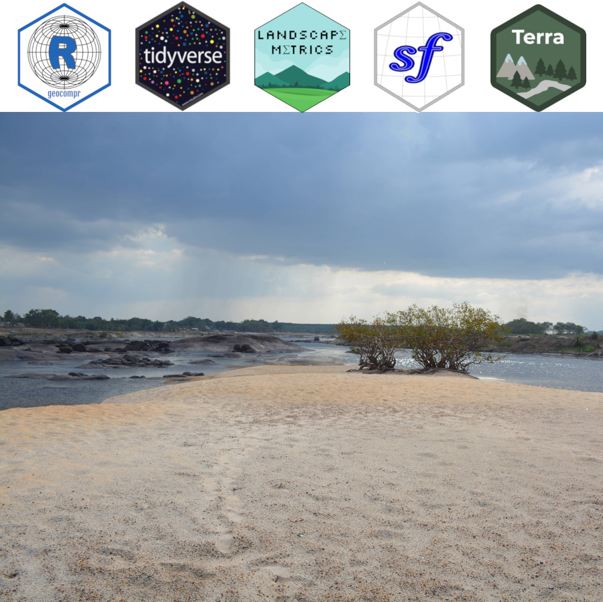

--- 
title: "Ecologia de Paisagens com R"
author: "Darren Norris: darren.norris@unifap.br"
date: "`r Sys.setlocale('LC_TIME', 'Portuguese'); format(Sys.time(), '%d %B, %Y')`"
site: bookdown::bookdown_site
bibliography: references.bib
url: 'https\://darrennorris.github.io/epr/pref%C3%A1cio-%C3%A0-primeira-edi%C3%A7%C3%A3o.html/' 
cover-image: cover.jpg # relative to index
description: "This is a minimal example."
github-repo: darrennorris/epr
toc-title: Sumário
urlcolor: blue
---

\newpage{}

# (PART) Apresentação {-}

# Bem-vindos {.unnumbered}

Este é um trabalho em andamento do 1ª edição:
**"Ecologia de Paisagens com R"**.

Versoes: 

-  web: https://darrennorris.github.io/epr/  

-  pdf: https://github.com/darrennorris/epr/blob/main/docs/epr.pdf

Este é um material introdutório destinado principalmente a estudantes de graduação e cursos de pós-graduação em ecologia e áreas correlatas.

O objetivo é de apresentar os capacidades e opções para desenvolver e integrar pesquisas na Ecologia da Paisagem no ambiente estatística de R.

Esperamos que ele seja utilizado tanto por quem quer se aprofundar em análises comumente utilizadas em Ecologia da Paisagem, mesmo por quem tem poucas habilidades quantitativas. 

## Agradecimentos {.unnumbered}

Este livro não é apenas o resulto dos autores. Mas é o resultado de muitas pessoas na comunidade R e Ecologia da Paisagem no Brasil.
Muito obrigado!
